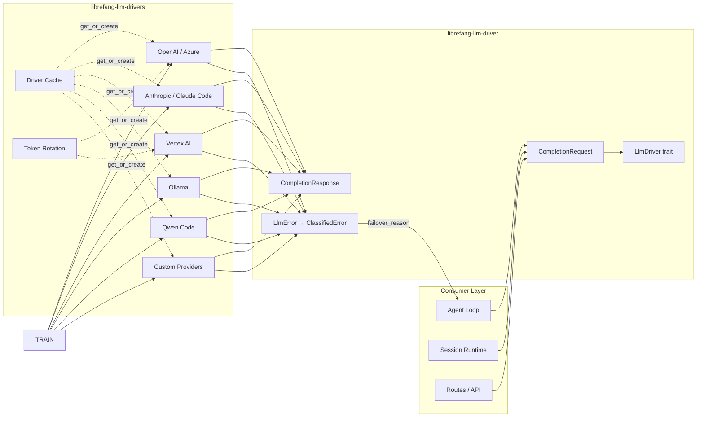

# LLM Drivers

# LLM Drivers

The LLM Drivers module group provides LibreFang's complete interface to large language model services. It ships a provider-agnostic trait layer together with concrete driver implementations for cloud APIs, local model servers, and CLI-based tools.

## How the crates relate

The two sub-modules follow a trait/impl split:

| Crate | Role |
|---|---|
| [`librefang-llm-driver`](librefang-llm-driver-src.md) | Defines the `LlmDriver` trait, shared request/response types (`CompletionRequest`, `CompletionResponse`), and the error-classification infrastructure (`LlmError`, `ClassifiedError`, `classify_error`) that every backend depends on. |
| [`librefang-llm-drivers`](librefang-llm-drivers-src.md) | Implements `LlmDriver` for every supported provider—Anthropic, OpenAI, Azure OpenAI, Vertex AI (Gemini), Ollama, Claude Code CLI, Qwen Code, and custom endpoints—and adds cross-cutting infrastructure: retry logic, token rotation, rate-limit guards, credential pooling, driver caching, and streaming utilities. |

## Key cross-module workflows

1. **Request lifecycle** — A consumer (agent loop, session runtime, API route) builds a `CompletionRequest` from the shared types in `librefang-llm-driver`, calls `LlmDriver::complete` or `LlmDriver::stream`, and receives a typed `CompletionResponse`. The consumer never knows which backend handled the call.

2. **Error classification and failover** — Any driver can return an `LlmError`. The `classify_error` function in `librefang-llm-driver` maps it to a `ClassifiedError` whose `failover_reason` field drives the fallback chain in the caller. This keeps retry/failover decisions decoupled from individual provider error formats.

3. **Driver instantiation and caching** — `librefang-llm-drivers` exposes `create_driver_from_entry` and a driver cache (`get_or_create`) that resolve a `DriverConfig` (defined in `librefang-llm-driver`) into a concrete, possibly Arc-shared, driver instance. Credential pooling and provider auto-detection happen at this boundary.

4. **Token rotation** — For providers that use rotating credentials (e.g. Vertex AI service account keys, Azure tokens), the rotation wrapper in `librefang-llm-drivers` intercepts `complete` calls, detects rate-limit or auth failures, and swaps the active key before retrying—without the consumer or the trait layer needing to know.

5. **Streaming** — Streaming responses flow through `utf8_stream` utilities in `librefang-llm-drivers`, ensuring consistent UTF-8 decoding across all providers before reaching the session runtime.

Consult the individual sub-module pages for driver-specific configuration options, supported environment variables, and implementation details.