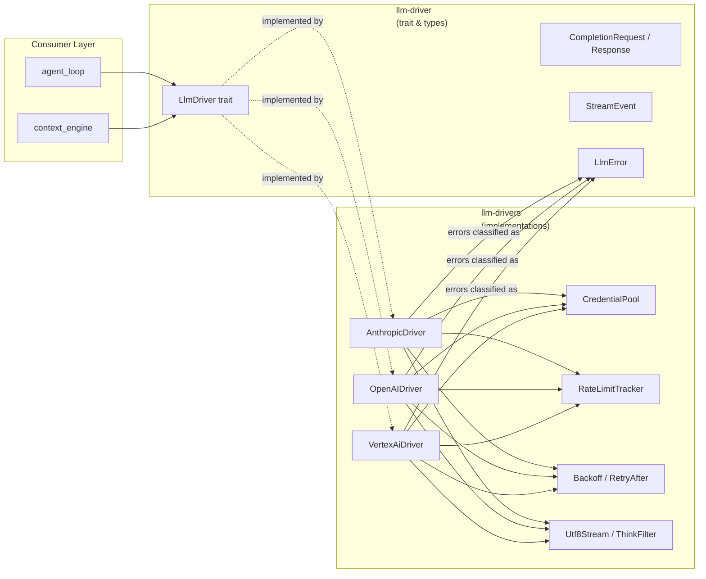

# LLM Drivers

# LLM Drivers

The LLM Drivers module group provides a provider-agnostic interface for calling large language models, along with production-ready concrete implementations for every supported provider.

## Structure

| Sub-module | Role |
|---|---|
| [librefang-llm-driver-src](librefang-llm-driver-src.md) | Defines the `LlmDriver` trait, core request/response types (`CompletionRequest`, `CompletionResponse`, `StreamEvent`), `DriverConfig`, `LlmFamily`, and the `llm_errors` classification pipeline that turns raw provider errors into structured categories for retry and failover decisions. |
| [librefang-llm-drivers-src](librefang-llm-drivers-src.md) | Concrete `LlmDriver` implementations (Anthropic, OpenAI-compatible, Vertex AI, Aider CLI, and others) plus shared infrastructure: credential rotation via `CredentialPool`, retry/backoff logic, rate-limit tracking with cross-process lockout files, `Utf8Stream` for correct streaming of multi-byte codepoints, and `ThinkFilter` for stripping `<think/>` blocks from model output. |

## How They Fit Together

**[librefang-llm-driver-src](librefang-llm-driver-src.md)** is the interface contract. It owns the `LlmDriver` trait (with `complete` and `stream` methods), the error taxonomy (`LlmError`), and the data types every provider must produce. Consumers such as the agent loop and context engine depend only on this crate.

**[librefang-llm-drivers-src](librefang-llm-drivers-src.md)** implements that trait for each supported provider and houses the cross-cutting infrastructure those implementations share — credential pool rotation, exponential backoff, `Retry-After` header parsing, rate-limit tracking, and streaming utilities. When a concrete driver encounters a provider error, it surfaces it through the classification pipeline defined in the driver crate, giving upstream code a consistent basis for retry and failover decisions.