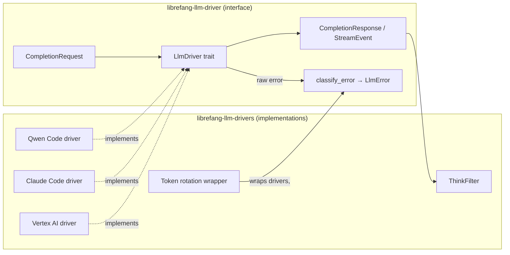

# LLM Drivers

# LLM Drivers

The LLM Drivers module group provides LibreFang's abstraction layer for communicating with large language model providers. It separates the *what* (the interface) from the *how* (the implementations).

## Sub-modules

| Sub-module | Role |
|---|---|
| [librefang-llm-driver](librefang-llm-driver-src.md) | Defines the `LlmDriver` trait, shared request/response types (`CompletionRequest`, `CompletionResponse`, `StreamEvent`), configuration (`DriverConfig`), and provider-agnostic error classification via `classify_error` |
| [librefang-llm-drivers](librefang-llm-drivers-src.md) | Concrete driver implementations for providers (Vertex AI, Claude Code, Qwen Code, etc.), plus cross-cutting utilities like `ThinkFilter`, token rotation, and CLI provider detection |

## How they fit together

All concrete drivers in `librefang-llm-drivers` implement the `LlmDriver` trait from `librefang-llm-driver`. Callers build a `CompletionRequest`, submit it through the trait, and receive either a `CompletionResponse` or a stream of `StreamEvent`s. When a provider returns an error, `classify_error` maps it to an actionable `LlmError` category that drives retry and rotation logic.

## Key cross-cutting workflows

- **Error classification → retry**: Raw provider errors are classified by `llm_errors` into categories (timeout, auth failure, rate limit, etc.). The token rotation layer in `librefang-llm-drivers` consumes these via `cooldown_from_error` to decide whether to rotate keys or back off.

- **Streaming through ThinkFilter**: Providers that emit `<think…>` blocks (e.g., reasoning models) have their `StreamEvent` streams passed through `ThinkFilter`, which strips or surfaces those blocks depending on configuration.

- **Provider discovery**: The CLI provider detection chain (`is_cli_provider` → `claude_code_available` → credential checks) allows LibreFang to auto-detect locally installed tools and register them in the model catalog at startup.