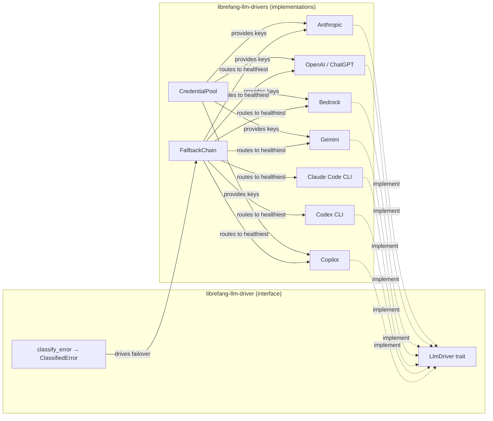

# LLM Drivers

# LLM Drivers

Provider-agnostic LLM integration layer that defines a uniform interface for completion requests, streaming, and error handling, then ships multiple concrete driver implementations behind a health-aware fallback system.

## Sub-modules

| Sub-module | Role |
|---|---|
| [librefang-llm-driver](librefang-llm-driver-src.md) | Core `LlmDriver` trait, request/response types, streaming events, and error classification taxonomy |
| [librefang-llm-drivers](librefang-llm-drivers-src.md) | Concrete driver implementations, credential pooling, fallback routing, and stream utilities |

## How they fit together

[librefang-llm-driver](librefang-llm-driver-src.md) defines the contract — `LlmDriver::complete`, `LlmDriver::stream`, `CompletionRequest`/`CompletionResponse`, and the `classify_error` taxonomy that categorises failures as overloaded, context overflow, transient, etc.

[librefang-llm-drivers](librefang-llm-drivers-src.md) implements that contract across seven providers, then layers two orchestration mechanisms on top:

- **CredentialPool** — rotates API keys and marks them exhausted when a provider returns rate-limit errors, so the next request automatically picks a live key.
- **FallbackChain** — wraps multiple drivers behind EWMA-based health scoring. When `classify_error` reports a retryable or overloaded failure, the chain suppresses the unhealthy driver for a cooldown window and routes subsequent requests to the next healthiest provider.

CLI-based drivers (Claude Code, Codex) additionally probe for local credential files and binary availability at startup, allowing the fallback chain to skip them entirely when unavailable.

## Key cross-module workflows

1. **Request with fallback** — Caller issues a `CompletionRequest` through `FallbackChain`. The chain picks the healthiest driver, calls `complete`, and if the result is a classified error, it re-routes to the next driver after updating health scores.
2. **Streaming** — `LlmDriver::stream` returns `mpsc`-based `StreamEvent`s; the trait layer tests that dropped receivers surface as default stream errors.
3. **Credential rotation** — A driver obtains a key from `CredentialPool::fill_first`, uses it for the request, and on rate-limit classification calls `mark_exhausted` so subsequent calls skip that key.