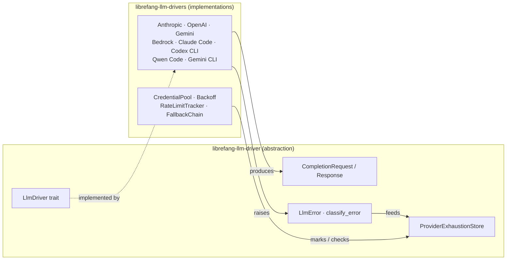

# LLM Drivers

# LLM Drivers

The LLM Drivers module group provides LibreFang's complete transport layer to upstream LLM providers. It splits cleanly into a thin abstraction crate and a heavy implementations crate.

## Structure

| Crate | Role |
|---|---|
| [librefang-llm-driver](librefang-llm-driver-src.md) | Defines the `LlmDriver` trait, shared request/response types (`CompletionRequest`, `CompletionResponse`), error taxonomy (`LlmError`, `classify_error`), and exhaustion tracking (`ProviderExhaustionStore`). |
| [librefang-llm-drivers](librefang-llm-drivers-src.md) | Implements `LlmDriver` for every supported provider (Anthropic, OpenAI, Gemini, Bedrock, Claude Code, Codex CLI, Qwen Code, Gemini CLI) and supplies cross-cutting infrastructure: credential pools, jittered backoff, rate-limit guards, token rotation, and fallback chains. |

## How They Fit Together

```mermaid
graph LR
    subgraph "librefang-llm-driver (abstraction)"
        T["LlmDriver trait"]
        REQ["CompletionRequest / Response"]
        ERR["LlmError · classify_error"]
        EXH["ProviderExhaustionStore"]
    end

    subgraph "librefang-llm-drivers (implementations)"
        PROV["Anthropic · OpenAI · Gemini<br/>Bedrock · Claude Code · Codex CLI<br/>Qwen Code · Gemini CLI"]
        INFRA["CredentialPool · Backoff<br/>RateLimitTracker · FallbackChain"]
    end

    T -.->|implemented by| PROV
    PROV -->|produces| REQ
    PROV -->|raises| ERR
    INFRA -->|marks / checks| EXH
    ERR -->|feeds| EXH
```

The kernel depends only on the `LlmDriver` trait and its types from the abstraction crate. Concrete providers and their supporting infrastructure live in the implementations crate and are wired together at runtime.

## Key Cross-Crate Workflows

**Request lifecycle.** The kernel acquires a credential from a `CredentialPool`, builds a `CompletionRequest`, and calls `LlmDriver::complete`. The chosen provider serialises the request, handles SSE streaming, and parses the response back into a `CompletionResponse`.

**Error classification → exhaustion marking.** When a provider call fails, the error flows through `classify_error` to determine its `FailoverReason`. Retriable errors trigger jittered exponential backoff (respecting `Retry-After` headers). Non-recoverable errors call `mark_exhausted` on the `ProviderExhaustionStore`, which causes credential pools and fallback chains to skip that provider on subsequent attempts.

**Fallback chains.** A `FallbackChain` iterates over an ordered list of `ChainEntry` providers. Each entry consults the shared exhaustion store before attempting a call, ensuring that a provider that has permanently failed (authentication error, billing issue, model not found) is not retried.