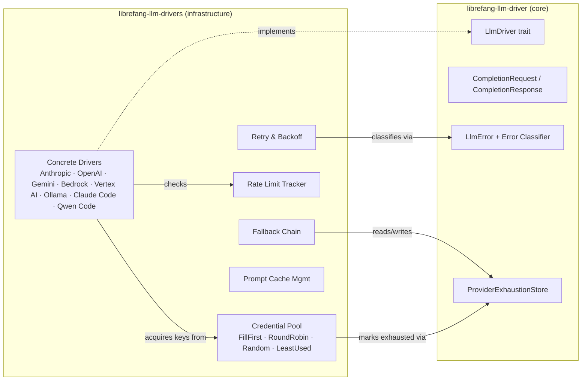

# LLM Drivers

# LLM Drivers

LibreFang's LLM integration layer, split into two cooperating crates: a core abstraction crate that defines the driver contract, and an infrastructure crate that provides concrete implementations, retry logic, credential management, and provider fallback.

## Structure

```mermaid
graph LR
    subgraph "librefang-llm-driver (core)"
        LT[LlmDriver trait]
        CR[CompletionRequest / CompletionResponse]
        LE[LlmError + Error Classifier]
        PES[ProviderExhaustionStore]
    end

    subgraph "librefang-llm-drivers (infrastructure)"
        CD[Concrete Drivers<br/>Anthropic · OpenAI · Gemini · Bedrock · Vertex AI · Ollama · Claude Code · Qwen Code]
        BO[Retry & Backoff]
        CP[Credential Pool<br/>FillFirst · RoundRobin · Random · LeastUsed]
        RLT[Rate Limit Tracker]
        FC[Fallback Chain]
        PC[Prompt Cache Mgmt]
    end

    CD -.->|implements| LT
    FC -->|reads/writes| PES
    CP -->|marks exhausted via| PES
    BO -->|classifies via| LE
    CD -->|acquires keys from| CP
    CD -->|checks| RLT
```

## Sub-modules

- **[LLM Driver (Core)](librefang-llm-driver-src.md)** — The `LlmDriver` trait, request/response types (`CompletionRequest`, `CompletionResponse`), streaming event protocol, `LlmError` taxonomy with error classification, `FailoverReason`, and the `ProviderExhaustionStore` ledger. Every other crate in this module group depends on these types.

- **[LLM Drivers (Infrastructure)](librefang-llm-drivers-src.md)** — Concrete provider implementations, plus cross-cutting infrastructure: retry with configurable backoff, a credential pool with pluggable selection strategies, rate-limit bucket tracking, prompt-cache control, and the fallback chain that orchestrates provider failover.

## Key Cross-Module Workflows

**Request lifecycle.** A `CompletionRequest` from the core crate is handed to a concrete driver (infrastructure crate), which acquires a credential from the `CredentialPool`, checks the `RateLimitTracker`, and dispatches over the wire. On transport errors, `transport_error_is_retryable` consults the core error classifier to decide whether to retry with backoff.

**Credential exhaustion flow.** When a provider returns HTTP 429 or 402, the credential pool calls `mark_exhausted` on the shared `ProviderExhaustionStore`. The pool then skips that key during acquisition. The fallback chain also reads from the same store to skip entire providers when all their keys are exhausted.

**Fallback chain.** The chain iterates over candidate drivers. On failure, `LlmError` is classified into a `FailoverReason`; retriable errors advance to the next provider, while non-retriable errors surface immediately. The exhaustion store prevents re-attempting providers that are known to be depleted.

**Provider detection.** Higher-level code (e.g., the API server's provider routes) probes driver availability by checking for CLI tool presence and credential files, as seen in the `claude_code_available` → `claude_credentials_in_dir` and `qwen_code_available` → `home_dir` call chains.

## Design Principles

- The core crate is zero-dependency on any specific provider; it only defines the contract and shared error/exhaustion state.
- The infrastructure crate owns all HTTP interaction, provider-specific serialization, and operational concerns like backoff and rate limiting.
- Exhaustion state is shared via `ProviderExhaustionStore`, allowing the credential pool and fallback chain to coordinate without coupling.