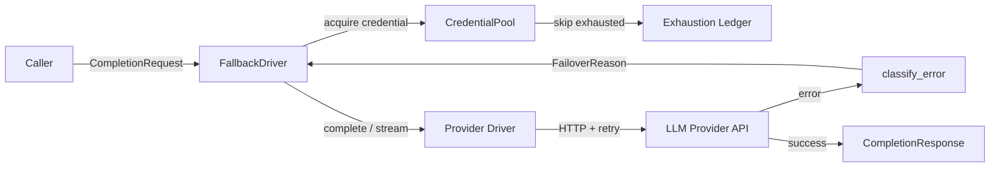

# LLM Drivers

# LLM Drivers

The LLM Drivers module group provides LibreFang's completion layer—the abstraction, infrastructure, and concrete provider implementations needed to route prompts to language models and stream responses back.

## Structure

| Sub-module | Role |
|---|---|
| [librefang-llm-driver](librefang-llm-driver-src.md) | Trait contract, shared types, error classification, and provider-exhaustion tracking |
| [librefang-llm-drivers](librefang-llm-drivers-src.md) | Concrete provider drivers, credential pooling, retry/backoff, and fallback chains |

## How They Fit Together

`librefang-llm-driver` is the foundational crate. It defines the `LlmDriver` trait and the request/response types (`CompletionRequest`, `CompletionResponse`, `StreamEvent`) that every provider must satisfy. It also owns the error pipeline—`classify_error`, `FailoverReason`, `ProviderErrorCode`, and the exhaustion ledger that tracks which providers are temporarily or permanently unavailable.

`librefang-llm-drivers` sits downstream. It consumes those types to implement:

- **Provider drivers** — Anthropic, OpenAI, Gemini, Bedrock, Vertex AI, Ollama, Copilot, ChatGPT, and Claude Code adapters that translate `CompletionRequest` into provider-specific HTTP calls and map responses back to `CompletionResponse`.
- **Credential pooling** — `CredentialPool` with round-robin selection that skips exhausted keys, integrating with the exhaustion ledger from the foundation crate.
- **Retry and backoff** — `jittered_backoff` and transport-error retry logic shared across all drivers.
- **Fallback chains** — `FallbackChain` / `FallbackDriver` that cycle through providers, using the exhaustion snapshot and failover reasons to decide where to route the next attempt.

## Key Cross-Module Workflow

```mermaid
graph LR
    Caller -->|"CompletionRequest"| FD["FallbackDriver"]
    FD -->|"acquire credential"| CP["CredentialPool"]
    CP -->|"skip exhausted"| EX["Exhaustion Ledger"]
    FD -->|"complete / stream"| PD["Provider Driver"]
    PD -->|"HTTP + retry"| LLM["LLM Provider API"]
    LLM -->|"error"| CL["classify_error"]
    CL -->|"FailoverReason"| FD
    LLM -->|"success"| CR["CompletionResponse"]
```

A completion request enters through the fallback driver, which selects an available credential and dispatches to a concrete provider driver. On transport failure, the error is classified; the provider may be marked exhausted and the chain retries on the next provider. Successful responses are normalized into `CompletionResponse` and returned to the caller.