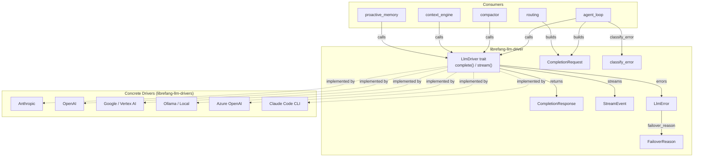

# LLM Provider Drivers — librefang-llm-driver-src

# LLM Provider Drivers — `librefang-llm-driver`

This crate defines the abstract interface between LibreFang's runtime and every LLM provider it supports. All higher-level code—agent loops, compactors, context engines, memory systems—interacts with LLMs exclusively through the types and traits defined here.

## Architecture



## Core Trait: `LlmDriver`

```rust
#[async_trait]
pub trait LlmDriver: Send + Sync {
    async fn complete(&self, request: CompletionRequest)
        -> Result<CompletionResponse, LlmError>;

    async fn stream(
        &self,
        request: CompletionRequest,
        tx: Sender<StreamEvent>,
    ) -> Result<CompletionResponse, LlmError>;

    fn is_configured(&self) -> bool { true }
    fn family(&self) -> LlmFamily { LlmFamily::Other }
}
```

- **`complete`** — Mandatory. Sends a single request, returns the full response.
- **`stream`** — Has a default implementation that wraps `complete()` and emits `TextDelta` + `ContentComplete` events. Concrete drivers override this to provide true incremental streaming.
- **`is_configured`** — Returns `false` only for `StubDriver`. All real drivers use the default (`true`).
- **`family`** — Identifies the provider family for cross-cutting policy (prompt caching, tool schema normalization). Defaults to `Other`; in-tree drivers override it.

## Request and Response Types

### `CompletionRequest`

All fields a consumer needs to construct an LLM call:

| Field | Purpose |
|---|---|
| `model` | Model identifier string |
| `messages` | Conversation history (`Vec<Message>`) |
| `tools` | Available tools (`Vec<ToolDefinition>`) |
| `max_tokens` | Generation limit |
| `temperature` | Sampling temperature |
| `system` | Extracted system prompt (for APIs requiring it separately) |
| `thinking` | Extended thinking configuration (provider-specific) |
| `prompt_caching` | Enable prompt cache markers (Anthropic: `cache_control` breakpoints; OpenAI: automatic prefix caching) |
| `cache_ttl` | Cache duration hint (`None` = 5m ephemeral, `Some("1h")` = 1-hour with Anthropic beta header) |
| `response_format` | Structured output mode (`ResponseFormat`) |
| `timeout_secs` | Per-request timeout override for CLI drivers |
| `extra_body` | Provider-specific parameters merged into the API body (last-wins) |
| `agent_id` | Owning agent identity for MCP bridge routing |

### `CompletionResponse`

| Field | Purpose |
|---|---|
| `content` | Raw content blocks (`Vec<ContentBlock>`) |
| `stop_reason` | Why generation stopped |
| `tool_calls` | Extracted tool invocations |
| `usage` | Token counts |

The `text()` method concatenates all `ContentBlock::Text` variants into a single `String`, filtering out `Thinking` blocks.

## Streaming Events (`StreamEvent`)

Emitted during `stream()` calls via a `tokio::sync::mpsc::Sender`:

- **`TextDelta`** — Incremental text fragment
- **`ThinkingDelta`** — Incremental reasoning text (extended thinking models)
- **`ToolUseStart` / `ToolInputDelta` / `ToolUseEnd`** — Tool call lifecycle (start → streaming JSON input → complete with parsed input)
- **`ContentComplete`** — Final event with `StopReason` and `TokenUsage`
- **`PhaseChange`** — Agent lifecycle phase transitions (e.g., `"response_complete"`)
- **`ToolExecutionResult`** — Tool execution outcome (emitted by agent loop, not drivers)
- **`OwnerNotice`** — Private notice routed to owner DM (emitted by agent loop)

The constant `PHASE_RESPONSE_COMPLETE` (`"response_complete"`) signals that streaming text is done and post-processing (session save, memory) is about to begin. Consumers use this to unblock user input before the full payload is finalized.

## Provider Families (`LlmFamily`)

Coarse-grained grouping for policy-level decisions:

| Variant | Providers |
|---|---|
| `Anthropic` | Claude direct API, Anthropic-compatible hosts, Claude Code CLI |
| `OpenAi` | OpenAI, Azure OpenAI, Groq, OpenRouter, DeepInfra, Together, Cerebras, and all OpenAI-compatible shim proxies |
| `Google` | Gemini API, Vertex AI Gemini, Gemini CLI |
| `Local` | Ollama, LM Studio, vLLM, sglang, llama.cpp (native protocols only; local servers accessed via OpenAI shim report `OpenAi`) |
| `Other` | Cohere, AI21, custom CLIs, out-of-tree drivers (default) |

Serialized as `snake_case` in JSON (e.g., `"open_ai"`). The `Display` impl matches the serde form.

## Error Handling

### `LlmError`

Driver-level error enum. Key variants:

- **`Api { status, message }`** — HTTP error with status code and provider message
- **`RateLimited { retry_after_ms, message }`** — Explicit rate limit with optional backoff hint
- **`Overloaded { retry_after_ms }`** — Transient capacity error
- **`TimedOut { inactivity_secs, partial_text, last_activity }`** — CLI subprocess timeout with captured partial output
- **`AuthenticationFailed` / `MissingApiKey`** — Configuration errors
- **`ModelNotFound`** — Unknown model identifier
- **`Parse`** — Response deserialization failure (not recoverable by switching providers)
- **`Http`** — Transport-level failure (connection refused, TLS error)

#### `LlmError::failover_reason()`

Maps any `LlmError` variant into a `FailoverReason` for the `FallbackChain` provider-switching logic. Classification is structural (variant + status + message keywords) and allocation-free:

| LlmError variant | FailoverReason |
|---|---|
| `RateLimited { .. }` | `RateLimit(Some(ms))` |
| `Overloaded { .. }` | `RateLimit(Some(ms))` |
| `Api { status: 429, .. }` | `RateLimit(None)` |
| `Api { status: 401, .. }` | `AuthError` |
| `Api { status: 402, .. }` | `CreditExhausted` |
| `Api { status: 403, .. }` | Keyword-dependent: rate-limit keywords → `RateLimit`, billing keywords → `CreditExhausted`, model keywords → `ModelUnavailable`, otherwise `HttpError` |
| `Api { status: 404, .. }` | Model-specific keywords → `ModelUnavailable`, else `HttpError` |
| `Api { status: 413, .. }` | `ContextTooLong` |
| `Api { status: 503, .. }` | `ModelUnavailable` |
| `Api { status: 400, .. }` | Context keywords → `ContextTooLong`, else `HttpError` |
| `ModelNotFound` | `ModelUnavailable` |
| `AuthenticationFailed` / `MissingApiKey` | `AuthError` |
| `TimedOut` | `Timeout` |
| `Parse` | `Unknown` |
| `Http` | `HttpError` |

### Error Classification (`llm_errors` module)

Independent classification pipeline used by the runtime to build user-facing error messages and drive retry logic.

#### `classify_error(message, status) → ClassifiedError`

Classifies raw API errors into 8 categories using HTTP status code fast-paths followed by case-insensitive substring pattern matching:

| Priority | Category | Key Signals |
|---|---|---|
| 1 | `ContextOverflow` | `"context_length_exceeded"`, `"token limit"`, `"prompt is too long"` |
| 2 | `Billing` | Status 402, `"payment required"`, `"insufficient credits"` |
| 3 | `Auth` | Status 401, `"invalid api key"`, `"authentication_error"` |
| 4 | `RateLimit` | Status 429, `"rate limit"`, `"quota exceeded"`, `"tpm limit"` |
| 5 | `ModelNotFound` | Status 404, `"model not found"`, `"unknown model"` |
| 6 | `Format` | Status 400, `"invalid request"`, `"schema"`, `"validation_error"` |
| 7 | `Overloaded` | Status 500/503, `"overloaded"`, `"service unavailable"` |
| 8 | `Timeout` | `"etimedout"`, `"econnreset"`, `"connection refused"` |

**Status code fast-paths** are checked first (429, 402, 401, 403, 404 have unambiguous mappings). Status 403 is special: it handles provider-specific ambiguity where Chinese providers and Anthropic use 403 for rate limits, billing blocks, and model permissions, not just authentication failures. The classifier checks `FORBIDDEN_NON_AUTH_PATTERNS` (quota, region, model keywords) before falling back to `Auth`.

HTML error pages (Cloudflare 521–530, `cf-error-code`) are detected and classified as `Overloaded`.

#### `classify_error_with_context(message, status, provider, model)`

Enriched version that attaches provider/model metadata and generates actionable suggestions. Preferred entry point when context is available.

#### `ClassifiedError` Fields

- `category: LlmErrorCategory` — One of 8 categories
- `is_retryable: bool` — True for `RateLimit`, `Overloaded`, `Timeout`
- `is_billing: bool` — True only for `Billing`
- `suggested_delay_ms: Option<u64>` — Parsed from `"retry after N"` patterns
- `sanitized_message: String` — User-safe message with API keys redacted, JSON extracted, HTML stripped
- `raw_message: String` — Original error for logging
- `provider` / `model` — Optional context
- `suggestion` — Actionable resolution hint

#### Sanitization Pipeline

```
raw error string
  → is_html_error_page? → "provider returned an error page"
  → extract_json_message? → pull .error.message / .message / .detail
  → redact_secrets → replace sk-*/key-*/Bearer * with <redacted>
  → strip_llm_wrapper → remove "LLM driver error: API error (NNN): " prefix
  → cap_message → truncate to 200 chars at UTF-8 boundaries
```

The `cap_message` function handles multi-byte UTF-8 (CJK, emoji) safely by walking back to the nearest char boundary before truncation.

#### `extract_retry_delay(message) → Option<u64>`

Parses `"retry after N"`, `"retry-after: N"`, `"try again in N"` from error messages. Values without an `ms` suffix are treated as seconds and converted to milliseconds.

#### `is_transient(message) → bool`

Quick heuristic checking if an error is retryable (timeout patterns, overloaded patterns, rate limit patterns, SSL transient patterns like `bad_record_mac`). Used by `stream_with_retry` in the runtime agent loop.

### `FailoverReason`

Provider-switching taxonomy driving `FallbackChain` recovery:

| Variant | Recovery Strategy |
|---|---|
| `RateLimit(Option<u64>)` | Sleep (optional hint ms), retry same provider |
| `CreditExhausted` | Skip to next provider immediately |
| `ModelUnavailable` | Skip to next provider |
| `ContextTooLong` | Propagate to caller (must compress) |
| `Timeout` | Skip to next provider |
| `HttpError` | Skip to next provider |
| `AuthError` | Skip to next provider (next slot may have valid key) |
| `Unknown` | Propagate immediately |

## Driver Configuration

### `DriverConfig`

Serializable configuration for constructing a driver:

| Field | Default | Purpose |
|---|---|---|
| `provider` | `""` | Provider identifier string |
| `api_key` | `None` | API key (redacted in `Debug` output) |
| `base_url` | `None` | Override API endpoint |
| `vertex_ai` | `Default` | Vertex AI project/region/credentials |
| `azure_openai` | `Default` | Azure endpoint/deployment/api_version |
| `skip_permissions` | `true` | `--dangerously-skip-permissions` for Claude Code CLI |
| `message_timeout_secs` | `300` | Inactivity timeout for CLI drivers (not wall-clock) |
| `mcp_bridge` | `None` | MCP bridge config (not serialized, set by kernel) |
| `proxy_url` | `None` | Per-provider proxy override |
| `request_timeout_secs` | `None` | Per-provider HTTP read timeout (API drivers only) |

The `Debug` impl redacts `api_key`, `vertex_ai.credentials_path`, and `proxy_url` to prevent credential leakage in logs.

### `McpBridgeConfig`

Configuration for bridging LibreFang tools into CLI-based drivers (Claude Code) via MCP:

```rust
pub struct McpBridgeConfig {
    pub base_url: String,     // Daemon URL, e.g. "http://127.0.0.1:4545"
    pub api_key: Option<String>,  // X-API-Key header
}
```

The driver writes a temp `mcp_config.json` and passes `--mcp-config` to the spawned CLI subprocess. The MCP endpoint lives at `{base_url}/mcp`.

## Integration Points

**Downstream consumers** (in `librefang-runtime` and `librefang-memory`) that use these types:

- `agent_loop::run_agent_loop` / `run_agent_loop_streaming` — Build `CompletionRequest`, call `complete`/`stream`, consume `StreamEvent`
- `agent_loop::build_user_facing_llm_error` — Calls `classify_error` to produce user-facing messages
- `agent_loop::stream_with_retry` — Calls `is_transient` to decide retry behavior
- `compactor::summarize_messages` / `summarize_in_chunks` — Build `CompletionRequest` for context compression
- `context_engine` / `context_compressor` — Call `complete` for context enrichment
- `proactive_memory::decide_action` / `extract_memories` — Use `complete` for memory decisions
- `routing::make_request` — Constructs `CompletionRequest` for routing probes
- `provider_health::probe_model` — Calls `complete` for health checks
- `http_vector_store::search` / `insert` — Uses response `text()` for embedding queries

**Upstream dependency**: Concrete driver implementations live in the separate `librefang-llm-drivers` crate, which implements `LlmDriver` for each provider and re-exports `McpBridgeConfig`.