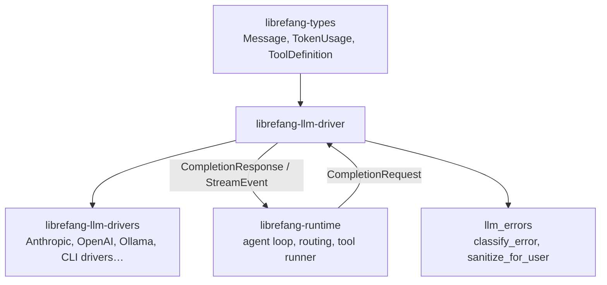

# LLM Provider Drivers — librefang-llm-driver-src

# LLM Provider Drivers — `librefang-llm-driver`

This crate defines the core trait (`LlmDriver`) and supporting types that abstract over LLM providers. Every concrete provider implementation—Anthropic, OpenAI, Ollama, Vertex AI, Azure OpenAI, CLI-based drivers like Claude Code—depends on this crate and implements its trait.

## Architecture



The crate has two public modules:

- **`lib`** (root) — `LlmDriver` trait, request/response types, streaming events, driver configuration.
- **`llm_errors`** — Error classification, sanitization, and retry-delay extraction used across all providers.

---

## Core Trait: `LlmDriver`

```rust
#[async_trait]
pub trait LlmDriver: Send + Sync {
    async fn complete(&self, request: CompletionRequest)
        -> Result<CompletionResponse, LlmError>;

    async fn stream(
        &self,
        request: CompletionRequest,
        tx: tokio::sync::mpsc::Sender<StreamEvent>,
    ) -> Result<CompletionResponse, LlmError>;

    fn is_configured(&self) -> bool { true }
}
```

- **`complete`** — Blocking-style request. Implementors must provide this.
- **`stream`** — Has a default implementation that calls `complete`, sends a single `TextDelta`, then `ContentComplete`. Real providers override this to emit incremental events. The caller receives the full `CompletionResponse` as the return value while consuming `StreamEvent`s from the channel concurrently.
- **`is_configured`** — Returns `true` for all real drivers. `StubDriver` (in the testing crate) returns `false`.

### Consumers

The trait is consumed by:
- `librefang-runtime` — the agent loop constructs `CompletionRequest` and calls `stream` or `complete` depending on whether a UI is attached.
- `librefang-runtime/src/routing.rs` — `make_request` builds a `CompletionRequest` and dispatches to the selected provider.
- `librefang-runtime/src/provider_health.rs` — `probe_model` issues test completions to check provider availability.
- `librefang-testing/src/mock_driver.rs` — test harness implements `LlmDriver` for deterministic responses.

---

## Request and Response Types

### `CompletionRequest`

All fields a provider needs to fulfill a completion:

| Field | Purpose |
|---|---|
| `model` | Model identifier (e.g. `"claude-sonnet-4-20250514"`) |
| `messages` | Conversation history as `Vec<Message>` |
| `tools` | Available `ToolDefinition`s the model may invoke |
| `max_tokens` | Generation cap |
| `temperature` | Sampling temperature |
| `system` | System prompt, pre-extracted for APIs requiring it separately |
| `thinking` | Extended thinking config (Anthropic-style) |
| `prompt_caching` | Enables ephemeral cache markers (Anthropic) or parses cached token counts (OpenAI) |
| `response_format` | Structured output mode (`ResponseFormat`) |
| `timeout_secs` | Per-request timeout override; CLI drivers use this instead of the global `message_timeout_secs` |
| `extra_body` | Provider-specific JSON merged into the top-level request body (last-wins on key conflict) |
| `agent_id` | Owning agent identity, forwarded to MCP bridges so they can resolve workspace and allowlists |

### `CompletionResponse`

| Field | Purpose |
|---|---|
| `content` | `Vec<ContentBlock>` — text, thinking, tool-use blocks |
| `stop_reason` | Why generation stopped (`EndTurn`, `ToolUse`, `MaxTokens`, etc.) |
| `tool_calls` | Parsed `ToolCall` objects extracted from content blocks |
| `usage` | `TokenUsage` (input, output, cache read/write tokens) |

**`text()`** — Convenience method that concatenates all `ContentBlock::Text` blocks, skipping thinking and tool-use. Widely used across the codebase (OAuth flows, web fetch, MCP, vector stores, TTS synthesis) to extract plain text from responses.

---

## Streaming: `StreamEvent`

Events emitted to the `mpsc::Sender` during streaming:

| Variant | Direction | Produced by |
|---|---|---|
| `TextDelta` | Incremental text | Provider driver |
| `ThinkingDelta` | Extended thinking text | Anthropic driver |
| `ToolUseStart` | Tool block begun | Provider driver |
| `ToolInputDelta` | Partial JSON input | Provider driver |
| `ToolUseEnd` | Complete tool call with parsed input | Provider driver |
| `ContentComplete` | Final event with stop reason and usage | Provider driver |
| `PhaseChange` | Lifecycle signal (e.g. `"response_complete"`) | Agent loop |
| `ToolExecutionResult` | Tool output preview | Agent loop |

The constant `PHASE_RESPONSE_COMPLETE` (`"response_complete"`) is emitted by the agent loop via `PhaseChange` to signal that LLM text is fully streamed. Consumers use this to unblock user input before session-save and proactive-memory post-processing finishes.

---

## Error Handling: `LlmError`

The root error enum for driver operations:

| Variant | When |
|---|---|
| `Http(String)` | Network-level failure |
| `Api { status, message }` | Provider returned a non-2xx response |
| `RateLimited { retry_after_ms, message }` | 429 with optional provider hint |
| `Parse(String)` | Response body couldn't be deserialized |
| `MissingApiKey(String)` | No key configured for the provider |
| `Overloaded { retry_after_ms }` | 503 / capacity error |
| `AuthenticationFailed(String)` | Invalid or missing credentials |
| `ModelNotFound(String)` | Model doesn't exist on the provider |
| `TimedOut { inactivity_secs, partial_text, last_activity, … }` | CLI subprocess stalled; partial output captured |

---

## Error Classification: `llm_errors` Module

This module normalizes raw provider errors into 8 categories. It handles error formats from 19+ providers using case-insensitive substring matching—no regex dependency.

### `LlmErrorCategory`

| Category | `is_retryable` | `is_billing` | Typical status codes |
|---|---|---|---|
| `RateLimit` | ✅ | | 429 |
| `Overloaded` | ✅ | | 500, 503, 529 |
| `Timeout` | ✅ | | — (network) |
| `Billing` | | ✅ | 402 |
| `Auth` | | | 401, 403 |
| `ContextOverflow` | | | 400 |
| `Format` | | | 400 |
| `ModelNotFound` | | | 404 |

### Classification Pipeline: `classify_error`

```
raw error message + optional HTTP status
        │
        ▼
  Status-code fast paths
  (429→RateLimit, 402→Billing, 401→Auth,
   403→disambiguated, 404→ModelNotFound)
        │
        ▼
  Pattern matching in priority order:
  1. ContextOverflow  2. Billing  3. Auth  4. RateLimit
  5. ModelNotFound    6. Format   7. Overloaded  8. Timeout
        │
        ▼
  HTML error page detection (Cloudflare)
        │
        ▼
  Fallback: 5xx→Overloaded, 4xx→Format,
            network words→Timeout, else→Format
```

The **403 handling is deliberately nuanced**: many providers (especially Chinese providers like Qwen/ZhiPu) return 403 for quota exhaustion, region restrictions, or model-permission issues—not just auth failures. The classifier checks `FORBIDDEN_NON_AUTH_PATTERNS` (quota, limit, region, billing, etc.) before falling back to `Auth`. A generic 403 with no recognizable body defaults to `Auth`.

### Rich Classification: `classify_error_with_context`

Accepts optional `provider` and `model` strings. Returns a `ClassifiedError` with:

- **`sanitized_message`** — User-safe message with provider/model context appended: `"Rate limited [provider=openai, model=gpt-4]"`
- **`suggestion`** — Actionable next step (e.g. `"Check your openai API key in config.toml"`, `"Model 'claude-99' may not be available on anthropic"`)
- **`suggested_delay_ms`** — Parsed from `"retry after N"` or `"retry-after: Nms"` patterns in the raw message

### Sanitization

`sanitize_for_user` produces user-facing messages that:

1. Extract the relevant message from JSON error bodies (`/error/message`, `/message`, `/detail` paths).
2. Redact secrets — strips `sk-*`, `key-*`, `Bearer *` token sequences.
3. Strip internal wrappers like `"LLM driver error: API error (NNN): "`.
4. Replace HTML error pages with `"provider returned an error page (possible outage)"`.
5. Cap at 300 characters with `…` truncation.

### Transient Detection: `is_transient`

Quick heuristic returning `true` for `RateLimit`, `Overloaded`, and `Timeout` patterns. Used by retry logic in the runtime without requiring full classification.

### Retry Delay Extraction: `extract_retry_delay`

Parses patterns like `"retry after 30"` (seconds→30000ms), `"retry-after: 5"` (seconds), `"Retry after 500ms"` (milliseconds). Returns `Option<u64>` in milliseconds.

---

## Driver Configuration: `DriverConfig`

Serializable configuration carried from `KernelConfig` to driver construction:

| Field | Default | Notes |
|---|---|---|
| `provider` | `""` | Provider name identifier |
| `api_key` | `None` | **Redacted in `Debug` output** |
| `base_url` | `None` | Custom endpoint override |
| `vertex_ai` | `VertexAiConfig::default()` | Google Vertex AI project/region/credentials |
| `azure_openai` | `AzureOpenAiConfig::default()` | Azure endpoint/deployment/api_version |
| `skip_permissions` | `true` | Claude Code `--dangerously-skip-permissions` flag |
| `message_timeout_secs` | `300` | Inactivity timeout for CLI-based drivers |
| `mcp_bridge` | `None` | `#[serde(skip)]` — set at runtime by the kernel |
| `proxy_url` | `None` | Per-provider proxy override |

**Security**: `DriverConfig` implements a custom `Debug` that redacts `api_key`, `vertex_ai.credentials_path`, and `proxy_url`.

### `McpBridgeConfig`

Runtime-only configuration for bridging LibreFang tools into CLI-based drivers (currently Claude Code). The kernel writes a temp `mcp_config.json` and passes `--mcp-config` to the spawned CLI so it discovers tools via the daemon's `/mcp` endpoint.

- `base_url` — Daemon URL (e.g. `http://127.0.0.1:4545`)
- `api_key` — Optional `X-API-Key` header value

---

## Usage Patterns

### Implementing a new provider

```rust
use librefang_llm_driver::{LlmDriver, CompletionRequest, CompletionResponse, LlmError, StreamEvent};

struct MyProviderDriver { /* ... */ }

#[async_trait]
impl LlmDriver for MyProviderDriver {
    async fn complete(&self, req: CompletionRequest) -> Result<CompletionResponse, LlmError> {
        // Build HTTP request from req.model, req.messages, req.tools, etc.
        // Parse response into CompletionResponse
    }

    async fn stream(
        &self,
        req: CompletionRequest,
        tx: tokio::sync::mpsc::Sender<StreamEvent>,
    ) -> Result<CompletionResponse, LlmError> {
        // Open SSE connection, emit TextDelta/ToolUseStart/ToolInputDelta/ToolUseEnd
        // Emit ContentComplete as the final event
    }
}
```

### Classifying provider errors

```rust
use librefang_llm_driver::llm_errors::{classify_error_with_context, is_transient};

// Quick check — should we retry?
if is_transient(&raw_message) {
    // schedule retry with backoff
}

// Full classification with context
let classified = classify_error_with_context(
    &raw_message,
    Some(status_code),
    Some("anthropic"),
    Some("claude-sonnet-4-20250514"),
);

println!("Category: {:?}", classified.category);     // e.g. RateLimit
println!("Retryable: {}", classified.is_retryable);   // true
println!("Suggestion: {}", classified.suggestion.unwrap_or_default());
println!("Safe message: {}", classified.sanitized_message);
```