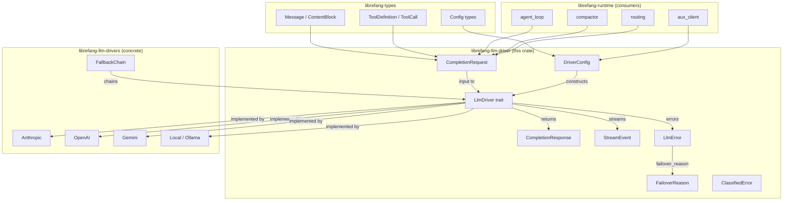

# LLM Provider Drivers — librefang-llm-driver-src

# LLM Provider Drivers — `librefang-llm-driver`

The `librefang-llm-driver` crate defines the abstraction layer between LibreFang's runtime and the dozens of LLM providers it supports. It provides the `LlmDriver` trait that every concrete provider (Anthropic, OpenAI, Gemini, Ollama, etc.) implements, along with the request/response types, streaming event protocol, error taxonomy, and error classification pipeline that drives automatic failover and user-facing error messages.

## Architecture



## Module Structure

| File | Purpose |
|------|---------|
| `lib.rs` | Core trait, request/response types, error enum, driver config, provider family enum |
| `llm_errors.rs` | Error classification into categories, message sanitization, `FailoverReason` taxonomy, transient detection |

## The `LlmDriver` Trait

The central abstraction. Every provider implements this async trait:

```rust
#[async_trait]
pub trait LlmDriver: Send + Sync {
    async fn complete(&self, request: CompletionRequest) 
        -> Result<CompletionResponse, LlmError>;

    async fn stream(&self, request: CompletionRequest, tx: Sender<StreamEvent>) 
        -> Result<CompletionResponse, LlmError>;

    fn is_configured(&self) -> bool;
    fn family(&self) -> LlmFamily;
}
```

**`complete`** — blocking-style request. Returns the full response at once.

**`stream`** — sends incremental `StreamEvent` items through a `tokio::sync::mpsc::Sender`. The default implementation wraps `complete()` by emitting a single `TextDelta` followed by `ContentComplete`. Concrete drivers override this to provide true token-by-token streaming.

**`is_configured`** — returns `true` for all real drivers. Only `StubDriver` returns `false`, allowing the `FallbackChain` to skip unconfigured slots.

**`family`** — returns the provider family (`LlmFamily`). Defaults to `Other` so out-of-tree drivers compile without changes.

## Request and Response Types

### `CompletionRequest`

Carries everything a provider needs to generate a completion:

| Field | Type | Purpose |
|-------|------|---------|
| `model` | `String` | Model identifier (e.g. `claude-sonnet-4-20250514`, `gpt-4o`) |
| `messages` | `Vec<Message>` | Conversation history |
| `tools` | `Vec<ToolDefinition>` | Tools the model may invoke |
| `max_tokens` | `u32` | Generation cap |
| `temperature` | `f32` | Sampling randomness |
| `system` | `Option<String>` | System prompt (separated for APIs like Anthropic that require it as a top-level field) |
| `thinking` | `Option<ThinkingConfig>` | Extended thinking / chain-of-thought configuration |
| `prompt_caching` | `bool` | Enable prompt cache markers (Anthropic: cache_control breakpoints; OpenAI: automatic prefix caching) |
| `cache_ttl` | `Option<&'static str>` | Cache duration hint — `None` = 5m ephemeral, `Some("1h")` = 1-hour (Anthropic only, auto-injects beta header) |
| `response_format` | `Option<ResponseFormat>` | Structured output mode (JSON schema, etc.) |
| `timeout_secs` | `Option<u64>` | Per-request timeout override for CLI drivers |
| `extra_body` | `Option<HashMap<String, Value>>` | Provider-specific parameters merged into the API body (last-wins over standard fields) |
| `agent_id` | `Option<String>` | Owning agent identity for MCP bridge routing |

### `CompletionResponse`

```rust
pub struct CompletionResponse {
    pub content: Vec<ContentBlock>,
    pub stop_reason: StopReason,
    pub tool_calls: Vec<ToolCall>,
    pub usage: TokenUsage,
}
```

The `text()` helper concatenates all `ContentBlock::Text` variants, filtering out thinking blocks and tool-use blocks. Most runtime consumers use this:

```rust
let summary = response.text();
```

## Streaming Protocol

`StreamEvent` defines the wire protocol between a driver and the agent loop:

| Variant | Direction | Purpose |
|---------|-----------|---------|
| `TextDelta` | Driver → UI | Incremental text token |
| `ThinkingDelta` | Driver → UI | Chain-of-thought token |
| `ToolUseStart` | Driver → UI | Tool invocation started (ID + name) |
| `ToolInputDelta` | Driver → UI | Incremental JSON for in-progress tool input |
| `ToolUseEnd` | Driver → UI | Tool input complete with parsed JSON |
| `ContentComplete` | Driver → UI | Turn finished with stop reason and usage |
| `PhaseChange` | Agent loop → UI | Lifecycle transition (e.g. `"response_complete"`) |
| `ToolExecutionResult` | Agent loop → UI | Tool ran, here's the result preview |
| `OwnerNotice` | Agent loop → Bridge | Private message routed to owner DM |

The constant `PHASE_RESPONSE_COMPLETE` (`"response_complete"`) is emitted by the agent loop after the last text delta to signal that user input can be unblocked before post-processing finishes.

## `LlmFamily` — Provider Classification

Groups providers into families that share wire format and policy behaviour:

| Family | Providers |
|--------|-----------|
| `Anthropic` | Direct Anthropic API, Claude Code CLI |
| `OpenAi` | OpenAI, Azure OpenAI, Groq, OpenRouter, DeepInfra, Together, Cerebras |
| `Google` | Gemini API, Vertex AI Gemini, Gemini CLI |
| `Local` | Ollama, LM Studio, vLLM, sglang, llama.cpp (native protocol) |
| `Other` | Cohere, custom CLIs, out-of-tree drivers (default) |

Serializes as snake_case (`"open_ai"`, not `"openai"`). This enum is metadata-only in the current crate — family-aware policy hooks live in downstream crates.

## Error Handling

### `LlmError` — Raw Error Variants

The error type returned by all driver operations:

| Variant | When | Recoverable? |
|---------|------|-------------|
| `Http(String)` | Transport failure (connection refused, TLS error) | No — network layer |
| `Api { status, message }` | Provider returned HTTP error | Depends on status |
| `RateLimited { retry_after_ms, message }` | Explicit rate limit response | Yes — back off and retry |
| `Overloaded { retry_after_ms }` | Provider capacity error | Yes — back off and retry |
| `Parse(String)` | Response body couldn't be deserialized | No — propagate |
| `MissingApiKey(String)` | No key configured for this slot | No — skip slot |
| `AuthenticationFailed(String)` | 401 / invalid key | No — skip slot |
| `ModelNotFound(String)` | Model doesn't exist on this provider | No — skip provider |
| `TimedOut { inactivity_secs, partial_text, … }` | CLI subprocess stalled | Yes — try next provider |

### `LlmError::failover_reason()` → `FailoverReason`

Maps every `LlmError` variant into a `FailoverReason` that the `FallbackChain` uses to decide what to do next:

```
LlmError::RateLimited    → FailoverReason::RateLimit(Some(ms))
LlmError::Api(429)       → FailoverReason::RateLimit(None)
LlmError::Api(402)       → FailoverReason::CreditExhausted
LlmError::Api(401)       → FailoverReason::AuthError
LlmError::Api(403)       → message inspection → RateLimit | CreditExhausted | ModelUnavailable | AuthError
LlmError::Api(404)       → model keywords? → ModelUnavailable | HttpError
LlmError::Api(413)       → FailoverReason::ContextTooLong
LlmError::Api(503)       → FailoverReason::ModelUnavailable
LlmError::Api(400)       → context keywords? → ContextTooLong | HttpError
LlmError::Overloaded     → FailoverReason::RateLimit(Some(ms))
LlmError::ModelNotFound  → FailoverReason::ModelUnavailable
LlmError::TimedOut       → FailoverReason::Timeout
LlmError::AuthenticationFailed | MissingApiKey → FailoverReason::AuthError
LlmError::Parse(_)       → FailoverReason::Unknown
LlmError::Http(_)        → FailoverReason::HttpError
```

The 403 handling is deliberately nuanced — Anthropic uses 403 for rate limits, Chinese providers use it for quota/region/model-permission issues, and only genuine key failures should map to `AuthError`. The classifier checks rate-limit keywords first, then billing keywords, then model keywords, before falling back to `AuthError`.

### `LlmErrorCategory` — Classification Pipeline (`llm_errors.rs`)

Separate from `FailoverReason`, the classification pipeline in `llm_errors.rs` categorizes raw API error messages into 8 buckets for user-facing diagnostics:

| Category | Retryable | Billing | Typical status |
|----------|-----------|---------|---------------|
| `RateLimit` | ✓ | | 429 |
| `Overloaded` | ✓ | | 503, 500 |
| `Timeout` | ✓ | | network errors |
| `Billing` | | ✓ | 402 |
| `Auth` | | | 401 |
| `ContextOverflow` | | | 413, 400 |
| `Format` | | | 400 |
| `ModelNotFound` | | | 404 |

#### Classification Priority

`classify_error(message, status)` evaluates in this order:

1. **Status-code fast paths** — 429→RateLimit, 402→Billing, 401→Auth, 403→multi-branch (checks rate limit → billing → context → model not found → non-auth patterns → auth patterns → generic Auth), 404→ModelNotFound
2. **Pattern matching** (case-insensitive substring, no regex) — ContextOverflow → Billing → Auth → RateLimit → ModelNotFound → Format → Overloaded → Timeout
3. **HTML error page detection** — Cloudflare etc. → Overloaded
4. **Fallback** — 5xx→Overloaded, 4xx→Format, network-sounding words→Timeout, else→Format

#### Context-Enriched Classification

`classify_error_with_context(message, status, provider, model)` wraps `classify_error` and enriches the result with:

- `provider` and `model` fields for logging
- `suggestion` — actionable user message (e.g. *"Model 'claude-99' may not be available on anthropic. Check available models with `librefang models list`."*)
- Enriched `sanitized_message` with `[provider=X, model=Y]` suffix

### Message Sanitization

`sanitize_for_user(category, raw)` produces user-safe messages:

1. Detects HTML error pages → replaces with *"provider returned an error page (possible outage)"*
2. Extracts `.error.message`, `.message`, or `.detail` from JSON bodies
3. Redacts secrets — replaces `sk-...`, `key-...`, `Bearer ...` tokens with `<redacted>`
4. Strips the `"LLM driver error: API error (NNN): "` wrapper
5. Caps at 300 characters with `...` truncation (UTF-8 boundary safe)

### Retry Delay Extraction

`extract_retry_delay(message)` parses `"retry after 30"`, `"retry-after: 5"`, `"try again in 10"`, and `"retry after 500ms"` into millisecond values. Absent an `ms` suffix, values are treated as seconds and multiplied by 1000.

### Transient Detection

`is_transient(message)` returns `true` for rate-limit, overloaded, timeout, and SSL transient patterns (bad record MAC, TLS alert). SSL handshake failures are intentionally excluded — they are configuration errors that will fail identically on retry.

## `DriverConfig`

Configuration for constructing a driver, consumed by the kernel's `build_driver` function:

| Field | Default | Purpose |
|-------|---------|---------|
| `provider` | `""` | Provider name (e.g. `"anthropic"`, `"openai"`) |
| `api_key` | `None` | API key (redacted in `Debug` output) |
| `base_url` | `None` | Override the provider's default endpoint |
| `vertex_ai` | default | Vertex AI project/region/credentials |
| `azure_openai` | default | Azure endpoint/deployment/api-version |
| `skip_permissions` | `true` | Adds `--dangerously-skip-permissions` for Claude Code CLI (safe because LibreFang runs headless with its own RBAC) |
| `message_timeout_secs` | `300` | CLI subprocess inactivity timeout (wall-clock silence, not total time) |
| `mcp_bridge` | `None` | Daemon URL + API key for bridging LibreFang tools into CLI subprocesses via MCP |
| `proxy_url` | `None` | Per-provider HTTP proxy override (redacted in `Debug`) |
| `request_timeout_secs` | `None` | Per-provider HTTP read timeout (HTTP drivers only; CLI drivers use `message_timeout_secs`) |

The `Debug` implementation redacts `api_key`, `vertex_ai.credentials_path`, and `proxy_url` to prevent credential leaks in logs.

### `McpBridgeConfig`

Enables a CLI-based driver (Claude Code) to discover LibreFang tools through the daemon's `/mcp` endpoint:

```rust
pub struct McpBridgeConfig {
    pub base_url: String,      // e.g. "http://127.0.0.1:4545"
    pub api_key: Option<String>, // X-API-Key header, None = no auth
}
```

The driver writes a temporary `mcp_config.json` and passes `--mcp-config` to the spawned CLI process.

## Integration Points

The crate sits between `librefang-types` (shared data structures) and `librefang-llm-drivers` (concrete implementations). Runtime consumers across the codebase use these types:

- **`agent_loop`** — builds `CompletionRequest` for each turn, calls `.text()` on responses for tool routing
- **`compactor`** — creates `CompletionRequest` for summarization, reads `.text()` for summaries
- **`routing`** — constructs `CompletionRequest` for routing probes
- **`aux_client`** — builds `DriverConfig` and calls `complete()` directly
- **`context_engine` / `context_compressor`** — call `complete()` for context retrieval and compression
- **`proactive_memory`** — calls `.text()` to parse memory extraction results
- **`provider_health`** — calls `.text()` for health probe responses