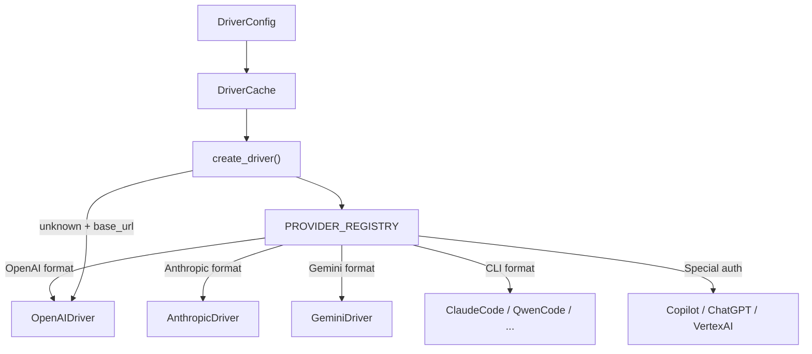

# LLM Provider Drivers — librefang-llm-drivers-src

# LLM Provider Drivers — `librefang-llm-drivers`

## Purpose

This crate provides the LLM abstraction layer for LibreFang. It maps provider names (e.g. `"anthropic"`, `"groq"`, `"ollama"`) to concrete driver implementations that handle HTTP requests, SSE streaming, authentication, and response parsing. Every agent in the runtime ultimately calls through `create_driver()` to get an `Arc<dyn LlmDriver>`.

The module supports **43+ providers** — cloud APIs, local inference servers, CLI subprocess tools, and Azure/Vertex AI services — through a handful of driver implementations that share a common protocol interface.

## Architecture



All drivers implement the `LlmDriver` trait (defined in `librefang-llm-driver`, re-exported here as `crate::llm_driver::LlmDriver`) with two methods:

- **`complete(request) → CompletionResponse`** — single-shot request/response
- **`stream(request, tx) → CompletionResponse`** — SSE streaming via an `mpsc::Sender<StreamEvent>` channel

## Module Layout

| Path | Responsibility |
|------|---------------|
| `src/lib.rs` | Re-exports `librefang-llm-driver` as `llm_driver`; declares `drivers` and `think_filter` submodules |
| `src/drivers/mod.rs` | Provider registry, `DriverCache`, `ApiFormat` enum, `create_driver()` factory, detection utilities |
| `src/drivers/openai.rs` | OpenAI-compatible driver — handles 90%+ of providers |
| `src/drivers/anthropic.rs` | Anthropic Messages API driver |
| `src/drivers/gemini.rs` | Google Gemini `generateContent` API driver |
| `src/drivers/vertex_ai.rs` | Google Cloud Vertex AI (OAuth2 + Gemini format) |
| `src/drivers/chatgpt.rs` | ChatGPT with session-token auth |
| `src/drivers/copilot.rs` | GitHub Copilot with automatic token exchange |
| `src/drivers/claude_code.rs` | Claude Code CLI subprocess driver |
| `src/drivers/qwen_code.rs` | Qwen Code CLI subprocess driver |
| `src/drivers/gemini_cli.rs` | Gemini CLI subprocess driver |
| `src/drivers/codex_cli.rs` | Codex CLI subprocess driver |
| `src/drivers/aider.rs` | Aider CLI subprocess driver |
| `src/drivers/fallback.rs` | Fallback driver that tries multiple providers in sequence |
| `src/drivers/token_rotation.rs` | Wrapper that rotates API keys on rate-limit errors |
| `src/think_filter.rs` | Streaming `\widgets` tag filter |

## Provider Registry

`PROVIDER_REGISTRY` is a static slice of `ProviderEntry` structs. Each entry contains:

- **`name`** — canonical provider identifier (e.g. `"deepseek"`)
- **`aliases`** — alternative names that resolve to this provider (e.g. `"google"` → `"gemini"`, `"doubao"` → `"volcengine"`)
- **`base_url`** — default API endpoint
- **`api_key_env`** — primary environment variable for the API key
- **`alt_api_key_env`** — secondary env var (e.g. `GEMINI_API_KEY` also checks `GOOGLE_API_KEY`)
- **`key_required`** — `false` for local providers (Ollama, vLLM, LM Studio) that don't require authentication
- **`api_format`** — which `ApiFormat` variant to use
- **`hidden`** — excluded from `known_providers()` output (internal/coding-specific variants)

Lookup is performed by `find_provider()`, which matches against `name` and `aliases`.

### API Formats

| `ApiFormat` | Driver | Auth / Notes |
|---|---|---|
| `OpenAI` | `OpenAIDriver` | Bearer token; covers Groq, OpenRouter, DeepSeek, etc. |
| `Anthropic` | `AnthropicDriver` | `x-api-key` header |
| `Gemini` | `GeminiDriver` | API key as query parameter |
| `AzureOpenAI` | `OpenAIDriver` (Azure mode) | `api-key` header; deployment-based URL |
| `VertexAI` | `VertexAiDriver` | Google OAuth2 from service account |
| `ChatGpt` | `ChatGptDriver` | Session cookie auth |
| `Copilot` | `CopilotDriver` | GitHub token → Copilot token exchange |
| `ClaudeCode` | `ClaudeCodeDriver` | CLI subprocess |
| `QwenCode` | `QwenCodeDriver` | CLI subprocess |
| `GeminiCli` | `GeminiCliDriver` | CLI subprocess |
| `CodexCli` | `CodexCliDriver` | CLI subprocess |
| `Aider` | `AiderDriver` | CLI subprocess |

## Driver Creation Flow

`create_driver(config: &DriverConfig) → Result<Arc<dyn LlmDriver>, LlmError>`

1. Look up `config.provider` in `PROVIDER_REGISTRY` via `find_provider()`
2. If found, delegate to `create_driver_from_entry()` which:
   - Resolves the API key: explicit `config.api_key` → primary env var → alt env var → (for OpenAI) Codex credential file
   - Validates that required keys are present
   - Constructs the concrete driver, passing `proxy_url` if set
3. If not found and `config.base_url` is set, create an `OpenAIDriver` (convention: `{PROVIDER}_API_KEY` env var)
4. If not found and no `base_url`, check whether the convention env var exists — if so, return a helpful error asking for `base_url`
5. Otherwise, return an error listing all known providers

## DriverCache

`DriverCache` is a thread-safe, lazy-initializing cache backed by `DashMap<String, Arc<dyn LlmDriver>>`. It prevents redundant TLS handshake and connection-pool setup when the same provider configuration is used repeatedly.

**Cache key construction** (`DriverCache::cache_key`):
```
{provider}|{hashed_api_key}|{base_url}|{proxy_url}
```

The API key is hashed (not stored raw) to avoid keeping secrets as map keys.

Usage pattern:
```rust
let cache = DriverCache::new();
let driver = cache.get_or_create(&config)?;  // creates once, returns Arc clone after
cache.clear();  // invalidate after config hot-reload
```

## OpenAI-Compatible Driver

`OpenAIDriver` is the most complex driver because it handles the majority of providers. Key behaviors:

### Request Building (`build_request`)

- Converts `CompletionRequest.messages` to OpenAI wire format (`OaiMessage`)
- Handles `ContentBlock` variants: `Text`, `ToolUse`, `ToolResult`, `Image`, `ImageFile`, `Thinking`
- Strips `reasoning_content` from historical assistant messages for DeepSeek-R1 (the API rejects it)
- Adds empty-string `reasoning_content` for Kimi K2.5 multi-turn with tool calls
- Selects `max_tokens` vs `max_completion_tokens` based on model family (GPT-5, o-series use the latter)
- Omits `temperature` for reasoning models that reject it
- Adds Ollama `think` boolean from `request.thinking` when targeting Ollama-like endpoints
- Applies `response_format` for structured output (JSON schema)
- Merges `extra_body` parameters into the JSON body (provider-specific overrides)

### Retry Logic (both `complete` and `stream`)

The driver retries up to 3 times with automatic parameter adjustment:

| Condition | Action |
|---|---|
| HTTP 429 (rate limit) | Exponential backoff: 2s, 4s, 6s |
| `temperature` + `unsupported_parameter` | Strip `temperature` |
| `max_tokens` + `unsupported_parameter` | Switch to `max_completion_tokens` |
| `max_tokens` exceeds model limit | Auto-cap to extracted limit |
| `tool_use_failed` (Groq) | Parse XML tool calls from `failed_generation` |
| 500 + "does not support tools" | Retry without tools |

### Streaming

SSE parsing processes `data:` lines from the byte stream. Deltas are routed:

- `delta.content` → through `StreamingThinkFilter` → `StreamEvent::TextDelta`
- `delta.reasoning_content` (or `delta.reasoning` for Ollama) → `StreamEvent::ThinkingDelta`
- `delta.tool_calls` → accumulated by index → `StreamEvent::ToolUseStart` / `ToolInputDelta` / `ToolUseEnd`
- `usage` (in final chunk) → tracked for response

The `stream_options: {"include_usage": true}` field is sent to get token counts; if the provider rejects it, the retry loop strips it.

### Think Tag Extraction

Local models (Qwen3, DeepSeek-R1) sometimes embed reasoning in ` widgets` tags within `content`. `extract_think_tags()` separates these into `ContentBlock::Thinking`. The streaming path uses `StreamingThinkFilter` to intercept these tags in real-time deltas.

When a response contains only thinking with no text output, `extract_thinking_summary()` synthesizes a brief text block from the last paragraph of the thinking content to prevent the agent loop from treating it as an empty response.

### Azure OpenAI Mode

`OpenAIDriver::new_azure_with_proxy()` constructs the URL as `{endpoint}/openai/deployments/{deployment}/chat/completions?api-version={version}` and uses the `api-key` header instead of `Authorization: Bearer`.

### Groq Tool Call Recovery

When Groq returns `tool_use_failed` (model generated tool calls as XML instead of JSON), `parse_groq_failed_tool_call()` extracts `<function=name{args}></function>` blocks and constructs a valid `CompletionResponse` with proper `ToolCall` structs.

## Utility Functions

| Function | Purpose |
|---|---|
| `detect_available_provider()` | Scans env vars in priority order; returns first provider with a configured key |
| `known_providers()` | Lists all non-hidden provider names (for CLI help / status display) |
| `cli_provider_available(name)` | Checks if a CLI binary is on PATH or has credentials |
| `is_cli_provider(name)` | Returns true for subprocess-based providers |
| `is_proxied_via_env(env_vars, official_hosts)` | Detects if env vars redirect traffic away from official API hosts |
| `resolve_provider_api_key(provider)` | Checks all key sources: primary env → alt env → Codex credential file |
| `read_codex_credential()` | Reads OpenAI key from `$CODEX_HOME/auth.json` or `~/.codex/auth.json` |

## Connection to the Rest of the Codebase

- **Runtime** (`librefang-runtime`) calls `create_driver()` and `DriverCache::get_or_create()` to instantiate drivers for agents
- **Model catalog** (`librefang-runtime/src/model_catalog.rs`) calls `detect_auth()` which uses `cli_provider_available()` and `is_cli_provider()` to determine provider availability
- **CLI** (`librefang-cli`) calls `detect_available_provider()` for first-run setup and `known_providers()` for help output
- **Types** (`librefang-types`) provides `DriverConfig`, `VertexAiConfig`, `AzureOpenAiConfig`, `ContentBlock`, `TokenUsage`, `ToolCall`, `ResponseFormat`
- **HTTP** (`librefang-http`) provides `proxied_client()` and `proxied_client_with_override()` for constructing `reqwest::Client` instances with proxy support
- **Driver trait** (`librefang-llm-driver`) defines `LlmDriver`, `CompletionRequest`, `CompletionResponse`, `StreamEvent`, `LlmError`

## Adding a New Provider

1. Add a `ProviderEntry` to `PROVIDER_REGISTRY` in `src/drivers/mod.rs` with the provider name, base URL, env var, and `ApiFormat` variant
2. If the provider uses an existing format (most use `OpenAI`), no driver code changes are needed — the registry entry and env var are sufficient
3. If the provider needs a new auth flow or wire format, add a new `ApiFormat` variant and corresponding driver module, then wire it up in `create_driver_from_entry()`
4. If the provider is an internal/coding variant that shouldn't appear in `known_providers()`, set `hidden: true`