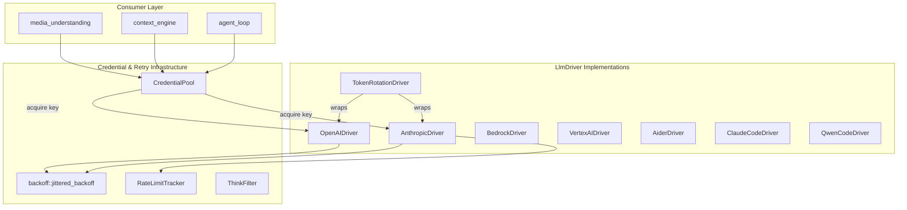

# LLM Provider Drivers — librefang-llm-drivers-src

# librefang-llm-drivers — LLM Provider Drivers

## Purpose

This crate provides a unified abstraction layer over multiple LLM providers (Anthropic, OpenAI, AWS Bedrock, Google Vertex AI) and CLI-based coding assistants (Aider, Claude Code, Qwen Code). Every provider is wrapped behind the `LlmDriver` trait so that the rest of the codebase can dispatch completions and streaming requests without knowing which backend is in use.

## Architecture



## Core Trait — `LlmDriver`

Every provider implements `LlmDriver` (defined in the companion `librefang-llm-driver` crate) which exposes two methods:

| Method | Description |
|--------|-------------|
| `complete(CompletionRequest) -> Result<CompletionResponse, LlmError>` | Blocking (async) request/response completion |
| `stream(CompletionRequest, mpsc::Sender<StreamEvent>) -> Result<CompletionResponse, LlmError>` | Server-sent-events streaming; sends incremental deltas through the channel and returns the assembled response |

Implementations also expose `family() -> LlmFamily` to identify the provider family (Anthropic, OpenAI, etc.) for provider-specific logic elsewhere in the system.

### Key Types

- **`CompletionRequest`** — Model ID, message history, tools, system prompt, temperature, max tokens, prompt caching flags, thinking configuration, and response format.
- **`CompletionResponse`** — Content blocks (text, tool use, thinking), stop reason, tool calls list, and token usage.
- **`StreamEvent`** — Incremental events emitted during streaming: `TextDelta`, `ThinkingDelta`, `ToolUseStart`, `ToolInputDelta`, `ToolUseEnd`, `ContentComplete`.
- **`LlmError`** — `Http`, `Api { status, message }`, `RateLimited`, `Overloaded`, `Parse`, `MissingApiKey`.

---

## Credential Pool — `credential_pool`

Multi-key failover for a single provider. Holds multiple API keys ranked by priority and selects among non-exhausted credentials using a pluggable strategy.

### Selection Strategies

| Strategy | Behaviour |
|----------|-----------|
| `FillFirst` | Always pick the highest-priority available key until exhausted, then fall back. Maximises premium key utilisation. |
| `RoundRobin` | Cycle through available keys in priority order. Distributes load evenly. **(default)** |
| `Random` | Pick a random available key on each call. |
| `LeastUsed` | Pick the key with the lowest `request_count`. |

### Exhaustion and Cooldown

When a key receives a 429 (rate-limited) or 402 (quota-exhausted) response, call `mark_exhausted(&key)`. The credential is excluded from selection for `exhausted_ttl` (default 1 hour, configurable via `with_exhausted_ttl`). On success, `mark_success(&key)` increments the request counter and clears any active exhaustion marker immediately (early recovery).

### Thread Safety

The pool wraps all mutable state in a single `Mutex` so that the round-robin index and credential list are read/written atomically together, eliminating TOCTOU races. The `ArcCredentialPool` type alias (`Arc<CredentialPool>`) is the recommended handle for sharing across async tasks.

### Key Redaction

All diagnostic output (`Debug` impl, `CredentialSnapshot`) redacts API keys to a `****abcd` hint (last 4 characters). Raw key strings never appear in logs or panic messages.

---

## Backoff — `backoff`

Jittered exponential backoff for retry loops shared by all HTTP-based drivers.

### Formula

```
delay = max(exp_delay, floor) + jitter
exp_delay = min(base × 2^(attempt-1), max_delay)
jitter ∈ [0, jitter_ratio × base_for_jitter]
```

### Seed Diversity

The random seed combines `SystemTime::now().subsec_nanos()` with a process-global Weyl-sequence counter (`JITTER_COUNTER`), ensuring diverse seeds even when multiple concurrent retry loops fire within the same clock tick.

### Convenience Functions

| Function | Base | Cap | Jitter | Use Case |
|----------|------|-----|--------|----------|
| `standard_retry_delay(attempt, floor)` | 2 s | 60 s | 50% | Standard LLM API retries; `floor` accepts `Retry-After` header value |
| `tool_use_retry_delay(attempt)` | 1.5 s | 60 s | 50% | Faster base for tool-use failures |

### Retry-After Floor

Pass a `Retry-After` `Duration` as the `floor` argument to honour server-supplied minimum delays. The floor is capped at 300 s to prevent pathological values from stalling the retry loop.

---

## HTTP-Based Drivers

### Anthropic — `drivers/anthropic`

Full implementation of the Anthropic Messages API (version `2023-06-01`).

**Features:**
- System prompt extraction from messages or dedicated field
- Tool use with structured `input` (ensured to be a JSON object via `ensure_object`)
- Extended thinking (`budget_tokens` ≥ 1024, automatic `max_tokens` adjustment)
- Prompt caching with rolling-window `cache_control` markers
- SSE streaming with `TextDelta`, `ThinkingDelta`, `ToolUseStart/InputDelta/End` events
- Retry on 429/529 with `standard_retry_delay` and `Retry-After` header extraction
- Rate limit header logging via `RateLimitSnapshot`

#### Prompt Caching — Rolling Window

Anthropic allows at most 4 `cache_control` breakpoints per request. The driver distributes them as:

1. **System block** — always 1 marker
2. **Last tool definition** — 1 marker when tools are present
3. **Trailing messages** — remaining 2–3 markers on the newest messages

This maximises the cached prefix length for multi-turn conversations. Empty `Blocks` payloads (e.g. thinking-only turns after filtering) are skipped without consuming breakpoint slots.

#### Cache TTL

| `cache_ttl` | Marker | Beta Header |
|-------------|--------|-------------|
| `None` (default) | `{"type": "ephemeral"}` (5 min) | No |
| `Some("1h")` | `{"type": "ephemeral", "ttl": "1h"}` | `extended-cache-ttl-2025-04-11` |

#### Structured Output

Anthropic has no native `response_format` field. When `ResponseFormat::Json` or `ResponseFormat::JsonSchema` is requested, formatting instructions are appended to the system prompt.

#### Tool Input Normalisation — `ensure_object`

The Anthropic API requires tool `input` to be a JSON object. `ensure_object` handles malformed inputs from hallucinating models:
- `null` → `{}`
- JSON string containing an object → parse and use the object
- Any other type → `{"raw_input": <value>}` (preserves original for debugging)

---

### OpenAI — `drivers/openai`

OpenAI-compatible API driver (also used for any provider with an OpenAI-compatible endpoint). Referenced by Anthropic for shared `parse_tool_args` and `malformed_tool_input` helpers.

### AWS Bedrock — `drivers/bedrock`

Uses the Bedrock Converse API with bearer token authentication (`AWS_BEARER_TOKEN_BEDROCK`).

**Credential resolution order:**
1. `bedrock_api_key` constructor argument
2. `AWS_BEARER_TOKEN_BEDROCK` environment variable

**Region resolution:**
1. `region` constructor argument
2. `AWS_REGION` environment variable
3. `AWS_DEFAULT_REGION` environment variable
4. Default: `us-east-1`

**Message conversion:** Converts LibreFang message types to Bedrock's `ConverseRequest` format. Tool use/result blocks are mapped to Bedrock's `toolUse`/`toolResult` structures. Includes `validate_bedrock_tool_pairing` to ensure tool-use/tool-result message alternation requirements are met.

**Unsupported content blocks:** `Image`, `ImageFile`, `Thinking`, and `Unknown` are silently dropped during conversion.

---

### Vertex AI — `drivers/vertex_ai`

Google Vertex AI driver with JWT-based service account authentication. Implements RSA-SHA256 signing in pure Rust (no OpenSSL dependency) with custom ASN.1/DER parsing for PKCS#8 keys (`parse_pkcs8_rsa`). Supports token acquisition from both service account JSON and `gcloud` CLI.

### Token Rotation — `drivers/token_rotation`

Wrapper driver that manages multiple API keys/credentials and rotates among them based on exhaustion state and usage metrics. Uses `resets_sooner` logic to prefer tokens with later reset times.

---

## CLI-Based Drivers

These drivers spawn external CLI tools as subprocesses rather than making HTTP API calls. They handle their own LLM provider authentication via standard environment variables.

### Aider — `drivers/aider`

Spawns `aider` in non-interactive mode (`--message`) with `--yes-always --no-auto-commits --no-git` flags. Model IDs are mapped by stripping the `aider/` prefix (e.g. `aider/sonnet` → `--model sonnet`).

### Claude Code — `drivers/claude_code`

Wraps the Claude Code CLI. Checks for credentials in the user's home directory (`claude_credentials_exist` → `claude_credentials_in_dir`).

### Qwen Code — `drivers/qwen_code`

Wraps the Qwen Code CLI. Similar credential discovery pattern, with `common_cli_paths` for binary detection and `home_dir` for credential location.

---

## Supporting Modules

### Rate Limit Tracker — `rate_limit_tracker`

Parses provider-specific rate limit headers into `RateLimitSnapshot` structs. Provides `display()` formatting for diagnostics (used by CLI commands like `doctor`, `update`, `init`). Includes utilities like `usage_ratio`, `ascii_bar`, `fmt_seconds`, `fmt_bucket_line`, and datetime parsing (`parse_iso8601_to_unix`, `parse_http_date_to_unix`).

### Think Filter — `think_filter`

Stateful filter that strips `<think&gt;...&lt;/think>` blocks from streaming text deltas using `partial_suffix_match` for robust handling of tags split across multiple deltas. Used to suppress internal reasoning output from models that emit think tags.

---

## Driver Discovery — `drivers/mod.rs`

The `ProviderEntry` system and `detect_available_provider` / `cli_provider_available` / `is_cli_provider` functions determine which drivers are available at runtime. This feeds into the model catalog's `detect_auth` flow and the CLI's `detect_best_provider` startup sequence.

---

## Integration Points

### Who calls `CredentialPool::acquire`?

| Caller | Context |
|--------|---------|
| `agent_loop::call_with_retry` | Main agent completion loop |
| `agent_loop::stream_with_retry` | Streaming agent loop |
| `context_engine::after_turn` | Post-turn context processing |
| `hooks::run_hook` | Hook execution |
| `media_understanding::process_attachments` | Image/file processing |
| `media_understanding::transcribe_audio` | Audio transcription |
| `command_lane::submit` | Command submission |

### Who reads `RateLimitTracker::display`?

CLI commands (`doctor`, `update`, `init`, `start`), dotenv/vault loading, plugin runtime, registry sync, and Docker sandbox creation all use rate limit display for diagnostics and status reporting.