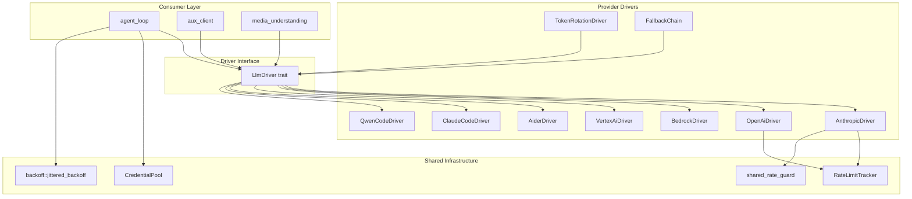

# LLM Provider Drivers — librefang-llm-drivers-src

# LLM Provider Drivers — `librefang-llm-drivers`

## Purpose

This crate provides a uniform driver layer for communicating with LLM providers. Every provider — whether it's a hosted API (Anthropic, OpenAI, Bedrock, Vertex AI), an OpenAI-compatible proxy, or a local CLI tool (Aider, Claude Code, Qwen Code) — is accessed through the same `LlmDriver` trait. The crate also ships the cross-cutting infrastructure that all drivers share: retry backoff with jitter, credential pooling with failover, rate-limit tracking, and cross-process rate-limit guards.

## Architecture



## Key Components

### `LlmDriver` Trait

The central abstraction. Every provider implements this async trait with two methods:

- **`complete(request: CompletionRequest) → Result<CompletionResponse, LlmError>`** — single-shot request/response.
- **`stream(request, tx: Sender<StreamEvent>) → Result<CompletionResponse, LlmError>`** — server-sent events streamed to `tx`, with a final `CompletionResponse` returned once the stream ends.

Both methods accept the same `CompletionRequest` struct (model ID, messages, tools, temperature, system prompt, thinking config, caching flags) and return the same `CompletionResponse` (content blocks, tool calls, stop reason, token usage).

### `LlmError` Variants

| Variant | Meaning |
|---|---|
| `Http(String)` | Network / transport failure |
| `Api { status, message }` | Non-2xx HTTP response |
| `RateLimited { retry_after_ms, message }` | 429 from the provider |
| `Overloaded { retry_after_ms }` | 529 (Anthropic-specific capacity limit) |
| `Parse(String)` | Response body couldn't be deserialized |
| `MissingApiKey(String)` | No credential available |

### `LlmFamily` Enum

Groups drivers by wire protocol family (`Anthropic`, `OpenAi`, `Gemini`, `Bedrock`, etc.). Used upstream for provider-specific behaviour like message formatting and tool schema adaptation.

---

## Infrastructure Modules

### `backoff` — Jittered Exponential Backoff

Provides retry delay computation with proportional jitter to avoid thundering-herd effects when multiple sessions retry simultaneously.

**Formula:** `delay = max(exp_delay, floor) + jitter`

where `exp_delay = min(base × 2^(attempt−1), max_delay)` and `jitter ∈ [0, jitter_ratio × base_for_jitter]`.

#### Key Functions

| Function | Use Case |
|---|---|
| `jittered_backoff(attempt, base, max, jitter_ratio, floor)` | Fully configurable delay |
| `standard_retry_delay(attempt, floor)` | Standard LLM retries — 2 s base, 60 s cap, 50% jitter |
| `tool_use_retry_delay(attempt)` | Tool-use failures — 1.5 s base, 60 s cap, 50% jitter |

The `floor` parameter honours server-supplied `Retry-After` headers (capped at 300 s). The random seed combines wall-clock nanoseconds with a process-global Weyl-sequence counter (`JITTER_COUNTER`) so that concurrent calls within the same clock tick still produce diverse delays — critical on Windows where clock granularity is ~15 ms.

All arithmetic is performed in `f64` space and clamped before constructing a `Duration`, avoiding the overflow panic that `Duration::mul_f64` triggers for large exponents.

### `credential_pool` — Multi-Key Failover

Manages multiple API keys per provider with automatic exhaustion tracking and cooldown.

#### Selection Strategies

| Strategy | Behaviour |
|---|---|
| `FillFirst` (default priority ordering) | Always picks the highest-priority available key. Premium keys are exhausted before falling back. |
| `RoundRobin` (default) | Cycles through available keys in priority order. Distributes load evenly. |
| `Random` | Picks a random available key using a time-seeded LCG (no `rand` dependency). |
| `LeastUsed` | Picks the key with the fewest successful `request_count` values. |

#### Lifecycle

```
acquire() → Option<String>       // Get next available key (cloned)
mark_success(&key)                // Increment count, clear exhaustion
mark_exhausted(&key)              // Enter cooldown for DEFAULT_EXHAUSTED_TTL (1 hour)
```

Credentials are sorted by priority (descending) at construction. Exhausted credentials are excluded from selection until their cooldown expires. Calling `mark_success` on an exhausted key immediately clears the cooldown (early-recovery path).

The pool is `Send + Sync` behind a single `Mutex`, ensuring the `RoundRobin` index and credential list are always read/written atomically — no TOCTOU between reading the index and selecting a credential.

#### `CredentialSnapshot`

The `snapshot()` method returns redacted diagnostic views (`key_hint: "****abcd"`, priority, request_count, is_exhausted) safe for logging and dashboards. Raw API keys are never exposed.

#### `ArcCredentialPool`

A type alias for `Arc<CredentialPool>`. Use `new_arc_pool(keys, strategy)` for a ready-to-share handle.

---

## Provider Drivers

### Anthropic (`drivers/anthropic`)

Full implementation of the Anthropic Messages API (version `2023-06-01`).

**Features:**
- System prompt extraction from messages or explicit field
- Prompt caching with `cache_control` markers, respecting the 4-breakpoint-per-request cap
- Extended thinking (`budget_tokens`) with automatic `max_tokens` adjustment
- Tool use (content blocks + `ToolCall` extraction)
- SSE streaming with incremental `TextDelta`, `ThinkingDelta`, `ToolInputDelta`, and `ToolUseEnd` events
- Automatic retry on 429/529 with `standard_retry_delay`
- Cross-process rate-limit guard via `shared_rate_guard` (429 lockouts only — 529 is server capacity, not account-level)
- Rate-limit header extraction and logging via `RateLimitSnapshot`
- `response_format` injection into system prompt (Anthropic has no native field)
- `Retry-After` header honouring as the backoff floor

**Prompt caching strategy (`system_and_3` rolling window):**

The driver stamps `cache_control` markers on up to 4 breakpoints:
1. System prompt block (always)
2. Last tool definition (when tools are present)
3–4. Trailing message blocks (newest first)

The function `apply_cache_markers_system_and_3` walks the message list tail-to-head, skipping empty `Blocks` payloads (e.g., Thinking-only turns that `convert_message` filters out) without consuming the breakpoint budget. This ensures the rolling window always covers 2–3 actual messages.

**1-hour cache TTL:** When `cache_ttl: Some("1h")` is set, the driver attaches the `extended-cache-ttl-2025-04-11` beta header and writes `"ttl": "1h"` into every `cache_control` marker. The default (no `ttl` key) maps to Anthropic's 5-minute window.

**Tool input sanitization (`ensure_object`):**

Anthropic requires tool `input` to be a JSON object. `ensure_object` handles malformed inputs:
- `null` → `{}`
- String containing a JSON object → parsed and used
- Any other type → `{"raw_input": <value>}` for debugging

### Bedrock (`drivers/bedrock`)

AWS Bedrock Converse API driver using bearer token authentication (`AWS_BEARER_TOKEN_BEDROCK`).

**Credential resolution order:**
1. Explicit `bedrock_api_key` argument
2. `AWS_BEARER_TOKEN_BEDROCK` environment variable

**Region resolution:**
1. Explicit `region` argument
2. `AWS_REGION` env var
3. `AWS_DEFAULT_REGION` env var
4. Fallback: `us-east-1`

The endpoint is constructed as `https://bedrock-runtime.{region}.amazonaws.com/model/{model}/converse`. Messages are converted to Bedrock's `ConverseRequest` format with proper tool-use/tool-result pairing validation.

### Aider (`drivers/aider`)

Spawns the `aider` CLI as a subprocess in non-interactive mode. Aider manages its own LLM provider authentication via standard environment variables.

**Key details:**
- Model IDs prefixed with `aider/` are stripped before passing to `--model`
- Always runs with `--yes-always`, `--no-auto-commits`, `--no-git`
- Authentication errors are detected from stderr patterns ("not authenticated", "api key", etc.)
- Returns zero token usage (CLI doesn't report this)
- Detectable via `aider_available()` / `AiderDriver::detect()`

### Other Drivers (referenced in call graph)

| Driver | Protocol | Auth |
|---|---|---|
| `OpenAiDriver` | OpenAI Chat Completions API (also DeepSeek, Ollama, and other compatible endpoints) | API key |
| `VertexAiDriver` | Google Vertex AI with JWT signing (service account or `gcloud` CLI) | Service account JSON / gcloud |
| `GeminiDriver` | Google Gemini API (shares request building with Vertex AI) | API key |
| `ClaudeCodeDriver` | Claude Code CLI subprocess | Local credentials (`~/.claude/`) |
| `QwenCodeDriver` | Qwen Code CLI subprocess with environment filtering | Local credentials |
| `TokenRotationDriver` | Wrapper that rotates to a new credential on rate-limit errors | Delegates to inner driver |
| `FallbackChain` | Chains multiple `ChainEntry` drivers; tries each in order on failure | Per-entry |

---

## Driver Construction

Drivers are created through the `create_driver` / `create_driver_from_entry` functions in `drivers/mod.rs`, which:

1. Resolve the provider's API format via `provider_api_format`
2. Look up default URLs and settings via `provider_defaults`
3. Check for CLI-based providers via `cli_provider_available` / `is_cli_provider`
4. Construct the appropriate driver with proxy and timeout settings

Provider defaults include base URLs, model aliases, and credential sources for known providers (Novita, Bedrock, Kimi Coding, etc.).

---

## Thread Safety and Concurrency

- All drivers are `Send + Sync` and safe to share across async tasks.
- `CredentialPool` uses a single `Mutex<CredentialPoolInner>` for atomic index + credential reads.
- The backoff counter `JITTER_COUNTER` is an `AtomicU64` with `Relaxed` ordering — sufficient for seed diversity.
- API keys are stored in `Zeroizing<String>` wrappers that zero memory on drop.
- HTTP clients are obtained from `librefang_http::proxied_client()` or `proxied_client_with_override(proxy_url)` for per-provider proxy support.

## Usage from the Runtime

The consumer layer (`librefang-runtime`) interacts with this crate primarily through:

- **`call_with_retry` / `stream_with_retry`** in `agent_loop` — acquires a credential from the pool, calls the driver, and handles retry/exhaustion marking
- **`build_driver`** in `aux_client` — constructs a driver from a config entry
- **`detect_auth`** in `model_catalog` — probes for CLI provider availability
- **`probe_provider`** in `provider_health` — checks provider connectivity using the driver's API format