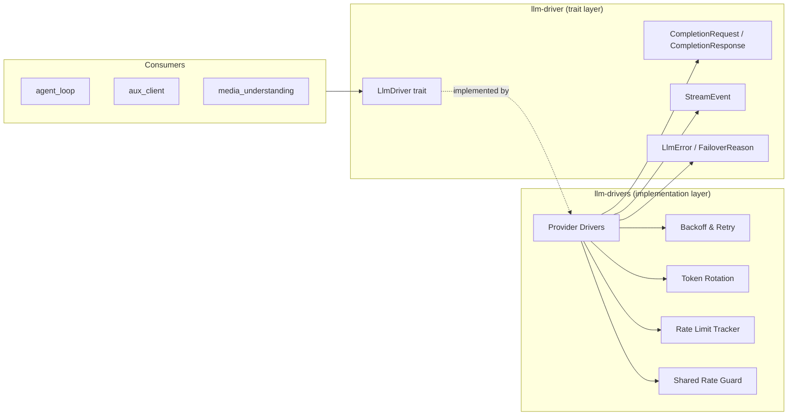

# LLM Provider Drivers

# LLM Provider Drivers

The LLM Provider Drivers module is LibreFang's interface to every supported large language model provider. It is split into two cooperating crates: one that defines the abstraction contract, and one that ships concrete implementations and the shared operational infrastructure they all rely on.

## Structure

| Sub-module | Responsibility |
|---|---|
| [librefang-llm-driver](librefang-llm-driver-src.md) | Defines the `LlmDriver` trait, request/response types (`CompletionRequest`, `CompletionResponse`), streaming protocol (`StreamEvent`), error taxonomy (`LlmError`, `FailoverReason`), and driver configuration. This is the contract that every provider implements. |
| [librefang-llm-drivers](librefang-llm-drivers-src.md) | Contains the concrete driver implementations (OpenAI, Anthropic, Gemini, Bedrock, Vertex AI, Ollama, Aider, Claude Code, Qwen Code, and OpenAI-compatible proxies) plus the shared cross-cutting infrastructure: retry backoff with jitter, credential pooling via `token_rotation`, rate-limit tracking, and cross-process rate-limit guards. |

## Key Cross-Module Workflows

**Request lifecycle.** A consumer such as `agent_loop` builds a `CompletionRequest` (types from `llm-driver`) and calls a concrete driver (from `llm-drivers`). The driver serialises the request for its specific provider, then deserialises the response back into the shared `CompletionResponse` / `StreamEvent` types so the caller never needs to know which provider was used.

**Credential rotation and failover.** Drivers use `token_rotation` to cycle through available API keys, cooling down slots that return errors. When a request fails, the error is classified into a `FailoverReason` (defined in `llm-driver`), which the runtime uses to decide whether to retry with a different key, fall back to another provider, or surface the error to the user.

**Rate-limit awareness.** Before issuing a request, each driver checks the `shared_rate_guard` (cross-process mutex) and the `rate_limit_tracker`. After a response, 429 headers are recorded. This state is shared across all driver instances so that one process's rate-limit backoff benefits every other process using the same guard file.

**Retry with backoff.** Transient failures trigger `standard_retry_delay` (exponential backoff with jitter), also defined in `llm-drivers`. The error taxonomy from `llm-driver` determines which failures are retryable versus fatal.