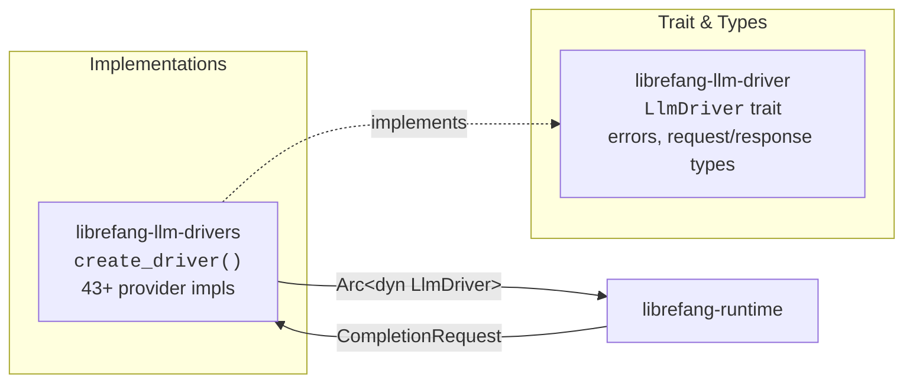

# LLM Provider Drivers

# LLM Provider Drivers

## Purpose

This module group provides LibreFang's LLM abstraction layer — a trait-based interface (`LlmDriver`) backed by 43+ concrete provider implementations. Every agent completion request in the runtime flows through this layer, whether it targets a cloud API, a local inference server, or a CLI subprocess tool.

## Sub-modules

| Crate | Role |
|---|---|
| [librefang-llm-driver](librefang-llm-driver-src.md) | Defines the core `LlmDriver` trait, `CompletionRequest`/`CompletionResponse` types, streaming events, and error classification/sanitization utilities. |
| [librefang-llm-drivers](librefang-llm-drivers-src.md) | Implements `LlmDriver` for every supported provider and exposes the `create_driver()` factory that maps provider names to concrete drivers. |

## How They Fit Together

**`librefang-llm-driver`** is the contract crate — it has zero provider-specific logic. It depends on `librefang-types` for shared domain types (`Message`, `TokenUsage`, `ToolDefinition`) and exports the error utilities that providers use to classify and sanitize raw API errors for downstream consumers.

**`librefang-llm-drivers`** consumes that contract and fills in every concrete implementation. Its `create_driver()` factory accepts a `DriverConfig`, resolves provider-specific defaults (base URLs, auth headers, model families), and returns a cached `Arc<dyn LlmDriver>`. Provider families include:

- **Cloud APIs** — Anthropic, OpenAI, Gemini, Groq, and others
- **Cloud platform wrappers** — Azure OpenAI, Vertex AI (with PKCS#8 RSA key parsing for JWT auth)
- **Local inference** — Ollama and compatible servers
- **CLI subprocess drivers** — Claude Code, Qwen Code, Gemini CLI, Codex CLI (auto-detected from `$PATH` and credential files)
- **Cross-cutting wrappers** — token-rotation driver (cycles API keys), fallback driver (chains multiple providers)

## Key Cross-Module Workflows

1. **Driver instantiation** — Runtime calls `create_driver(config)` → factory resolves provider name → applies defaults and URL overrides → caches the driver instance for reuse.

2. **Completion** — Runtime builds a `CompletionRequest` against the trait → concrete driver handles HTTP/SSE, authentication, and provider-specific quirks (e.g., DeepSeek reasoning content stripping, Groq failed-tool-call parsing) → returns `CompletionResponse` or a stream of `StreamEvent`s.

3. **Error handling** — Provider implementations surface raw API errors → `sanitize_raw_excerpt` and `classify_error` (from the trait crate) transform them into user-safe, categorized error types that the runtime can act on.

4. **Provider detection** — CLI drivers check `$PATH` and credential stores (e.g., `claude_credentials_exist` reads from the vault) to determine availability at startup and during catalog updates.