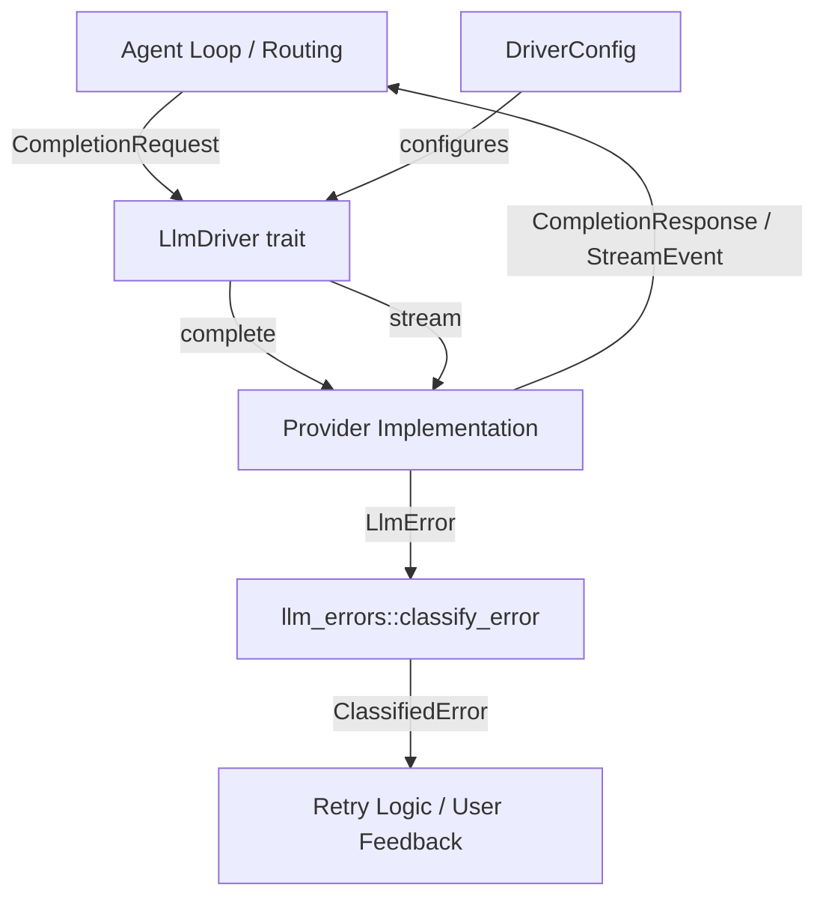
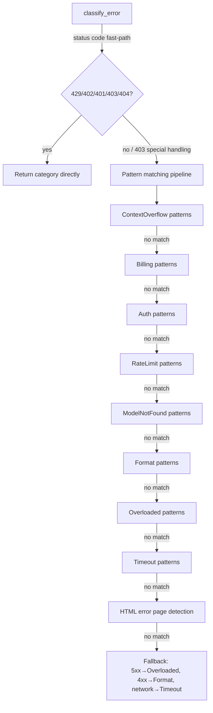

# LLM Providers — librefang-llm-driver-src

# librefang-llm-driver

Provider-agnostic LLM driver abstraction and error classification for LibreFang.

This crate defines the core `LlmDriver` trait that all LLM provider implementations (Anthropic, OpenAI, Gemini, Ollama, etc.) conform to, along with the request/response types, streaming event protocol, and a comprehensive error classification system used throughout the runtime.

## Architecture



The crate is split into two modules:

- **`lib.rs`** — the `LlmDriver` trait, `CompletionRequest`/`CompletionResponse` types, `StreamEvent` protocol, `DriverConfig`, and the `LlmError` enum.
- **`llm_errors`** — error classification (`classify_error`), sanitization for user display, retry-delay extraction, and transient-error detection. Handles error formats from all 19+ supported providers.

## Core Types

### CompletionRequest

A request to an LLM for completion. Constructed by the agent loop or routing layer and passed to a driver.

| Field | Type | Purpose |
|---|---|---|
| `model` | `String` | Model identifier (e.g. `"claude-sonnet-4-20250514"`) |
| `messages` | `Vec<Message>` | Conversation history |
| `tools` | `Vec<ToolDefinition>` | Tools available to the model |
| `max_tokens` | `u32` | Maximum tokens to generate |
| `temperature` | `f32` | Sampling temperature |
| `system` | `Option<String>` | System prompt (extracted for APIs requiring it separately) |
| `thinking` | `Option<ThinkingConfig>` | Extended thinking / reasoning configuration |
| `prompt_caching` | `bool` | Enable prompt caching (Anthropic: ephemeral cache markers; OpenAI: automatic prefix caching) |
| `response_format` | `Option<ResponseFormat>` | Structured output format |
| `timeout_secs` | `Option<u64>` | Per-request timeout override (seconds, inactivity-based) |
| `extra_body` | `Option<HashMap<String, Value>>` | Provider-specific parameters merged into the request body (last-wins) |
| `agent_id` | `Option<String>` | Caller agent identity for MCP bridge forwarding |

### CompletionResponse

```rust
pub struct CompletionResponse {
    pub content: Vec<ContentBlock>,
    pub stop_reason: StopReason,
    pub tool_calls: Vec<ToolCall>,
    pub usage: TokenUsage,
}
```

Use `response.text()` to concatenate all text content blocks into a single string. This is the most common accessor — it filters out `Thinking` blocks and any non-text content.

### StreamEvent

Events emitted during streaming. The agent loop consumes these via a `tokio::sync::mpsc::Receiver` to provide real-time feedback.

| Variant | When emitted |
|---|---|
| `TextDelta { text }` | Incremental text content |
| `ToolUseStart { id, name }` | A tool use block has begun |
| `ToolInputDelta { text }` | Incremental JSON for an in-progress tool call |
| `ToolUseEnd { id, name, input }` | Tool call complete with parsed input |
| `ThinkingDelta { text }` | Incremental reasoning/thinking text |
| `ContentComplete { stop_reason, usage }` | Entire response is done |
| `PhaseChange { phase, detail }` | Agent lifecycle phase transition (UX indicators) |
| `ToolExecutionResult { name, result_preview, is_error }` | Tool execution finished (emitted by agent loop, not the driver) |

The constant `PHASE_RESPONSE_COMPLETE` (`"response_complete"`) is the phase name signalling that LLM text has finished streaming and the agent loop is entering post-processing (session save, proactive memory). Consumers use this to unblock user input before the full response payload is ready.

## The LlmDriver Trait

```rust
#[async_trait]
pub trait LlmDriver: Send + Sync {
    async fn complete(&self, request: CompletionRequest)
        -> Result<CompletionResponse, LlmError>;

    async fn stream(
        &self,
        request: CompletionRequest,
        tx: Sender<StreamEvent>,
    ) -> Result<CompletionResponse, LlmError> { /* default impl */ }

    fn is_configured(&self) -> bool { true }
}
```

**`complete`** — required. Sends a non-streaming request and returns the full response.

**`stream`** — optional override. The default implementation wraps `complete()` and emits `TextDelta` + `ContentComplete` events. Real provider implementations override this to emit incremental deltas. The method returns the full `CompletionResponse` when done, so callers always get a complete result regardless of whether they consume the stream events.

**`is_configured`** — returns `true` for all real drivers. Only `StubDriver` returns `false`, used for testing or when no provider is available.

### Implementing a New Provider

1. Create a struct holding provider-specific state (HTTP client, API key, base URL, etc.).
2. Implement `LlmDriver` with at minimum `complete()`.
3. Override `stream()` if the provider supports SSE or incremental responses.
4. Return `LlmError` variants mapped from provider-specific errors (see error handling below).

## DriverConfig

Configuration for constructing a driver. Passed from `KernelConfig` down to the driver factory.

```rust
pub struct DriverConfig {
    pub provider: String,
    pub api_key: Option<String>,
    pub base_url: Option<String>,
    pub vertex_ai: VertexAiConfig,
    pub azure_openai: AzureOpenAiConfig,
    pub skip_permissions: bool,          // default: true
    pub message_timeout_secs: u64,       // default: 300
    pub mcp_bridge: Option<McpBridgeConfig>,
    pub proxy_url: Option<String>,
}
```

Notable fields:

- **`skip_permissions`** defaults to `true` because LibreFang runs as a daemon with no interactive terminal. The daemon's own capability/RBAC layer handles authorization.
- **`message_timeout_secs`** is inactivity-based (seconds of silence on stdout), not wall-clock time. Only applies to CLI-based providers like Claude Code.
- **`mcp_bridge`** configures bridging LibreFang tools into a CLI driver via MCP. Not serialized — set only by the kernel at construction time.
- **`proxy_url`** overrides the global proxy for this specific provider.

Security: `DriverConfig` implements `Debug` with redacted API keys and credentials. Always use the derived `Debug` output in logs.

## Error Handling

### LlmError (Driver-Level)

The `LlmError` enum represents errors from the driver layer itself:

| Variant | Meaning | Retryable |
|---|---|---|
| `Http(String)` | HTTP request failed | Context-dependent |
| `Api { status, message }` | Provider returned an error | No (generally) |
| `RateLimited { retry_after_ms, message }` | 429 / quota hit | Yes, after delay |
| `Parse(String)` | Response deserialization failed | No |
| `MissingApiKey(String)` | No API key configured | No |
| `Overloaded { retry_after_ms }` | Provider overloaded (503/529) | Yes, after delay |
| `AuthenticationFailed(String)` | Invalid API key | No |
| `ModelNotFound(String)` | Unknown model | No |
| `TimedOut { inactivity_secs, partial_text, partial_text_len, last_activity }` | CLI process stalled | Yes (with partial output) |

The `TimedOut` variant preserves partial output so the agent loop can still use whatever text was generated before the stall.

### Error Classification (llm_errors)

The `llm_errors` module provides a secondary classification layer that takes raw error messages (from any provider) and categorizes them into 8 canonical categories. This is used by the retry logic, user-facing error messages, and monitoring.

#### LlmErrorCategory

```rust
pub enum LlmErrorCategory {
    RateLimit,       // 429, quota exceeded
    Overloaded,      // 503, high demand
    Timeout,         // network errors, ETIMEDOUT
    Billing,         // 402, insufficient credits
    Auth,            // 401/403, invalid API key
    ContextOverflow, // context length exceeded
    Format,          // malformed request
    ModelNotFound,   // unknown model
}
```

#### Classification Flow



**403 handling is special.** Many providers (especially Chinese ones) return 403 for non-auth reasons: quota exhaustion, region restrictions, model access permissions. The classifier checks for rate-limit, billing, and other patterns before falling back to `Auth`. The `FORBIDDEN_NON_AUTH_PATTERNS` table prevents false-positive auth classifications.

#### Primary Entry Points

```rust
// Basic classification — use when you only have the error message and status
let classified = classify_error(message, status);

// Rich classification — preferred when provider/model context is available
let classified = classify_error_with_context(message, status, Some("openai"), Some("gpt-4"));
```

`classify_error_with_context` enriches the result with:
- `provider` and `model` fields for logging
- `suggestion` — actionable advice for the user
- Enriched `sanitized_message` with context annotations (e.g., `"Rate limited [provider=openai, model=gpt-4]"`)

#### ClassifiedError

```rust
pub struct ClassifiedError {
    pub category: LlmErrorCategory,
    pub is_retryable: bool,           // true for RateLimit, Overloaded, Timeout
    pub is_billing: bool,             // true only for Billing
    pub suggested_delay_ms: Option<u64>,
    pub sanitized_message: String,    // safe for user display (no secrets)
    pub raw_message: String,          // original error for logging
    pub provider: Option<String>,
    pub model: Option<String>,
    pub suggestion: Option<String>,
}
```

#### Sanitization

`sanitize_for_user` produces user-safe messages by:
1. Extracting the `message` field from JSON error bodies (`/error/message`, `/message`, `/detail`)
2. Redacting secrets (API key prefixes: `sk-`, `key-`, `Bearer `)
3. Stripping the internal `"LLM driver error: API error (NNN): "` wrapper
4. Replacing HTML error pages with `"provider returned an error page (possible outage)"`
5. Capping at 300 characters with ellipsis

#### Retry Delay Extraction

`extract_retry_delay` parses delay hints from error messages:

- `"retry after 30"` → `30000` ms
- `"retry-after: 5"` → `5000` ms
- `"try again in 10 seconds"` → `10000` ms
- `"retry after 500ms"` → `500` ms

#### Transient Detection

`is_transient(message)` is a lightweight heuristic that returns `true` for rate-limit, overloaded, and timeout patterns. Use it for quick retry decisions without full classification.

#### HTML / Cloudflare Detection

`is_html_error_page(body)` detects when a provider returns an HTML error page instead of JSON (common with Cloudflare). Checks for `<!DOCTYPE`, `<html`, `cf-error-code`, and Cloudflare status codes 521–530.

## Pattern Matching Strategy

Classification uses case-insensitive substring matching — no regex dependency. Each category has a constant pattern table (`CONTEXT_OVERFLOW_PATTERNS`, `RATE_LIMIT_PATTERNS`, etc.). The `matches_any` helper checks whether a lowercased message contains any pattern from a given table.

Pattern tables are ordered by specificity: `CONTEXT_OVERFLOW_PATTERNS` is checked first because its patterns are highly specific, while `FORMAT_PATTERNS` serves as a catch-all for 400-class issues.

## Integration Points

**Incoming** — The agent loop and routing layer construct `CompletionRequest` objects and call `LlmDriver::stream()` or `LlmDriver::complete()`. The `text()` method on `CompletionResponse` is widely used across the runtime (tool runners, web fetch, embedding, OAuth flows, plugin management, etc.) to extract string responses.

**Outgoing** — `LlmDriver` implementations live in `librefang-llm-drivers` (a separate crate). This crate defines the trait; that crate provides concrete implementations for each provider.

**Error flow** — Provider implementations return `LlmError` variants. The runtime's retry logic and agent loop use `classify_error` / `classify_error_with_context` to decide whether to retry, how long to wait, and what to tell the user.

## Default Streaming Behavior

When a provider doesn't override `stream()`, the default implementation:

1. Calls `complete()` to get the full response.
2. Emits `TextDelta` with the concatenated text content (if non-empty).
3. Emits `ContentComplete` with stop reason and token usage.
4. Returns the full `CompletionResponse`.

This ensures every provider works with streaming consumers out of the box, even if it only supports batch requests.