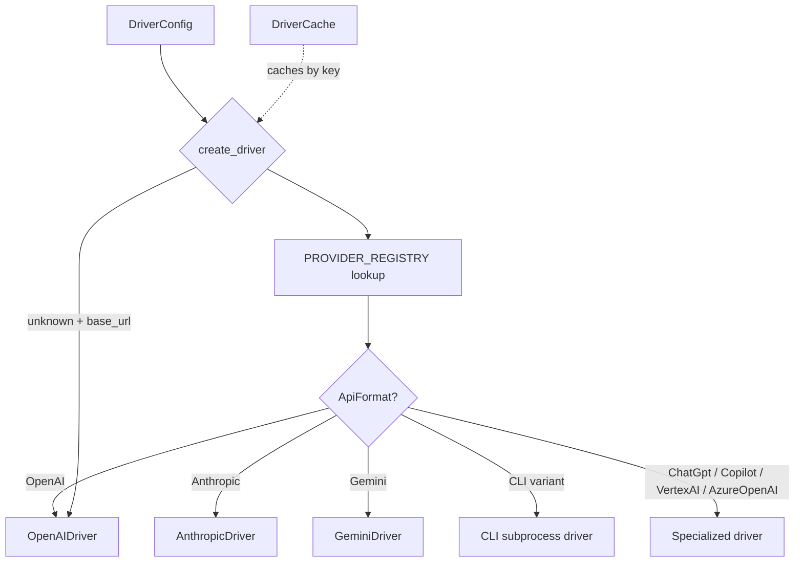

# LLM Providers — librefang-llm-drivers-src

# LLM Providers — `librefang-llm-drivers`

## Overview

This crate provides the LLM driver layer for LibreFang. It contains a static provider registry, a factory function, a thread-safe driver cache, and concrete driver implementations for 40+ LLM providers. Every agent message ultimately passes through a driver produced by this module.



## Module Layout

| Path | Purpose |
|---|---|
| `src/lib.rs` | Re-exports `librefang_llm_driver` as `llm_driver`; exposes `drivers` and `think_filter` modules |
| `src/drivers/mod.rs` | Registry, cache, factory, and provider-detection helpers |
| `src/drivers/openai.rs` | OpenAI-compatible chat completions driver (covers the majority of providers) |
| `src/drivers/anthropic.rs` | Anthropic Claude Messages API driver with prompt caching and extended thinking |
| `src/drivers/gemini.rs` | Google Gemini `generateContent` API driver |
| `src/drivers/chatgpt.rs` | ChatGPT Responses API with OAuth/session-token auth |
| `src/drivers/copilot.rs` | GitHub Copilot with automatic token exchange |
| `src/drivers/vertex_ai.rs` | Google Cloud Vertex AI with JWT/OAuth2 (includes minimal RSA signing) |
| `src/drivers/claude_code.rs` | Claude Code CLI subprocess driver |
| `src/drivers/qwen_code.rs` | Qwen Code CLI subprocess driver |
| `src/drivers/gemini_cli.rs` | Gemini CLI subprocess driver |
| `src/drivers/codex_cli.rs` | Codex CLI subprocess driver |
| `src/drivers/aider.rs` | Aider CLI subprocess driver |
| `src/drivers/fallback.rs` | Fallback driver for multi-provider failover |
| `src/drivers/token_rotation.rs` | Wrapper driver that rotates API keys on rate-limit or auth errors |
| `src/think_filter.rs` | Streaming filter that strips `<think/>` reasoning tags |

---

## Provider Registry

The static `PROVIDER_REGISTRY` array defines every known provider as a `ProviderEntry` with these fields:

- **`name`** — Canonical provider name (e.g. `"anthropic"`, `"deepseek"`)
- **`aliases`** — Alternative names that resolve to this provider (e.g. `"google"` → `"gemini"`, `"azure"` → `"azure-openai"`)
- **`base_url`** — Default API endpoint
- **`api_key_env`** — Primary environment variable for the API key
- **`alt_api_key_env`** — Secondary env var (e.g. `GOOGLE_API_KEY` for Gemini)
- **`key_required`** — `false` for local providers (Ollama, vLLM, LM Studio)
- **`api_format`** — Which `ApiFormat` variant to use
- **`hidden`** — Excludes the provider from `known_providers()` output

### `ApiFormat` Variants

| Variant | Driver | Used by |
|---|---|---|
| `OpenAI` | `OpenAIDriver` | openai, groq, openrouter, deepseek, ollama, vllm, and ~25 others |
| `Anthropic` | `AnthropicDriver` | anthropic, kimi_coding |
| `Gemini` | `GeminiDriver` | gemini |
| `ChatGpt` | `ChatGptDriver` | chatgpt |
| `Copilot` | `CopilotDriver` | github-copilot |
| `VertexAI` | `VertexAiDriver` | vertex-ai |
| `AzureOpenAI` | `OpenAIDriver` (Azure mode) | azure-openai |
| `ClaudeCode` / `QwenCode` / `GeminiCli` / `CodexCli` / `Aider` | CLI subprocess drivers | claude-code, qwen-code, gemini-cli, codex-cli, aider |

### Lookup and Resolution

`find_provider(name)` scans the registry for an exact name match or alias match. The factory function `create_driver()` calls this first; if no entry is found, it falls back to treating the provider as a custom OpenAI-compatible endpoint if `base_url` is set.

---

## Driver Creation: `create_driver`

```rust
pub fn create_driver(config: &DriverConfig) -> Result<Arc<dyn LlmDriver>, LlmError>
```

The factory function resolves configuration in this order:

1. **Registry lookup** — If the provider name (or alias) is in `PROVIDER_REGISTRY`, delegate to `create_driver_from_entry`.
2. **Custom OpenAI-compatible** — If `base_url` is set, create an `OpenAIDriver` with the convention env var `{PROVIDER_UPPER}_API_KEY` as fallback for the API key.
3. **Env var only, no URL** — If the convention env var exists but no `base_url` is configured, return a helpful error telling the user to add `base_url`.
4. **Unknown** — Return an error listing all supported providers.

### API Key Resolution (within `create_driver_from_entry`)

For registry entries, the key is resolved in priority order:

1. Explicit `config.api_key`
2. Primary env var (`entry.api_key_env`)
3. Alternate env var (`entry.alt_api_key_env`)
4. Special case: OpenAI also checks the Codex CLI credential file (`~/.codex/auth.json`)

### Azure OpenAI

Azure OpenAI requires additional configuration from `DriverConfig::azure_openai`:
- `endpoint` — The Azure resource endpoint (from config, `base_url`, or `AZURE_OPENAI_ENDPOINT` env var)
- `deployment` — The model deployment name
- `api_version` — API version string (defaults to `"2024-02-01"`)

### Vertex AI

Vertex AI uses the `DriverConfig::vertex_ai` fields (`project_id`, `region`, `credentials_path`) and handles OAuth2/JWT authentication internally via self-signed JWTs from service account credentials.

---

## `DriverCache`

```rust
pub struct DriverCache {
    cache: DashMap<String, Arc<dyn LlmDriver>>,
}
```

A concurrent, lock-free cache that avoids redundant HTTP client construction and TLS handshakes. Each unique `(provider, api_key_hash, base_url, proxy_url)` tuple maps to one `Arc<dyn LlmDriver>`.

### Cache Key Construction

The key is built by `DriverCache::cache_key`, which hashes the API key with `DefaultHasher` to avoid storing raw secrets as map keys:

```
{provider}|{api_key_hash}|{base_url}|{proxy_url}
```

### Methods

| Method | Description |
|---|---|
| `new()` | Empty cache |
| `get_or_create(&config)` | Returns cached driver or creates and caches one |
| `clear()` | Invalidates all cached drivers (use after config hot-reload) |
| `len()` / `is_empty()` | Cache metrics |

---

## Provider Detection

### `detect_available_provider()`

Scans environment variables in two phases:

1. **Priority list** — Checks popular cloud providers first: openai → anthropic → gemini → groq → deepseek → openrouter → mistral → together → fireworks → xai → perplexity → cohere → azure-openai.
2. **Remaining registry** — Scans all non-hidden, key-required providers not in the priority list.

Returns `(provider_name, model_placeholder, api_key_env)` for the first match, or `None`.

### `resolve_provider_api_key(provider)`

Resolves the API key for a given provider through all known sources: primary env var → alt env var → Codex credential file (OpenAI only).

### CLI Provider Availability

`cli_provider_available(name)` checks if a CLI binary is on `PATH` by calling each CLI's detection function (`claude_code_available()`, `qwen_code_available()`, etc.). These typically run `binary --version` and check for success.

`is_cli_provider(name)` returns `true` for: `claude-code`, `qwen-code`, `gemini-cli`, `codex-cli`, `aider`.

### Proxy Detection

`is_proxied_via_env(env_vars, official_hosts)` checks whether environment variables (like `ANTHROPIC_BASE_URL`) redirect traffic away from official API hosts. Returns `true` when the configured URL does not contain any of the official host substrings.

---

## Driver Implementations

### OpenAI-Compatible (`openai.rs`)

The workhorse driver. Used directly by 30+ providers that share the OpenAI chat completions format. Key features:

- Standard `/v1/chat/completions` endpoint
- Azure mode via `new_azure_with_proxy()` with `api-key` header and deployment-based URL construction
- Streaming SSE support
- `extra_body` passthrough for provider-specific fields
- Temperature clamping for models that require `temperature=1`
- Thinking/reasoning token extraction from `<think/>` tags via `ThinkFilter`

### Anthropic (`anthropic.rs`)

Full Anthropic Messages API implementation:

- **Prompt caching** — When `request.prompt_caching` is `true`, stamps `cache_control: {"type": "ephemeral"}` on the system block, the last tool definition, and the last content block of the last message. This caches the (system + tools + conversation history) prefix as one unit.
- **Extended thinking** — Sends `thinking: {"type": "enabled", "budget_tokens": N}` when the request includes a thinking config with budget ≥ 1024. Automatically increases `max_tokens` to exceed `budget_tokens`.
- **Tool use** — Full tool calling with `tool_use` and `tool_result` content blocks. Malformed tool inputs (null, string, array) are wrapped in `{"raw_input": ...}` rather than silently lost via `ensure_object()`.
- **Streaming** — SSE event parsing with accumulators for text, thinking, and tool input JSON deltas.
- **Retry** — Automatic retry with exponential backoff on 429 (rate limited) and 529 (overloaded) responses, up to 3 attempts.

### ChatGPT (`chatgpt.rs`)

Uses the ChatGPT Responses API (not `/v1/chat/completions`) because OAuth tokens with `api.connectors` scopes only work with this endpoint.

- **Auth** — Session token from `CHATGPT_SESSION_TOKEN` env var, with automatic refresh via `CHATGPT_REFRESH_TOKEN` on 401/403.
- **Token cache** — `ChatGptTokenCache` stores the bearer token with an estimated 7-day TTL. Refreshes are attempted with a 15-second timeout.
- **Response format** — Injects JSON-formatting instructions into the system prompt since the Responses API has no native `response_format` field.

### CLI Subprocess Drivers

Five drivers spawn external CLI tools as subprocesses:

| Driver | Binary | Auth mechanism |
|---|---|---|
| `ClaudeCodeDriver` | `claude` | Uses Claude's own credential store |
| `QwenCodeDriver` | `qwen-code` | Uses Qwen's credential store |
| `GeminiCliDriver` | `gemini` | Uses Google application credentials |
| `CodexCliDriver` | `codex` | Uses OpenAI credentials |
| `AiderDriver` | `aider` | Uses standard env vars (OPENAI_API_KEY, etc.) |

All CLI drivers share a common pattern:
1. Build a text prompt from the `CompletionRequest` message history
2. Construct CLI arguments (e.g., `--message`, `--model`, `--yes-always`)
3. Spawn the process with `tokio::process::Command`
4. Parse stdout for the response text
5. Return a `CompletionResponse` with zero token usage (CLI tools don't report token counts)

Configuration options common across CLI drivers:
- `cli_path` (from `config.base_url`) — Override binary path
- `skip_permissions` (from `config.skip_permissions`) — Enable yolo/auto-accept mode
- `message_timeout_secs` — Process kill timeout

### Vertex AI (`vertex_ai.rs`)

Uses Google Cloud Vertex AI with Gemini-format API calls. Handles its own authentication:

- Reads service account credentials (JSON key file) from `config.vertex_ai.credentials_path` or `GOOGLE_APPLICATION_CREDENTIALS`
- Implements minimal RSA-SHA256 JWT signing (PKCS#1 v1.5 padding, modular exponentiation) without external crypto dependencies
- Mints self-signed JWTs and exchanges them for access tokens
- Delegates to `GeminiDriver`'s `convert_tools()` and `stream_gemini_sse()` for request/response formatting

### Token Rotation (`token_rotation.rs`)

A wrapper driver that holds multiple API keys and rotates through them on `RateLimited` or `AuthenticationFailed` errors:

- `should_rotate(error)` — Returns `true` for rate-limit and auth errors
- On rotation, increments to the next key and retries the request
- Wraps any `Arc<dyn LlmDriver>` — provider-agnostic

---

## Think Filter (`think_filter.rs`)

A stateful streaming filter that processes text deltas and extracts content from `<think reasoning="...">...</think)` tags. Used by `OpenAIDriver::stream()` to separate reasoning content from visible text.

---

## Integration Points

### Downstream Consumers

- **`librefang-runtime`** — `ModelCatalog::detect_auth()` calls `cli_provider_available()` and `is_cli_provider()` to determine which providers are available
- **`librefang-cli`** — `detect_best_provider()` calls `detect_available_provider()` during first-run setup
- **Agent execution loop** — Uses `DriverCache::get_or_create()` to obtain drivers, then calls `complete()` or `stream()` on the `LlmDriver` trait

### Upstream Dependencies

- `librefang_llm_driver` — Defines the `LlmDriver` trait, `DriverConfig`, `CompletionRequest`, `CompletionResponse`, `LlmError`, and `StreamEvent` types
- `librefang_types` — Message types (`ContentBlock`, `Role`, `TokenUsage`), tool types, and config structs (`VertexAiConfig`, `AzureOpenAiConfig`, `ResponseFormat`)
- `librefang_http` — HTTP client construction with proxy support (`proxied_client()`, `proxied_client_with_override()`)
- `librefang_runtime_oauth` — ChatGPT OAuth token refresh

---

## Adding a New Provider

To add a provider that uses an existing API format:

1. Add a `ProviderEntry` to `PROVIDER_REGISTRY` in `src/drivers/mod.rs` with the appropriate `api_format`, `base_url`, and `api_key_env`.
2. If the provider needs a custom env var naming convention, set `alt_api_key_env`.
3. The existing driver (e.g., `OpenAIDriver`) handles the rest.

To add a provider with a new API format:

1. Create a new driver file in `src/drivers/` implementing the `LlmDriver` trait.
2. Add a new `ApiFormat` variant.
3. Add the `ProviderEntry` to the registry.
4. Add the match arm in `create_driver_from_entry()`.
5. Register the module in `src/drivers/mod.rs`.