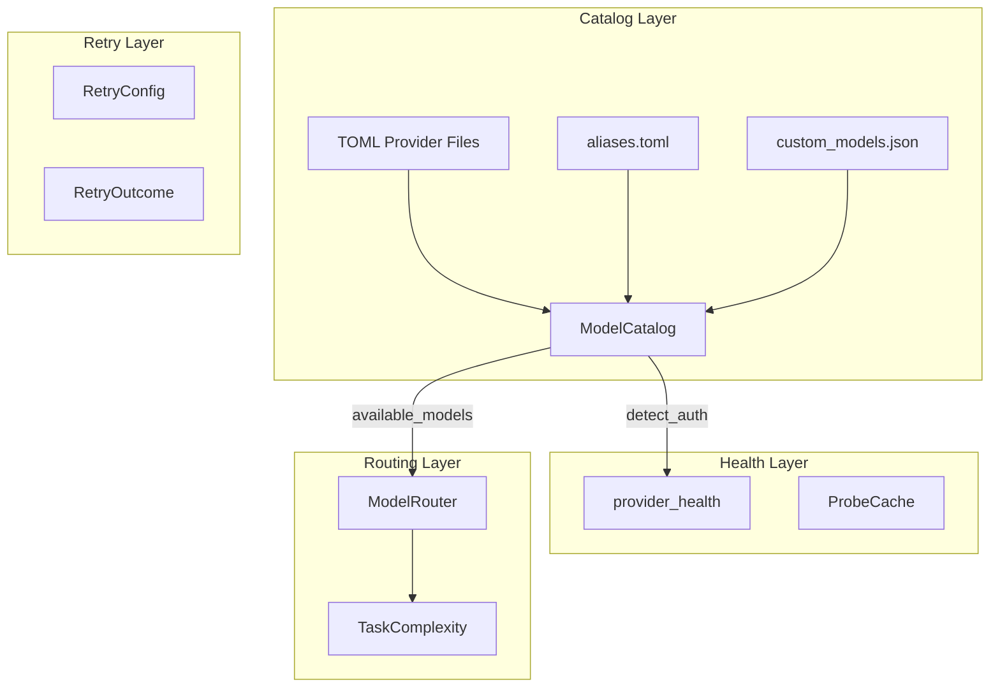

# LLM Providers — librefang-runtime-src

# LLM Providers — `librefang-runtime`

This crate provides the runtime layer for LLM provider management: a model catalog registry with authentication detection, provider health probing, complexity-based model routing, and a generic retry utility.

## Architecture Overview



---

## Model Catalog (`model_catalog.rs`)

The central registry of all known LLM models and providers. Ships with 130+ builtin models across 28+ providers loaded from TOML files, and supports runtime extension via custom models, cached community catalogs, and user-defined catalogs.

### Construction

`ModelCatalog` is built by loading `*.toml` files from a providers directory. Three constructors cover different use cases:

| Constructor | Use Case |
|---|---|
| `ModelCatalog::new(home_dir)` | Production. Loads from `home_dir/providers/`, classifies built-in vs custom using `home_dir/registry/providers/`. |
| `ModelCatalog::new_from_dir(providers_dir)` | Testing / isolated loading. All providers marked `is_custom = false`. |
| `ModelCatalog::new_from_dir_with_registry(providers_dir, registry_dir)` | Full control. Uses `registry_dir` to classify providers as built-in or user-added. |

The `Default` impl resolves the home directory from `LIBREFANG_HOME` or `~/.librefang`.

#### Built-in vs Custom Classification

The `registry_dir` contains filenames of known built-in providers. When a provider TOML's filename appears in the registry, it's marked `is_custom = false`. This is a **tri-state** check:

- `None` registry dir passed → classification unavailable → every provider is `is_custom = false` (safe default — hides the delete button on built-ins).
- `Some(empty_set)` → every provider is user-added.
- `Some(set_with_entries)` → classified by membership.

#### Catalog Loading Pipeline

During server startup, catalogs are loaded in layers (later layers override earlier ones):

1. **Built-in providers** — `home_dir/providers/*.toml`
2. **Cached community catalog** — `load_cached_catalog_for(home_dir)` reads from `home_dir/cache/catalog/providers/`
3. **User catalog** — `load_user_catalog_for(home_dir)` reads `home_dir/model_catalog.toml`
4. **Custom models** — `load_custom_models(path)` reads from JSON
5. **URL/region overrides** — `apply_url_overrides()`, `resolve_region_urls()`

### Model Lookup: `find_model`

Resolution order (all case-insensitive):

1. **Direct ID match** — prefers `Custom` tier entries over builtins (handles the case where a user overrides a builtin model with a different provider).
2. **Display name match** — for dashboard/UI payloads that send human-readable labels.
3. **Alias resolution** — looks up in the `aliases` map, then finds the model by canonical ID.

```rust
let model = catalog.find_model("sonnet"); // alias → "claude-sonnet-4-6"
let model = catalog.find_model("claude-sonnet-4-20250514"); // exact ID
```

### Authentication Detection: `detect_auth`

Classifies each provider's auth status using a three-tier probe:

```
Primary env var → Fallback env var → CLI tool availability
```

**Primary**: checks the provider's declared `api_key_env`. `GITHUB_TOKEN` is explicitly excluded — its presence doesn't prove access to a specific provider; users authenticate via dashboard OAuth instead.

**Fallback**: provider-specific alternative keys:
- `"gemini"` → `GOOGLE_API_KEY`
- `"openai"` / `"codex"` → `OPENAI_API_KEY` or Codex CLI credential file

**CLI fallback**: checks for installed CLI tools (`claude-code`, `gemini-cli`, `codex-cli`, `qwen-code`, `aider`) that can serve as auth proxies.

Auth status values map to:
- `Configured` — primary key found
- `AutoDetected` — fallback key found
- `ConfiguredCli` — CLI tool installed
- `Missing` — no auth available
- `NotRequired` — local/keyless providers
- `LocalOffline` — set by async health probe, **never overwritten** by `detect_auth`
- `CliNotInstalled` — CLI-based provider without the tool

Providers can be **suppressed** via `suppress_provider()` — this disables fallback and CLI detection so only the primary env var is checked. Useful when a user explicitly removes a key via the dashboard.

### Background Key Validation

`providers_needing_validation()` collects providers with `Configured` or `AutoDetected` status for async probing. The `probe_api_key()` async function sends a lightweight `GET /models` request:

| HTTP Status | Result |
|---|---|
| 200–299 | `key_valid = Some(true)`, extracts available model IDs from response |
| 429 | `key_valid = Some(true)` (rate-limited but key is valid) |
| 401 / 403 | `key_valid = Some(false)` |
| Other / network error | `key_valid = None` (transient — don't penalize) |

Provider-specific auth headers: Anthropic uses `x-api-key`, Gemini uses `x-goog-api-key`, all others use `Bearer` token.

### Custom Models

```rust
// Add at runtime
catalog.add_custom_model(ModelCatalogEntry { ... });

// Load from JSON file
catalog.load_custom_models(path);

// Remove (only Custom tier)
catalog.remove_custom_model("my-model");
```

`add_custom_model` returns `false` if a model with the same ID **and** provider already exists. Multiple providers can share the same model ID — they're kept distinct.

`find_model` always prefers `Custom` tier entries over builtins with the same ID, ensuring user-defined routing takes precedence.

### Discovered Models from Local Providers

`merge_discovered_models(provider, model_ids)` adds models not already in the catalog with `Local` tier and zero cost. Used after probing Ollama, vLLM, etc. for their currently loaded models.

### Region Support

Providers can define named regions with distinct `base_url` and optional `api_key_env`:

```toml
[provider.regions.cn]
base_url = "https://cn.api.provider.com/v1"
api_key_env = "PROVIDER_CN_API_KEY"
```

- `resolve_region_urls(selections)` — maps `{provider: region_name}` → `{provider: base_url}`
- `resolve_region_api_keys(selections)` — maps `{provider: region_name}` → `{provider: api_key_env}` (only for regions with custom env vars)

Both skip unknown providers/regions with a `tracing::warn`.

### Per-Model Overrides

Inference parameter overrides are keyed by `"provider:model_id"`:

```rust
catalog.set_overrides("anthropic:claude-sonnet-4-6".into(), overrides);
catalog.get_overrides("anthropic:claude-sonnet-4-6");
```

Persisted via `load_overrides` / `save_overrides` to a JSON file. Empty overrides are auto-removed.

---

## Provider Health Probing (`provider_health.rs`)

Lightweight HTTP health checks for local LLM providers (Ollama, vLLM, LM Studio, Lemonade).

### Local Provider Detection

`is_local_provider(provider)` returns `true` for `"ollama"`, `"vllm"`, `"lmstation"`, and `"lemonade"` (case-insensitive).

### Probe Endpoints

| Provider | Endpoint | Response Format |
|---|---|---|
| Ollama | `GET {root}/api/tags` (strips `/v1` from base_url) | `{ "models": [{ "name": "...", "details": {...} }] }` |
| OpenAI-compat (vLLM, LM Studio) | `GET {base_url}/models` | `{ "data": [{ "id": "..." }] }` |

Timeouts: 2s total request, 1s TCP connect. These are intentionally aggressive — local services should respond near-instantly.

### Discovered Model Metadata

For Ollama, the probe extracts enriched metadata per model:

```
DiscoveredModelInfo {
    name: "llama3.2:latest",
    parameter_size: Some("3.2B"),
    quantization_level: Some("Q4_K_M"),
    family: Some("llama"),
    size: Some(1_928_000_000),
}
```

`None` fields are omitted from JSON serialization. Non-Ollama providers get empty `discovered_model_info`.

### Probe Cache

`ProbeCache` is a `DashMap`-backed TTL cache with a 60-second default expiry. Store it once in `AppState` and share across requests:

```rust
let cached_result = probe_provider_cached("ollama", base_url, &cache).await;
```

Cache hits skip the HTTP request entirely, making repeated `/api/providers` calls instantaneous.

### Lightweight Model Probe

`probe_model(provider, base_url, model, api_key)` sends a minimal `POST /chat/completions` with `max_tokens: 1` to verify a specific model is responsive. Used by the circuit breaker during cooldown re-tests. Returns `Ok(latency_ms)` on success or `Err(message)` on failure.

---

## Model Routing (`routing.rs`)

Complexity-based model selection. The router scores `CompletionRequest` objects and picks the cheapest model that can handle the task.

### Scoring Heuristics

The score is a weighted sum of:

| Signal | Weight | Rationale |
|---|---|---|
| Token count (chars / 4) | 1× | Longer input = more reasoning |
| Tool count | +20 per tool | Tools imply multi-step work |
| Code markers in last message | +30 per marker | Code generation is harder |
| Conversation depth (>10 msgs) | +15 per extra msg | More context = harder reasoning |
| System prompt length (>500 chars) | +(len - 500) / 10 | Complex instructions |

Code markers: ` ``` `, `fn `, `def `, `class `, `import `, `function `, `async `, `await `, `struct `, `impl `, `return `.

### Complexity Tiers

```rust
enum TaskComplexity { Simple, Medium, Complex }
```

Classified by comparing the score against `config.simple_threshold` and `config.complex_threshold`. Each tier maps to a model name in the routing config.

### Integration with Catalog

```rust
let mut router = ModelRouter::new(config);
router.resolve_aliases(&catalog); // "sonnet" → "claude-sonnet-4-6"
router.validate_models(&catalog); // warn on unknown models
let (complexity, model) = router.select_model(&request);
```

---

## Retry Utility (`retry.rs`)

Generic async retry with exponential backoff and jitter. No external randomness dependency — uses `SystemTime` nanos as a pseudo-random seed.

### Configuration

```rust
RetryConfig {
    max_attempts: 3,       // total tries including first
    min_delay_ms: 300,     // initial backoff
    max_delay_ms: 30_000,  // backoff cap
    jitter: 0.2,           // 0.0 = none, 1.0 = full
}
```

### Backoff Formula

```
delay = min(min_delay * 2^attempt, max_delay) * (1 + random_fraction * jitter)
```

The jitter prevents thundering herds on shared providers.

### Result Type

```rust
enum RetryOutcome<T, E> {
    Success { result: T, attempts: u32 },
    Exhausted { last_error: E, attempts: u32 },
}
```

Both variants carry the attempt count for observability/logging.

---

## Key Integration Points

### Server Startup (`run_daemon`)

The typical initialization sequence:

1. `ModelCatalog::new(home_dir)` — load built-in providers
2. `load_cached_catalog_for(home_dir)` — merge community models
3. `load_user_catalog_for(home_dir)` — merge user overrides
4. `detect_auth()` — classify provider auth status
5. `providers_needing_validation()` → async `probe_api_key()` — validate keys
6. `resolve_region_urls()` + `apply_url_overrides()` — apply config overrides
7. Async provider health probes for local providers

### API Routes

- `src/routes/providers.rs` → `available_models()`, `models_by_provider()`
- `src/routes/system.rs` → `detect_auth()`, `load_catalog_file()`
- `librefang-api/src/ws.rs` → `find_model()`, `get_provider()`

### CLI Commands

- `cmd_models_list` → `list_models()`
- `cmd_models_providers` → `list_providers()`
- `cmd_models_aliases` → `list_aliases()`
- `pick_model` → `resolve_alias()`, `list_models()`

### Cost Estimation

`librefang-kernel-metering` uses `find_model()` to look up `input_cost_per_m` / `output_cost_per_m` for token cost calculation. Local-tier models report zero cost.