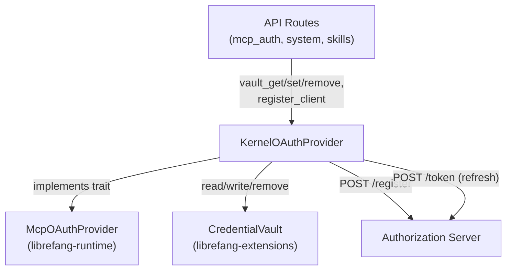

# MCP Integration — librefang-kernel-src

# MCP OAuth Provider — `librefang-kernel/src/mcp_oauth_provider.rs`

## Purpose

This module provides the kernel-side OAuth credential management layer for MCP (Model Context Protocol) server authentication. It implements the `McpOAuthProvider` trait defined in `librefang-runtime`, persisting OAuth tokens and related metadata in the encrypted `CredentialVault` at `~/.librefang/vault.enc`.

The module is **stateless by design** — every operation opens and unlocks the vault fresh, consistent with the kernel's vault access pattern elsewhere. It does not handle the browser-facing OAuth flow (PKCE generation, redirect handling); that lives in the API layer (`src/routes/mcp_auth.rs`). This provider is purely responsible for token CRUD, refresh, and RFC 7591 dynamic client registration.

## Architecture



## Vault Key Schema

All OAuth data is namespaced under the `mcp_oauth` prefix, keyed by server URL and field name:

```
mcp_oauth:{server_url}:{field}
```

For example, for `https://mcp.notion.com/mcp`:
- `mcp_oauth:https://mcp.notion.com/mcp:access_token`
- `mcp_oauth:https://mcp.notion.com/mcp:refresh_token`
- `mcp_oauth:https://mcp.notion.com/mcp:client_id`

The canonical set of fields is defined in the constant `ALL_VAULT_FIELDS`:

| Field | Written by | Purpose |
|---|---|---|
| `access_token` | `store_tokens` | Bearer token for MCP requests |
| `refresh_token` | `store_tokens` | Token rotation via `try_refresh` |
| `expires_at` | `store_tokens` | Unix timestamp; 60-second pre-expiry buffer |
| `token_endpoint` | `auth_start` (API layer) | Used by `try_refresh` to POST refresh requests |
| `client_id` | `auth_start` (API layer) | Included in refresh requests if present |
| `pkce_verifier` | `auth_start` (API layer) | PKCE code verifier for the authorization code exchange |
| `pkce_state` | `auth_start` (API layer) | CSRF protection state parameter |
| `redirect_uri` | `auth_start` (API layer) | OAuth callback URI |

> **Important:** `ALL_VAULT_FIELDS` must be kept in sync with every field written across `auth_start`, `store_tokens`, and `try_refresh`. The test `clear_tokens_covers_all_stored_fields` guards against accidental omissions. When adding a new vault field, update both the write site and this constant.

## `KernelOAuthProvider` Struct

```rust
pub struct KernelOAuthProvider {
    home_dir: PathBuf,
}
```

Constructed via `KernelOAuthProvider::new(home_dir)`, where `home_dir` is typically `~/.librefang`. The struct holds no mutable state; all vault interactions are method-scoped.

### Core Vault Methods

**`vault_key(server_url, field) -> String`** (associated function)
Generates the full vault key string. Used throughout the module and by external callers (e.g., `auth_start` in `src/routes/mcp_auth.rs`, `delete_mcp_server` in `src/routes/skills.rs`).

**`vault_get(key) -> Option<String>`**
Unlocks the vault and reads a value. Returns `None` if the vault doesn't exist, can't be unlocked (check `LIBREFANG_VAULT_KEY`), or the key is absent. Logs a warning on unlock failure.

**`vault_set(key, value) -> Result<(), String>`**
Writes a value, initializing the vault first if it doesn't exist. Uses `zeroize::Zeroizing` to wrap the value in memory before passing to the vault.

**`vault_remove(key) -> Result<bool, String>`**
Removes a single key. Returns `Ok(true)` if the key existed, `Ok(false)` if the vault doesn't exist. Used internally by `clear_tokens`.

All three methods instantiate a fresh `CredentialVault` on each call — there is no cached vault handle.

### `McpOAuthProvider` Trait Implementation

**`load_token(server_url) -> Option<String>`**

The primary entry point for consuming OAuth tokens. Execution flow:

1. Read `access_token` from vault. If absent, return `None`.
2. Read `expires_at`. If present and within 60 seconds of expiry (or past it), attempt refresh:
   - Read `refresh_token` from vault.
   - Call `try_refresh` to POST to the stored `token_endpoint`.
   - On success, persist refreshed tokens via `store_tokens` and return the new access token.
   - On failure, log a warning and return `None`.
3. If no `expires_at` is stored (some providers like Notion don't return one), return the token as-is.

**`store_tokens(server_url, tokens) -> Result<(), String>`**

Persists an `OAuthTokens` struct. Writes `access_token` unconditionally, `refresh_token` if present, and `expires_at` (computed as `now + expires_in`) when `expires_in > 0`.

**`clear_tokens(server_url) -> Result<(), String>`**

Iterates over every field in `ALL_VAULT_FIELDS` and removes the corresponding vault key. Errors from individual removals are silently ignored (the field may not have been stored), but the overall result is `Ok(())`.

### OAuth Network Operations

**`register_client(registration_endpoint, redirect_uri, _server_url) -> Result<String, String>`** *(async)*

Implements RFC 7591 Dynamic Client Registration. POSTs a JSON body to the registration endpoint requesting a **public client** (`token_endpoint_auth_method: "none"`). Returns the `client_id` from the response. The `client_secret`, if echoed by the authorization server, is intentionally discarded — public clients must not use it.

Currently called by `auth_start` in the API layer for MCP servers (like Notion) that require dynamic registration rather than a pre-configured client ID.

**`try_refresh(server_url, refresh_token) -> Result<OAuthTokens, String>`** *(async, private)*

Performs a token refresh by POSTing `grant_type=refresh_token` to the stored `token_endpoint`. Includes `client_id` if available. Returns parsed `OAuthTokens` on success. Called internally by `load_token`; not exposed on the trait.

## Integration Points

### From the API Layer

- **`src/routes/mcp_auth.rs`** — `auth_start` uses `vault_key`, `vault_get`, `vault_set`, `vault_remove`, and `register_client` to initiate the OAuth flow and persist PKCE parameters. `auth_callback` reads PKCE state from the vault and exchanges the authorization code for tokens.
- **`src/routes/skills.rs`** — `delete_mcp_server` calls `vault_key` and `vault_remove` to clean up OAuth data when an MCP server is removed.

### From System Routes (Shared Vault)

The same `vault_get`/`vault_set` methods are called by TOTP and approval routes (`src/routes/system.rs`), which share the encrypted vault for different credential types under separate key namespaces.

### Vault Dependency

All vault operations depend on `librefang_extensions::vault::CredentialVault`, which requires the `LIBREFANG_VAULT_KEY` environment variable to be set for decryption. If unset, `vault_get` returns `None` and `vault_set` returns an error.

## Testing

The test suite focuses on key isolation and field exhaustiveness:

- **`vault_key_format`** / **`vault_key_refresh_token`** — Verify the `mcp_oauth:{url}:{field}` format.
- **`vault_key_all_fields_namespaced`** — Ensures every field in `ALL_VAULT_FIELDS` produces a correctly prefixed key.
- **`vault_keys_are_isolated_per_server`** — Different server URLs produce distinct vault keys.
- **`clear_tokens_covers_all_stored_fields`** — Asserts `ALL_VAULT_FIELDS` contains exactly the 8 expected fields, preventing silent data leaks when new fields are added to write paths but forgotten in the clear logic.

The `clear_token_fields()` helper is `#[cfg(test)]`-gated and exposes `ALL_VAULT_FIELDS` for assertion without requiring a live vault.

## Adding a New OAuth Vault Field

1. Add the field name to `ALL_VAULT_FIELDS`.
2. Write the field in whichever function needs it (`auth_start` in the API layer, or `store_tokens`/`try_refresh` here).
3. Update the `clear_tokens_covers_all_stored_fields` test's expected list if the field should be cleaned up on logout/disconnect.
4. Verify the test passes — it asserts both inclusion of expected fields and the total field count.