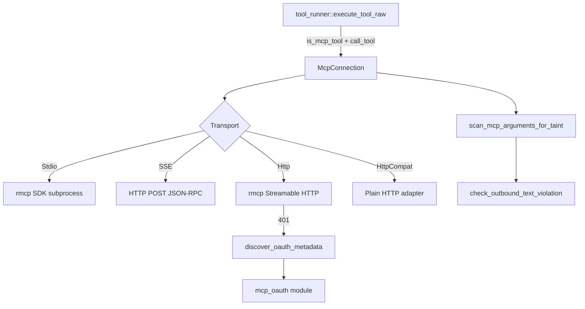

# MCP Integration — librefang-runtime-mcp-src

# librefang-runtime-mcp — MCP Client Integration

## Purpose

This crate implements the client side of the Model Context Protocol (MCP) for librefang. It connects to external MCP servers over various transports, discovers their tools, and executes tool calls on behalf of the LLM runtime. Every tool exposed through this module is namespaced as `mcp_{server}_{tool}` so that tools from different servers never collide.

The module is consumed by `librefang-runtime`'s tool runner (`execute_tool_raw`), which dispatches `mcp_*` tool calls here, and by the API layer (`src/routes/mcp_auth.rs`), which drives OAuth flows when a remote MCP server requires authentication.

---

## Architecture



---

## Connection Lifecycle

### `McpConnection::connect(config)`

The single entry point. Takes an `McpServerConfig`, establishes the transport, performs the MCP handshake, discovers tools, and returns a ready-to-use `McpConnection`.

The flow branches by transport type:

| Transport | Handshake | Tool discovery |
|-----------|-----------|----------------|
| `Stdio` | rmcp SDK spawns subprocess, full MCP `initialize` | `client.list_all_tools()` via rmcp |
| `Sse` | Manual `initialize` JSON-RPC POST | `tools/list` JSON-RPC POST |
| `Http` | rmcp SDK Streamable HTTP transport | `client.list_all_tools()` via rmcp |
| `HttpCompat` | HTTP probe only (no MCP protocol) | Static declarations from config |

### `McpConnection::call_tool(name, arguments)`

Resolves the namespaced tool name back to the original server tool name, then delegates to the transport-specific call path. Before any outbound call, the taint scanner runs against the arguments tree (unless `taint_scanning` is `false` for this server).

---

## Configuration Types

### `McpServerConfig`

Top-level configuration for one MCP server connection:

- **`name`** — Display name used in tool namespacing (e.g. `"github"` → `mcp_github_*`).
- **`transport`** — One of four transport variants (see below).
- **`timeout_secs`** — Request timeout, defaults to 60.
- **`env`** — Environment variables for Stdio subprocesses. Each entry is `"KEY=VALUE"` (explicit) or `"KEY"` (inherit from parent process). The subprocess does **not** inherit the full parent environment — only `SAFE_ENV_VARS` (PATH, HOME, NODE_PATH, etc.) plus declared entries are passed.
- **`headers`** — Extra HTTP headers for SSE/Streamable HTTP requests. Format: `"Header-Name: value"`.
- **`oauth_provider`** / **`oauth_config`** — OAuth authentication (see below).
- **`taint_scanning`** — Enable outbound credential scanning (default: `true`).
- **`roots`** — Filesystem root directories advertised to the server via MCP Roots capability. Populated at runtime by the kernel; never serialized.

### `McpTransport` (tagged enum)

```rust
pub enum McpTransport {
    Stdio { command, args },
    Sse { url },
    Http { url },           // Streamable HTTP (MCP 2025-03-26+)
    HttpCompat { base_url, headers, tools },
}
```

Serialized with `#[serde(tag = "type", rename_all = "snake_case")]`.

---

## Transport Details

### Stdio

Spawns a child process and communicates over stdin/stdout using the `rmcp` SDK. The subprocess environment is sandboxed:

- Parent environment is cleared (`cmd.env_clear()`).
- Only variables in `SAFE_ENV_VARS` (PATH, HOME, language/locale vars, runtime-specific vars like NODE_PATH, CARGO_HOME, GOPATH, etc.) are inherited.
- Explicit `env` entries from config are added on top.
- `$VAR` and `${VAR}` references in `args` are expanded via `expand_env_vars` so templates can reference `$HOME` without a shell wrapper.

**Security checks on the command:**
- Path traversal (`..`) in the command path is rejected.
- Shell interpreters (bash, sh, zsh, fish, cmd, powershell, etc.) are blocked — MCP servers must specify a concrete runtime (npx, node, python).

**Windows adaptation:** If the command has no `.cmd`/`.bat` extension and a `.cmd` variant exists on PATH, it is used automatically (npm/npx on Windows install as `.cmd` batch wrappers).

If `roots` is non-empty, a `RootsClientHandler` is used instead of the default unit handler. This declares the `roots` capability in the MCP `initialize` handshake and responds to `roots/list` requests with the configured directories (converted to `file://` URIs).

### SSE (Server-Sent Events)

Legacy bidirectional JSON-RPC over HTTP POST. Implemented manually (not via rmcp) for backward compatibility:

1. `sse_initialize()` — sends `initialize` + `notifications/initialized`.
2. `sse_discover_tools()` — sends `tools/list`, parses the response.
3. `sse_send_request()` — generic JSON-RPC request with auto-incrementing `id`.
4. `sse_send_notification()` — fire-and-forget JSON-RPC notification.

SSE is unidirectional from the client's perspective, so the `roots` capability is **never** declared — the server has no channel to send `roots/list` back.

### Streamable HTTP (`Http` variant)

Uses the `rmcp` SDK's `StreamableHttpClientTransport` for full MCP 2025-03-26+ protocol support: Accept header negotiation, `Mcp-Session-Id` tracking, SSE stream parsing.

If the server returns a 401, the module attempts OAuth discovery (see OAuth section). On successful discovery, the connection returns `Err("OAUTH_NEEDS_AUTH")` to signal that the API layer should drive the PKCE flow via the UI.

`roots` are only advertised to local servers (determined by `is_local_url`).

### HttpCompat

A built-in adapter for plain HTTP/JSON backends that don't speak MCP at all. Tools are statically declared in config with:

- **`path`** — URL path template with `{param}` placeholders (percent-encoded on substitution).
- **`method`** — GET, POST, PUT, PATCH, or DELETE.
- **`request_mode`** — `JsonBody`, `Query`, or `None`.
- **`response_mode`** — `Text` or `Json` (pretty-printed).

Config is validated by `validate_http_compat_config` before use. Headers support static `value` or environment-variable-based `value_env`.

---

## Tool Namespacing

All MCP tools are namespaced to prevent collisions across servers:

```
format_mcp_tool_name("github", "create_issue") → "mcp_github_create_issue"
format_mcp_tool_name("my-server", "do_thing")  → "mcp_my_server_do_thing"
```

Normalization (`normalize_name`) lowercases and replaces hyphens with underscores.

### Resolving server from a tool name

The naive helper `extract_mcp_server` splits on the first `_` after `mcp_` and is unreliable for multi-segment server names. **Always prefer `resolve_mcp_server_from_known`** at runtime — it matches against the known list of configured server names using longest-prefix matching:

```rust
resolve_mcp_server_from_known("mcp_http_tools_fetch_item", ["http", "http-tools"])
// → Some("http-tools")  (longer prefix wins)
```

This is what `execute_tool_raw` in `librefang-runtime` uses for dispatch.

---

## Outbound Taint Scanning

Before every tool call, `scan_mcp_arguments_for_taint` walks the JSON argument tree looking for credential-shaped values that an LLM might have been manipulated into exfiltrating.

### How it works

1. Recurse through the JSON tree (objects, arrays, strings). Numbers, bools, and null are skipped.
2. For string leaves, run `check_outbound_text_violation` with `TaintSink::mcp_tool_call`.
3. For object keys, check against `MCP_SENSITIVE_KEY_NAMES` (authorization, api_key, password, secret, etc.) — if the key matches and the value is a non-empty string, it's blocked regardless of the value's appearance.
4. Recursion depth is capped at `MCP_TAINT_SCAN_MAX_DEPTH` (64).

**Critical design constraint:** The error message returned to the caller must **never** contain the offending payload. It only includes the JSON path and the sink name. This is because the error flows back to the LLM and into logs — echoing the blocked secret would defeat the filter.

### Disabling

`McpServerConfig::taint_scanning` can be set to `false` to skip the content-based heuristic for trusted local servers (browser automation, database adapters) whose results contain opaque session handles that would false-positive. Key-name blocking (Authorization, secret, etc.) remains active regardless.

---

## OAuth Support (`mcp_oauth` module)

### Three-Tier Metadata Discovery

When a Streamable HTTP server returns 401, `discover_oauth_metadata` resolves OAuth endpoints using a three-tier strategy:

1. **Tier 1** — Parse the `WWW-Authenticate` header, extract `resource_metadata` URL, fetch RFC 8414 metadata.
2. **Tier 2** — Construct `.well-known/oauth-authorization-server` from the server URL origin, fetch metadata.
3. **Tier 3** — Fall back to `McpOAuthConfig` from `config.toml` (requires both `auth_url` and `token_url`).

Config values always override discovered values via `merge_metadata_with_config`.

### WWW-Authenticate Parsing

`parse_www_authenticate` strips the `Bearer ` prefix (case-insensitive), splits parameters on commas while respecting quoted strings, and returns a `HashMap<String, String>`.

### SSRF Protections on Metadata URLs

`extract_metadata_url` applies three layers of validation:

1. **HTTPS only** — `http://` metadata URLs are rejected.
2. **Same-origin** — metadata URL must share scheme + host + port with the server URL.
3. **No private/loopback IPs** — `is_ssrf_blocked_host` blocks 127.0.0.0/8, 10.0.0.0/8, 172.16.0.0/12, 192.168.0.0/16, 169.254.0.0/16, IPv6 loopback/unique-local/link-local, and known hostnames like `localhost` and `metadata.google.internal`.

### PKCE

`generate_pkce()` returns a `(verifier, challenge)` pair using 32 random bytes (base64url) and SHA-256. `generate_state()` produces a 16-byte random state parameter.

### Provider Trait

`McpOAuthProvider` is the trait for token persistence:

```rust
pub trait McpOAuthProvider: Send + Sync {
    async fn load_token(&self, server_url: &str) -> Option<String>;
    async fn store_tokens(&self, server_url: &str, tokens: OAuthTokens) -> Result<(), String>;
    async fn clear_tokens(&self, server_url: &str) -> Result<(), String>;
}
```

The actual PKCE flow and browser redirect are driven by the API layer (`src/routes/mcp_auth.rs`), not by this module. The provider only handles token CRUD.

### Auth State Machine

`McpAuthState` tracks the per-server OAuth lifecycle:

- `NotRequired` — no auth needed (or token already injected)
- `NeedsAuth` — 401 detected at boot
- `PendingAuth { auth_url }` — user clicked Authorize
- `Authorized { expires_at, tokens }` — token stored
- `Expired` — token needs refresh
- `Error { message }` — flow failed

---

## Security Measures Summary

| Threat | Mitigation |
|--------|-----------|
| Credential exfiltration via MCP tool calls | `scan_mcp_arguments_for_taint` — content heuristic + sensitive key names |
| LLM sees blocked secret in error | Error messages are redacted (JSON path only, no payload) |
| Subprocess inherits full env | `env_clear()` + `SAFE_ENV_VARS` allowlist |
| Shell injection via Stdio command | Blocked interpreters list (bash, sh, powershell, etc.) |
| Path traversal in command | `..` in command path is rejected |
| SSRF via SSE/HTTP URLs | `check_ssrf` blocks cloud metadata endpoints (169.254.169.254, metadata.google) |
| SSRF via OAuth metadata URLs | HTTPS-only, same-origin, no private IPs (`is_ssrf_blocked_host`) |
| Domain spoofing of localhost | `is_local_url` uses proper URL parsing, not substring matching |

---

## Integration Points

### Incoming (this module is called by)

- **`execute_tool_raw`** (`librefang-runtime/src/tool_runner.rs`) — calls `is_mcp_tool`, `resolve_mcp_server_from_known`, and `McpConnection::call_tool`.
- **`auth_start`** (`src/routes/mcp_auth.rs`) — calls `discover_oauth_metadata` to kick off OAuth.
- **`get_agent_mcp_servers`** (`src/routes/agents.rs`) — calls `resolve_mcp_server_from_known`.
- **`load_token`** (`librefang-kernel/src/mcp_oauth_provider.rs`) — calls `store_tokens` on the OAuth provider.

### Outgoing (this module depends on)

- **`librefang_types::taint`** — `check_outbound_text_violation`, `TaintSink` for credential scanning.
- **`librefang_types::config`** — `HttpCompatHeaderConfig`, `HttpCompatToolConfig`, `McpOAuthConfig`, `HttpCompatMethod`, `HttpCompatRequestMode`, `HttpCompatResponseMode`.
- **`librefang_types::tool`** — `ToolDefinition` for discovered tool metadata.
- **`librefang_http`** — `proxied_client_builder()` for constructing HTTP clients that respect proxy configuration.
- **`rmcp`** — SDK for Stdio and Streamable HTTP transports, `ClientHandler` trait, tool discovery.