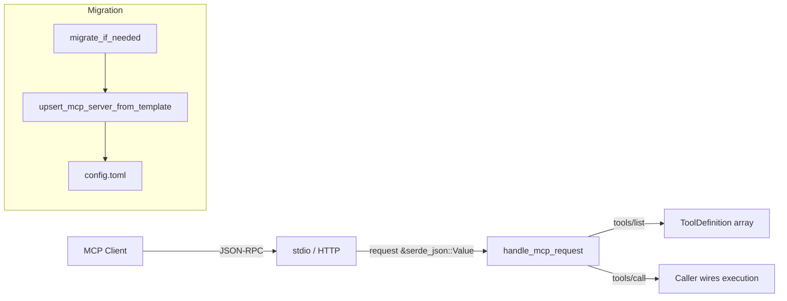

# MCP Integration — librefang-runtime-src

# MCP Integration — `librefang-runtime`

This module provides two capabilities for LibreFang's Model Context Protocol integration:

1. **`mcp_server`** — a transport-agnostic JSON-RPC handler that speaks the MCP protocol to external clients (Claude Desktop, VS Code extensions, etc.).
2. **`mcp_migrate`** — a one-time migration utility that converts the legacy two-file MCP layout into the unified `config.toml` layout.

## Architecture



---

## `mcp_server` — MCP Protocol Handler

### `handle_mcp_request`

```rust
pub async fn handle_mcp_request(
    request: &serde_json::Value,
    tools: &[ToolDefinition],
) -> serde_json::Value
```

A **stateless** handler for incoming MCP JSON-RPC 2.0 requests. The caller (the CLI or the HTTP route in `src/routes/network.rs` via `mcp_http`) is responsible for providing the available `ToolDefinition` slice and wiring the response into whatever transport is in use.

The function dispatches on `request["method"]` and returns a well-formed JSON-RPC response or error.

#### Supported Methods

| Method | Behavior |
|---|---|
| `initialize` | Returns server identity, protocol version (`2024-11-05`), and capabilities. Declares `tools` capability. |
| `notifications/initialized` | Client notification — returns `null` (no response per spec). |
| `tools/list` | Serializes the caller-provided `tools` slice into the MCP `tools` array format (`name`, `description`, `inputSchema`). |
| `tools/call` | Validates that the requested tool name exists in `tools`, then returns a placeholder text content. **Actual execution is delegated to the caller.** |
| *any other* | Returns JSON-RPC error `-32601` (Method not found). |

#### Tool Execution Delegation

The current implementation of `tools/call` validates the tool exists but does **not** execute it. The response informs the caller:

> *"Tool '{name}' is available. Execution must be wired by the host."*

In a complete integration, the host (kernel/CLI layer) intercepts `tools/call` requests and routes them to `execute_tool()` after `handle_mcp_request` validates the request format. This separation keeps the protocol handler free of tool-specific logic.

#### Response Helpers

- **`make_response(id, result)`** — Wraps a result value in a JSON-RPC 2.0 success envelope (`{ "jsonrpc": "2.0", "id", "result" }`).
- **`make_error(id, code, message)`** — Wraps an error in a JSON-RPC 2.0 error envelope (`{ "jsonrpc": "2.0", "id", "error": { "code", "message" } }`).

Both are private to the module.

---

## `mcp_migrate` — Legacy Layout Migration

### When This Runs

Migration runs at most **once per home directory**, early in the application startup. It is triggered by the presence of legacy files:

| Legacy Path | Purpose |
|---|---|
| `~/.librefang/integrations/*.toml` | Catalog templates (read-only) |
| `~/.librefang/integrations.toml` | Installed state + credentials |

These are migrated into:

| New Path | Purpose |
|---|---|
| `~/.librefang/mcp/catalog/*.toml` | Catalog templates (read-only) |
| `~/.librefang/config.toml` | `[[mcp_servers]]` entries with optional `template_id` |

After migration, `registry_sync` manages the catalog cache and the installer writes directly to `config.toml`.

### `migrate_if_needed`

```rust
pub fn migrate_if_needed(home_dir: &Path) -> Result<Option<String>, String>
```

Entry point for migration. Returns:

- `Ok(Some(summary))` — migration performed work; `summary` is a human-readable description of what changed.
- `Ok(None)` — nothing to migrate (no legacy files found).
- `Err(message)` — unexpected I/O or parse failure during migration.

#### Migration Steps

**Step 1 — Directory rename:** If `integrations/` exists and `mcp/catalog/` does not, the directory is renamed. If the rename fails (cross-device, permissions), it falls back to a recursive copy via `copy_dir_recursive`, then removes the source.

**Step 2 — Install record synthesis:** If `integrations.toml` exists, each `[[installed]]` entry is processed:

1. The corresponding template is loaded from the (possibly just-renamed) catalog directory.
2. A `[[mcp_servers]]` TOML table is synthesized from the template's transport, required env vars, and OAuth config.
3. The entry is **upserted** into `config.toml` via `upsert_mcp_server_from_template`.
4. The legacy `integrations.toml` is backed up to `integrations.toml.bak.<unix_timestamp>`.

### `upsert_mcp_server_from_template`

```rust
fn upsert_mcp_server_from_template(
    config_path: &Path,
    install: &LegacyInstalledIntegration,
    template: &LegacyTemplate,
) -> Result<(), String>
```

Reads `config.toml` (or creates an empty table), builds a `[[mcp_servers]]` entry from the legacy install record and template, and appends it. Key behaviors:

- **Disabled entries are skipped.** A legacy install with `enabled = false` is not written.
- **No clobbering.** If an entry with the same `name` already exists in `config.toml`, the existing manual entry is left intact.
- **Parse errors propagate.** If `config.toml` exists but is malformed, the function returns an error rather than overwriting with a near-empty table (preventing data loss).
- The entry includes: `name`, `template_id`, `timeout_secs` (default 30), `env`, `headers` (empty), `taint_scanning` (true), `transport`, and optional `oauth`.

### Supported Legacy Transports

The `LegacyTransport` enum mirrors the template format without depending on the extensions crate (avoiding circular dependencies):

| Variant | Fields |
|---|---|
| `stdio` | `command`, `args` (default empty) |
| `sse` | `url` |
| `http` | `url` |

### `copy_dir_recursive`

Private helper that recursively copies a directory tree. Used as a fallback when `fs::rename` fails across mount points.

---

## Integration Points

| Caller | Target | Notes |
|---|---|---|
| `mcp_http` (in `src/routes/network.rs`) | `handle_mcp_request` | Routes HTTP MCP requests to the protocol handler |
| Application startup | `migrate_if_needed` | Run before the MCP server initializes |

## Testing

Both modules have comprehensive test coverage:

- **`mcp_server` tests**: Verify `initialize`, `tools/list`, and unknown-method error responses against a fixture tool list.
- **`mcp_migrate` tests**: Cover no-op (no legacy files), directory rename, install record synthesis, disabled entry skipping, and protection against clobbering manual `config.toml` entries.