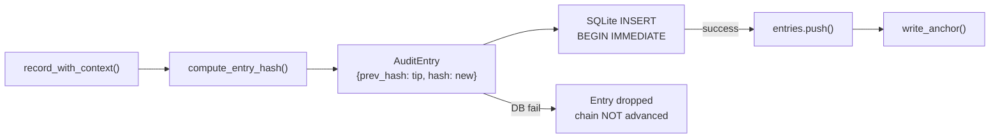

# MCP, Media & Sandbox Runtimes — librefang-runtime-audit-src

# librefang-runtime-audit

Merkle hash chain audit trail for security-critical actions in the LibreFang agent runtime.

## Overview

Every auditable event is appended to an append-only log where each entry contains the SHA-256 hash of its own fields concatenated with the hash of the previous entry, forming a tamper-evident linked list. Any in-place modification of a stored entry breaks the chain at that point, making tampering detectable by a single linear walk.

When backed by SQLite (`with_db` / `with_db_anchored`), entries are persisted to the `audit_entries` table so the trail survives daemon restarts. An optional external **anchor file** stores the latest `seq:hash` pair outside the database, closing the gap where an attacker with write access to SQLite could fabricate an entirely new chain.

## Architecture



The chain is a singly-linked list where each node's `hash` commits to its own content plus `prev_hash`. The `tip` tracks the hash of the most recent entry (or the 64-zero genesis sentinel when empty).

## Threat Model

| Attack vector | Detection mechanism |
|---|---|
| Modify a field in an existing row | `verify_integrity()` recomputes the hash — field change breaks `prev_hash` link in the next entry |
| Delete a row from the middle | `prev_hash` chain has a gap — next entry points at a hash that no longer exists |
| Delete rows and recompute all hashes | **Anchor file** stores tip outside SQLite; `verify_integrity()` compares DB tip against anchor and fails if they diverge |
| Shift content across field boundaries (e.g. `agent_id="a", detail="bc"` → `agent_id="ab", detail="c"`) | v2 hash layout uses `\x1f`-delimited field tags, making cross-boundary shifts produce different digests |

The anchor file is the critical external witness. Without it, a full rewrite of `audit_entries` is undetectable. For production deployments, point `anchor_path` at a location the daemon can write to but unprivileged code cannot (e.g. a chmod-0400 file owned by a different user, a read-only mount, or a log pipeline).

## Core Types

### `AuditAction`

Enum of auditable event categories. Variant names are folded into the hash via `Display` (which delegates to `Debug`):

- **Agent lifecycle**: `AgentSpawn`, `AgentKill`, `AgentMessage`
- **Capability & access**: `ToolInvoke`, `CapabilityCheck`, `MemoryAccess`, `FileAccess`, `NetworkAccess`, `ShellExec`
- **Auth & RBAC**: `AuthAttempt`, `UserLogin`, `RoleChange`, `PermissionDenied`, `BudgetExceeded`
- **Infrastructure**: `WireConnect`, `ConfigChange`, `DreamConsolidation`, `RetentionTrim`
- **A2A federation**: `A2aDiscovered`, `A2aTrusted`

**Stability contract**: This enum is append-only. Adding variants is safe. Renaming or reordering is a breaking change that invalidates every persisted hash.

### `AuditEntry`

A single node in the chain:

| Field | Description |
|---|---|
| `seq` | Monotonically increasing 0-indexed sequence number |
| `timestamp` | ISO-8601 timestamp (RFC 3339) |
| `agent_id` | Agent that triggered or is the subject of the action |
| `action` | `AuditAction` category |
| `detail` | Free-form context (tool name, file path, etc.) |
| `outcome` | Result of the action (`"ok"`, `"denied"`, error message) |
| `user_id` | `Option<UserId>` — `None` for kernel-internal / pre-M1 entries |
| `channel` | `Option<String>` — origin channel (`"telegram"`, `"slack"`, etc.) |
| `prev_hash` | SHA-256 of the previous entry (64 zeros for genesis) |
| `hash` | SHA-256 of this entry's content + `prev_hash` |

### `TrimReport`

Summary returned by `trim()` with per-action drop counts and the new chain anchor hash.

### `AuditLog`

The main struct. Thread-safe — all mutable state is guarded by `Mutex` or `AtomicUsize`. Holds:

- `entries`: in-memory window (may be a suffix after retention trimming)
- `tip`: hash of the most recent entry
- `db`: optional SQLite connection pool
- `anchor_path`: optional filesystem path for the external tip witness
- `chain_anchor`: hash of the most recent dropped entry (used by `verify_integrity` to skip the trimmed prefix)
- `max_in_memory_entries`: configurable soft cap for the in-memory window

## Construction

### `AuditLog::new()`

In-memory only. No persistence. The tip starts as the genesis sentinel (64 zeros).

### `AuditLog::with_db(pool)`

Backed by SQLite. On construction:

1. Loads all rows from `audit_entries` ordered by `seq ASC`.
2. Recovers the `chain_anchor` from the first surviving entry's `prev_hash` (if non-genesis, the predecessor was dropped by a prior trim).
3. Calls `verify_integrity()` on the loaded chain and logs the result.

### `AuditLog::with_db_anchored(pool, anchor_path)`

Same as `with_db`, plus an external anchor file:

1. Calls `with_db(pool)`.
2. If the anchor file exists: compares its `seq:hash` against the in-DB tip. On mismatch, logs an `ERROR` — the daemon still starts, but `verify_integrity()` will return `Err`.
3. If the anchor file doesn't exist: seeds it from the current tip so future tampering is detectable.
4. If the anchor file is corrupt: logs an `ERROR` and refuses to overwrite it.

The kernel's `boot_with_config` function calls `with_db_anchored` and then `set_max_in_memory_entries` from the operator's `config.toml`.

## Recording Events

### `record(agent_id, action, detail, outcome)`

Convenience wrapper that omits user/channel attribution. Pre-M1 call sites use this form.

### `record_with_context(agent_id, action, detail, outcome, user_id, channel)`

The primary append path. Execution flow:

1. **Derive `seq`** from `entries.last().seq + 1` (not `entries.len()`, because a trim may have dropped a prefix).
2. **Compute hash** via `compute_entry_hash` with the current `tip` as `prev_hash`.
3. **Persist to SQLite** inside `BEGIN IMMEDIATE` transaction. This acquires a RESERVED lock so concurrent writers cannot interleave against the same `prev_hash`.
4. **On DB failure**: the entry is dropped. The chain is NOT advanced — `entries` and `tip` remain unchanged. The next call reuses the same `seq` with a fresh timestamp. This is intentional: advancing the in-memory chain without persisting creates an unrecoverable break after restart.
5. **On DB success**: push to `entries`, advance `tip`.
6. **Enforce soft cap**: if `entries.len()` exceeds the effective ceiling, drain the oldest prefix and update `chain_anchor`.
7. **Update anchor file**: atomic write via `.tmp` + `rename`.

## Hash Computation

### v2 layout (`compute_entry_hash`)

Every field is prefixed with `\x1f<tag>=` before hashing:

```
\x1fseq=<seq>\x1ftimestamp=<ts>\x1fagent_id=<id>\x1faction=<action>
\x1fdetail=<detail>\x1foutcome=<outcome>
[\x1fuser_id=<uid>][\x1fchannel=<ch>]
\x1fprev_hash=<prev>
```

The delimiters prevent field-boundary ambiguity: `agent_id="a", detail="bc"` and `agent_id="ab", detail="c"` produce different hashes.

`user_id` and `channel` are included only when present so pre-M1 entries (recorded before these fields existed) verify with their original hashes.

### v1 layout (`compute_entry_hash_legacy`)

The original six fields concatenated with no separators, then optionally-tagged `user_id`/`channel`, then bare `prev_hash`. Retained only for `verify_integrity` to validate entries written before the delimiter fix. Never used to write new entries.

## Integrity Verification

### `verify_integrity()`

Walks the chain and recomputes every hash:

1. Seeds `expected_prev` from `chain_anchor` (or genesis sentinel if no anchor).
2. For each entry: checks `prev_hash == expected_prev`, then recomputes the hash using both v2 and v1 layouts (accepting either).
3. Compares the tip against the external anchor file if configured. If the anchor is missing, returns `Err` (fail closed — a disappeared anchor is indistinguishable from deletion by an attacker).
4. Returns `Ok(())` if everything checks out, or `Err(msg)` describing the first inconsistency.

Called automatically on boot by `with_db`, and available via `GET /api/audit/verify`.

## Retention & Memory Management

### Soft cap (`max_in_memory_entries`)

Configured via `audit.retention.max_in_memory_entries` in `config.toml`. The effective ceiling is the configured value × 1.5 (the `MAX_IN_MEMORY_SOFT_CAP_NUMERATOR / DENOMINATOR` ratio). When `entries.len()` exceeds this, `record_with_context` drains the oldest prefix before returning.

The 1.5× multiplier prevents the buffer from reaching the hard `MAX_AUDIT_ENTRIES` (10,000) default between scheduled `trim()` ticks. The hard cap exists as a fallback when no operator cap is configured.

### `trim(policy, now)`

Applies a per-action retention policy from `AuditRetentionConfig`:

1. **Pass 1**: Enforce `max_in_memory_entries` cap — drop oldest entries until survivor count ≤ cap.
2. **Pass 2**: Walk forward, dropping entries whose action has a configured retention window AND whose timestamp is older than the window. Stops at the first survivor (chain is contiguous — no holes).
3. Persists the delete to SQLite before mutating in-memory state. On DB failure, returns an empty `TrimReport` so the trim retries on the next tick.
4. Updates `chain_anchor` to the hash of the last dropped entry.
5. Refreshes the anchor file's `seq` column.

The caller (a scheduled job) typically records a `RetentionTrim` action after calling `trim`, making the trim itself auditable.

### `prune(retention_days)`

Simpler retention: drops all entries older than `retention_days`. Same prefix-only semantics and persist-before-mutate ordering as `trim`. Returns the count of pruned entries.

### Why prefix-only?

To keep the chain anchor logic sound, dropping is always a contiguous prefix from the front. You cannot punch holes in a Merkle list — the first surviving entry's `prev_hash` must point at the anchor, and the anchor must be the hash of the last dropped entry.

## Reading Entries

| Method | Description |
|---|---|
| `recent(n)` | Returns the most recent `n` entries (cloned) |
| `since_seq(cursor)` | Returns all entries with `seq > cursor`. O(log n) seek via `partition_point`. Used by cursor-based SSE streaming (`/api/logs/stream`) |
| `len()` / `is_empty()` | Current in-memory entry count |
| `tip_hash()` | SHA-256 of the most recent entry |

`since_seq` uses strict greater-than: `since_seq(0)` skips an entry with seq=0. SSE handlers handle the initial backfill via `recent()` before entering the cursor loop.

## Anchor File

The anchor file stores a single line: `<seq> <64-char-hex-hash>\n`. Written atomically via a `.tmp` file + `rename` so a crash mid-write never leaves a truncated file.

```rust
// Example contents:
42 a3f7c2e8b1d4f6a9c3e5b7d1f3a5c7e9b1d3f5a7c9e1b3d5f7a9c1e3b5d7f9a1
```

Three locations interact with the anchor:

- **`with_db_anchored`**: Compares anchor against DB tip on boot. Seeds if missing. Warns on mismatch.
- **`record_with_context`**: Rewrites anchor after every successful append.
- **`verify_integrity`**: Compares anchor against computed tip. Fails closed if missing or divergent.

## Thread Safety

All mutable state is serialized through `Mutex` guards. The `max_in_memory_entries` field uses `AtomicUsize` with `Ordering::Relaxed` so `set_max_in_memory_entries` can update it without taking the `entries` mutex — this is safe because the setter is called once at boot before any append-path contention exists.

SQLite writes use `BEGIN IMMEDIATE` transactions to prevent concurrent writers from interleaving against the same `prev_hash`.

## Database Schema

Entries are stored in the `audit_entries` table (schema V8 baseline, V22 added `user_id` and `channel` columns). Rows persisted before the V22 migration return NULL for these columns, which deserializes to `None` and preserves the original hash (the hash function omits absent fields).

## Integration Points

- **Kernel boot** (`src/kernel/boot.rs`): Calls `with_db_anchored` and `set_max_in_memory_entries` from config.
- **Audit routes** (`src/routes/audit.rs`): Exposes `AuditEntry` via the HTTP API.
- **TUI** (`src/tui/event.rs`): Reads `AuditEntry` for the terminal audit viewer.
- **Config reload** (`config_reload.rs`): Audit retention config does **not** hot-reload (see `build_reload_plan`), so the cap is set once at boot.