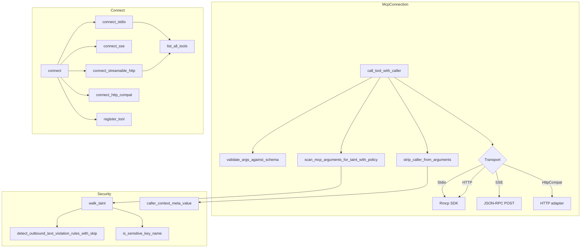

# MCP, Media & Sandbox Runtimes — librefang-runtime-mcp-src

# librefang-runtime-mcp — MCP Client Runtime

## Overview

This module implements LibreFang's Model Context Protocol (MCP) client. It manages outbound connections to external MCP servers, discovers their tools, and dispatches tool calls from the agent runtime. Every tool is namespaced as `mcp_{server}_{tool}` to prevent collisions across servers.

The module sits at the trust boundary between the LLM's tool-call output and remote MCP servers. Multiple security layers are applied before any data leaves the process: taint scanning, caller-context sanitisation, SSRF guards, and bounded response reading.

## Architecture



## Transport Types

`McpTransport` is the transport selector, configured via `config.toml`:

| Variant | Protocol | Tool Discovery | Caller Context Channel |
|---|---|---|---|
| `Stdio` | MCP over stdin/stdout via rmcp SDK | `tools/list` during handshake | Request `_meta` field |
| `Sse` | JSON-RPC 2.0 over HTTP POST | `tools/list` via SSE requests | `_meta` on JSON-RPC params |
| `Http` | Streamable HTTP (MCP 2025-03-26+) | `tools/list` via rmcp SDK | Request `_meta` field |
| `HttpCompat` | Plain HTTP adapter (no MCP handshake) | Static `tools` array in config | `X-Librefang-Caller` header |

### Stdio

Spawns a subprocess with a sandboxed environment. The rmcp SDK handles the MCP protocol framing, `initialize` handshake, and `roots` capability advertisement. Shell interpreters (`bash`, `sh`, `cmd`, `powershell`, etc.) are explicitly blocked — the command must target a specific runtime (`npx`, `node`, `python`).

Key behaviours:
- **Environment isolation**: `env_clear()` followed by an allowlist of safe system vars (`PATH`, `HOME`, `NODE_PATH`, etc.) plus operator-declared vars from config. No daemon secrets leak to child processes.
- **`kill_on_drop(true)`**: The subprocess is terminated when the transport is dropped.
- **Stderr draining**: Child stderr is read in a background task, capped at 100 lines × 256 bytes. The drain continues past the log cap to prevent pipe-buffer stalls that would hang the child.

### SSE (Server-Sent Events)

Legacy bidirectional JSON-RPC over HTTP POST. LibreFang sends requests; the server returns JSON-RPC responses. No `roots` capability is advertised (SSE is client-initiated only). The `sse_initialize` handshake validates the server's `protocolVersion` against `SUPPORTED_MCP_VERSIONS`.

### Streamable HTTP

Uses the rmcp SDK's `StreamableHttpClientTransport` for MCP 2025-03-26+ servers. Supports `Mcp-Session-Id` tracking, SSE stream parsing, and content-type negotiation. Falls back to SSE if the server prefers it.

Roots are only advertised for local URLs (loopback addresses). Remote MCP servers (GitHub, Slack) don't receive host filesystem paths.

### HttpCompat

A built-in adapter for plain HTTP/JSON backends that don't speak MCP. Tools are declared statically in config with path templates (`{param}` placeholders), HTTP methods, and request/response modes. No MCP handshake occurs.

Path templates are rendered by substituting `{key}` placeholders from the arguments object, with percent-encoding of non-unreserved characters. Remaining arguments (not consumed by path rendering) are sent as the JSON body or query string depending on `request_mode`.

## Connection Lifecycle

### `McpConnection::connect(config)`

1. Dispatches to the transport-specific connector.
2. Performs the MCP handshake (Stdio/HTTP) or SSE initialize.
3. Discovers tools via `tools/list` or reads the static `HttpCompat` tool list.
4. Registers each tool under a namespaced name via `register_tool`.
5. Returns an `McpConnection` ready for tool calls.

### `McpConnection::close()`

Explicitly shuts down the connection. For Stdio, this cancels the rmcp service and waits (with a 10-second timeout) for the subprocess to be reaped. Callers doing hot-reload should call this before starting a new connection.

### `Drop` implementation

If `close()` was not called, `Drop` spawns a best-effort async close on the current tokio runtime. This is a safety net — the explicit `close()` path is preferred because it awaits completion.

## Caller Context (#5699)

`CallerContext` carries the kernel-attested identity of the entity driving the current agent turn:

```rust
pub struct CallerContext {
    pub peer_id: Option<String>,    // Channel user ID
    pub channel: Option<String>,    // "telegram", "slack", etc.
    pub chat_id: Option<String>,    // Conversation ID
    pub session_id: Option<String>, // LibreFang SessionId
}
```

Built from `ToolExecContext` fields by `CallerContext::from_parts`. Returns `None` if all signals are missing (preserving legacy payload byte-for-byte for prompt-cache parity).

### Security invariant

The agent **cannot** influence the caller context:

1. **Strip**: `strip_caller_from_arguments` unconditionally removes any agent-supplied `_librefang_caller` key from `arguments` before transmit.
2. **Inject**: The kernel-attested value is shipped out-of-band — in the request `_meta` field (Stdio/SSE/HTTP) or the `X-Librefang-Caller` header (HttpCompat) — never inside `arguments`.

Placing the context in `_meta` rather than `arguments` avoids breaking MCP servers that forward unknown arguments verbatim to downstream REST APIs (e.g., `@notionhq/notion-mcp-server` rejects non-scalar query parameters).

## Taint Scanning

Every outbound tool call is scanned for credential/PII leaks before leaving the process. The scanner walks every string leaf in the JSON argument tree.

### Scanning layers

1. **Sensitive key names**: Object keys like `authorization`, `api_key`, `secret`, `password` with non-empty string values are always blocked, regardless of the value's shape. This catches `"Authorization": "Bearer sk-..."` (which wouldn't trip the text heuristic due to whitespace and scheme prefix). Controlled by the `TaintRuleId::SensitiveKeyName` rule.

2. **Content heuristic**: String values are checked against the `TaintSink::mcp_tool_call()` denylist via `detect_outbound_text_violation_rules_with_skip`. This is the part disabled by `taint_scanning = false` in config.

3. **Sensitive key blocking stays on**: Even with `taint_scanning = false`, key-name blocking remains active — only the value-content heuristic is disabled.

### Policy configuration (`McpTaintPolicy`)

Fine-grained control at three levels:

**Tool-level kill switch**: `default = "skip"` bypasses all scanning (including key-name blocking) for a specific tool.

**Per-path skip rules**: Individual taint rules can be exempted for specific JSONPaths:
```toml
[taint_policy.tools.my_tool.paths]
"$.headers.authorization" = { skip_rules = ["SensitiveKeyName"] }
```

**Named rule sets**: Rule sets defined in `[[taint_rules]]` can downgrade `Block` to `Warn` or `Log`:
```toml
[[taint_rules]]
name = "allow_known_tokens"
action = "warn"
rules = ["Secret"]
```

When multiple rule sets cover the same rule, the most permissive action wins: `Log` > `Warn` > `Block`.

### JSONPath matching

The scanner uses a minimal JSONPath matcher supporting:
- `$.a.b` — exact nested property
- `$.a.*` — any direct child
- `$.a[*]` — any array element
- `$.*` — any top-level property

Limitation: object keys containing `.` or `[` cannot be addressed precisely. Use broader patterns (`$.*`) as a workaround.

### Hot-reload of rule sets

`TaintRuleSetsHandle` (`Arc<ArcSwap<Vec<NamedTaintRuleSet>>>`) is shared across all connections. The kernel updates it on config reload via `.store()`. Each scan takes a `.load()` snapshot at the start, so rules cannot change under an in-flight tool call.

## Argument Validation

`validate_args_against_schema` provides a lightweight guard before forwarding to the MCP server:

1. If the schema declares `type: "object"`, rejects non-object arguments (arrays, scalars).
2. Checks that all fields in the schema's `required` array are present.

This is intentionally not a full JSON Schema validator — type correctness of individual fields, pattern matching, enum constraints, etc. remain delegated to the MCP server.

## Tool Namespacing

Tools are registered with the pattern `mcp_{server}_{tool}`, where both server and tool names are normalized (lowercase, hyphens replaced with underscores).

| Function | Purpose |
|---|---|
| `format_mcp_tool_name` | Build `mcp_{server}_{tool}` |
| `is_mcp_tool` | Check if a name starts with `mcp_` |
| `extract_mcp_server` | Heuristic single-segment extraction (fragile for multi-word names) |
| `resolve_mcp_server_from_known` | Robust resolution against a known server list — always prefer this |
| `strip_mcp_prefix` | Strip the prefix given a known server name |

`resolve_mcp_server_from_known` iterates known server names and picks the longest matching prefix, correctly handling server names that contain underscores.

## MCP Annotations

`inject_annotation_class` translates MCP `tools/list` annotations into a `metadata.tool_class` field on the tool's JSON Schema:

- `readOnlyHint=true, destructiveHint=false` → `"readonly_search"`
- All other combinations → `"mutating"`

Defaults per the MCP spec: `readOnlyHint=false`, `destructiveHint=true`. The runtime tool classifier reads `metadata.tool_class` for safe parallel candidate selection.

## Security Guards

### SSRF Protection

`check_ssrf` is called for every outbound HTTP transport before connection. It delegates to `mcp_oauth::is_ssrf_blocked_url_for_connect`, which:

- Parses URLs with the `url` crate (no substring matching — prevents `127.0.0.1.evil.com` evasion)
- Rejects non-http(s) schemes, userinfo in URLs
- Blocks cloud-metadata pivots: `0.0.0.0`, `169.254/16`, CGNAT `100.64.0.0/10`, Azure IMDS `192.0.0.192`, and IMDS hostnames
- Allows loopback/RFC1918 for operator-configured MCP backend URLs (local MCP servers are a legitimate, common setup)

### Response body capping

`read_response_bytes_capped` streams HTTP responses chunk-by-chunk with a 16 MiB cap. Rejects based on `Content-Length` first (fast path), then aborts mid-stream if the running total breaches the limit. Prevents OOM from malicious servers returning gigabyte-sized responses.

### Protocol version validation

`sse_initialize` validates the server's `protocolVersion` against `SUPPORTED_MCP_VERSIONS` (`["2024-11-05", "2025-03-26"]`). Unknown versions produce a warning but do not abort the connection.

### JSON-RPC ID verification

SSE responses are checked for ID mismatch with the sent request. Mismatched responses are dropped to prevent silent data corruption from server routing errors.

## OAuth Integration

The `mcp_oauth` submodule provides:

- **Three-tier metadata discovery**: WWW-Authenticate header → `.well-known/oauth-authorization-server` → config fallback
- **PKCE flow**: Token caching via `McpOAuthProvider`, with structured error handling for locked vaults
- **SSRF-hardened discovery**: The OAuth path uses stricter SSRF checks (blocks all loopback/RFC1918/ULA) since the redirect URI comes from a remote server response
- **Auth state machine**: `NotRequired` → `OAUTH_NEEDS_AUTH` (returned as an error string) → API layer drives the browser flow → tokens cached for subsequent connections

When `connect_streamable_http` receives a 401, it extracts the `WWW-Authenticate` header from rmcp's error chain (downcasting through `DynamicTransportError` → `StreamableHttpError::AuthRequired`) and attempts metadata discovery. If discovery succeeds, it returns `Err("OAUTH_NEEDS_AUTH")` to signal the API layer.

## Configuration

`McpServerConfig` fields:

| Field | Type | Default | Description |
|---|---|---|---|
| `name` | `String` | — | Display name, used in namespacing |
| `transport` | `McpTransport` | — | Transport variant |
| `timeout_secs` | `u64` | 60 | Request timeout |
| `env` | `Vec<String>` | `[]` | Subprocess env vars (`"KEY=VALUE"` or `"KEY"` for passthrough) |
| `headers` | `Vec<String>` | `[]` | Extra HTTP headers (`"Name: value"`) |
| `oauth_provider` | `Option<Arc<dyn McpOAuthProvider>>` | `None` | Runtime-only, never serialised |
| `oauth_config` | `Option<McpOAuthConfig>` | `None` | Discovery fallback config |
| `taint_scanning` | `bool` | `true` | Enable/disable content heuristic |
| `taint_policy` | `Option<McpTaintPolicy>` | `None` | Per-tool, per-path exemptions |
| `taint_rule_sets` | `TaintRuleSetsHandle` | empty | Live handle, never serialised |
| `roots` | `Vec<String>` | `[]` | Filesystem roots for MCP Roots capability, runtime-only |

## Integration Points

### Callers (upstream)

- **`librefang-runtime::tool_runner::dispatch`**: Resolves MCP tools via `is_mcp_tool` and `resolve_mcp_server_from_known`, builds `CallerContext` from `ToolExecContext`, calls `call_tool_with_caller`.
- **`librefang-kernel::mcp_setup`**: Manages the MCP connection pool, calls `connect`, `close`, and handles reconnection.
- **`librefang-kernel::tools_and_skills`**: Aggregates `McpConnection::tools()` into the agent's available tool list.
- **`librefang-api::routes::mcp_auth`**: Drives the OAuth flow when `connect` returns `OAUTH_NEEDS_AUTH`.

### Dependencies (downstream)

- **`rmcp`**: MCP protocol SDK for Stdio and Streamable HTTP transports.
- **`librefang-http`**: `proxied_client_builder()` for HTTP clients with proxy support.
- **`librefang-types::taint`**: `TaintSink`, `detect_outbound_text_violation_rules_with_skip`.
- **`librefang-types::config`**: Configuration types (`McpTaintPolicy`, `HttpCompatToolConfig`, etc.).
- **`librefang-types::tool`**: `ToolDefinition`.
- **`url`**: RFC-compliant URL parsing for SSRF checks and `file://` URI construction.