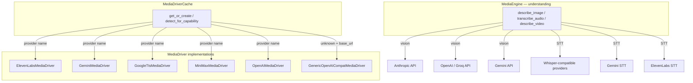

# MCP, Media & Sandbox Runtimes — librefang-runtime-media-src

# librefang-runtime-media

Provider-agnostic media generation and understanding — image synthesis, text-to-speech, video generation, music generation, image description, and audio transcription.

## Architecture



The crate has two independent subsystems that share no runtime state:

1. **MediaDriver trait + cache** — generates media (TTS audio, images, video, music) via provider APIs.
2. **MediaEngine** — understands existing media (describes images, transcribes audio) by calling vision/STT models.

---

## MediaDriver Trait and Cache

### `MediaDriver` trait

Defined in `lib.rs`. Each provider implements only the modalities it supports; unimplemented methods return `MediaError::NotSupported` by default.

| Method | Modality | Return type |
|---|---|---|
| `generate_image` | Image generation | `MediaImageResult` |
| `synthesize_speech` | Text-to-speech | `MediaTtsResult` |
| `submit_video` / `poll_video` / `get_video_result` | Video (async) | `MediaVideoSubmitResult` / `MediaTaskStatus` / `MediaVideoResult` |
| `generate_music` | Music | `MediaMusicResult` |

Required methods every driver must implement:

- **`capabilities()`** — returns which `MediaCapability` variants the driver supports.
- **`is_configured()`** — returns `true` when the required API key env var is present. Defaults to `true`; every built-in driver overrides this to check its key.
- **`provider_name()`** — static string identifier (e.g. `"elevenlabs"`, `"minimax"`).

### `MediaDriverCache`

Thread-safe, lazy-initializing cache backed by `DashMap`. Created once at startup and shared across tasks.

```rust
let cache = MediaDriverCache::new_with_urls(config.provider_urls);
let driver = cache.get_or_create("openai", None)?;  // Arc<dyn MediaDriver>
```

**URL resolution order** for `get_or_create(provider, base_url)`:

1. Explicit `base_url` argument
2. `provider_urls` map (from `[provider_urls]` in `config.toml`)
3. Driver's hardcoded default

The cache key is `"{provider}|{url}"` so the same provider with different base URLs (e.g. a proxy) gets a separate driver instance.

**Auto-detection** — `detect_for_capability(capability)` iterates the provider preference list and returns the first driver where `is_configured()` is true and `capabilities()` includes the requested capability.

**Hot-reload** — `update_provider_urls()` replaces the URL map and clears the cache. `load_providers_from_registry()` rebuilds the provider list from `ProviderInfo` structs that declare `media_capabilities`.

### Provider factory

`create_media_driver(provider, base_url)` maps provider names to concrete types:

| Provider name | Driver type | Env var |
|---|---|---|
| `"elevenlabs"` | `ElevenLabsMediaDriver` | `ELEVENLABS_API_KEY` |
| `"gemini"` / `"google"` | `GeminiMediaDriver` | `GEMINI_API_KEY` or `GOOGLE_API_KEY` |
| `"google_tts"` | `GoogleTtsMediaDriver` | `GOOGLE_API_KEY` or `GOOGLE_CLOUD_API_KEY` |
| `"minimax"` | `MiniMaxMediaDriver` | `MINIMAX_API_KEY` (or `MINIMAX_CN_API_KEY` for China) |
| `"openai"` | `OpenAIMediaDriver` | `OPENAI_API_KEY` |
| any other + `base_url` | `GenericOpenAICompatMediaDriver` | `{PROVIDER}_API_KEY` |

Unknown providers without a `base_url` return `MediaError::InvalidRequest` with guidance to set `provider_urls.{name}` in config.

---

## Provider Implementations

### ElevenLabs (`elevenlabs.rs`) — Text-to-Speech

**Capability:** `TextToSpeech` only.

**Endpoint:** `POST {base_url}/text-to-speech/{voice_id}?output_format={format}`

**Defaults:**
- Base URL: `https://api.elevenlabs.io/v1`
- Model: `eleven_multilingual_v2`
- Voice: `21m00Tcm4TlvDq8ikWAM` (Rachel)
- Output format: `mp3_44100_128`

**Voice ID validation** is the critical security boundary. `validate_voice_id()` enforces exactly 20 ASCII-alphanumeric characters, which closes URL-path-injection vectors (`../../`, `?x=y`, trailing `/`). Validation runs **before** the API key check so that malformed input surfaces as `InvalidRequest` rather than `MissingKey`.

Error echo is capped at 64 bytes (`VOICE_ID_ERROR_ECHO_MAX_BYTES`) to prevent a 10 kB malicious voice ID from producing a 10 kB error string.

Audio response is capped at 25 MB (`MAX_AUDIO_RESPONSE_BYTES`), checked both via `Content-Length` header and actual decoded size.

Duration is estimated at ~150 words/min (`word_count * 400ms`).

### Gemini (`gemini.rs`) — Image Generation

**Capability:** `ImageGeneration` only (Imagen 3).

**Endpoint:** `POST {base_url}/v1beta/models/{model}:predict?key={api_key}`

**Defaults:**
- Base URL: `https://generativelanguage.googleapis.com`
- Model: `imagen-3.0-generate-002`

API key is passed as a query parameter (`?key=`). The driver reads `GEMINI_API_KEY` first, falling back to `GOOGLE_API_KEY`.

Image count is capped at 4 per request (`sampleCount.min(4)`). Response images exceeding 10 MB base64 are skipped with a warning. If all images are empty, the driver checks for `raiFilteredReason` in the response and returns `MediaError::ContentFiltered` if present.

### Google Cloud TTS (`google_tts.rs`) — Text-to-Speech

**Capability:** `TextToSpeech` only.

**Endpoint:** `POST {base_url}/text:synthesize?key={api_key}`

**Defaults:**
- Base URL: `https://texttospeech.googleapis.com/v1`
- Voice: `en-US-Standard-F`
- Language: `en-US`

**SSML detection** (`build_input`) automatically wraps text containing SSML markup:

| Input | Behaviour |
|---|---|
| Contains `<speak>` | Passed as `ssml` verbatim |
| Contains SSML tags but no `<speak>` | Auto-wrapped in `<speak>...</speak>` |
| Plain text | Passed as `text` |

The `is_ssml()` function checks for unambiguous SSML-only tags (`<prosody`, `<emphasis`, `<say-as`, etc.) and requires paired closing tags or SSML-specific attributes for tags that overlap with HTML (`<p>`, `<s>`, `<sub>`, `<mark>`, `<audio>`) to avoid false positives.

Audio encoding mapping (`map_audio_encoding`):

| Format string | Google encoding |
|---|---|
| `opus` / `ogg` | `OGG_OPUS` |
| `wav` / `pcm` / `linear16` | `LINEAR16` |
| anything else | `MP3` |

Duration estimate accounts for `speaking_rate`: `(word_count * 400) / rate`, clamped to 500 ms minimum.

### MiniMax (`minimax.rs`) — All Four Modalities

**Capabilities:** `ImageGeneration`, `TextToSpeech`, `VideoGeneration`, `MusicGeneration`.

**Region detection:** If the base URL contains `minimaxi.com` (extra "i"), the driver uses `MINIMAX_CN_API_KEY`; otherwise `MINIMAX_API_KEY`.

**Error handling** — MiniMax returns errors in a `base_resp` envelope with `status_code` and `status_msg`. `check_base_resp` maps known codes:

| Code | MediaError variant |
|---|---|
| 1002 | `RateLimit` |
| 1004 | `MissingKey` |
| 1026 / 1027 | `ContentFiltered` |
| 2013 | `InvalidRequest` |
| other non-zero | `Api { status, message }` |

**Video generation** uses the async submit/poll pattern:
1. `submit_video` → returns `MediaVideoSubmitResult` with a task ID
2. `poll_video` → returns `MediaTaskStatus` (pending/processing/completed/failed)
3. `get_video_result` → returns the final video URL/data

### OpenAI (`openai.rs`) — Image + TTS

The OpenAI module provides both `OpenAIMediaDriver` and `GenericOpenAICompatMediaDriver` for third-party OpenAI-compatible APIs.

---

## MediaEngine — Understanding

Defined in `media_understanding.rs`. Processes existing media (images, audio, video) rather than generating new content.

### Provider Selection

There is **no runtime fallback cascade**. A single provider is chosen:

- If `[media] image_provider` / `audio_provider` is set in config, that provider is used.
- Otherwise, `detect_vision_provider()` / `detect_audio_provider()` returns the first provider whose API key env var is present.

**Vision priority:** Anthropic → OpenAI → Groq → Gemini

**Audio priority:** Groq → OpenAI → Gemini → ElevenLabs → MiniMax → Fireworks → Together → SiliconFlow

### Image Description

`describe_image(attachment)` reads image bytes from `MediaSource::FilePath` or `MediaSource::Base64`, encodes them as base64, and sends to the provider's multimodal endpoint:

| Provider | API | Image format |
|---|---|---|
| Anthropic | Messages API (`/v1/messages`) | `image` block with `base64` source |
| OpenAI / Groq | Chat Completions | `image_url` block with data-URL |
| Gemini | generateContent | `inline_data` part |

URL-based sources are rejected — the caller must download the image first.

### Audio Transcription

`transcribe_audio(attachment)` dispatches to one of three API families:

1. **Whisper-compatible** (Groq, OpenAI, MiniMax, Fireworks, Together, SiliconFlow) — multipart form upload to `/v1/audio/transcriptions`.
2. **Gemini** — multimodal `generateContent` with `inline_data` audio part.
3. **ElevenLabs** — `/v1/speech-to-text` multipart with `xi-api-key` header.
4. **Custom** (`[media.custom_stt]`) — any OpenAI-compatible Whisper endpoint, with optional API key.

**`.oga` transcoding:** Telegram voice notes arrive as `.oga` / `audio/oga`, which Whisper rejects. The engine automatically re-encodes to Ogg/Opus via `ffmpeg` stdin/stdout pipes (no scratch files). Requires `ffmpeg` on `PATH`. A 30-second wall-clock timeout kills and reaps the child process to prevent zombies.

**Model resolution order:**

1. `[media] audio_model` (global override)
2. `[media.custom_stt] model` — **only** for custom/self-hosted providers; the guard in `custom_stt_model_ref` returns `None` for all built-in providers
3. Provider-specific default (`default_audio_model`)

This prevents an operator setting `custom_stt.model = "large-v3"` from accidentally overriding Groq's default model.

**Default models by provider:**

| Provider | Default model |
|---|---|
| Groq | `whisper-large-v3-turbo` |
| OpenAI | `whisper-1` |
| Gemini | `gemini-2.0-flash` |
| ElevenLabs | `scribe_v1` |
| MiniMax | `speech-01-turbo` |
| Fireworks | `whisper-v3-turbo` |
| Together | `whisper-large-v3-turbo` |
| SiliconFlow | `FunAudioLLM/SenseVoiceSmall` |
| Custom | `whisper-1` |

### Custom STT Configuration

`[media.custom_stt]` in `config.toml` configures a self-hosted Whisper endpoint:

| Field | Purpose |
|---|---|
| `base_url` | Required. The full URL (e.g. `http://localhost:8080/v1/audio/transcriptions`) |
| `api_key_env` | Env var name for the API key. Empty = no auth |
| `key_required` | If `true`, missing env var is an error |
| `model` | Model name override (only used for custom providers) |

### Concurrency

`MediaEngine` uses a `tokio::sync::Semaphore` clamped to `[media] max_concurrency` (1–8, default 2). `process_attachments` spawns one task per attachment, each acquiring a permit before calling the provider.

### Video Description

`describe_video` currently returns a stub. Requires `video_description = true` in config and a Gemini API key. Full implementation is deferred.

---

## Error Handling

`MediaError` is the unified error type for all media operations:

| Variant | When |
|---|---|
| `NotSupported(capability)` | Driver doesn't implement the modality |
| `MissingKey(details)` | Required env var absent |
| `Http(message)` | Network / request failure |
| `Api { status, message }` | Provider returned non-2xx |
| `RateLimit(message)` | Provider rate limit hit |
| `ContentFiltered(reason)` | Safety filter rejected content |
| `InvalidRequest(message)` | Bad input (malformed voice ID, failed validation) |
| `TaskNotFound(id)` | Unknown async task ID |
| `Other(message)` | Catch-all |

Error messages from providers are truncated to 500 bytes via `safe_truncate_str` to avoid ballooning logs or leaking full response bodies. This helper performs UTF-8-safe truncation (backs up to the nearest char boundary).

---

## Adding a New Provider

1. Create a new submodule (e.g. `src/my_provider.rs`).
2. Implement `MediaDriver` — override only the methods your provider supports.
3. Add a match arm in `create_media_driver()` in `lib.rs`.
4. Add the provider name to the `media_providers` default list in `MediaDriverCache::new()`.
5. Wire the API key check in `is_configured()`.

For a custom OpenAI-compatible endpoint, no code changes are needed — set `provider_urls.my_provider` in config and the factory returns `GenericOpenAICompatMediaDriver`.