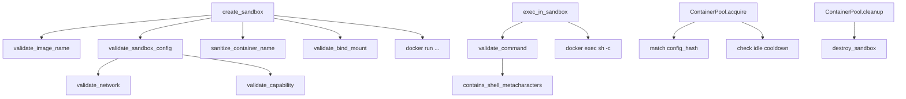

# MCP, Media & Sandbox Runtimes — librefang-runtime-sandbox-docker-src

# Docker Sandbox Runtime (`librefang-runtime-sandbox-docker`)

## Overview

This crate provides OS-level sandboxing for agent code execution using Docker containers. Every agent gets an isolated container with strict resource limits, a dropped capability set, network isolation, and a read-only root filesystem. The module handles the full container lifecycle — creation, command execution, destruction — and optionally pools containers for reuse across sessions.

All security-relevant parameters are validated at config-load time, before any `docker` subprocess is spawned. Invalid configurations fail fast with typed errors and `error!`-level log emissions.

## Architecture

## Core Types

### `SandboxContainer`

A handle to a running Docker container, returned by `create_sandbox` and consumed by `destroy_sandbox`:

| Field | Type | Description |
|---|---|---|
| `container_id` | `String` | Docker container ID (hex string from `docker run`) |
| `agent_id` | `String` | Logical agent this container belongs to |
| `created_at` | `DateTime<Utc>` | Creation timestamp |

### `ExecResult`

The outcome of a command run via `exec_in_sandbox`:

| Field | Type | Description |
|---|---|---|
| `stdout` | `String` | Captured standard output (truncated at 50,000 chars) |
| `stderr` | `String` | Captured standard error (truncated at 50,000 chars) |
| `exit_code` | `i32` | Process exit code (`-1` if unavailable) |

### `ContainerPool`

A concurrency-safe pool (`DashMap`-backed) for reusing containers across sessions. Containers are matched by `config_hash` and gated by an idle-cooldown period.

## Public API

### `is_docker_available() -> bool`

Checks whether a Docker daemon is reachable by running `docker version`. Returns `false` on any error (daemon not running, binary missing, permission denied). Call this at startup to decide whether to fall back to an alternative sandbox.

### `create_sandbox(config, agent_id, workspace) -> Result<SandboxContainer, String>`

Creates and starts a Docker container configured for isolation:

1. Validates the image name (`validate_image_name`).
2. Runs `validate_sandbox_config` to reject dangerous networks and capabilities.
3. Derives a collision-resistant container name via SHA-256 of the `agent_id`.
4. Validates the workspace bind-mount path against blocked paths and symlink escapes.
5. Spawns `docker run -d` with all security flags applied.
6. Returns a `SandboxContainer` handle on success.

**Docker flags applied:**

| Flag | Purpose |
|---|---|
| `--memory`, `--cpus`, `--pids-limit` | Resource limits from config |
| `--cap-drop ALL` | Drop all Linux capabilities |
| `--security-opt no-new-privileges` | Prevent privilege escalation via setuid binaries |
| `--cap-add <cap>` | Selectively re-add only allowlisted capabilities |
| `--read-only` | Read-only root filesystem (when `read_only_root` is true) |
| `--network <net>` | Network namespace isolation (validated; never `host`) |
| `--tmpfs <mount>` | tmpfs mounts for writable directories |
| `-v workspace:workdir:ro` | Workspace mounted read-only |

### `exec_in_sandbox(container, command, timeout) -> Result<ExecResult, String>`

Executes a command inside a running container via `docker exec sh -c`. Key behaviors:

- **Command validation**: `validate_command` rejects shell metacharacters (pipes, backticks, `$()`, `${}`, semicolons, redirections, brace expansion, backgrounding).
- **Timeout**: wraps `cmd.output()` in `tokio::time::timeout`. On timeout, returns an error string.
- **`kill_on_drop(true)`**: ensures the host-side `docker exec` process is SIGKILLed if the future is dropped (e.g., after timeout). Without this, timed-out calls would leak host processes.
- **Output truncation**: stdout and stderr are truncated at 50,000 characters (UTF-8-safe truncation via `helpers::safe_truncate_str`).

### `destroy_sandbox(container) -> Result<(), String>`

Stops and removes a container with `docker rm -f`. Logs a warning on failure but does not return an error — the container may already be gone.

### `validate_sandbox_config(config) -> Result<(), String>`

Entry point for config-load-time validation of `network` and `cap_add`. Rejects `host` networking, `container:*` networking, and any capability not in the `SAFE_CAPS` allowlist. Emits `error!`-level logs on rejection so failures are recorded even if the caller discards the `Result`.

### `validate_bind_mount(path, blocked) -> Result<(), String>`

Guards against mounting sensitive host paths into the sandbox:

1. Requires absolute paths.
2. Rejects `..` path traversal.
3. Checks against a hardcoded blocklist (`/etc`, `/proc`, `/sys`, `/dev`, `/var/run/docker.sock`, `/root`, `/boot`).
4. Checks against user-configured `blocked_mounts`.
5. **Symlink escape detection**: canonicalizes the path (or its nearest existing ancestor) and re-checks the resolved path against both blocklists. This prevents an attacker from creating a symlink that resolves into a blocked path after the check.

### `config_hash(config) -> u64`

Deterministic hash of key config fields (`image`, `network`, `memory_limit`, `workdir`) for pool matching. Used by `ContainerPool` to find reusable containers with identical configurations.

## Container Naming

Container names are derived as `{container_prefix}-{suffix}` where `suffix` is `SHA-256(agent_id)[..8 hex chars]`. This replaces an earlier lossy truncation scheme that collapsed distinct agent IDs (e.g., `foo/bar` and `foo-bar` both became `foo-bar`).

The 8-character hex prefix provides a 2^32 keyspace. For realistic agent counts on a single host, collision probability is negligible (birthday bound for 1,000 agents: ~1.2×10⁻⁴).

## Capability Allowlist (`SAFE_CAPS`)

The 14 capabilities in `SAFE_CAPS` are re-added after `--cap-drop ALL`. Explicitly **excluded** (sandbox-collapse vectors):

- `SYS_ADMIN` — mount, kexec, BPF, namespace manipulation
- `NET_ADMIN` — interface reconfiguration, firewall rules
- `SYS_PTRACE` — process attachment, defeats `no-new-privileges`
- `BPF`, `PERFMON`, `SYS_MODULE`, `SYS_BOOT`, `SYS_RAWIO`, `SYS_TIME`, and all `MAC_*`, `IPC_*`, `AUDIT_*`, `CHECKPOINT_RESTORE`, `SYSLOG`

`NET_RAW` is retained (needed for `ping`/`traceroute`) but documented as a minor SSRF amplifier; the network namespace boundary is the primary protection.

## Network Validation

`validate_network` rejects:

- **`host`** — shares the host network namespace, exposing loopback, cloud metadata at `169.254.169.254`, and the daemon port.
- **`container:<name>`** — joins another container's namespace, transitively defeating isolation.
- **Non-alphanumeric characters** — prevents shell injection in the `--network` argument.

Accepted values: `bridge`, `none`, and user-defined network names matching `[A-Za-z0-9_-]+`.

## Shell Metacharacter Detection

The `helpers::contains_shell_metacharacters` function scans commands for injection vectors. It handles quoting correctly:

- **Scanned raw** (fire inside double quotes): backticks, `$(`, `${`
- **Scanned after stripping quoted regions**: `;`, `|`, `>`, `<`, `{`, `}`, `&`
- **Always blocked**: embedded newlines, null bytes

This mirrors the implementation in `librefang_runtime::subprocess_sandbox` and is kept in sync via a parity test at `crates/librefang-runtime/tests/docker_sandbox_helpers_parity.rs`.

## ContainerPool

The pool enables container reuse to avoid the overhead of repeated `docker run` / `docker rm` cycles:

| Method | Description |
|---|---|
| `new()` | Create an empty pool |
| `release(container, config_hash)` | Return a container to the pool |
| `acquire(config_hash, cool_secs)` | Claim a container matching the hash that has been idle at least `cool_secs` seconds |
| `cleanup(idle_timeout_secs, max_age_secs)` | Destroy containers that are too old or have been idle too long |
| `len()` / `is_empty()` | Pool size queries |

`cleanup` should be called periodically (e.g., from a background task) to prevent unbounded growth.

## Configuration

Controlled via `DockerSandboxConfig` (defined in `librefang_types::config`):

| Field | Default | Description |
|---|---|---|
| `enabled` | `false` | Whether Docker sandboxing is active |
| `image` | `python:3.12-slim` | Docker image for sandbox containers |
| `container_prefix` | `librefang-sandbox` | Prefix for container names |
| `workdir` | `/workspace` | Working directory inside container |
| `network` | `none` | Docker network (validated; never `host`) |
| `memory_limit` | `512m` | Memory cap |
| `cpu_limit` | `1.0` | CPU limit |
| `timeout_secs` | `60` | Command execution timeout |
| `read_only_root` | `true` | Read-only root filesystem |
| `cap_add` | `[]` | Additional capabilities (validated against allowlist) |
| `tmpfs` | `["/tmp:size=64m"]` | tmpfs mount specifications |
| `pids_limit` | `100` | Maximum PIDs in the container |
| `blocked_mounts` | `[]` | Additional host paths that must not be bind-mounted |

## Security Invariants

1. **Capabilities**: `--cap-drop ALL` is always applied. Only `SAFE_CAPS` entries pass validation. No warning-and-skip — invalid capabilities are hard errors.
2. **Network**: `host` and `container:*` are always rejected. Network namespace isolation is always enforced.
3. **Privilege escalation**: `--security-opt no-new-privileges` is always set.
4. **Filesystem**: Root is read-only by default. Workspace is mounted read-only. Bind mounts are validated against blocklists with symlink resolution.
5. **Commands**: Shell metacharacters are rejected before `docker exec` invocation. Quoting-aware analysis prevents double-quote bypass.
6. **Process leaks**: `kill_on_drop(true)` ensures timed-out `docker exec` processes are cleaned up on the host.