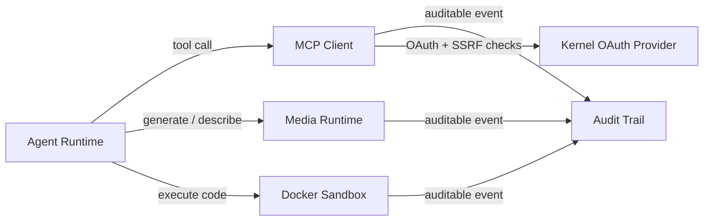

# MCP, Media & Sandbox Runtimes

# MCP, Media & Sandbox Runtimes

## Purpose

This module group provides the execution layer that sits between the LibreFang agent and the outside world. It controls **what the agent can reach** (MCP servers, media providers), **where it can run code** (Docker sandboxes), and **what gets recorded** (Merkle-audited event trail).

## Sub-modules

| Module | Responsibility |
|---|---|
| [MCP Client Runtime](librefang-runtime-mcp-src.md) | Connects to external MCP servers, discovers tools, dispatches namespaced `mcp_{server}_{tool}` calls through taint scanning, schema validation, and SSRF guards |
| [Media Runtime](librefang-runtime-media-src.md) | Provider-agnostic media synthesis (image, TTS, video, music) and understanding (image description, audio transcription, video description) via swappable drivers |
| [Docker Sandbox](librefang-runtime-sandbox-docker-src.md) | Isolated container-based code execution with resource caps, dropped capabilities, network isolation, and optional container pooling |
| [Audit Trail](librefang-runtime-audit-src.md) | Append-only, SHA-256 chained log of security-critical events with SQLite persistence and out-of-band anchor files for tamper evidence |

## How they fit together

The four runtimes are independent crates that share a common pattern: **each guards a trust boundary and records what crosses it**.

- **MCP** is the gateway to external tool servers. Before any call leaves the process, it validates arguments against the server's JSON Schema, scans for tainted content, strips caller context, and checks target URLs against SSRF blocklists. OAuth flows for MCP servers route through the kernel's `register_client` path, reusing the same `is_ssrf_blocked_url_with` guard.
- **Media** exposes a unified `MediaEngine` regardless of which provider (ElevenLabs, Gemini, MiniMax, OpenAI, etc.) backs a given capability. Drivers are resolved through a cache keyed on provider name and capability, so the agent doesn't need to know which service handles a request.
- **Sandbox** gives the agent a disposable execution environment. Containers are created with validated security parameters (read-only rootfs, no-new-privileges, dropped capabilities) and destroyed or returned to a pool after use.
- **Audit** sits underneath all three. Every security-significant action — a tool dispatch, a sandbox creation, a media call — is appended as a chained `AuditEntry`. The Merkle linkage means any post-hoc modification breaks the chain, and the external anchor file closes the gap where an attacker with database access could rewrite history.

## Key cross-module workflows

**Authenticated MCP tool call** — The agent issues a tool call → MCP validates args and checks taint rules → the OAuth metadata flow validates the server's endpoints against SSRF blocklists (shared with the kernel provider) → the call is dispatched over SSE or stdio → the result is bounded-read → an audit entry is recorded.

**Media generation with audit** — The agent requests synthesis or understanding → `MediaEngine` selects a cached driver for the capability → the driver calls the external provider → an audit entry is appended to the Merkle chain.

**Sandboxed code execution** — The agent submits code → a Docker container is created with pre-validated security config → the command runs inside the isolated container → output is collected → the container is destroyed or pooled → the session event is written to the audit log.