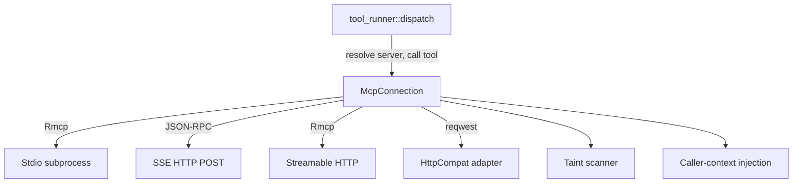

# MCP Protocol

# MCP Protocol Module

The `librefang-runtime-mcp` crate implements the client side of the Model Context Protocol (MCP). It connects to external MCP servers, discovers their tools, and dispatches tool calls from the LLM runtime while enforcing security boundaries around credential exfiltration, caller identity, and network access.

## Architecture Overview



All MCP tools are namespaced as `mcp_{server}_{tool}` to prevent collisions when multiple servers are connected.

---

## Core Types

### `McpServerConfig`

Holds all configuration for a single MCP server connection. Key fields:

| Field | Purpose |
|---|---|
| `name` | Display name, used in tool namespacing |
| `transport` | Transport variant (`Stdio`, `Sse`, `Http`, `HttpCompat`) |
| `timeout_secs` | Per-request deadline (default 60) |
| `env` | Declared environment variables for subprocess |
| `headers` | Extra HTTP headers for SSE/HTTP transports |
| `taint_scanning` | Enable outbound credential scanning (default `true`) |
| `taint_policy` | Fine-grained per-tool, per-path exemptions |
| `taint_rule_sets` | Live `ArcSwap` handle to named taint rule sets for downgrade logic |
| `roots` | Filesystem directories advertised via MCP Roots capability |

### `McpConnection`

Active connection to an MCP server. Lifecycle:

1. **`McpConnection::connect(config)`** — Establishes transport, performs MCP handshake, discovers tools via `tools/list`.
2. **`conn.call_tool_with_caller(name, arguments, caller)`** — Dispatches a tool call after taint scanning and caller-context injection.
3. **`conn.close()`** — Explicitly shuts down the transport (preferred over implicit `Drop` for hot-reload).

The `Drop` implementation provides a best-effort fallback: if the runtime is available, it spawns a bounded async close; otherwise the rmcp `DropGuard` fires synchronously.

### `McpTransport` (enum)

| Variant | Protocol | SDK |
|---|---|---|
| `Stdio { command, args }` | MCP over stdin/stdout | `rmcp` SDK with `TokioChildProcess` |
| `Sse { url }` | JSON-RPC over HTTP POST | Manual reqwest |
| `Http { url }` | Streamable HTTP (2025-03-26 spec) | `rmcp` SDK `StreamableHttpClientTransport` |
| `HttpCompat { base_url, headers, tools }` | Plain HTTP/JSON adapter | Manual reqwest |

---

## Tool Namespacing

All tools from MCP servers are prefixed to avoid naming collisions:

- **`format_mcp_tool_name(server, tool)`** → `mcp_{server}_{tool}` (both parts normalized to lowercase with hyphens replaced by underscores).
- **`is_mcp_tool(name)`** → checks `mcp_` prefix.
- **`resolve_mcp_server_from_known(tool_name, server_names)`** → reverse lookup using longest-prefix match against known server names. This is the robust variant used by `tool_runner::dispatch`; the simpler `extract_mcp_server` splits on the first underscore and is unreliable for multi-word server names.

---

## Caller Context (Identity Attestation)

The kernel injects an attested identity into every MCP tool call so servers can enforce per-user authorization.

### `CallerContext`

```rust
pub struct CallerContext {
    pub peer_id: Option<String>,    // e.g. Telegram user id
    pub channel: Option<String>,    // "telegram", "slack", …
    pub chat_id: Option<String>,    // conversation id
    pub session_id: Option<String>, // LibreFang SessionId
}
```

Built via `CallerContext::from_parts(...)` from `ToolExecContext` fields. Returns `None` when all signals are absent, preserving byte-for-byte payload parity with pre-attestation calls.

### Injection mechanism

The strip-then-set ordering is the security boundary:

1. Clone `arguments`, coerce to `{}` if null/non-object.
2. **Remove** any agent-supplied `_librefang_caller` key — the agent must never control this value.
3. **Insert** the kernel-attested `CallerContext` under `_librefang_caller` (for Rmcp/SSE) or as the `X-Librefang-Caller` HTTP header (for HttpCompat).

See `inject_caller_into_arguments()` for the Rmcp/SSE path. The taint scanner runs against the **original** agent-supplied arguments before injection, so a malicious agent can't hide data behind the `_librefang_caller` key.

---

## Taint Scanning (Outbound Credential Detection)

Before any arguments leave the process, the taint scanner walks every string leaf in the JSON tree to detect credentials and PII.

### Entry point

`scan_mcp_arguments_for_taint_with_policy(value, taint_policy, rule_set_registry, tool_name)` → `Option<String>` (redacted violation description).

### How it works

1. **Tool-level bypass**: If the tool's policy has `default = Skip`, scanning is skipped entirely.
2. **Recursive walk** (`walk_taint`): Traverses objects, arrays, and string leaves. Recursion capped at `MCP_TAINT_SCAN_MAX_DEPTH` (64).
3. **Sensitive key detection**: Object keys matching known credential names (`authorization`, `api_key`, `password`, `secret`, etc.) with non-empty string values are blocked regardless of value shape. This catches patterns like `{"headers": {"Authorization": "Bearer sk-..."}}` that the text heuristic misses.
4. **Content-based scanning**: Each string leaf is checked via `detect_outbound_text_violation_rules_with_skip` from `librefang_types::taint`.
5. **Per-path skip rules**: `McpTaintPolicy` can exempt specific JSONPath patterns (e.g., `$.tab_id`) from specific rules.
6. **Rule-set downgrades**: Named rule sets referenced in the tool's policy can downgrade `Block` → `Warn` or `Log`. When multiple sets cover the same rule, the most permissive action wins (`Log` > `Warn` > `Block`).

### JSONPath matching

`jsonpath_matches(pattern, path)` supports:
- Exact paths: `$.a.b`
- Wildcards: `$.a.*`, `$.*`
- Array wildcards: `$.items[*]` matches `$.items[0]`

**Limitation**: Object keys containing `.` or `[` cannot be addressed precisely. Use broader patterns as a workaround.

### Important security properties

- Returned error strings contain only the JSON path and rule name — **never** the offending payload value.
- The scanner fires on every rule, not just the first, so a `Warn` downgrade on rule A cannot mask an unauthorized rule B firing in the same payload.

---

## Transport Details

### Stdio

Spawns a subprocess with a sandboxed environment:

- **Shell blocking**: `bash`, `sh`, `cmd`, `powershell`, etc. are rejected — servers must specify a runtime (`npx`, `node`, `python`).
- **Environment sandboxing**: The subprocess does NOT inherit the parent environment. Only `SAFE_ENV_VARS` (PATH, HOME, NODE_PATH, etc.) and explicitly declared `env` entries are passed.
- **Env var expansion in args**: `$VAR` and `${VAR}` references in args are expanded only for variables in the allowlist (safe system vars + declared env). Undeclared secrets like `ANTHROPIC_API_KEY` are never leaked.
- **Tilde expansion**: Leading `~` in args is expanded to the home directory.
- **Windows `.cmd` adaptation**: On Windows, `npx` is resolved to `npx.cmd` automatically.
- **Stderr draining**: Child stderr is captured and logged at DEBUG level, capped at 100 lines of 256 bytes each. Draining continues past the cap to prevent pipe stalls.

### SSE (Server-Sent Events)

Manual JSON-RPC 2.0 over HTTP POST:

- `sse_initialize()` sends the MCP `initialize` handshake, validates the server's `protocolVersion` against `SUPPORTED_MCP_VERSIONS`.
- `sse_discover_tools()` calls `tools/list`.
- Response validation: Content-Type must be `application/json` or `text/event-stream`; JSON-RPC `id` in the response must match the request.
- Does **not** declare `roots` capability (SSE is unidirectional).

### Streamable HTTP

Uses the `rmcp` SDK's `StreamableHttpClientTransport`:

- Supports `Mcp-Session-Id` for session management.
- Advertises `roots` capability only for local URLs.
- On 401, attempts OAuth metadata discovery and returns `"OAUTH_NEEDS_AUTH"` to defer to the API layer.

### HttpCompat

Built-in adapter for plain HTTP/JSON backends that don't speak MCP:

- Tools are statically declared in config (no `tools/list`).
- Path templates use `{param}` placeholders rendered from arguments.
- Supports `GET`, `POST`, `PUT`, `PATCH`, `DELETE` methods.
- Request modes: `JsonBody`, `Query`, `None`.
- Response modes: `Text`, `Json`.
- Caller context shipped via `X-Librefang-Caller` header.

---

## Security Features

### SSRF Protection

`check_ssrf(url, label)` is called for every HTTP-based transport. It:

- Rejects non-`http(s)` schemes.
- Rejects URLs with userinfo (`http://user:pw@host/`).
- Blocks cloud-metadata endpoints: `0.0.0.0`, `169.254/16`, `100.64/16`, Azure IMDS, GCP/AWS metadata hostnames.
- Unwraps IPv4-mapped IPv6 and NAT64 prefixes before re-checking.

Loopback/RFC1918 addresses are **allowed** for MCP backend URLs (operator-configured) but blocked on the OAuth discovery/token-exchange path where hosts come from remote responses.

### Bounded Response Reading

`read_response_bytes_capped(response)` streams the HTTP body with a running counter, rejecting anything over 16 MiB (`MAX_RESPONSE_BYTES`). This prevents malicious servers from causing OOM via unbounded responses — the check is streaming, not buffered.

### Argument Validation

`validate_args_against_schema` provides a lightweight guard (not full JSON Schema validation):

1. Rejects non-object arguments when the schema declares `type: "object"`.
2. Rejects missing `required` fields.

Full validation (types, patterns, enums, nested objects) is delegated to the MCP server.

---

## MCP Roots Capability

`RootsClientHandler` implements `rmcp::ClientHandler` to declare filesystem root directories during the MCP `initialize` handshake. Paths are converted to `file://` URIs with proper percent-encoding and Windows drive-letter handling.

- **Stdio**: Roots are always advertised (local subprocess).
- **Streamable HTTP**: Roots advertised only for local URLs (`localhost`, `127.x.x.x`, `::1`).
- **SSE / HttpCompat**: Roots are not applicable (no handshake or unidirectional).

---

## OAuth Integration

The `mcp_oauth` submodule handles:

- **Metadata discovery**: Three-tier resolution (WWW-Authenticate header → RFC 8414 well-known → config fallback). Validates metadata endpoints against the Public Suffix List to prevent open redirect attacks.
- **PKCE flow**: `generate_pkce()` creates verifier/challenge pairs; `generate_state()` and `generate_flow_id()` produce cryptographic nonces.
- **Token storage**: `McpOAuthProvider` trait for loading/storing tokens (vault-backed).
- **SSRF on discovery**: OAuth endpoints (from remote responses) get stricter SSRF checks than backend URLs.

When a Streamable HTTP server returns 401, the connect flow extracts the `WWW-Authenticate` header via `extract_auth_header_from_error` and returns `"OAUTH_NEEDS_AUTH"` so the API layer can drive the browser-based PKCE flow.

---

## Hot-Reload Contract

`TaintRuleSetsHandle` (`Arc<ArcSwap<Vec<NamedTaintRuleSet>>>`) is shared across all connected servers. The kernel owns a single swap and clones it into each `McpServerConfig`. On config reload:

1. Kernel calls `handle.store(Arc::new(new_rules))`.
2. The next `call_tool_with_caller` picks up new rules via `.load()`.
3. The `.load()` snapshot is held for the entire argument-tree walk, so rules cannot change mid-scan.

---

## Integration Points

### Called by the kernel

- **`tool_runner::dispatch::execute_tool_raw`** → `is_mcp_tool()`, `resolve_mcp_server_from_known()`, `CallerContext::from_parts()`, `call_tool_with_caller()`
- **`kernel::mcp_summary::render_mcp_summary`** → `normalize_name()`, `resolve_mcp_server_from_known()`
- **`routes::mcp_auth::auth_start`** → `discover_oauth_metadata()`, `generate_state()`
- **`routes::agents::get_agent_mcp_servers`**, **`tui::event::spawn_fetch_agent_mcp_servers`** → `resolve_mcp_server_from_known()`

### Dependencies

- `rmcp` — MCP protocol SDK (Stdio and Streamable HTTP transports)
- `librefang_types` — `TaintSink`, `ToolDefinition`, config types
- `librefang_http` — `proxied_client_builder()` for HTTP clients
- `arc_swap` — Lock-free hot-reload for taint rule sets
- `reqwest` — HTTP client for SSE and HttpCompat