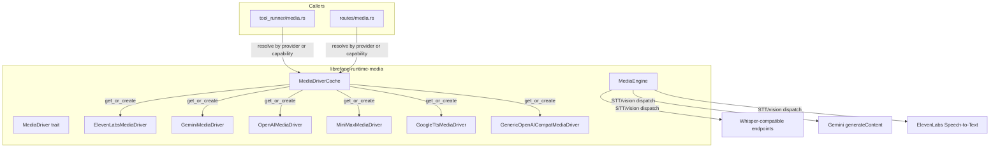

# Media Processing

# Media Processing Module

The `librefang-runtime-media` crate provides a provider-agnostic abstraction layer for media generation (image, TTS, video, music) and media understanding (image description, audio transcription, video analysis). It mirrors the architecture used by the LLM driver system: a trait-based interface with per-provider implementations, lazy-initialized caching, and configuration-driven URL resolution.

## Architecture



## Core Trait: `MediaDriver`

Defined in `lib.rs`, the `MediaDriver` trait provides per-modality async methods with default implementations that return `MediaError::NotSupported`. Providers override only the methods they support.

```rust
#[async_trait]
pub trait MediaDriver: Send + Sync {
    fn capabilities(&self) -> Vec<MediaCapability>;
    fn is_configured(&self) -> bool;
    fn provider_name(&self) -> &str;

    async fn generate_image(&self, _request: &MediaImageRequest)
        -> Result<MediaImageResult, MediaError>;
    async fn synthesize_speech(&self, _request: &MediaTtsRequest)
        -> Result<MediaTtsResult, MediaError>;
    async fn submit_video(&self, _request: &MediaVideoRequest)
        -> Result<MediaVideoSubmitResult, MediaError>;
    async fn poll_video(&self, _task_id: &str)
        -> Result<MediaTaskStatus, MediaError>;
    async fn get_video_result(&self, _task_id: &str)
        -> Result<MediaVideoResult, MediaError>;
    async fn generate_music(&self, _request: &MediaMusicRequest)
        -> Result<MediaMusicResult, MediaError>;
}
```

### Capability Matrix

| Provider | Image Gen | TTS | Video Gen | Music Gen | Auth env var |
|---|---|---|---|---|---|
| **OpenAI** | ✅ (DALL-E 3, gpt-image-1) | ✅ (tts-1, tts-1-hd) | — | — | `OPENAI_API_KEY` |
| **Gemini** | ✅ (Imagen 3) | — | — | — | `GEMINI_API_KEY` or `GOOGLE_API_KEY` |
| **ElevenLabs** | — | ✅ (multilingual_v2) | — | — | `ELEVENLABS_API_KEY` |
| **MiniMax** | ✅ (image-01) | ✅ (speech-2.8-hd) | ✅ (Hailuo) | ✅ (music-2.5) | `MINIMAX_API_KEY` |
| **Google TTS** | — | ✅ (Standard/WaveNet/Neural2) | — | — | `GOOGLE_API_KEY` or `GOOGLE_CLOUD_API_KEY` |
| **Generic OpenAI-compat** | ✅ | ✅ | — | — | `{PROVIDER}_API_KEY` |

### Error Handling: `MediaError`

```rust
pub enum MediaError {
    NotSupported(String),      // Modality not implemented by this driver
    MissingKey(String),        // Required env var not set
    Http(String),              // Network/transport failure
    Api { status: u16, message: String },  // Provider returned non-2xx
    RateLimit(String),         // Throttled by provider
    ContentFiltered(String),   // Safety filter triggered
    InvalidRequest(String),    // Bad input parameters
    TaskNotFound(String),      // Unknown async task ID
    Other(String),             // Catch-all
}
```

All error messages from provider responses are truncated to 500 bytes via `safe_truncate_str` before being surfaced, preventing oversized error payloads from propagating.

## Driver Cache: `MediaDriverCache`

A thread-safe, lazy-initializing cache backed by `DashMap`. It resolves base URLs from three sources in priority order:

1. **Explicit `base_url` argument** to `get_or_create`
2. **`provider_urls` map** (sourced from `config.toml` `[provider_urls]` section)
3. **Driver's hardcoded default** URL

### Key methods

- **`get_or_create(provider, base_url)`** — Returns a cached `Arc<dyn MediaDriver>`. Cache key is `"{provider}|{url}"`, so different base URLs for the same provider produce separate instances.
- **`detect_for_capability(capability)`** — Iterates the media provider list in preference order, returning the first driver that is both configured (API key present) and supports the requested capability.
- **`load_providers_from_registry(providers)`** — Populates the provider list from `ProviderInfo` entries that declare `media_capabilities`. Built-in providers are always appended as fallback.
- **`update_provider_urls(urls)`** — Hot-reloads URL overrides and clears the cache so drivers are recreated on next access.

### Provider aliases

`"google"` is aliased to `"gemini"` for URL resolution. Unknown providers with a configured `base_url` fall through to `GenericOpenAICompatMediaDriver`, which speaks the OpenAI API protocol using `{PROVIDER_UPPER}_API_KEY`.

## Provider Implementations

### ElevenLabs (`elevenlabs.rs`)

**Capability:** Text-to-speech only.

**Endpoint:** `POST {base_url}/text-to-speech/{voice_id}?output_format={format}`

Key design points:

- **Voice ID validation** (`validate_voice_id`): Every voice ID must be exactly 20 ASCII-alphanumeric characters. This closes a URL-path-injection vector since the voice ID is interpolated directly into the path. The constant `VOICE_ID_LEN` and the default `DEFAULT_VOICE_ID` (Rachel: `21m00Tcm4TlvDq8ikWAM`) must stay in sync.
- **Error echo truncation**: Invalid voice IDs are echoed in error messages but capped at `VOICE_ID_ERROR_ECHO_MAX_BYTES` (64 bytes) to prevent a malicious 10 kB input from producing a 10 kB error string.
- **Validation ordering**: Voice ID is validated *before* the API key is read. This ensures that when both are wrong, the agent sees the actionable `InvalidRequest` rather than a generic `MissingKey`.
- **Speed handling**: ElevenLabs has no direct speed parameter; speed is approximated by adjusting `stability` in voice settings (lower stability for faster speech).
- **Response size**: Audio responses are capped at 25 MB (`MAX_AUDIO_RESPONSE_BYTES`), checked both from `Content-Length` header and actual byte count.
- **Output format parsing**: `parse_output_format` splits strings like `"mp3_44100_128"` into format and sample rate components.

### Gemini (`gemini.rs`)

**Capability:** Image generation only (Imagen 3).

**Endpoint:** `POST {base_url}/v1beta/models/{model}:predict?key={api_key}`

- API key is passed as a query parameter (`?key=`), read from `GEMINI_API_KEY` or `GOOGLE_API_KEY`.
- Images are returned as base64 in `predictions[].bytesBase64Encoded`. Individual images exceeding 10 MB base64 are skipped with a warning.
- Content filter detection: if `predictions[0].raiFilteredReason` is present and no images were returned, the error surfaces as `MediaError::ContentFiltered`.
- `sampleCount` is capped at 4 per request.
- Supported aspect ratios: `"1:1"`, `"3:4"`, `"4:3"`, `"9:16"`, `"16:9"`.

### Google Cloud TTS (`google_tts.rs`)

**Capability:** Text-to-speech only.

**Endpoint:** `POST {base_url}/text:synthesize?key={api_key}`

- Supports Standard, WaveNet, Neural2, and Studio voices via the `voice.name` parameter.
- **SSML auto-detection** (`build_input`): If input text contains `<speak>`, it's sent as SSML directly. If it contains SSML-only tags (e.g., `<break`, `<prosody`) without a `<speak>` wrapper, the text is auto-wrapped. Otherwise, it's sent as plain text.
- **Audio encoding mapping** (`map_audio_encoding`): `"opus"`/`"ogg"` → `OGG_OPUS`, `"wav"`/`"pcm"`/`"linear16"` → `LINEAR16`, everything else → `MP3`.
- Speaking rate and pitch are passed directly through `audioConfig`.
- Response audio is base64-encoded in the `audioContent` field; decoded with size pre-check (base64 length × 4/3 as an upper bound).

### MiniMax (`minimax.rs`)

**Capability:** All four modalities — the most complete driver.

| Modality | Endpoint | Default model |
|---|---|---|
| Image | `POST /v1/image_generation` | `image-01` |
| TTS | `POST /v1/t2a_v2` | `speech-2.8-hd` |
| Video | `POST /v1/video_generation` + polling | `MiniMax-Hailuo-2.3` |
| Music | `POST /v1/music_generation` | `music-2.5` |

**Region awareness:** The China endpoint (`api.minimaxi.com`, note the extra "i") is auto-detected from the base URL. China prefers `MINIMAX_CN_API_KEY`; international prefers `MINIMAX_API_KEY`, with fallback to the other.

**Error handling:** `check_base_resp` maps MiniMax status codes to typed errors:
- `1002` → `RateLimit`
- `1004` → `MissingKey`
- `1026`/`1027` → `ContentFiltered`
- `2013` → `InvalidRequest`

**Audio encoding:** MiniMax returns audio as hex-encoded bytes (`"output_format": "hex"`), decoded via the `hex` crate. Duration, sample rate, and format are extracted from `extra_info`.

**Video generation** uses an async submit/poll/result pattern:
1. `submit_video` → returns a `task_id`
2. `poll_video` → maps status strings (`"Preparing"`, `"Queueing"`, `"Processing"`, `"Success"`, `"Fail"`) to `MediaTaskStatus`
3. `get_video_result` → fetches the `file_id`, then retrieves the download URL via `/files/retrieve`

### OpenAI (`openai.rs`)

**Capability:** Image generation and TTS.

| Modality | Endpoint | Default model |
|---|---|---|
| Image | `POST /v1/images/generations` | `dall-e-3` |
| TTS | `POST /v1/audio/speech` | `tts-1` |

- Image responses are returned as `b64_json` by default; individual images exceeding 10 MB base64 are skipped.
- TTS returns raw audio bytes (not base64), with a 10 MB size cap.
- The `revised_prompt` field from DALL-E 3 responses is captured and returned.
- Supports speed control via the `speed` parameter on TTS requests.

**Generic OpenAI-compatible driver** (`GenericOpenAICompatMediaDriver`): Instantiated for unknown provider names that have a configured `base_url`. Allows integrating with any OpenAI-protocol-compatible service without writing a dedicated driver.

## Media Understanding Engine (`media_understanding.rs`)

Separate from generation, `MediaEngine` handles consuming media: image description, audio transcription, and video analysis.

### Construction

```rust
let engine = MediaEngine::new(config);
```

Concurrency is bounded by a `Semaphore` initialized from `config.max_concurrency` (clamped to 1–8).

### Provider Selection

Each modality picks **exactly one** provider — no fallback cascade:

- **Image description**: `[media] image_provider` config, or first detected from `ANTHROPIC_API_KEY` → `OPENAI_API_KEY` → `GEMINI_API_KEY`
- **Audio transcription**: `[media] audio_provider` config, or first detected from `GROQ_API_KEY` → `OPENAI_API_KEY` → `GEMINI_API_KEY` → `ELEVENLABS_API_KEY` → `MINIMAX_API_KEY` → `FIREWORKS_API_KEY` → `TOGETHER_API_KEY` → `SILICONFLOW_API_KEY`
- **Video description**: Gemini only (requires `GEMINI_API_KEY` or `GOOGLE_API_KEY`)

When auto-detection is used, a warning is logged advising explicit configuration.

### Audio Transcription Flow

Audio transcription has the most complex pipeline:

1. **Read audio bytes** from `MediaSource::FilePath` or `MediaSource::Base64`. URL sources are rejected.
2. **Detect format** from MIME type (`mime_to_ext`) or source file extension. Falls back to `.wav`.
3. **OGA transcoding**: Telegram voice notes arrive as `.oga`/`audio/oga`, which Whisper rejects. The `transcode_oga_to_ogg_opus` function shells out to `ffmpeg` to re-packetize the Opus payload into a standard Ogg container. stdin/stdout are piped (no scratch files), with a 30-second wall-clock timeout and explicit child kill + reap on timeout.
4. **Dispatch to provider**:
   - **Whisper-compatible** (groq, openai, minimax, fireworks, together, siliconflow): multipart POST with `file` + `model` + `response_format=text`
   - **Gemini**: `generateContent` with inline base64 audio and a transcription prompt
   - **ElevenLabs**: `POST /v1/speech-to-text` with multipart file upload

### Security

Error messages from transcription providers are sanitized before being returned to the caller. The underlying `reqwest::Error` display can leak URLs (Gemini embeds `?key=` in the URL); these are logged at warn level but replaced with generic messages in the `Err` returned to the agent prompt.

## Integration Points

The module is consumed by two main callers:

- **`src/tool_runner/media.rs`** — Tool implementations (`tool_image_generate`, `tool_text_to_speech`, `tool_video_generate`, `tool_video_status`, `tool_music_generate`) resolve drivers via `get_or_create` (explicit provider) or `detect_for_capability` (auto-detect).
- **`src/routes/media.rs`** — HTTP API routes (`list_media_providers`, `poll_video_task`, `resolve_driver`) for external consumers.

## Adding a New Provider

1. Create a new submodule (e.g., `replicate.rs`) implementing `MediaDriver`.
2. Override the methods for supported modalities; leave unsupported ones as defaults (they return `NotSupported`).
3. Add the provider to the `match` arm in `create_media_driver` in `lib.rs`.
4. Add the provider name to the default `media_providers` list in `MediaDriverCache::new()`.
5. If the provider uses a custom env var for auth, implement `api_key()` accordingly and return `false` from `is_configured()` when it's missing.