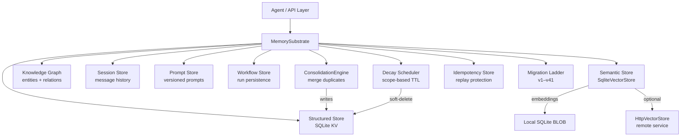

# Memory & Knowledge Base — librefang-memory-src

# librefang-memory — Memory & Knowledge Base

## Overview

`librefang-memory` is the persistence substrate for the LibreFang Agent Operating System. It provides a unified memory API over three storage backends — structured key-value, semantic search, and a knowledge graph — all backed by SQLite with optional HTTP vector store delegation.

Agents interact through a single `Memory` trait that abstracts over all three stores, while infrastructure concerns (schema migration, connection pooling, background decay) are handled internally.

## Architecture



## Key Components

### MemorySubstrate (`substrate.rs`)

The central factory and connection pool holder. Created via `open_in_memory()` for tests or `open(path)` for production. All sub-stores receive a clone of the `r2d2::Pool<SqliteConnectionManager>` so every read and write flows through the same WAL-aware pool.

### Migration Ladder (`migration.rs`)

Schema versioning at `SCHEMA_VERSION = 41`. Each step runs in its own transaction that bundles DDL, an `INSERT INTO migrations` audit row, and a `PRAGMA user_version` bump — ensuring atomicity and an auditable trail.

**Safety checks before any DDL runs:**

| Condition | Behavior |
|-----------|----------|
| `user_version > SCHEMA_VERSION` | Refuses to downgrade (returns error) |
| `MAX(migrations.version) > user_version` | `InconsistentLadder` error with recovery instructions |
| Audit rows missing after successful run | Auto-backfills and logs a warning (#3538) |

Helper: `column_exists(conn, table, column)` — used by migrations that conditionally add columns, since SQLite lacks `ADD COLUMN IF NOT EXISTS`.

### Text Chunker (`chunker.rs`)

Splits long documents into overlapping chunks for embedding. Entry point: `chunk_text(text, max_size, overlap) -> Vec<String>`.

**Splitting strategy (in order of precedence):**

1. **Paragraph boundaries** (`\n\n`)
2. **Sentence boundaries** — ASCII `. ` / `.\n`, CJK `。`, `？`, `！`
3. **Hard character split** — last resort when a single token exceeds `max_size`

Internals: `build_segments()` produces atomic segments, then `pack_with_overlap()` greedily packs them, prepending the last `overlap` characters of the previous chunk to maintain context continuity. All operations use char-based indexing (via `char_boundaries()`) to handle multi-byte Unicode correctly.

### Semantic Store (`semantic.rs`)

Text-based memory with recall search. Stores memories as rows with content, metadata (JSON), confidence, access tracking, and optional embedding BLOBs (LE f32 vectors).

`SqliteVectorStore` provides the local vector backend. For external services (Qdrant, Weaviate, etc.), swap in `HttpVectorStore`.

### Consolidation Engine (`consolidation.rs`)

`ConsolidationEngine::conssolidate()` runs two phases:

**Phase 1 — Confidence decay:** Memories not accessed in 7+ days have their confidence reduced by `decay_rate` (clamped at 0.1 floor).

**Phase 2 — Duplicate merging:** Within each `agent_id` (no cross-tenant comparison), memories with >90% text similarity are merged. Per run, capped at `MAX_MERGES_PER_RUN = 100` merges to avoid O(n²) blowup.

**Merge semantics for keeper ← loser:**

| Field | Strategy |
|-------|----------|
| `confidence` | `max(keeper, loser)` |
| `access_count` | Sum of both |
| `metadata` | JSON object union; keeper wins key conflicts. Non-object payloads on either side → keeper preserved verbatim. |
| `embedding` | Running confidence-weighted average. Tracks accumulated weight across multiple losers so a keeper absorbing N vectors produces a true average, not a chain of pairwise blends. |
| Loser row | Soft-deleted (`deleted = 1`) |

All merges execute inside a single outer transaction — one `fsync` for the entire batch rather than one per pair.

### Decay Scheduler (`decay.rs`)

Scope-based TTL soft-deletion via `run_decay(pool, config)`:

| Scope | TTL Config Field | Behavior |
|-------|-----------------|----------|
| `user_memory` | — | **Never decays** (permanent) |
| `session_memory` | `session_ttl_days` | Soft-delete after N days of no access |
| `agent_memory` | `agent_ttl_days` | Soft-delete after N days of no access |

Uses `datetime()` comparisons in SQLite to handle RFC3339 offset/precision differences correctly.

**Two-phase deletion:**
1. `run_decay` → soft-delete (`deleted = 1`, stamps `deleted_at`)
2. `prune_soft_deleted_memories(pool, older_than_days)` → hard-deletes rows soft-deleted more than N days ago, reclaiming embedding BLOBs

Access via `SemanticStore::recall_with_embedding` resets `accessed_at`, keeping frequently-used memories alive.

### Knowledge Graph (`knowledge.rs`)

`KnowledgeStore` manages entities and relations in SQLite with support for graph pattern queries.

```rust
// Add entities
store.add_entity(Entity { name: "Alice", entity_type: EntityType::Person, ... }, agent_id);

// Add relations (supports both ID and name references)
store.add_relation(Relation { source: "Alice", relation: RelationType::WorksAt, target: "Acme", ... }, agent_id);

// Pattern matching
store.query_graph(GraphPattern { source: Some("Alice"), relation: Some(RelationType::WorksAt), target: None, max_depth: 1 });
```

The JOIN in `query_graph` resolves entity references by both ID and name, supporting the MCP tool pattern where relations reference entities by human-readable name.

**Corrupt data handling:** `parse_entity` and `parse_relation` fail loudly on malformed JSON in `properties` columns (returns `Serialization` error) rather than silently substituting an empty map — making corruption detectable in production logs.

### HTTP Vector Store (`http_vector_store.rs`)

Delegates vector operations to a remote HTTP service. Implements the `VectorStore` trait.

**API contract:**

| Method | Path | Purpose |
|--------|------|---------|
| POST | `/insert` | Store embedding + payload |
| POST | `/search` | Nearest-neighbor search |
| DELETE | `/delete` | Remove by ID |
| POST | `/get_embeddings` | Bulk fetch embeddings |

Trailing slashes on `base_url` are stripped automatically. All errors are wrapped in `LibreFangError::Internal` with the HTTP status and response body.

### Idempotency Store (`idempotency.rs`)

SQLite-backed cache for HTTP Idempotency-Key replay protection (#3637). 24-hour TTL (`TTL_SECONDS = 86_400`).

```rust
pub trait IdempotencyStore: Send + Sync {
    fn lookup(&self, key: &str) -> Result<Option<StoredRecord>, IdempotencyError>;
    fn put(&self, key: &str, body_hash: &str, response: &CachedResponse) -> Result<(), IdempotencyError>;
    fn prune_expired(&self) -> Result<(), IdempotencyError>;
}
```

- `lookup` deletes expired rows in-place, returning `None` for stale entries
- `put` uses `INSERT OR IGNORE` for first-writer-wins semantics
- `prune_expired` is called opportunistically by middleware for self-trimming
- Pool exhaustion increments a `librefang_memory_pool_get_failed_total` counter per operation

### Additional Stores

| Module | Purpose |
|--------|---------|
| `session.rs` / `session_store.rs` | Message history with FTS, context window tracking, denormalized `message_count` |
| `prompt.rs` | Versioned prompt templates with experiment support |
| `structured.rs` | Key-value store for agent state |
| `workflow_store.rs` | Workflow run persistence (replaced tmp+rename JSON file) |
| `usage.rs` | Token usage tracking for budget enforcement |
| `proactive.rs` | mem0-style auto-memorize/auto-retrieve hooks |
| `namespace_acl.rs` | Redaction and access control for memory namespaces |
| `provider.rs` | Memory provider plugin system with `NullMemoryProvider` fallback |
| `roster_store.rs` | Agent roster management |

## Public API (re-exports from `lib.rs`)

```rust
// Core substrate
pub use substrate::MemorySubstrate;
pub use session_store::SessionStore;
pub use workflow_store::{WorkflowRunRow, WorkflowStore};

// Memory types from librefang-types
pub use librefang_types::memory::{
    ExtractionResult, MemoryAction, MemoryAddResult, MemoryFilter, MemoryFragment,
    MemoryId, MemoryItem, MemoryLevel, MemorySource, ProactiveMemory,
    ProactiveMemoryConfig, ProactiveMemoryHooks, RelationTriple,
    VectorSearchResult, VectorStore,
};

// Sub-stores and utilities
pub use proactive::{MemoryExportItem, MemoryStats, ProactiveMemoryStore};
pub use prompt::PromptStore;
pub use namespace_acl::{MemoryNamespaceGuard, NamespaceGate};
pub use http_vector_store::HttpVectorStore;
pub use semantic::SqliteVectorStore;
pub use provider::{MemoryError, MemoryManager, MemoryProvider, NullMemoryProvider};
```

## Database Schema

The migration ladder creates and evolves ~15 tables. The most important:

- **`memories`** — semantic memory with content, embedding BLOB, confidence, scope, access tracking, soft-delete
- **`entities`** / **`relations`** — knowledge graph nodes and edges, keyed by `agent_id`
- **`sessions`** — message history with FTS (`sessions_fts`), denormalized `message_count`, `model_override`
- **`agents`** — agent registry with manifest blobs
- **`idempotency_keys`** — HTTP replay cache with `expires_at`
- **`migrations`** — audit trail of applied schema versions
- **`workflow_runs`** — persisted workflow state (Running/Pending/Complete)
- **`approval_audit`** — human-in-the-loop approval log

## Contributing

When adding a new schema change:

1. Add a `migrate_vN` function with DDL + `INSERT INTO migrations` + `set_schema_version`
2. Bump `SCHEMA_VERSION` in `migration.rs`
3. Add a `run_step!` invocation in the ladder
4. Ensure the `migrations` audit-row backfill logic at the end of `run_migrations` covers your new version automatically
5. Add a test that verifies migration idempotency (calling `run_migrations` twice is a no-op)