# Memory & Knowledge Base — librefang-memory-wiki-src

# Memory & Knowledge Base (`librefang-memory-wiki`)

Durable markdown knowledge vault for the LibreFang Agent OS. While the companion `librefang-memory` crate (SQLite + vectors) handles nearest-neighbour snippet retrieval, this vault provides a **navigable, human-editable knowledge base** that operators can also open directly in Obsidian or any Markdown editor. Every page carries provenance frontmatter — which agent, session, channel, and turn produced the claim — so facts are always auditable.

The vault is **disabled by default**. Operators opt in via configuration.

## Architecture

```mermaid
graph TD
    A[wiki_write caller] -->|topic, body, provenance| B[WikiVault]
    B -->|validate topic| C[validate_topic]
    B -->|rewrite &#91;&#91;link&#93;&#93; placeholders| D[RenderMode]
    B -->|check mtime + sha256| E[CompileState]
    B -->|render YAML header| F[frontmatter::render]
    B -->|atomic write| G["&lt;topic&gt;.md on disk"]
    B -->|rebuild index + backlinks| H["index.md + backlinks.json"]
    I[wiki_get caller] -->|topic| B
    B -->|parse frontmatter| J[frontmatter::split + parse]
    K[wiki_search caller] -->|query| B
    B -->|scan bodies, rank| L[SearchHit list]
```



## Configuration

```toml
[memory_wiki]
enabled = true
mode = "isolated"          # isolated | bridge | unsafe_local
vault_path = "~/.librefang/wiki/main"
render_mode = "native"     # native | obsidian
ingest_filter = "tagged"   # tagged | all
```

| Field | Description |
|-------|-------------|
| `enabled` | Must be `true` or the vault returns `WikiError::Disabled` on construction. |
| `mode` | v1 only implements `isolated`. `bridge` and `unsafe_local` return `WikiError::ModeNotImplemented`. |
| `vault_path` | Filesystem root for the vault. When unset, falls back to `<home_dir>/wiki/main` (the kernel's home directory, not an env variable, so embedded profiles don't mix data). |
| `render_mode` | Controls how cross-page links are rendered on disk. `native` produces `[topic](topic.md)`, `obsidian` keeps `[[topic]]`. |
| `ingest_filter` | v1 ingests only through explicit `wiki_write` calls. Setting `all` has no behavioural effect but logs a warning to surface misconfigured expectations. |

## File Layout on Disk

```
<vault_path>/
├── index.md                 # auto-generated alphabetical topic index
├── project-conventions.md   # one page per topic
├── api-design.md
├── _meta/
│   ├── compile-state.json   # mtime + sha256 of every page after last compile
│   └── backlinks.json       # { target → [source, ...] } index
```

Every page is a Markdown file with YAML frontmatter:

```markdown
---
topic: project-conventions
created: 2026-05-06T10:30:00Z
updated: 2026-05-06T11:00:00Z
content_sha256: 6a4f...
provenance:
  - agent: agent_xyz
    session: sess_abc
    channel: cli
    turn: 4
    at: 2026-05-06T10:30:00Z
---

body markdown ...
```

## Core Types

### `WikiVault`

The main entry point. Created via `WikiVault::new(&config, home_dir)` or `WikiVault::with_root(root, render_mode, ingest_filter)` for tests.

All writes are serialised through an internal `Mutex` to prevent concurrent corruption.

### `WikiPage`

```rust
pub struct WikiPage {
    pub topic: String,
    pub frontmatter: Frontmatter,
    pub body: String,
}
```

Returned by `get`. `body` contains the rendered markdown (links already rewritten to the active flavor).

### `Frontmatter`

Strongly-typed representation of the YAML header. Key fields:

- **`content_sha256`** — SHA-256 of the page body (trailing newline normalised). Used by the hand-edit detector to detect external modifications even on filesystems with coarse mtime precision.
- **`provenance`** — `Vec<ProvenanceEntry>` tracking every write's agent, session, channel, turn, and timestamp. Monotonically appended; the vault never drops history.

### `ProvenanceEntry`

```rust
pub struct ProvenanceEntry {
    pub agent: String,
    pub session: Option<String>,
    pub channel: Option<String>,
    pub turn: Option<u64>,
    pub at: DateTime<Utc>,
}
```

### `WikiWriteOutcome`

Returned by `write`. Indicates whether the write merged with an external hand-edit (`merged_with_external_edit: bool`).

### `SearchHit`

```rust
pub struct SearchHit {
    pub topic: String,
    pub snippet: String,  // ~120 chars around the first match
    pub score: f64,
}
```

### `BacklinkEntry`

```rust
pub struct BacklinkEntry {
    pub source: String,
    pub target: String,
}
```

## Vault Operations

### `WikiVault::write`

```rust
pub fn write(
    &self,
    topic: &str,
    body_with_placeholders: &str,
    provenance: ProvenanceEntry,
    force: bool,
) -> WikiResult<WikiWriteOutcome>
```

The primary write path. Callers pass body markdown using `[[topic]]` wiki-link syntax for cross-references — the vault rewrites these into the active render flavor at flush time, so the same body is portable across render modes.

**Execution flow:**

1. **Validate topic** — must match `[a-zA-Z0-9_-]+`, max 100 chars, cannot be `index` or start with `_`.
2. **Check body size** — rejects bodies exceeding 1 MiB (`MAX_BODY_BYTES`).
3. **Acquire write lock** — serialises concurrent writes to the same vault.
4. **Detect hand-edit drift** — compares on-disk mtime and body sha256 against `CompileState`. If either diverged and `force` is `false`, returns `WikiError::HandEditConflict`.
5. **Choose body** — when `force = true` and the page drifted, the external edit's body is preserved (only provenance is appended). Otherwise the caller's body is rendered with link rewriting.
6. **Update frontmatter** — creates a new header or updates an existing one. `updated` is set to now. The new provenance entry is appended. `content_sha256` is recomputed.
7. **Atomic write** — writes to a `.tmp.write` file then renames over the target.
8. **Update compile state** — records the new mtime and sha256.
9. **Rebuild index and backlinks** — regenerates `index.md` and `_meta/backlinks.json` from all pages.

### `WikiVault::get`

```rust
pub fn get(&self, topic: &str) -> WikiResult<WikiPage>
```

Reads a page from disk. Handles:
- **Missing pages** → `WikiError::NotFound`
- **CRLF normalisation** — automatically converts `\r\n` to `\n` so pages edited on Windows or via `git autocrlf` parse correctly.
- **Missing frontmatter** — pages hand-authored in Obsidian without a YAML block get a synthetic default frontmatter.
- **Malformed YAML** — logs a warning and falls back to a default frontmatter instead of failing the read. The body remains accessible.

### `WikiVault::search`

```rust
pub fn search(&self, query: &str, limit: usize) -> WikiResult<Vec<SearchHit>>
```

Case-insensitive substring search across all page bodies and topics. Scoring:
- Topic name match: **+10.0**
- Body matches: **ln(1 + count)** — sub-linear weighting so long pages don't drown short topic-only matches.

Results are sorted by score descending, then topic name ascending for determinism. Returns a ~120-character snippet around the first body match.

### `WikiVault::backlinks`

```rust
pub fn backlinks(&self) -> WikiResult<Vec<BacklinkEntry>>
```

Returns every backlink recorded in `_meta/backlinks.json`. Deterministically ordered by (target asc, source asc).

## Topic Validation

`validate_topic` enforces these rules:

| Rule | Reason |
|------|--------|
| Non-empty | Prevents degenerate filenames |
| ≤ 100 characters | Keeps filenames reasonable |
| Must not be `index` | Reserved for the auto-generated index page |
| Must not start with `_` | Reserved for vault metadata (`_meta/`) |
| Only `[a-zA-Z0-9_-]` | Ensures safe filenames across all platforms |

## Render Modes

Defined in `render.rs` as the `RenderMode` enum.

| Mode | Link format | Use case |
|------|-------------|----------|
| `Native` | `[topic](topic.md)` | Standard Markdown renderers |
| `Obsidian` | `[[topic]]` | Obsidian / Logseq |

### Authoring contract

Callers always write `[[topic]]` in the body they pass to `write`. The vault's render mode determines what actually lands on disk:

- **`RenderMode::rewrite_links`** — substitutes every `[[topic]]` placeholder. Empty or multi-line topics inside brackets are left untouched.
- **`RenderMode::extract_links`** — recognises both `[[topic]]` and `[topic](topic.md)` forms (only when visible text matches the target stem, to avoid false positives from arbitrary links). This means the backlink index is invariant under render-mode flips.

## Hand-Edit Safety

A core design goal (acceptance criterion #4 from issue #3329): pages edited by hand outside the vault are never silently overwritten.

**Detection mechanism** — `CompileState` stores per-page:
- `mtime_ns` — filesystem modification time as nanoseconds since epoch.
- `sha256` — `Frontmatter::hash_body` of the rendered body.

On every write, the vault compares these against the current on-disk state. If either diverged, the page was externally edited.

**Behaviour:**

| Condition | `force = false` | `force = true` |
|-----------|------------------|----------------|
| No drift | Write proceeds normally | Write proceeds normally |
| External edit detected | Returns `WikiError::HandEditConflict` | Preserves the external body, appends provenance entry only |

When `force = true` resolves a conflict, `WikiWriteOutcome::merged_with_external_edit` is `true`, signalling to the caller that a human edit was preserved rather than overwritten.

## Frontmatter System

The `frontmatter` module handles parsing and rendering of the YAML header.

### `split(raw) -> (Option<&str>, &str)`

Splits a raw page file into its YAML block and body. Returns `(None, raw)` for pages without frontmatter, allowing seamless handling of hand-authored files.

### `parse(yaml, topic) -> Result<Frontmatter, WikiError>`

Deserialises the YAML string into a `Frontmatter`. Wraps `serde_yaml` errors with the topic name for diagnostics.

### `render(frontmatter, body) -> Result<String, WikiError>`

Serialises frontmatter and body into the canonical on-disk format with `---` delimiters and a blank separator line.

### `Frontmatter::hash_body(body) -> String`

Computes SHA-256 of the body after stripping one trailing newline, so editor newline variations don't flip the hash.

## Error Handling

All errors are consolidated in `WikiError`:

| Variant | When |
|---------|------|
| `Disabled` | Vault not enabled in config |
| `ModeNotImplemented` | `bridge` or `unsafe_local` mode in v1 |
| `InvalidTopic` | Topic fails validation (includes reason) |
| `BodyTooLarge` | Body exceeds 1 MiB cap |
| `NotFound` | No page exists for the topic |
| `HandEditConflict` | External edit detected without `force` |
| `Frontmatter` | YAML parse error (wraps `serde_yaml::Error`) |
| `Io` | Filesystem I/O error (wraps `std::io::Error` with path) |

The type alias `WikiResult<T>` is `Result<T, WikiError>`.

## Cross-Platform Robustness

The vault handles several real-world edge cases:

- **CRLF tolerance** — `read_page_if_present` normalises `\r\n` to `\n` before parsing. Without this, the LF-only delimiter matcher in `split` would miss `---\r\n` headers and the entire YAML block would leak into the body.
- **Malformed YAML fallback** — a corrupted frontmatter block doesn't brick reads. The vault logs a warning and synthesises a default header. The next successful `write` repairs the YAML.
- **Atomic writes** — all file mutations go through `atomic_write` which writes to a `.tmp.write` file then renames, preventing partial writes on crash.
- **Missing frontmatter** — pages created directly in Obsidian without a YAML header load normally with a synthetic default frontmatter. The next compiler pass re-renders them with a proper header.

## v1 Scope and Future Work

**In scope (v1):**
- `isolated` mode only.
- Explicit `wiki_write` / `wiki_get` / `wiki_search` tool surface.
- `native` and `obsidian` render modes.
- Hand-edit safety with mtime + sha256 conflict detection.
- Case-insensitive substring search (no FTS5 or vector ranking).

**Out of scope (tracked as #3329 follow-ups):**
- `bridge` mode — reading shared artifacts from the memory substrate.
- `unsafe_local` mode — same-machine escape hatch for existing Obsidian vaults.
- Memory-event subscription (`ingest_filter = all`). The hook contract depends on `before_prompt_build` infrastructure (#3326).
- LLM-assisted topic extraction. v1 requires explicit topic tags.
- `memory_search` cross-corpus parameter (`corpus = all|kv|wiki`). This extends the runtime tool surface and should land separately so the wiki crate stays independently usable.