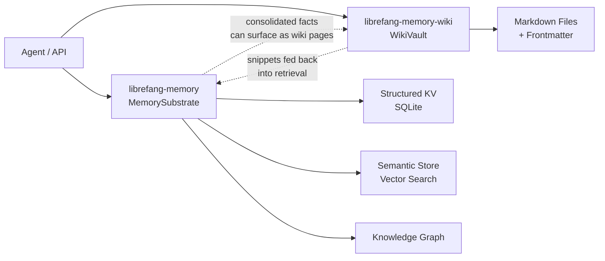

# Memory & Knowledge Base

# Memory & Knowledge Base

The Memory & Knowledge Base module group provides the complete persistence layer for the LibreFang Agent Operating System. It spans two complementary storage paradigms — machine-optimized retrieval and human-auditable documentation — giving agents durable access to facts, semantic context, and relational knowledge.

## Sub-Modules

| Sub-module | Role |
|---|---|
| [librefang-memory](librefang-memory-src.md) | Core persistence substrate: structured key-value store, semantic vector search, and knowledge graph, all backed by SQLite with optional HTTP vector store delegation |
| [librefang-memory-wiki](librefang-memory-wiki-src.md) | Durable Markdown knowledge vault with provenance frontmatter, designed for human navigation in Obsidian or any Markdown editor |

## How They Fit Together

**`librefang-memory`** is the primary substrate. Agents interact through a single `Memory` trait that abstracts over structured storage, nearest-neighbour vector retrieval, and graph-based knowledge relations. It handles schema migration, connection pooling, namespace ACLs, idempotent writes, background decay, and proactive memory management internally.

**`librefang-memory-wiki`** complements the substrate with a navigable, human-editable knowledge base. Every page carries provenance frontmatter — agent, session, channel, and turn — so facts are always auditable. The wiki is **disabled by default**; operators opt in via configuration.

## Key Cross-Module Workflows

- **Memory → Documentation**: Consolidated or proactive memories from the substrate can be promoted into wiki pages, creating a durable, human-readable record of agent knowledge.
- **Retrieval augmentation**: Wiki pages are chunked into snippets (via `build_snippet` with `char_floor`/`char_ceil` bounds) that can feed back into semantic search, enriching recall.
- **Provenance flows**: The wiki's frontmatter system reuses patterns from the substrate's migration and audit infrastructure, ensuring consistent traceability across both stores.