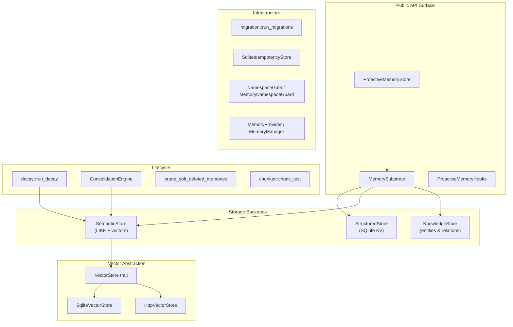

# Memory & Knowledge — librefang-memory-src

# librefang-memory — Memory & Knowledge Substrate

## Purpose

`librefang-memory` is the persistent memory and knowledge layer for the LibreFang Agent Operating System. It provides agents with three complementary storage paradigms—structured key-value, semantic text/vector search, and a knowledge graph—all backed by SQLite and unified behind a single `MemorySubstrate`. The crate also manages the full memory lifecycle: chunking text for embeddings, decaying stale memories, consolidating duplicates, and pruning soft-deleted rows.

## Architecture

## Core Components

### MemorySubstrate (`substrate.rs`)

The central entry point. Holds a single SQLite connection pool (`r2d2::Pool<SqliteConnectionManager>`) and wraps the structured store, semantic store, knowledge store, and session store. Created via `MemorySubstrate::open(path)` for a file-backed database or `MemorySubstrate::open_in_memory(decay_rate)` for tests.

The kernel and most subsystems receive an `Arc<MemorySubstrate>` at boot and delegate all persistence through it. The substrate exposes convenience methods like `structured_get`, `structured_set`, `structured_modify` that the goal runner and cron bridge use to persist agent state.

### Structured Store (`structured.rs`)

Key-value storage scoped by agent ID and namespace. Used for agent configuration, goal state, and arbitrary typed data. Values are stored as JSON TEXT columns.

### Semantic Store (`semantic.rs`)

Text-based memory with search capabilities. Memories carry an `agent_id`, `content`, `scope` (user/session/agent), `confidence`, `metadata` (JSON), `embedding` (BLOB of LE f32), and timestamps. Key operations:

- **`remember`** — insert a new memory
- **`recall_with_embedding`** — search by text and/or embedding, bumps `accessed_at`
- **`forget` / `forget_by_agent` / `forget_by_scope`** — soft-delete (sets `deleted = 1` and stamps `deleted_at`)

### Knowledge Store (`knowledge.rs`)

An entity-relation graph stored in SQLite. Supports:

- **`add_entity`** — upsert an entity (Person, Organization, Concept, Custom, etc.) with typed properties
- **`add_relation`** — link two entities with a typed, confidence-scored relation (WorksAt, RelatedTo, etc.)
- **`query_graph`** — pattern matching on source/relation/target with support for both ID and name lookups
- **`delete_by_agent`** — transactionally remove all entities and relations for a tenant

Relations can reference entities by name (as the MCP tool does) or by ID. The JOIN in `query_graph` resolves both. Corrupt JSON in `properties` columns surfaces as `LibreFangError::Serialization` rather than being silently replaced with an empty map.

### Vector Stores

The `VectorStore` trait (`librefang_types::memory`) defines `insert`, `search`, `delete`, and `get_embeddings`. Two implementations ship in this crate:

| Implementation | File | Use case |
|---|---|---|
| `SqliteVectorStore` | `semantic.rs` | Default; stores embeddings as LE f32 BLOBs alongside memories |
| `HttpVectorStore` | `http_vector_store.rs` | Delegates to an external HTTP service (Qdrant, Weaviate, custom) |

`HttpVectorStore` expects a REST contract with four endpoints: `POST /insert`, `POST /search`, `DELETE /delete`, and `POST /get_embeddings`. Construct with `HttpVectorStore::new(base_url)`.

## Memory Lifecycle

### Text Chunking (`chunker.rs`)

`chunk_text(text, max_size, overlap)` splits long documents into character-bounded, overlapping chunks suitable for embedding. The splitting cascade:

1. Split on paragraph boundaries (`\n\n`)
2. If a paragraph exceeds `max_size`, split on sentence boundaries (`. `, `。`, `？`, `！`)
3. If a single sentence is still too large, hard-split at the character limit (respecting UTF-8 boundaries)

Overlap is applied by prepending the last `overlap` characters of the previous chunk to the next. If the combined overlap + new segment exceeds `max_size`, the overlap is dropped.

### Time-Based Decay (`decay.rs`)

Scope-based TTL soft-deletion driven by `MemoryDecayConfig`:

| Scope | TTL field | Behavior |
|---|---|---|
| `user_memory` | — | **Never decays** (permanent) |
| `session_memory` | `session_ttl_days` | Soft-deleted after N days of no access |
| `agent_memory` | `agent_ttl_days` | Soft-deleted after N days of no access |

`run_decay(pool, config)` issues `UPDATE … SET deleted = 1, deleted_at = <now>` for stale rows. Timestamps are compared via `datetime()` to handle RFC3339 format variations correctly. Accessing a memory (through `recall_with_embedding`) resets the timer by updating `accessed_at`.

`prune_soft_deleted_memories(pool, older_than_days)` performs the final hard `DELETE` to reclaim embedding BLOBs, but only on rows with a non-null `deleted_at` older than the threshold.

### Consolidation (`consolidation.rs`)

`ConsolidationEngine` runs periodic sweeps that:

1. **Decay confidence** — reduce confidence of unaccessed memories (>7 days) by `1 - decay_rate`
2. **Merge near-duplicates** — compare memories per-agent using Jaccard word overlap (`text_similarity`). When similarity exceeds `duplicate_threshold` (default 0.85, configurable at runtime via `set_duplicate_threshold`), the lower-confidence row is absorbed into the higher-confidence keeper

Merge semantics preserve all data:
- **access_count** — summed from keeper + loser
- **metadata** — JSON union; keeper wins on key conflict; non-object JSON is preserved verbatim
- **embedding** — running confidence-weighted average across all absorbed losers (not pairwise re-blend)
- **confidence** — `max(keeper, loser)`

Two caps bound the cost: `MAX_CANDIDATES_PER_AGENT = 500` limits the per-tenant candidate set, and `MAX_MERGES_PER_RUN = 100` limits writes per cycle. A single outer transaction wraps all merges to collapse fsyncs.

The duplicate threshold is stored as `AtomicU32` (f32 bits) so the hot-reload path can update it through `Arc<MemorySubstrate>` without `&mut`.

## Proactive Memory

The proactive subsystem (`proactive.rs`) provides mem0-style auto-memorize and auto-retrieve capabilities:

- **`ProactiveMemoryStore`** — built on `MemorySubstrate`; manages extraction, search, and dedup with embedding awareness
- **`ProactiveMemoryHooks`** — hooks that intercept agent turns to auto-extract and store relevant memories
- **`ProactiveMemory`** trait — unified API surface (search, add, get, list)

Initialized via the runtime with optional LLM extractor and embedding driver. The sidecar command path allows delegating extraction to an external process.

## Infrastructure

### Schema Migrations (`migration.rs`)

`run_migrations(conn)` manages a versioned ladder from `user_version = 0` to `SCHEMA_VERSION = 41`. Each step runs in its own transaction that bundles DDL, an audit row in the `migrations` table, and the pragma bump. The system:

- Refuses to downgrade against a newer schema
- Detects ladder drift between the audit table and `user_version` (`InconsistentLadder` error) and provides operator recovery instructions
- Backfills missing audit rows on upgrade from pre-#3538 databases

### Idempotency Store (`idempotency.rs`)

`SqliteIdempotencyStore` provides `IdempotencyStore`-traited persistence for HTTP middleware. Records carry a key, body hash, cached response (status + body bytes), and a 24-hour expiration. Expired rows are pruned opportunistically on lookup. First-writer-wins via `INSERT OR IGNORE`.

### Session Management (`session.rs`, `session_store.rs`)

Tracks conversation sessions per agent with FTS5-indexed message history. Supports canonical message appending, session cleanup by TTL and count limits, and soft-delete-recreate without double-indexing.

### Namespace ACL (`namespace_acl.rs`)

`NamespaceGate` and `MemoryNamespaceGuard` enforce access control on structured store namespaces, with redaction support for bulk operations.

### Provider Plugin System (`provider.rs`)

`MemoryProvider` trait with `MemoryManager` registry. Supports built-in providers and external registration. Prefetch and turn-complete notifications are isolated — errors in providers don't propagate to callers.

### Other Modules

| Module | Purpose |
|---|---|
| `prompt.rs` | Prompt template storage and retrieval |
| `roster_store.rs` | Agent roster persistence |
| `usage.rs` | Memory usage metering |
| `workflow_store.rs` | Workflow run state with SQLite and in-memory backends |

## Integration Points

The kernel wires `MemorySubstrate` at boot and passes `Arc<MemorySubstrate>` to:

- **Goal runner** (`librefang-kernel/src/goal_runner.rs`) — reads/writes goal state via `structured_get`/`structured_set`
- **Background lifecycle** — calls `ConsolidationEngine::consolidate` and `run_decay` on the configured intervals
- **Cron bridge** (`src/kernel/cron_bridge.rs`) — persists scheduled response delivery
- **API layer** (`librefang-api`) — routes like `/api/memory/agents/{id}/consolidate` invoke per-agent consolidation; session endpoints call `push_message`
- **Runtime** (`librefang-runtime`) — initializes `ProactiveMemoryStore` with LLM and embedding drivers
- **Recovery tests** (`agent_loop/tests/recovery.rs`) — use `open_in_memory` for isolated test substrates

## Error Handling

All fallible operations return `LibreFangResult<T>` from `librefang_types::error`. The module uses dedicated error constructors (`LibreFangError::memory`, `LibreFangError::serialization`) and propagates SQLite errors through the `LibreFangError` enum. Pool exhaustion is tracked via `metrics::counter!("librefang_memory_pool_get_failed_total")` so operators can detect connection starvation before it causes user-visible failures.