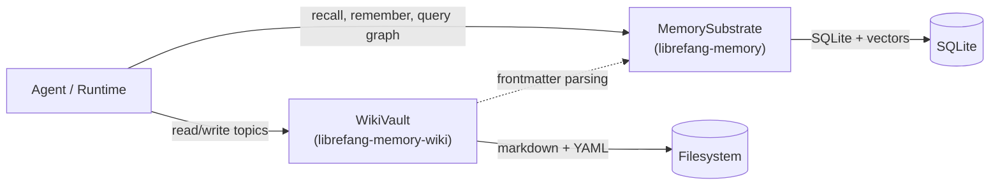

# Memory & Knowledge

# Memory & Knowledge

The Memory & Knowledge module provides the persistent storage and retrieval layer for the LibreFang Agent Operating System. It gives agents two complementary paradigms for managing information: a structured, queryable memory substrate optimized for machine recall, and a human-readable knowledge vault optimized for navigation and auditability.

## Sub-Modules

| Sub-module | Role | Storage |
|---|---|---|
| [librefang-memory](librefang-memory-src.md) | Structured memory, semantic search, knowledge graph | SQLite + vectors |
| [librefang-memory-wiki](librefang-memory-wiki-src.md) | Durable markdown knowledge base | Filesystem (`.md` files) |

## How They Fit Together

The two sub-modules address different halves of the same problem:

- **librefang-memory** answers *"find me the K nearest snippets matching this intent."* It provides a `MemorySubstrate` that unifies key-value lookups, semantic vector recall, and graph-based knowledge traversal behind a single API. It also manages the full memory lifecycle—chunking text for embeddings, decaying stale entries, consolidating duplicates, and pruning soft-deleted rows.

- **librefang-memory-wiki** answers *"give me a navigable, auditable knowledge base I can also open in Obsidian."* Its `WikiVault` stores each topic as a markdown file with structured YAML provenance metadata, making pages simultaneously accessible to agents via API and to humans via any text editor.

The wiki vault is a companion to the memory substrate rather than a replacement. An agent typically uses the memory substrate for fast, similarity-based recall during task execution, and the wiki vault for long-form knowledge that benefits from cross-linking (`[[topic]]` placeholders), human review, and durable file-based storage.

## Key Workflows That Span Both Modules

1. **Knowledge capture** — An agent records a memory via `MemorySubstrate` for immediate vector recall, then writes a structured topic page to `WikiVault` for long-term reference and human consumption.

2. **Proactive memory management** — `ProactiveMemoryStore` and `ProactiveMemoryHooks` in the memory substrate handle automatic decay and consolidation. Wiki pages, being file-backed, persist independently and serve as the authoritative record when memories are pruned.

3. **Frontmatter and metadata parsing** — The wiki vault's frontmatter module (`librefang-memory-wiki/src/frontmatter.rs`) participates in shared parsing flows that also touch the runtime plugin manager, linking knowledge entries to plugin version checks and metadata extraction.