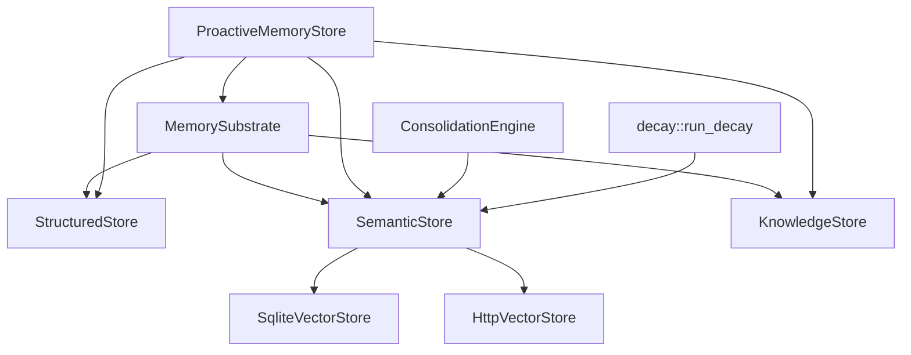

# Memory Management

# Memory Management (`librefang-memory`)

## Purpose

The memory substrate for the LibreFang Agent Operating System. It provides a unified memory API over three storage backends so agents can persist, search, and reason over structured state, semantic memories, and knowledge graph relationships through a single interface.

## Architecture



Agents interact primarily with `ProactiveMemoryStore` (the mem0-style API) or directly with `MemorySubstrate` for lower-level operations. Both delegate to three SQLite-backed stores:

| Store | Purpose | Tables |
|---|---|---|
| **StructuredStore** | Key-value pairs, agent state, config | `kv_store` |
| **SemanticStore** | Text memories with optional vector embeddings | `memories` |
| **KnowledgeStore** | Named entities and typed relations | `entities`, `relations` |

## Memory Levels

Every memory has a scope that controls its lifecycle:

| Level | Scope String | Decay Behavior |
|---|---|---|
| `User` | `user_memory` | Never decays — permanent user knowledge |
| `Session` | `session_memory` | Hard-deleted after `session_ttl_hours` of inactivity |
| `Agent` | `agent_memory` | Hard-deleted after `agent_ttl_days` of inactivity |

Accessing a memory (via search/recall) updates `accessed_at`, resetting the decay timer.

## Proactive Memory System (`proactive.rs`)

The `ProactiveMemoryStore` implements a mem0-style API on top of `MemorySubstrate`. This is the recommended interface for agent memory operations.

### Core Operations

| Method | Description |
|---|---|
| `search(query, user_id, limit)` | Semantic search across all memory levels |
| `add(messages, user_id)` | Store memories with automatic extraction from conversation messages |
| `get(user_id)` | Retrieve all user-level memories |
| `list(user_id, level, category)` | List memories filtered by level and category |
| `export_all(agent_id)` | Export all memories as a flat JSON-serializable list |
| `import_memories(agent_id, items)` | Import memories with deduplication |

### Auto Hooks

`ProactiveMemoryHooks` provides two hooks that wrap agent execution:

- **`auto_memorize`** — Called after an agent response. Extracts memories from the conversation, decides whether to ADD, UPDATE, or skip (NOOP), and persists the result.
- **`auto_retrieve`** — Called before an agent execution. Searches relevant memories and returns them as context.

### Memory Decision Flow

When `add()` is called, the store runs a dedup/merge decision:

1. Compute an embedding for the candidate memory (if embedding driver is configured).
2. Search for the top 5 most similar existing memories (vector cosine similarity or LIKE fallback).
3. The `MemoryExtractor` (default: `DefaultMemoryExtractor`) decides the action:
   - **ADD** — No similar memory exists; create a new one.
   - **UPDATE** — A similar memory exists but content differs; update in-place with version history.
   - **NOOP** — The memory already exists verbatim; skip.

When an UPDATE targets a memory that appears contradictory (detected by `detect_memory_conflict`), a `MemoryConflict` is attached to the result and `conflict_detected` is set in metadata.

### Confidence Decay

Each call to `search()`, `auto_retrieve()`, or consolidation triggers `maybe_run_maintenance()`, which rate-limits two tasks to once per hour:

- **Confidence decay**: For memories not accessed in >1 day, applies exponential decay: `confidence × e^(-rate × days)`, then a frequency boost: `× min(1.0 + log₂(access_count), 2.0)`.
- **Session TTL cleanup**: Soft-deletes session-level memories older than the configured `session_ttl_hours`.

### Per-Agent Memory Cap

`ProactiveMemoryConfig.max_memories_per_agent` sets a hard cap. When adding memories would exceed the cap, `evict_if_over_cap()` removes the lowest-confidence memories (eviction is capped at the number of existing memories; if a single batch alone exceeds the cap, a warning is logged and the cap is temporarily exceeded).

### Embedding Driver

By default, `ProactiveMemoryStore` falls back to `LIKE` text matching for search. Call `.with_embedding(driver)` to enable vector similarity search. The driver must implement:

```rust
#[async_trait]
pub trait EmbeddingFn: Send + Sync {
    async fn embed_one(&self, text: &str) -> LibreFangResult<Vec<f32>>;
}
```

When enabled, embeddings are stored alongside memories and cosine similarity is used for recall.

### Knowledge Graph Integration

When `auto_memorize` extracts `RelationTriple`s from conversation, `store_relations()` upserts entities and relations into `KnowledgeStore`. Deduplication skips triples where an identical (source, relation, target) edge already exists.

## MemorySubstrate (`substrate.rs`)

The lower-level entry point that owns the SQLite connection and exposes the three stores.

```rust
let substrate = MemorySubstrate::open_in_memory(0.1)?;
let substrate = Arc::new(substrate);
```

Key methods:

| Method | Delegates To |
|---|---|
| `structured_get/set/delete` | `StructuredStore` |
| `remember/recall/forget` | `SemanticStore` |
| `store_with_chunking` | `SemanticStore` (via `chunker`) |
| `consolidate` | `ConsolidationEngine` |
| `get_session/create_session` | `SessionStore` |
| `usage_conn()` | Shared connection for `UsageStore` |

### Chunked Storage

`store_with_chunking` splits long text using the chunker before storing. Each chunk gets its own row in `memories` with independent confidence and access tracking, but shares the same `agent_id` and `scope`.

## Text Chunking (`chunker.rs`)

`chunk_text(text, max_size, overlap)` splits documents into character-bounded chunks:

1. Split on paragraph boundaries (`\n\n`).
2. Within oversized paragraphs, split on sentence boundaries (`. `, `。`, `？`, `！`).
3. Within oversized sentences, hard-split at the character limit.
4. Greedily pack segments into chunks, prepending `overlap` characters from the previous chunk.

All splitting operates on Unicode character boundaries — multi-byte text (CJK, emoji) is handled correctly.

## Memory Consolidation (`consolidation.rs`)

`ConsolidationEngine::consolidate()` runs two phases:

1. **Confidence decay**: Multiplies confidence by `(1 - decay_rate)` for memories not accessed in the last 7 days, floored at 0.1.
2. **Duplicate merging**: Loads all active memories sorted by confidence DESC. For each pair with >90% Jaccard word similarity, soft-deletes the lower-confidence duplicate. If the absorbed memory had higher confidence, the keeper is lifted to that value. Capped at 100 merges per run to avoid O(n²) blowup.

Returns a `ConsolidationReport` with `memories_decayed`, `memories_merged`, and `duration_ms`.

## Time-Based Decay (`decay.rs`)

`run_decay(conn, config)` performs hard deletion based on scope TTLs:

- **USER scope**: Never touched.
- **SESSION scope**: Deleted when `accessed_at` is older than `session_ttl_days`.
- **AGENT scope**: Deleted when `accessed_at` is older than `agent_ttl_days`.

Controlled by `MemoryDecayConfig` (gated by `enabled` flag). This is distinct from consolidation's confidence decay — this removes stale data entirely.

## Knowledge Graph (`knowledge.rs`)

`KnowledgeStore` stores `Entity` and `Relation` records in SQLite with support for graph pattern queries.

### Entities

```rust
store.add_entity(
    Entity {
        id: String::new(),       // auto-generated UUID if empty
        entity_type: EntityType::Person,
        name: "Alice".to_string(),
        properties: HashMap::new(),
        created_at: Utc::now(),
        updated_at: Utc::now(),
    },
    "agent-id",
)?;
```

Upserts on conflict (updates name and properties).

### Relations

```rust
store.add_relation(
    Relation {
        source: "alice-id".to_string(),
        relation: RelationType::WorksAt,
        target: "acme-id".to_string(),
        properties: HashMap::new(),
        confidence: 0.95,
        created_at: Utc::now(),
    },
    "agent-id",
)?;
```

Relations can reference entities by either ID or name (the MCP tool uses names). The `query_graph` JOIN resolves both:

```sql
JOIN entities s ON (r.source_entity = s.id OR (r.source_entity = s.name AND s.agent_id = r.agent_id))
```

### Pattern Queries

`query_graph(GraphPattern)` returns `Vec<GraphMatch>` with source entity, relation, and target entity. Filters are optional — you can query by source, relation type, target, or any combination. Results are limited to 100 rows.

`delete_by_agent(agent_id)` removes all entities and relations owned by an agent.

## Session Management (`session.rs`)

`SessionStore` manages conversation history in the `sessions` table with:

- **Per-agent session isolation** via `agent_id` and optional `peer_id` (for multi-user agents).
- **FTS5 full-text search** across session content via the `sessions_fts` virtual table.
- **Canonical sessions** (`canonical_sessions` table) for cross-channel persistent memory — a single conversation thread shared across WhatsApp, web, etc.
- **Session labels** for human-readable identification.
- **JSONL mirror** support for streaming session content to a log file.
- **Cleanup**: `cleanup_excess_sessions(agent_id, max_count)` evicts the oldest sessions when an agent exceeds a limit.

## Schema Migrations (`migration.rs`)

SQLite schema is versioned via the `user_version` pragma. Current version: **19**.

Key tables created across migrations:

| Version | Addition |
|---|---|
| 1 | Core tables: `agents`, `sessions`, `events`, `kv_store`, `task_queue`, `memories`, `entities`, `relations` |
| 3 | `embedding` column on `memories` |
| 4 | `usage_events` for cost tracking |
| 5 | `canonical_sessions` for cross-channel memory |
| 8 | `audit_entries` for Merkle audit trail |
| 9 | Performance indexes for proactive memory queries |
| 10 | `agent_id` on entities/relations for per-agent cleanup |
| 12 | FTS5 virtual table for session search |
| 13 | Prompt versioning and A/B testing tables |
| 15 | Multimodal memory columns (`image_url`, `image_embedding`, `modality`) |
| 16 | `peer_id` on memories and sessions for per-user isolation |
| 17 | `approval_audit` for persistent approval audit log |
| 19 | `provider` column on `usage_events` for per-provider budgets |

Migrations are idempotent — `run_migrations` can be called safely on every boot.

## Usage Tracking (`usage.rs`)

`UsageStore` records per-request cost metrics in `usage_events`:

- `record(UsageRecord)` — Log a single LLM call (model, tokens, cost, latency, provider).
- `query_summary(agent_id)` — Aggregate stats for an agent.
- `query_hourly/daily/monthly` — Time-bucketed queries.
- `query_by_model(agent_id)` — Per-model breakdown.
- `check_quota(agent_id, limits)` — Enforce hourly/daily/monthly token and cost caps.
- `query_provider_*` — Per-provider budget enforcement (issue #2316).
- `cleanup_old(before)` — Purge old usage data.

The metering engine (`librefang-kernel-metering`) calls these methods to enforce budgets before allowing LLM calls.

## Prompt Versioning (`prompt.rs`)

`PromptStore` manages system prompt versioning and A/B testing:

- **Version history**: `create_version_if_changed` hashes prompt content and creates a new version only on changes.
- **Active version**: `set_active_version` promotes a version for production use.
- **Experiments**: Define A/B tests with traffic splits and success criteria.
- **Metrics**: Track request counts, success rates, latency, and cost per variant.

## Vector Store Backends

The `VectorStore` trait defines four operations: `insert`, `search`, `delete`, `get_embeddings`.

Two implementations:

| Backend | Use Case |
|---|---|
| `SqliteVectorStore` | Local development, single-node deployments. Stores embeddings as BLOBs. |
| `HttpVectorStore` | Production deployments with external vector DBs (Qdrant, Weaviate, custom). Delegates over HTTP/JSON. |

`HttpVectorStore` expects four REST endpoints at the configured `base_url`:

| Method | Path | Purpose |
|---|---|---|
| POST | `/insert` | Store an embedding with payload |
| POST | `/search` | Nearest-neighbor search |
| DELETE | `/delete` | Remove by ID |
| POST | `/get_embeddings` | Batch fetch embeddings |

## Integration Points

The memory module connects to the rest of the system through these call flows:

- **Agent message handling** (`src/routes/agents.rs`) → `MemorySubstrate::get_session` → `SessionStore` for loading conversation history.
- **Memory CRUD** (`src/routes/memory.rs`) → `ProactiveMemoryStore` → `SemanticStore::get_by_id` for updates and deletes.
- **KV access** (`src/routes/system.rs`, `src/kernel/mod.rs`) → `MemorySubstrate::structured_get` → `StructuredStore::get` for reading agent configuration.
- **Metering** (`librefang-kernel-metering`) → `UsageStore` methods for quota checking and cost recording before each LLM call.
- **Skills** (`src/routes/skills.rs`) → `MemorySubstrate::get_session` for session context during tool execution.