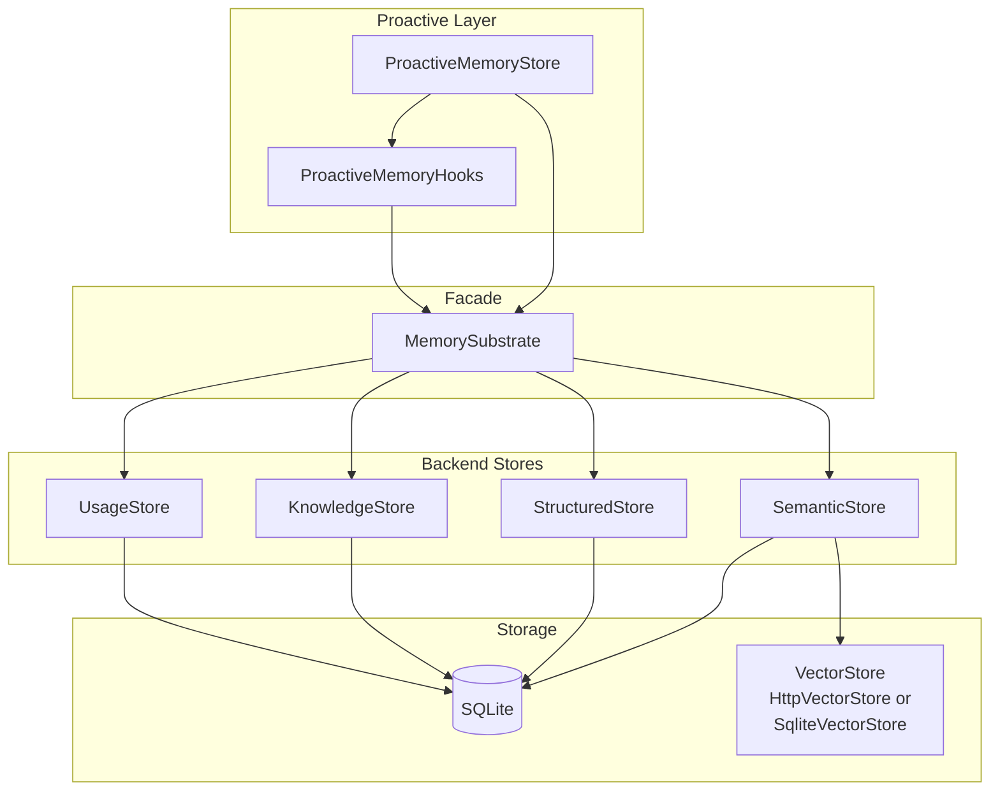
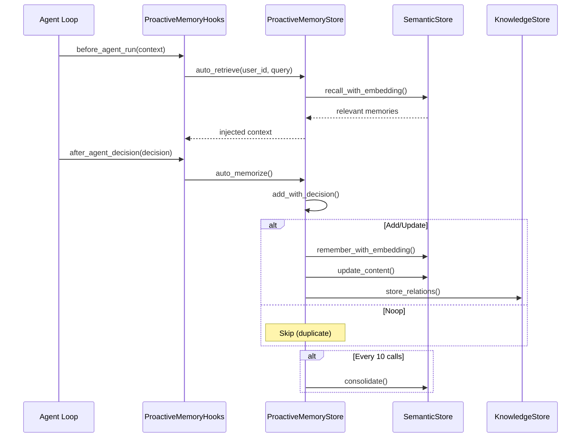

# Memory Management

# Memory Management Module (`librefang-memory`)

The `librefang-memory` crate provides the memory substrate for the LibreFang Agent Operating System. It exposes a unified API over three storage backends—structured, semantic, and knowledge graph—all backed by SQLite with optional external vector database support.

## Architecture Overview

The module is organized in three conceptual layers:

| Layer | Purpose | Backing Store |
|-------|---------|---------------|
| **Proactive Memory** | mem0-style API for agents: search, add, get, list | `ProactiveMemoryStore` |
| **Memory Substrate** | Unified facade over all storage backends | `MemorySubstrate` |
| **Backend Stores** | Individual stores for structured, semantic, and graph data | SQLite + optional vector DB |



## Multi-Level Memory

The system manages memories at three TTL tiers:

- **USER** (`user_memory`): Permanent user knowledge. Never decays or is auto-deleted. Stores preferences, important facts, and relationship information.
- **SESSION** (`session_memory`): Session-scoped context. Decays after `session_ttl_days` of no access. Stores ephemeral interaction context.
- **AGENT** (`agent_memory`): Agent-level knowledge. Decays after `agent_ttl_days` of no access. Stores learned agent behaviors and working context.

Every memory carries a `confidence` score (0.0–1.0) that decays over time and is boosted by repeated access.

## Key Components

### MemorySubstrate (`substrate.rs`)

The central facade that orchestrates all stores. Provides:

- **KV operations**: `set`, `get`, `delete` for structured key-value data
- **Session management**: `create_session`, `get_session`, `save_session`, `search_sessions`
- **Semantic memory**: `remember`, `remember_with_embedding_async`, `recall`, `recall_with_embedding`
- **Agent registry**: `save_agent`, `load_agent`, `load_all_agents`
- **Task queue**: `task_post`, `task_claim`, `task_complete`, `task_list`
- **Canonical sessions**: Cross-channel persistent memory via `append_canonical`, `canonical_context`

### SemanticStore (`semantic.rs`)

Handles embedding-backed memory storage and retrieval. Supports two search modes:

1. **Vector search**: When an embedding driver is provided, uses cosine similarity against stored vectors
2. **LIKE fallback**: When no embedding driver is available, searches using SQL `LIKE` on text content

Key operations:
- `remember_with_embedding`: Store a memory with its embedding
- `recall_with_embedding`: Search using a query embedding
- `update_content`: In-place content update preserving ID, scope, and access statistics
- `forget_session_older_than_global`: Batch soft-delete of session memories

### StructuredStore (`structured.rs`)

Key-value store for per-agent structured data. Backed by the `kv_store` SQLite table. Supports typed JSON values and version tracking.

### KnowledgeStore (`knowledge.rs`)

Graph store for entities and relations. Backed by `entities` and `relations` SQLite tables. Supports pattern queries via `GraphPattern` with optional source, relation type, and target filters.

The store resolves entity references by both ID and name, handling the common case where MCP tools create relations referencing entities by name rather than UUID.

### Knowledge Graph Entities and Relations

The knowledge graph stores structured facts extracted from conversations:

```rust
// Entities: people, organizations, concepts
Entity {
    id: String,
    entity_type: EntityType,  // Person, Organization, Concept, Custom
    name: String,
    properties: HashMap<String, JsonValue>,
    created_at: DateTime<Utc>,
    updated_at: DateTime<Utc>,
}

// Relations: directed edges between entities
Relation {
    source: String,  // entity ID or name
    relation: RelationType,  // WorksAt, Knows, RelatedTo, etc.
    target: String,
    properties: HashMap<String, JsonValue>,
    confidence: f32,
    created_at: DateTime<Utc>,
}
```

### ProactiveMemoryStore (`proactive.rs`)

A mem0-style wrapper over `MemorySubstrate` that provides a simpler API:

```rust
// Search memories semantically
let results = store.search("preferences", user_id, 10).await?;

// Add a memory with automatic deduplication
store.add(&[json!({"role": "user", "content": "I prefer dark mode"})], user_id).await?;

// Auto-retrieve relevant memories before agent execution
let context = store.auto_retrieve(user_id, query).await?;

// Auto-memorize after agent decisions
store.auto_memorize(user_id, agent_id, decision).await?;
```

**Auto-deduplication flow**: Before adding a memory, the store searches for similar existing memories. The `MemoryExtractor` trait decides whether to `Add`, `Update`, or `Noop`:

- **Noop**: Skip if a very similar memory (>90% text similarity) already exists
- **Add**: Store as a new memory
- **Update**: Merge into an existing memory, preserving a version history chain

**Conflict detection**: When updating, the store checks whether the update is a refinement or a contradiction. Contradictory updates are flagged with `conflict_detected: true` in metadata.

### Text Chunker (`chunker.rs`)

Splits long documents into overlapping chunks suitable for embedding:

1. Split on paragraph boundaries (`\n\n`) first
2. If a paragraph exceeds `max_size`, split on sentence boundaries (`. `, `。`, `？`, `！`)
3. If a sentence still exceeds `max_size`, hard-split at character boundaries (respecting UTF-8)

Overlap is applied by prepending the last `overlap` characters of the previous chunk. The chunker properly handles Unicode (Chinese, emoji) via char-based iteration.

### Consolidation Engine (`consolidation.rs`)

Reduces storage and improves retrieval quality by merging similar memories:

1. **Decay phase**: Reduce confidence of memories not accessed in 7 days
2. **Merge phase**: Soft-delete memories with >90% text similarity to a higher-confidence memory

The merge is capped at 100 merges per consolidation run to avoid O(n²) blowup on large stores.

### Time-Based Decay (`decay.rs`)

Hard-deletes memories past their TTL:

- **SESSION** scope: Deleted if not accessed for `session_ttl_days`
- **AGENT** scope: Deleted if not accessed for `agent_ttl_days`
- **USER** scope: Never automatically deleted

Accessing a memory (via `recall_with_embedding`) resets the `accessed_at` timestamp, preventing decay.

### Vector Store Implementations

Two `VectorStore` implementations exist:

**SqliteVectorStore** (`semantic.rs`): Stores embeddings as BLOBs in the SQLite `memories` table. Suitable for single-node deployments.

**HttpVectorStore** (`http_vector_store.rs`): Delegates to a remote HTTP service (Qdrant, Weaviate, custom microservice). Expected API:

| Method | Path | Purpose |
|--------|------|---------|
| POST | `/insert` | Store embedding |
| POST | `/search` | Query by embedding |
| DELETE | `/delete` | Remove embedding |
| POST | `/get_embeddings` | Batch retrieval |

### Session Management (`session.rs`)

Manages conversation history with support for:

- **Per-session storage**: Messages stored as JSON blobs in SQLite
- **Full-text search**: FTS5 virtual table (`sessions_fts`) for semantic session lookup
- **Canonical sessions**: Cross-channel persistent memory that survives session boundaries
- **Compaction**: Summarizes old messages to stay within context window limits
- **TTL enforcement**: `cleanup_expired_sessions` removes sessions past `session_ttl_days`

### Usage Tracking (`usage.rs`)

Records token usage and cost per agent per model. Used for metering and billing. Tables: `usage_events` with columns for `input_tokens`, `output_tokens`, `cost_usd`, `latency_ms`.

### Schema Migrations (`migration.rs`)

18 migrations bring the database from initial schema to current version:

- **v1**: Core tables (agents, sessions, events, kv_store, task_queue, memories, entities, relations)
- **v3**: Add `embedding` column to memories for vector search
- **v5**: Canonical sessions for cross-channel memory
- **v9**: Performance indexes for proactive memory queries
- **v10**: Add `agent_id` to entities and relations for per-agent cleanup
- **v12**: FTS5 virtual table for full-text session search
- **v13**: Prompt versioning and A/B testing tables
- **v15**: Multimodal memory (image URL, image embedding, modality)
- **v16**: `peer_id` for per-user isolation
- **v17**: Persistent approval audit log
- **v18**: TOTP lockout tracking

## Proactive Memory Lifecycle

The proactive memory hooks integrate with the agent loop:



**Rate-limited maintenance**: Decay and session cleanup run at most once per hour, even when called on every request.

## Configuration

Key configuration options in `ProactiveMemoryConfig`:

| Field | Default | Purpose |
|-------|---------|---------|
| `max_memories_per_agent` | 0 (unlimited) | Cap on memories per agent |
| `session_ttl_hours` | 0 (disabled) | Session memory TTL |
| `confidence_decay_rate` | 0.0 (disabled) | Exponential decay rate for unaccessed memories |

## Connecting to the Rest of the Codebase

**Agent Loop Integration** (`librefang-runtime/src/agent_loop.rs`):
- `remember_interaction_best_effort`: Stores user/assistant message pairs
- `save_session_async`: Persists session after each turn
- `setup_recalled_memories`: Injects `auto_retrieve` results into context

**Context Engine** (`librefang-runtime/src/context_engine.rs`):
- `ingest`: Calls `recall_with_embedding_async` to pull relevant memories
- `remember`: Direct `remember` call for specific facts

**Proactive Memory Initialization** (`librefang-runtime/src/proactive_memory.rs`):
- `init_proactive_memory_full`: Creates store with custom extractor and embedding driver

**HTTP Routes** (`src/routes/memory.rs`):
- `memory_delete`, `memory_update`: Use `find_agent_id_for_memory` → `get_by_id` to locate and modify memories

**Knowledge Graph via MCP** (`src/routes/memory.rs`):
- `knowledge_add_relation`: Adds entities and relations via `KnowledgeStore`
- `knowledge_query`: Pattern-based graph queries