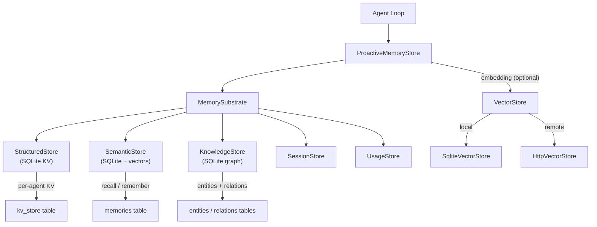

# Memory & Sessions

# Memory & Sessions

The unified memory substrate for LibreFang agents. It provides three persistent storage backends—structured key-value, semantic search, and a knowledge graph—all accessed through a single `MemorySubstrate` entry point, plus a mem0-style proactive memory layer that automatically extracts, deduplicates, and retrieves memories during agent conversations.

## Architecture



## Storage Backends

### Structured Store (`structured.rs`)

Per-agent key-value storage backed by SQLite's `kv_store` table. Used for agent state, configuration, and memory metadata entries (keyed as `memory:<id>`).

Key operations: `get`, `set`, `delete`, `list_kv`, `list_keys`, `remove_agent`.

### Semantic Store (`semantic.rs`)

Stores and searches free-text memories in the `memories` table. Each memory has a scope (`user_memory`, `session_memory`, `agent_memory`), confidence score, access tracking, and optional embedding vector.

Two search modes:
- **Keyword fallback**: `LIKE` matching when no embedding driver is configured
- **Vector search**: cosine similarity via `VectorStore` trait when embeddings are available

Core operations: `remember`, `recall`, `recall_with_embedding`, `update_content`, `forget`, `get_by_id`, `lowest_confidence`, `count`.

### Knowledge Store (`knowledge.rs`)

A lightweight knowledge graph stored in `entities` and `relations` tables. Supports:
- Entity upsert with type (`Person`, `Organization`, `Concept`, etc.)
- Typed relations between entities (`WorksAt`, `RelatedTo`, etc.)
- Pattern-based graph queries (`query_graph`) that match on source, relation type, and target

Entities can be referenced by either ID or name in relations (the JOIN handles both).

## Proactive Memory System (`proactive.rs`)

The `ProactiveMemoryStore` wraps the three backends into a mem0-style API. It implements both `ProactiveMemory` (unified search/add/get/list) and `ProactiveMemoryHooks` (auto-memorize, auto-retrieve) traits from `librefang-types`.

### Memory Levels

| Level | Scope String | Persistence | Decay |
|-------|-------------|-------------|-------|
| User | `user_memory` | Permanent | Never |
| Session | `session_memory` | TTL-based | After `session_ttl_hours` |
| Agent | `agent_memory` | Long-lived | After `agent_ttl_days` |

### Decision Flow: `add()`

When memories are added (either explicitly or via `auto_memorize`), the store runs a deduplication flow:

1. **Generate embedding** for the new content (if embedding driver is configured)
2. **Search** for the top 5 similar existing memories for this agent
3. **Decide action** via `MemoryExtractor::decide_action()`:
   - `NOOP` — skip, duplicate exists
   - `ADD` — store as new memory
   - `UPDATE` — replace existing memory in-place, preserving ID and access stats
4. **Conflict detection** — if an UPDATE changes semantic meaning (e.g., "I like X" → "I hate X"), a `MemoryConflict` is flagged and version history is preserved

### Auto-Retrieve: `auto_retrieve()`

Called before each agent turn to inject relevant context:

1. Runs periodic maintenance (confidence decay, session cleanup) — rate-limited to once per hour
2. Searches for memories relevant to the input query
3. Returns formatted context string for injection into the agent's system prompt

### Maintenance Tasks

- **Confidence decay**: `decay_confidence()` applies exponential decay (`e^(-rate × days)`) plus an access-count boost, rate-limited to once per hour
- **Session TTL cleanup**: `cleanup_expired()` soft-deletes session-level memories older than the configured TTL
- **Per-agent cap enforcement**: `evict_if_over_cap()` removes the lowest-confidence memories when an agent exceeds `max_memories_per_agent`
- **Consolidation**: After every 10th `auto_memorize` call per agent, `consolidate()` merges duplicate memories (>90% text similarity)

### Export / Import

`export_all()` serializes all memories for an agent as `Vec<MemoryExportItem>`. `import_memories()` restores them with deduplication (skips memories >90% similar to existing ones).

## Session Management (`session.rs`)

Each conversation channel gets its own `Session` stored in the `sessions` table. Key features:

- **Per-session storage** with `peer_id` isolation (same agent, different users)
- **Canonical sessions** (`canonical_sessions` table): cross-channel persistent memory that compacts older messages into summaries
- **LLM summarization**: `store_llm_summary()` compacts session history when token count exceeds the context window
- **FTS5 full-text search** across session content (`sessions_fts` virtual table)
- **JSONL mirror**: `write_jsonl_mirror()` appends session events to a JSONL file for external observability

### Compaction Flow

When `needs_compaction()` returns true (message count exceeds threshold), the compactor summarizes older messages into a compacted summary and advances the `compaction_cursor`. This keeps the working window small while preserving long-term context.

## Knowledge Graph Integration

`store_relations()` persists extracted `RelationTriple` objects into the knowledge graph:

1. Upsert source and target entities (with ID normalization)
2. Deduplicate: skip if an identical `(source, relation, target)` already exists
3. Add the relation edge

`query_graph()` performs pattern matching with `GraphPattern { source, relation, target, max_depth }`, joining entities by both ID and name.

## Vector Stores

The `VectorStore` trait abstracts vector operations (`insert`, `search`, `delete`, `get_embeddings`):

- **`SqliteVectorStore`** (`semantic.rs`): Stores embeddings as BLOBs in the `memories` table; uses cosine similarity computed in Rust
- **`HttpVectorStore`** (`http_vector_store.rs`): Delegates to a remote HTTP service (Qdrant, Weaviate, etc.) via a JSON API (`/insert`, `/search`, `/delete`, `/get_embeddings`)

The embedding driver is injected via `ProactiveMemoryStore::with_embedding()`. When absent, all search falls back to keyword matching.

## Text Chunking (`chunker.rs`)

Long documents are split into overlapping chunks before embedding:

1. Split on paragraph boundaries (`\n\n`)
2. If a paragraph exceeds `max_size`, split on sentence boundaries (`. `, `。`, `？`, `！`)
3. If a sentence still exceeds `max_size`, hard-split at the character limit
4. Apply `overlap` characters from the end of each chunk to the start of the next

All operations use char-based indexing for correct Unicode handling.

## Consolidation (`consolidation.rs`)

`ConsolidationEngine` runs periodic maintenance:

- **Confidence decay**: Reduces confidence of memories not accessed in 7+ days by a configurable decay factor (floor at 0.1)
- **Merge**: Finds pairs of memories with >90% Jaccard similarity and merges them (keeps the higher-confidence one, soft-deletes the other), capped at 100 merges per run to avoid O(n²) blowup

## Time-Based Decay (`decay.rs`)

`run_decay()` hard-deletes stale memories based on scope TTL:

| Scope | Default TTL | Behavior |
|-------|-----------|----------|
| `user_memory` | Never | Not touched |
| `session_memory` | `session_ttl_days` (default 7) | Hard-deleted after TTL |
| `agent_memory` | `agent_ttl_days` (default 30) | Hard-deleted after TTL |

Accessing a memory (via search/recall) resets `accessed_at`, which resets the decay timer.

## Usage Tracking (`usage.rs`)

`UsageStore` records per-call LLM usage in `usage_events` (model, input/output tokens, cost, latency, provider). Supports:

- Budget enforcement: `check_quota_and_record()` and `check_global_budget_and_record()` reject calls that would exceed hourly/daily/global caps
- Per-provider budgets via `check_all_with_provider_and_record()`
- Aggregated queries: `query_hourly()`, `query_daily()`, `query_by_model()`

## Prompt Versioning (`prompt.rs`)

`PromptStore` manages agent prompt versions with A/B testing support:

- `prompt_versions` table: versioned system prompts with content hashes
- `prompt_experiments` / `experiment_variants`: traffic-split experiment definitions
- `experiment_metrics`: aggregated success/latency/cost metrics per variant

## Schema Migrations (`migration.rs`)

SQLite schema is at version 19. Migrations run automatically via `run_migrations()`, using `PRAGMA user_version` for tracking. The migration chain creates:

- Core tables: `agents`, `sessions`, `events`, `kv_store`, `task_queue`, `memories`, `entities`, `relations`
- Indexes for performance (v9: composite indexes for proactive memory queries)
- FTS5 virtual table for session search (v12)
- Prompt versioning tables (v13)
- Per-agent isolation via `agent_id` on entities/relations (v10)
- `peer_id` columns for per-user memory isolation (v16)
- Audit, approval, TOTP lockout tables (v8, v17, v18)
- Provider column on usage events (v19)

All migrations are idempotent — safe to run repeatedly.

## Integration Points

| Caller | What it uses |
|--------|-------------|
| **Agent Loop** (`librefang-runtime`) | `save_session_async`, `remember`, `recall_with_embedding_async` via `MemorySubstrate` |
| **Context Engine** | `remember`, `recall` for injecting memories into agent context |
| **Compactor** | `Session` type for compaction decisions |
| **Proactive Memory Init** | `ProactiveMemoryStore::with_embedding()` to wire up embedding driver |
| **API Routes** | `ProactiveMemoryStore` for memory CRUD, `find_agent_id_for_memory` for auth checks |
| **Skills/Hands** | `save_session` to persist conversation turns |

## Quick Start

```rust,ignore
use librefang_memory::{MemorySubstrate, ProactiveMemoryStore, ProactiveMemory, ProactiveMemoryHooks};
use std::sync::Arc;

// Create in-memory substrate (use ::open(path) for disk-backed)
let substrate = Arc::new(MemorySubstrate::open_in_memory(0.1)?);

// Create proactive memory store with embedding driver
let store = ProactiveMemoryStore::with_default_config(substrate.clone());
let store = store.with_embedding(my_embedding_driver);
let store = Arc::new(store);

// Auto-memorize from conversation
let messages = vec![serde_json::json!({
    "role": "user",
    "content": "I prefer dark mode and use Python daily"
})];
store.auto_memorize(&messages, "agent-id", "user-123").await?;

// Auto-retrieve relevant context before agent turn
let context = store.auto_retrieve("agent-id", "What are my preferences?").await?;

// Search memories directly
let results = store.search("dark mode", "agent-id", 10).await?;
```