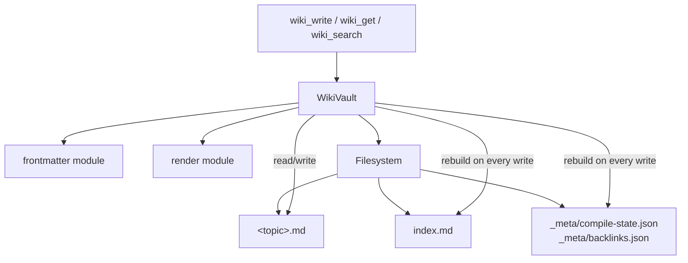

# Memory & Storage — librefang-memory-wiki-src

# librefang-memory-wiki

A durable markdown knowledge vault for the LibreFang Agent OS. Where the memory substrate (`librefang-memory`) excels at nearest-neighbour vector search, this vault provides a navigable, human-auditable knowledge base that can also be opened directly in Obsidian or any Markdown editor.

Every page carries YAML frontmatter tracking **provenance** — which agent, session, channel, and turn produced each claim — so any reader can trace a fact back to its origin.

The vault is **off by default**. Operators opt in via configuration.

## Architecture



## Configuration

```toml
[memory_wiki]
enabled = true
mode = "isolated"            # isolated | bridge | unsafe_local
vault_path = "~/.librefang/wiki/main"
render_mode = "native"       # native | obsidian
ingest_filter = "tagged"     # tagged | all
```

| Field | v1 behaviour |
|---|---|
| `enabled` | Must be `true` or the vault returns `WikiError::Disabled` on construction. |
| `mode` | Only `"isolated"` is wired. `"bridge"` and `"unsafe_local"` return `WikiError::ModeNotImplemented`. |
| `vault_path` | Optional. When unset, resolves to `<home_dir>/wiki/main`, where `home_dir` is the caller-supplied kernel home (not the env-derived `LIBREFANG_HOME`). |
| `render_mode` | Controls cross-reference syntax: `"native"` emits `[topic](topic.md)`, `"obsidian"` emits `[[topic]]`. |
| `ingest_filter` | Has no behavioural effect in v1 (all writes are accepted via explicit `wiki_write` calls). A non-default value logs a warning. |

## On-Disk Layout

```
<vault_path>/
├── <topic>.md                  # one page per topic
├── index.md                    # auto-generated alphabetical index
└── _meta/
    ├── compile-state.json      # mtime + sha256 per page (last compiler run)
    └── backlinks.json          # { target → [source, ...] }
```

### Page Format

Each `<topic>.md` file is YAML frontmatter followed by Markdown body:

```markdown
---
topic: project-conventions
created: 2026-05-06T10:30:00Z
updated: 2026-05-06T11:00:00Z
content_sha256: 6a4f...
provenance:
  - agent: agent_xyz
    session: sess_abc
    channel: cli
    turn: 4
    at: 2026-05-06T10:30:00Z
---

body markdown ...
```

`content_sha256` is the SHA-256 of the body after stripping one trailing newline. The vault uses this alongside filesystem mtime to detect external hand-edits between compiler runs.

## Module Structure

### `error` — Error Types

`WikiError` is the single error enum, returned as `WikiResult<T>`:

| Variant | Meaning |
|---|---|
| `Disabled` | `enabled` is not `true` in config. |
| `ModeNotImplemented(mode)` | `bridge` or `unsafe_local` requested; only `isolated` works in v1. |
| `InvalidTopic { topic, reason }` | Topic fails validation (empty, too long, bad characters, reserved name). |
| `BodyTooLarge { topic, size, cap }` | Page body exceeds the 1 MiB soft cap. |
| `NotFound(topic)` | No `.md` file exists for the topic. |
| `HandEditConflict { topic }` | Page was modified externally since the last compiler run; use `force = true` to preserve the edit. |
| `Frontmatter { topic, source }` | YAML parse error in the frontmatter block. |
| `Io { path, source }` | Filesystem I/O error. |

`WikiError::io(path, source)` is a helper constructor for wrapping `std::io::Error` with the affected path.

### `frontmatter` — YAML Frontmatter Parsing and Rendering

Handles the split/parse/render cycle for page headers.

**Types:**

- **`ProvenanceEntry`** — Tracks who wrote a claim. Fields: `agent` (required), `session`, `channel`, `turn` (all optional), `at` (timestamp, required).
- **`Frontmatter`** — Full header: `topic`, `created`, `updated`, `content_sha256`, `provenance` (list).

**Key functions:**

- `Frontmatter::default_for(topic)` — Synthesises a header with `created = updated = now`, empty provenance, empty hash.
- `Frontmatter::hash_body(body)` — SHA-256 of the body with one trailing newline stripped. Normalises away editor trailing-newline differences.
- `split(raw) -> (Option<&str>, &str)` — Separates a raw page into YAML block and body. Returns `(None, raw)` for pages without frontmatter, so hand-authored Obsidian pages still load.
- `parse(yaml, topic) -> Result<Frontmatter>` — Deserialises the YAML block.
- `render(frontmatter, body) -> Result<String>` — Serialises back to the on-disk `---\n...\n---\n\nbody\n` format.

The split/render cycle roundtrips: `split(render(fm, body))` yields the same frontmatter and body.

### `render` — Link Rendering

`RenderMode` controls how cross-references between pages are written:

| Mode | Output | Use case |
|---|---|---|
| `Native` (default) | `[topic](topic.md)` | Plain Markdown renderers |
| `Obsidian` | `[[topic]]` | Obsidian / Logseq |

**Authoring contract:** Callers always pass `[[topic]]` placeholders in body text. The vault rewrites them at flush time via `RenderMode::rewrite_links(body)`. This means the same body is portable across render modes without re-authoring.

**`RenderMode::extract_links(body) -> Vec<String>`** — Extracts all cross-references from a body in link order. Recognises both `[[topic]]` (Obsidian/authoring form) and `[topic](topic.md)` (native form where visible text equals the target stem). This ensures the backlinks index is invariant under render-mode flips.

### `vault` — Vault Store

`WikiVault` is the main entry point. It manages the on-disk file collection, compile state, and backlinks.

#### Construction

```rust
// From config (validates enabled, mode, resolves vault_path):
WikiVault::new(&config, home_dir)?;

// Direct (bypasses enabled check, used by tests and kernel after validation):
WikiVault::with_root(root, render_mode, ingest_filter)?;
```

Both constructors create the vault directory and `_meta/` subdirectory if they don't exist.

#### Public API

**`write(topic, body, provenance, force) -> WikiResult<WikiWriteOutcome>`**

Writes a page. Steps:
1. Validates the topic name.
2. Checks body size against the 1 MiB cap.
3. Acquires the write lock (Mutex serialises concurrent writes to the same vault).
4. Loads compile state, reads the existing page (if any).
5. **Hand-edit detection**: Compares on-disk mtime and body SHA-256 against the last compiler run. If either drifted and `force` is false, returns `HandEditConflict`. If `force` is true, preserves the external body and only appends provenance.
6. Rewrites `[[link]]` placeholders to the active render mode (unless preserving an external edit).
7. Appends the new `ProvenanceEntry` to the existing frontmatter (provenance is monotonic).
8. Writes the page atomically (tmp file + rename).
9. Updates compile state and rebuilds `index.md` and `backlinks.json`.

Returns `WikiWriteOutcome` with the topic, file path, content hash, and whether an external edit was merged.

**`get(topic) -> WikiResult<WikiPage>`**

Reads a single page. Returns `NotFound` if no file exists. On read, normalises CRLF to LF (handles Windows/git autocrlf) before splitting frontmatter. If the YAML block is malformed, falls back to a synthetic `Frontmatter::default_for(topic)` and logs a warning — the body remains accessible rather than bricking subsequent reads.

**`search(query, limit) -> WikiResult<Vec<SearchHit>>`**

Case-insensitive substring search across all page bodies and topics. Scoring:
- Topic name match: +10.0
- Body matches: `ln(1 + count)` — sub-linear weighting so long pages don't bury short topic-only hits.

Results are sorted by score descending, then topic alphabetically. Each hit includes a 120-character snippet around the first match.

**`backlinks() -> WikiResult<Vec<BacklinkEntry>>`**

Returns all `source → target` backlink pairs from `_meta/backlinks.json`. Deterministic order (target ascending, source ascending).

#### Topic Validation

Topics must satisfy:
- Non-empty, max 100 characters
- Match `[a-zA-Z0-9_-]+`
- Not equal to `index` (reserved for the auto-generated index)
- Not start with `_` (reserved for vault metadata)

#### Hand-Edit Safety

This is a core design invariant (issue #3329 acceptance criterion 4):

1. Every successful `write` records the page's mtime (as nanoseconds since epoch) and body SHA-256 in `_meta/compile-state.json`.
2. On the next `write`, the vault re-reads the file and compares the actual mtime and hash against the recorded values.
3. If either differs, the file was edited externally (e.g., in Obsidian). Without `force`, the write is rejected with `HandEditConflict`.
4. With `force = true`, the external body is preserved verbatim. Only provenance is appended and links are rewritten. `WikiWriteOutcome::merged_with_external_edit` signals this happened.

The dual mtime + hash check survives filesystems with coarse (1-second) mtime precision, because the hash diverges immediately on any content change.

#### Atomic Writes

All file writes use the tmp-rename pattern: data is written to `<path>.tmp.write`, then `fs::rename`d into place. This prevents readers from seeing partially-written files.

#### Concurrency

A `Mutex<()>` serialises all writes within a single vault instance. Multiple threads can call `write` concurrently; they will queue. Provenance entries accumulate correctly because each write loads the current frontmatter, appends, and flushes.

#### Compile State Rebuild

Every successful `write` triggers `rebuild_index_and_backlinks`, which:
1. Iterates all `<topic>.md` files (skipping `index.md`).
2. Rebuilds `index.md` — alphabetical list of topics with their `updated` timestamps.
3. Rebuilds `_meta/backlinks.json` — maps each link target to its source pages.

This is O(n) in the number of pages, acceptable for the expected vault sizes in v1.

## v1 Scope and Limitations

**In scope:**
- `isolated` mode only
- Three builtin tools: `wiki_get`, `wiki_search`, `wiki_write`
- `native` and `obsidian` render modes
- Hand-edit safety with forced merge
- Provenance tracking

**Out of scope (tracked as follow-ups to #3329):**
- `bridge` mode — reading shared artifacts from the memory substrate
- `unsafe_local` mode — same-machine escape hatch for existing Obsidian vaults
- Memory-event subscription — v1 ingests only via explicit `wiki_write` calls
- LLM-assisted topic extraction — v1 requires explicit topic tags
- Vector/FTS5 ranking in search — v1 uses naive substring matching