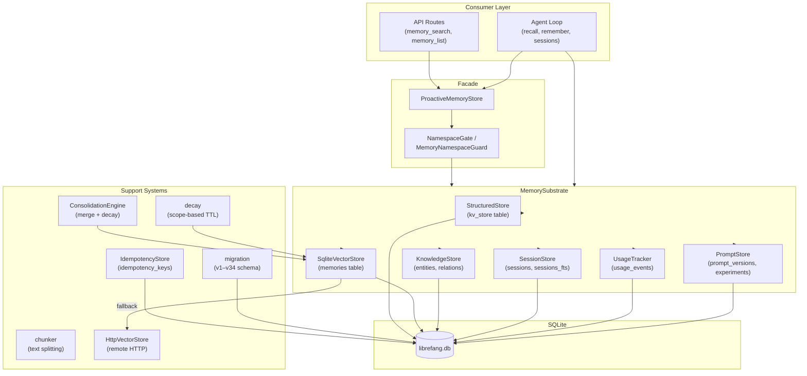

# Memory & Storage

# Memory & Storage Module

## Overview

`librefang-memory` is the persistence substrate for the LibreFang Agent Operating System. It provides agents with structured key-value storage, semantic text search with embeddings, a knowledge graph, session history, usage metering, and proactive mem0-style memory — all backed by SQLite with optional remote vector store delegation.

The crate is organized around a central `MemorySubstrate` that owns a shared `Arc<Mutex<Connection>>` and dispatches to specialized sub-stores. The kernel and API layer never access stores directly; they go through the substrate or through the `ProactiveMemoryStore` wrapper.

## Architecture



## Core Abstractions

### MemorySubstrate

The central struct that owns the SQLite connection and provides high-level operations:

- **Session management**: `save_session`, `load_session`, `search_sessions`, `create_session`, `cleanup_excess_sessions`
- **Semantic memory**: `remember`, `remember_with_embedding`, `recall`, `recall_with_embedding`, `forget`
- **Structured KV**: `set`, `get`, `list_kv`, `delete_kv`
- **Knowledge graph**: `add_entity`, `add_relation`, `query_graph`
- **Task queue**: `task_post`, `task_claim`, `task_complete`, `task_reset_stuck`
- **Agent lifecycle**: `register_agent`, `remove_agent`, `import`

Opened via `MemorySubstrate::open(path)` or `MemorySubstrate::open_in_memory()` for tests. An `open_with_chunking` variant enables automatic text chunking for long documents during `remember_with_embedding_async`.

### ProactiveMemoryStore

A higher-level wrapper providing the mem0-style API used by the HTTP routes:

- **`search_all_with_guard`** — Recalls memories with namespace ACL enforcement
- **`add` / `add_with_embedding`** — Stores new memories, optionally chunked
- **`list_all_with_guard`** — Lists memories with PII redaction
- **`stats`** — Returns `MemoryStats` for dashboards
- **`export`** — Exports all memories for a user/agent

### Namespace ACL

`MemoryNamespaceGuard` and `NamespaceGate` enforce per-user access control over memory namespaces. Every public read path (`search_all_with_guard`, `list_all_with_guard`, `get_with_guard`) checks read permissions and redacts PII fields before returning data. The guard is constructed from the user's policy and checks `can_read` / `namespace_glob_matches` before delegating to the underlying store.

## Store Components

### Structured Store (`structured.rs`)

Simple per-agent key-value storage using the `kv_store` table. Values are opaque blobs (`Vec<u8>`). Operations: `set`, `get`, `delete`, `list_kv`, `delete_by_prefix`, `list_by_prefix`.

### Semantic Store (`semantic.rs` / `SqliteVectorStore`)

Stores text memories with optional embedding vectors in the `memories` table.

- **`remember`** — Inserts a memory with LIKE-based search only
- **`remember_with_embedding`** — Inserts with a precomputed embedding blob (LE f32 array)
- **`recall_with_embedding`** — Returns the top-K memories ranked by cosine similarity against a query embedding, with an optional confidence floor
- **`recall`** — Falls back to `LIKE` matching when no embedding is available
- **`forget`** — Soft-deletes by ID

Embeddings are stored as `BLOB` (little-endian `f32` sequences). `embedding_from_bytes` / `embedding_to_bytes` handle serialization.

### Knowledge Graph (`knowledge.rs`)

Entities and relations stored in `entities` and `relations` tables with `agent_id` isolation.

- **`add_entity`** — Upserts an entity (generates UUID if no ID given)
- **`add_relation`** — Creates a typed relation between two entities
- **`query_graph`** — Pattern-matching queries using `GraphPattern { source, relation, target, max_depth }`. The SQL JOIN resolves entities by both ID and name, so MCP tools that reference entities by name work correctly
- **`delete_by_agent`** — Transactional cleanup of all entities and relations for a given agent
- **`has_relation`** — Checks existence of a specific relation type between entities

### Session Store (`session.rs` / `session_store.rs`)

Manages conversation sessions with full-text search support.

- **`create_session`** — Creates a new session for an agent
- **`save_session`** — Persists messages (as MessagePack blob), maintains the denormalized `message_count` column
- **`load_session`** — Deserializes the message blob back into `Vec<ChatMessage>`
- **`search_sessions`** — FTS5-powered full-text search across session content with pagination
- **`canonical_context`** — Cross-channel persistent memory with compaction cursor
- **`cleanup_excess_sessions`** / **`cleanup_orphan_sessions`** — Maintenance operations

FTS rows are kept in sync: inserts populate `sessions_fts`, deletes remove matching rows.

### Usage Tracking (`usage.rs`)

Records per-agent LLM usage events (tokens, cost, model) and provides aggregation queries:

- **`record`** — Inserts a usage event
- **`query_daily_breakdown`** — Daily cost/token aggregation
- **`query_hourly`** — Hourly aggregation for dashboards
- **`list_agent_events_recent`** — Recent events for a specific agent
- **`check_quota_and_record`** — Enforces per-agent spend limits before recording
- **`check_global_budget_and_record`** — Enforces system-wide budget caps
- **`channels_msgs_24h_bulk`** — Bulk channel message counting

### Prompt Store (`prompt.rs`)

Version-controlled prompt management with A/B testing:

- **Prompt versions** — Stores history with content hashes, supports activation/rollback
- **Experiments** — A/B test definitions with traffic splits and success criteria
- **Variants** — Maps experiment arms to prompt versions
- **Metrics** — Tracks success/failure counts, latency, and cost per variant

### Idempotency Store (`idempotency.rs`)

SQLite-backed cache for HTTP `Idempotency-Key` headers (24-hour TTL). The `IdempotencyStore` trait allows test doubles; production uses `SqliteIdempotencyStore` sharing the same connection pool.

- **`lookup`** — Returns a cached `StoredRecord` if the key exists and hasn't expired; deletes expired rows inline
- **`put`** — First-writer-wins via `INSERT OR IGNORE`
- **`prune_expired`** — Bulk cleanup of stale rows

## Memory Lifecycle

### 1. Ingestion

```
User message → Agent loop → remember_with_embedding_async()
                                    │
                                    ├─ Chunking enabled?
                                    │   ├─ Yes → chunk_text() → per-chunk remember
                                    │   └─ No  → single remember
                                    │
                                    └─ Embedding stored as BLOB in memories table
```

Text chunking (`chunker.rs`) splits long documents into overlapping segments that respect paragraph and sentence boundaries. Sentence splitting recognizes ASCII periods, CJK punctuation (`。`, `？`, `！`), and falls back to hard character-limit splits for degenerate input.

### 2. Retrieval

```
Query → recall_with_embedding(query_embedding, limit, confidence_floor)
              │
              ├─ Cosine similarity search over embeddings
              ├─ LIKE fallback when no embedding
              └─ Results returned with scores, filtered by confidence
```

When an external vector store is configured via `set_vector_store`, the substrate delegates search to it (either `HttpVectorStore` for remote services or `SqliteVectorStore` for local). The `VectorStore` trait defines the common interface: `insert`, `search`, `delete`, `get_embeddings`.

### 3. Consolidation (`consolidation.rs`)

`ConsolidationEngine::consolidate()` runs a two-phase maintenance cycle:

**Phase 1 — Decay**: Reduces confidence of memories not accessed in 7 days by `(1 - decay_rate)`, floored at 0.1.

**Phase 2 — Merge**: Compares memories within each `agent_id` using Jaccard text similarity. When similarity exceeds 90%:

1. The higher-confidence memory is the **keeper**
2. The loser is soft-deleted (`deleted = 1`)
3. Keeper absorbs the loser's state:
   - `access_count` is summed
   - `metadata` is unioned (keeper wins key conflicts)
   - `embedding` is a **running confidence-weighted average** across all absorbed losers
   - `confidence` takes the max

Key design decisions:
- **Per-agent isolation**: Memories from different agents are never compared, preventing cross-tenant data leaks
- **Single outer transaction**: All merges in a run commit together (one fsync instead of up to 100)
- **Running weighted average**: When a keeper absorbs multiple losers, the accumulated weight grows with each merge, preventing later losers from disproportionately shifting the embedding
- **Capped at 100 merges/run**: Prevents O(n²) blowup on large stores

### 4. Scope-Based Decay (`decay.rs`)

Soft-deletes stale memories based on scope-specific TTLs:

| Scope | Behavior |
|-------|----------|
| `user_memory` | **Never** decays — permanent user knowledge |
| `session_memory` | Soft-deletes after `session_ttl_days` of no access |
| `agent_memory` | Soft-deletes after `agent_ttl_days` of no access |

Decay stamps `deleted = 1` and sets `deleted_at` to the current Unix timestamp. Accessing a memory (via `recall_with_embedding`) updates `accessed_at`, resetting the timer.

### 5. Pruning

`prune_soft_deleted_memories(conn, older_than_days)` hard-deletes rows that have been soft-deleted for longer than the threshold, reclaiming embedding BLOB storage. Rows with `deleted_at = NULL` are skipped.

## Schema Management (`migration.rs`)

The migration system manages 34 schema versions via SQLite's `user_version` pragma. Each migration runs inside a transaction that bumps the version on success.

Key migrations:
- **v1**: Core tables (agents, sessions, events, kv_store, task_queue, memories, entities, relations, migrations)
- **v3**: Embedding BLOB column on memories
- **v4**: Usage events for cost tracking
- **v9**: Composite indexes for proactive memory performance
- **v10**: `agent_id` on entities/relations for multi-tenant isolation
- **v12**: FTS5 virtual table for session search
- **v13**: Prompt versioning and A/B testing
- **v25**: Idempotency keys
- **v32**: Denormalized `message_count` on sessions
- **v34**: Idempotency-Key cache table

Guards against downgrade: if `user_version` exceeds the binary's supported version, the migration aborts with an error rather than silently corrupting the schema.

An audit-trail consistency check runs after all migrations, backfilling any missing rows in the `migrations` table where DDL was applied without recording the audit row.

## Vector Store Abstraction

The `VectorStore` trait (from `librefang_types::memory`) defines four operations:

```rust
async fn insert(&self, id: &str, embedding: &[f32], payload: &str, metadata: HashMap<String, Value>) -> Result<()>;
async fn search(&self, query_embedding: &[f32], limit: usize, filter: Option<MemoryFilter>) -> Result<Vec<VectorSearchResult>>;
async fn delete(&self, id: &str) -> Result<()>;
async fn get_embeddings(&self, ids: &[&str]) -> Result<HashMap<String, Vec<f32>>>;
```

Two implementations:

- **`SqliteVectorStore`** — Default. Stores embeddings inline in the `memories` table, performs brute-force cosine similarity in Rust. Suitable for small-to-medium deployments.
- **`HttpVectorStore`** — Delegates to a remote HTTP service (Qdrant, Weaviate, custom). Expects a REST contract with `/insert`, `/search`, `/delete`, `/get_embeddings` endpoints.

Switch between them via `MemorySubstrate::set_vector_store()`.

## Memory Provider Plugin System (`provider.rs`)

The `MemoryProvider` trait allows plugging in alternative memory implementations:

```rust
pub trait MemoryProvider: Send + Sync {
    fn remember(&self, ...) -> Result<MemoryAddResult>;
    fn recall(&self, ...) -> Result<Vec<MemoryFragment>>;
    fn forget(&self, ...) -> Result<bool>;
}
```

`MemoryManager` wraps a `Box<dyn MemoryProvider>` and provides the concrete dispatch. `NullMemoryProvider` is a no-op implementation for agents with memory disabled.

## Thread Safety

All stores share a single `Arc<Mutex<Connection>>`. The mutex serializes all database access. Long-running operations (consolidation, FTS rebuilds) hold the lock for the duration of their transaction. The async wrappers (`save_session_async`, `recall_with_embedding_async`, `remember_with_embedding_async`) spawn blocking tasks via `tokio::task::spawn_blocking` to avoid parking the Tokio runtime.

## Integration Points

- **`librefang-runtime`**: The agent loop calls `recall_with_embedding_async` to inject relevant memories into the LLM context, `remember` to persist extracted facts, and session methods to manage conversation state. `setup_recalled_memories` applies namespace ACL checks and PII redaction before handing memories to the context engine.
- **`librefang-api`**: HTTP routes (`memory_search`, `memory_list`, `memory_get_user`) delegate to `ProactiveMemoryStore` with namespace guards. The idempotency store is wired into the API middleware for state-creating POSTs.
- **`librefang-types`**: Provides shared types (`MemoryFilter`, `VectorSearchResult`, `ConsolidationReport`, `GraphPattern`, error types, config structs) that this crate consumes but does not define.