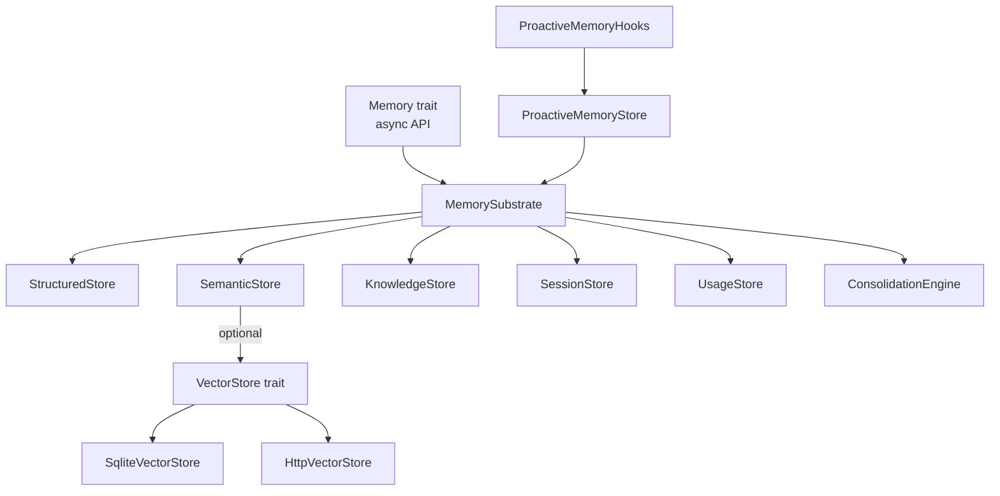

# Memory & Storage

# Memory & Storage Module

## Overview

`librefang-memory` is the persistence substrate for the LibreFang Agent Operating System. It provides a unified memory API over SQLite-backed stores, offering agents structured key-value storage, semantic recall with vector search, knowledge graph operations, session persistence, and a shared task queue — all behind a single `MemorySubstrate` entry point.

The module is designed around a single shared SQLite connection (with WAL mode and busy timeout) and composes specialized stores that each own a subset of the schema.

## Architecture



## Core Type: `MemorySubstrate`

The `MemorySubstrate` struct is the primary entry point. It holds an `Arc<Mutex<Connection>>` shared across all sub-stores and implements the async `Memory` trait from `librefang-types`.

### Opening a Substrate

```rust
use librefang_memory::MemorySubstrate;
use std::path::Path;

// Persistent database
let substrate = MemorySubstrate::open(Path::new("data/memory.db"), 0.1)?;

// In-memory (for testing)
let substrate = MemorySubstrate::open_in_memory(0.1)?;

// With explicit chunking configuration
let substrate = MemorySubstrate::open_with_chunking(
    Path::new("data/memory.db"),
    0.1,
    ChunkConfig { enabled: true, max_chunk_size: 1500, overlap: 200 },
)?;
```

The `decay_rate` parameter controls the consolidation engine's memory decay behavior. On open, the substrate:
1. Opens the SQLite connection with `PRAGMA journal_mode=WAL; PRAGMA busy_timeout=5000;`
2. Runs schema migrations via `migration::run_migrations`
3. Initializes all sub-stores with clones of the shared connection

### Attaching a Vector Backend

By default, vector similarity search uses in-process cosine similarity over SQLite BLOBs. For production deployments, attach an external backend:

```rust
let vector_store = Arc::new(HttpVectorStore::new("http://qdrant:6333"));
substrate.set_vector_store(vector_store);
```

When set, `recall_with_embedding` delegates to the `VectorStore::search` method and hydrates the returned IDs into full `MemoryFragment` structs from SQLite.

## Sub-Systems

### Structured Store (`structured`)

Agent-scoped key-value storage for configuration, state, and arbitrary JSON data.

| Method | Description |
|--------|-------------|
| `structured_get(agent_id, key)` | Retrieve a JSON value |
| `structured_set(agent_id, key, value)` | Upsert a JSON value |
| `structured_delete(agent_id, key)` | Delete a key |
| `list_kv(agent_id)` | List all key-value pairs |
| `list_keys(agent_id)` | List only keys |
| `save_agent(entry)` / `load_agent(id)` | Persist/retrieve `AgentEntry` |
| `remove_agent(agent_id)` | Delete agent row |

### Semantic Store (`semantic`)

Text-based memory with optional vector embeddings. Supports dual search modes:

- **Fallback**: SQL `LIKE` matching when no embeddings are available
- **Vector**: Cosine similarity ranking when query embeddings are provided

```rust
// Store a memory (no embedding)
let id = substrate.remember(agent_id, "User prefers dark mode", 
    MemorySource::Conversation, "user_preference", HashMap::new()).await?;

// Store with embedding
let id = substrate.remember_with_embedding(agent_id, "User prefers dark mode",
    MemorySource::Conversation, "user_preference", HashMap::new(), Some(&embedding)).await?;

// Text search
let results = substrate.recall("dark mode", 10, None).await?;

// Vector search
let results = substrate.recall_with_embedding("dark mode", 10, 
    Some(filter), Some(&query_embedding)).await?;
```

**Embedding storage**: Embeddings are serialized as little-endian `f32` arrays into SQLite BLOBs. The `cosine_similarity` function computes similarity between query and stored vectors.

**Multimodal support**: `remember_with_embedding_and_peer` accepts `image_url`, `image_embedding`, and `modality` fields for image-based memories.

**Peer isolation**: The `peer_id` field and `MemoryFilter.peer_id` enable per-user memory isolation within a shared agent — critical for multi-user deployments.

**Batch operations**: `get_embeddings_batch` loads embeddings for multiple IDs efficiently, used by the consolidation engine's duplicate detection.

**Access tracking**: Every recall increments `access_count` and updates `accessed_at`. Failures are logged rather than silently dropped because the decay engine uses these timestamps for TTL decisions.

#### `SqliteVectorStore`

Implements the `VectorStore` trait using in-process cosine similarity. Suitable for single-node deployments with <100k vectors. For larger deployments, use `HttpVectorStore` or a custom `VectorStore` implementation.

### Session Store (`session`)

Manages conversation history with FTS5 full-text search and cross-channel canonical sessions.

```rust
// Create and save sessions
let session = substrate.create_session(agent_id)?;
substrate.save_session(&session)?;

// Labeled sessions (for multi-chat isolation)
let session = substrate.create_session_with_label(agent_id, Some("whatsapp:alice"))?;
substrate.set_session_label(session.id, Some("telegram:bob"))?;

// Full-text search across sessions
let results = substrate.search_sessions("deployment error", Some(&agent_id))?;
```

**Canonical sessions** provide cross-channel memory persistence. An agent serving multiple channels (WhatsApp, Telegram, etc.) maintains a single canonical conversation that accumulates context across all channels:

```rust
// Append messages to the canonical session
substrate.append_canonical(agent_id, &messages, Some(100), Some(session_id))?;

// Load canonical context (summary + recent messages)
let (summary, recent_messages) = substrate.canonical_context(agent_id, Some(session_id), Some(20))?;

// Store an LLM-generated summary replacing older messages
substrate.store_llm_summary(agent_id, "User discussed deployment issues...", kept_messages)?;
```

**Session export**: `SessionExport` provides a portable serialization format for hibernation and state transfer.

**JSONL mirrors**: `write_jsonl_mirror` creates human-readable JSONL files on disk as a best-effort backup alongside the SQLite store.

**Cleanup operations**:
- `cleanup_expired_sessions(retention_days)` — delete sessions older than N days
- `cleanup_excess_sessions(max_per_agent)` — keep only the newest N sessions per agent
- `cleanup_orphan_sessions(live_agent_ids)` — delete sessions whose agent no longer exists

**Activity tracking**: `count_agent_sessions_touched_since` and `list_agent_sessions_touched_since` support the auto-dream consolidation gate — they determine whether an agent has had real activity since the last consolidation run. The `exclude_session` parameter prevents the dream session itself from counting as activity.

### Knowledge Store (`knowledge`)

Entity-relation graph for structured knowledge. Accessed through the `Memory` trait methods:

```rust
// Add entities and relations
let entity_id = substrate.add_entity(entity).await?;
let relation_id = substrate.add_relation(relation).await?;

// Pattern matching
let matches = substrate.query_graph(pattern).await?;
```

### Usage Store (`usage`)

Token usage tracking for metering and budget enforcement. Queried by the metering kernel (`librefang-kernel-metering`):

- `query_summary` — aggregate usage per agent
- `query_hourly` / `query_daily` / `query_monthly` — time-windowed queries
- `query_by_model` — per-model performance breakdown
- `check_quota_and_record` — atomic quota check + usage recording
- `check_global_budget_and_record` — global budget enforcement
- `cleanup_old` — prune old usage records

### Consolidation Engine (`consolidation`)

Merges similar memories, prunes low-confidence entries, and maintains memory quality over time. Triggered via the `Memory::consolidate` async method.

### Task Queue

A built-in persistent task queue stored in the `task_queue` table for inter-agent coordination:

```rust
// Post a task
let task_id = substrate.task_post("Review code", "Check auth module", Some("auditor"), None).await?;

// Claim the next available task
let task = substrate.task_claim("auditor").await?; // Option<JsonValue>

// Complete a task
substrate.task_complete(&task_id, "No issues found").await?;

// List/filter tasks
let pending = substrate.task_list(Some("pending")).await?;

// Retry a completed/failed task
substrate.task_retry(&task_id).await?;

// Delete a task
substrate.task_delete(&task_id).await?;
```

Task claiming is atomic: `task_claim` finds the first pending task matching the agent (or any unassigned task) and atomically sets it to `in_progress`. Only `completed` or `failed` tasks can be retried — `in_progress` tasks are excluded to prevent duplicate execution.

### Memory Decay (`decay`)

Time-based memory cleanup controlled by `MemoryDecayConfig`:

- **USER scope**: Never decays
- **SESSION scope**: Decays after `session_ttl_days` of no access
- **AGENT scope**: Decays after `agent_ttl_days` of no access

```rust
let deleted_count = substrate.run_decay(&decay_config)?;
```

### Chunking (`chunker`)

When enabled via `ChunkConfig`, long text content is automatically split into overlapping chunks before storage:

```rust
pub struct ChunkConfig {
    pub enabled: bool,
    pub max_chunk_size: usize,  // in characters
    pub overlap: usize,         // overlap between chunks
}
```

Each chunk is stored as a separate `MemoryFragment` with metadata:
- `chunk_index` — position in the chunk sequence
- `total_chunks` — total number of chunks
- `parent_id` — ID of the first chunk (the logical parent)

**Important**: When chunking activates, the original full-text embedding is **not** applied to individual chunks. Each chunk should receive its own embedding from the embedding pipeline later. This prevents stale full-text embeddings from polluting vector similarity results.

The returned `MemoryId` always refers to the first chunk, which serves as the logical parent.

### Proactive Memory (`proactive`)

A mem0-style API layer built on top of `MemorySubstrate`:

- `ProactiveMemoryStore` — implements search, add, get, list operations
- `ProactiveMemoryHooks` — auto-memorize and auto-retrieve hooks for agent pipelines
- `ProactiveMemoryConfig` — configuration for the proactive memory system

Re-exported types include `MemoryExportItem`, `MemoryStats`, and the `ProactiveMemoryStore` itself.

### Prompt Store (`prompt`)

Versioned prompt storage for A/B testing and prompt management. Re-exported as `PromptStore`.

## The `Memory` Trait

The async `Memory` trait from `librefang-types` defines the unified interface:

```rust
#[async_trait]
impl Memory for MemorySubstrate {
    async fn get(&self, agent_id: AgentId, key: &str) -> LibreFangResult<Option<Value>>;
    async fn set(&self, agent_id: AgentId, key: &str, value: Value) -> LibreFangResult<()>;
    async fn delete(&self, agent_id: AgentId, key: &str) -> LibreFangResult<()>;
    async fn remember(&self, agent_id: AgentId, content: &str, source: MemorySource, 
                      scope: &str, metadata: HashMap<String, Value>) -> LibreFangResult<MemoryId>;
    async fn recall(&self, query: &str, limit: usize, filter: Option<MemoryFilter>) 
                    -> LibreFangResult<Vec<MemoryFragment>>;
    async fn forget(&self, id: MemoryId) -> LibreFangResult<()>;
    async fn add_entity(&self, entity: Entity) -> LibreFangResult<String>;
    async fn add_relation(&self, relation: Relation) -> LibreFangResult<String>;
    async fn query_graph(&self, pattern: GraphPattern) -> LibreFangResult<Vec<GraphMatch>>;
    async fn consolidate(&self) -> LibreFangResult<ConsolidationReport>;
    async fn export(&self, format: ExportFormat) -> LibreFangResult<Vec<u8>>;
    async fn import(&self, data: &[u8], format: ExportFormat) -> LibreFangResult<ImportReport>;
}
```

All trait methods use `tokio::task::spawn_blocking` to avoid blocking the async runtime on SQLite operations.

## Concurrency Model

All sub-stores share a single `Arc<Mutex<Connection>>`. The mutex provides:
- Thread-safe access from multiple tokio tasks
- SQLite transaction isolation for atomic operations
- WAL mode allows concurrent reads while a write is in progress

Async wrappers (`save_session_async`, `remember_with_embedding_async`, `recall_with_embedding_async`) use `tokio::task::spawn_blocking` to move synchronous SQLite work off the async runtime.

## Data Flow

### Agent Message Handling

```
hand_send_message
  → inject_attachments_into_session
    → substrate.get_session
    → substrate.save_session
      → SessionStore.save_session
        → rmp_serde serialization
        → FTS5 index update
        → extract_text_content
```

### Memory Recall with Vectors

```
recall_with_embedding(query, limit, filter, Some(embedding))
  → SemanticStore.recall_with_embedding
    ├─ VectorStore configured? → recall_via_vector_store
    │   → VectorStore.search (external backend)
    │   → Hydrate MemoryFragments from SQLite
    └─ No VectorStore → Fetch candidates from SQLite
       → Re-rank by cosine_similarity
       → Update access_count / accessed_at
```

### Proactive Memory Operations

```
memory_update / memory_delete (HTTP API routes)
  → find_agent_id_for_memory (ProactiveMemoryStore)
    → SemanticStore.get_by_id
    → Returns MemoryFragment with agent_id
```

## Paired Devices

The substrate also persists paired device records (for push notification targets) in the `paired_devices` table:

- `load_paired_devices()` — returns all devices as JSON
- `save_paired_device(id, name, platform, paired_at, last_seen, push_token)` — upsert
- `remove_paired_device(id)` — delete

## Key Re-exports

The crate re-exports commonly needed types for convenience:

```rust
// From librefang-types::memory
pub use librefang_types::memory::{
    ExtractionResult, MemoryAction, MemoryAddResult, MemoryFilter, MemoryFragment,
    MemoryId, MemoryItem, MemoryLevel, MemorySource, ProactiveMemory,
    ProactiveMemoryConfig, ProactiveMemoryHooks, RelationTriple, VectorSearchResult,
    VectorStore,
};

// Store implementations
pub use proactive::{MemoryExportItem, MemoryStats, ProactiveMemoryStore};
pub use prompt::PromptStore;
pub use http_vector_store::HttpVectorStore;
pub use semantic::SqliteVectorStore;
pub use substrate::MemorySubstrate;
```