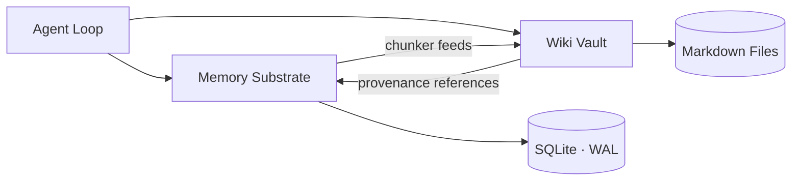

# Memory & Storage

# Memory & Storage

The persistence layer for the LibreFang Agent OS. It provides two complementary storage backends — one machine-optimised for semantic recall, one human-optimised for auditable knowledge — that together give agents durable, queryable memory across sessions.

## Sub-modules

| Sub-module | Role |
|---|---|
| [librefang-memory](librefang-memory-src.md) | Core memory substrate — a unified SQLite persistence layer (via `r2d2` pool, WAL mode) providing structured stores, vector search, knowledge graphs, session history, and proactive memory management (consolidation, decay). |
| [librefang-memory-wiki](librefang-memory-wiki-src.md) | Durable Markdown knowledge vault with YAML frontmatter provenance tracking. Human-auditable, Obsidian-compatible, and opt-in. |

## How they fit together

```mermaid
graph LR
    AgentLoop[Agent Loop] --> MS[Memory Substrate]
    AgentLoop --> WV[Wiki Vault]
    MS -->|chunker feeds| WV
    WV -->|provenance references| MS
    MS --> SQLite[(SQLite · WAL)]
    WV --> Disk[(Markdown Files)]
```

The **memory substrate** handles high-frequency, structured access — nearest-neighbour vector search, session state, prompt templates, idempotency checks, usage accounting. Everything flows through a single `r2d2` connection pool.

The **wiki vault** handles low-frequency, high-fidelity knowledge — long-form pages that agents write via `wiki_write` / `wiki_get` / `wiki_search` tools. Each page carries provenance frontmatter (agent, session, channel, turn) so any claim can be traced back to its origin. The vault detects human hand-edits and will not silently overwrite them.

The key bridge between the two is **chunking**: the memory substrate's `chunker` module produces the text segments that the wiki's `frontmatter` splitter consumes, ensuring consistent segmentation across both stores. Provenance entries in the wiki reference session identifiers held in the substrate, completing the traceability loop.

## Typical cross-module workflow

1. **Agent produces a claim** during a session tracked by `SessionStore`.
2. **Short-term**: the claim is embedded and stored via `SemanticStore` for vector recall.
3. **Long-term**: if the wiki is enabled, the agent calls `wiki_write`; the vault records provenance linking back to the session, and the `frontmatter` module uses the shared chunking logic to segment content.
4. **Consolidation & decay**: the substrate's consolidation pass merges similar memories and decays stale ones, while the wiki retains its pages durably unless explicitly pruned.
5. **Recall**: future sessions query `SemanticStore` for semantic matches or `wiki_search` for authored knowledge — the substrate answers "what's similar?" while the wiki answers "what did we write down?"