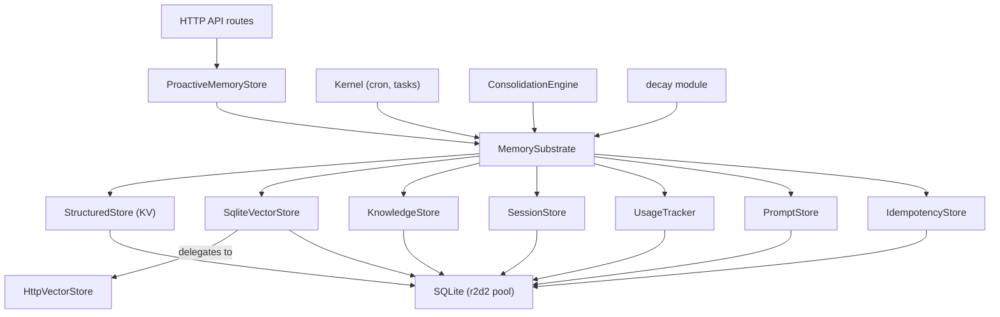

# Memory System — librefang-memory-src

# Memory System — `librefang-memory`

## Overview

`librefang-memory` is the persistent memory substrate for the LibreFang Agent Operating System. It provides a unified API over three storage paradigms — structured key-value, semantic vector search, and a knowledge graph — all backed by SQLite via a shared `r2d2` connection pool. Agents, the kernel, and the HTTP API layer interact with a single `MemorySubstrate` rather than individual stores.

## Architecture



## Core Type: `MemorySubstrate`

`MemorySubstrate` (in `substrate.rs`) is the central facade. It holds the `r2d2::Pool<SqliteConnectionManager>` and exposes methods for every subsystem: KV get/set, session save/load, task queue operations, memory recall, consolidation, and agent removal. It is `Clone`-safe (the pool is `Arc`-wrapped internally).

Create an in-memory instance for testing:

```rust
let substrate = MemorySubstrate::open_in_memory();
```

The kernel creates a file-backed instance at startup, running `migration::run_migrations` on the connection before serving requests.

## Storage Subsystems

### Structured Store (`structured.rs`)

Per-agent key-value storage. Keys are scoped to an `(agent_id, key)` pair with versioning. Namespace ACL guards (`namespace_acl.rs`) control which key prefixes an external caller can read or mutate.

### Semantic Store (`semantic.rs` — `SqliteVectorStore`)

Text-based memory search. Stores memory records in the `memories` table with optional embedding BLOBs (LE `f32` arrays). Supports:

- **Recall**: Retrieve memories by agent, ordered by confidence and recency
- **Insert with embedding**: Store a content string alongside its vector embedding
- **LIKE-based fallback search**: When no vector backend is available

Implements the `VectorStore` trait from `librefang-types`.

### HTTP Vector Store (`http_vector_store.rs`)

A `VectorStore` implementation that delegates to a remote HTTP service (e.g., Qdrant, Weaviate). All operations are async via `reqwest`:

| Endpoint | Method | Purpose |
|---|---|---|
| `/insert` | POST | Store an embedding with payload and metadata |
| `/search` | POST | Nearest-neighbour search |
| `/delete` | DELETE | Remove an embedding by ID |
| `/get_embeddings` | POST | Batch-fetch embeddings by ID |

Constructed with `HttpVectorStore::new("http://host:port/path")` — trailing slashes are stripped automatically.

### Knowledge Graph (`knowledge.rs`)

`KnowledgeStore` manages entities and relations in SQLite. Key methods:

- **`add_entity(entity, agent_id)`** — Upsert an entity (generates a UUID if `id` is empty)
- **`add_relation(relation, agent_id)`** — Create a typed, weighted edge between two entities
- **`query_graph(pattern)`** — Pattern-matching query over the `(source, relation, target)` triple
- **`has_relation(source, relation_type, target)`** — Existence check (matches by ID or name)
- **`delete_by_agent(agent_id)`** — Remove all entities and relations for an agent (transactional)

Relations can reference entities by **ID or name**. The SQL JOIN in `query_graph` handles both cases, which is important because the MCP tool layer often references entities by name rather than ID.

### Session Store (`session.rs`, `session_store.rs`)

Persists conversation sessions as MessagePack blobs in the `sessions` table. Features:

- **Message count denormalization**: The `message_count` column avoids deserializing the blob for listing (migration v32 backfills this).
- **Full-text search**: An FTS5 virtual table (`sessions_fts`) indexes session content for text search.
- **Canonical sessions**: Cross-channel persistent memory via `canonical_sessions` table.
- **JSONL mirror**: Optional write-ahead log for session content.

### Prompt Store (`prompt.rs`)

Versioned prompt management with A/B experiment support. Tables: `prompt_versions`, `prompt_experiments`, `prompt_experiment_results`. Experiments track traffic splits and success criteria.

### Usage Tracker (`usage.rs`)

Cost and token metering in `usage_events`. Records per-agent, per-model input/output tokens and cost. Supports aggregation queries for dashboards and billing.

### Idempotency Store (`idempotency.rs`)

SQLite-backed cache for HTTP `Idempotency-Key` semantics. Records expire after 24 hours. The lookup path opportunistically prunes expired rows so the table self-trims without a background job.

Key types:
- `IdempotencyStore` trait — pluggable backend (testable with mocks)
- `SqliteIdempotencyStore` — production implementation using the shared pool
- `CachedResponse { status: u16, body: Vec<u8> }` — replayed verbatim on duplicate requests

First-writer-wins via `INSERT OR IGNORE`.

### Provider System (`provider.rs`)

Plugin architecture for memory providers. `MemoryManager` holds a registry of `MemoryProvider` implementations (trait with methods like `prefetch`, `notify_turn_complete`). A `NullMemoryProvider` is registered as the built-in default; external providers are registered at startup. Errors in external providers are isolated and logged rather than propagated.

## Memory Lifecycle

### Chunking (`chunker.rs`)

Long documents are split into overlapping chunks before embedding. `chunk_text(text, max_size, overlap)` applies a three-tier splitting strategy:

1. **Paragraph boundaries** (`\n\n`)
2. **Sentence boundaries** (`. `, `.\n`, `。`, `？`, `！`)
3. **Hard character limit** (only when a single sentence exceeds `max_size`)

Segments are then greedily packed into chunks with `overlap` characters of context carried forward from the previous chunk. All operations are Unicode-aware (char-based, not byte-based).

### Decay (`decay.rs`)

Time-based soft-deletion based on memory scope and TTL:

| Scope | TTL Config Key | Behavior |
|---|---|---|
| `user_memory` | — | **Never decays** (permanent) |
| `session_memory` | `session_ttl_days` | Soft-deletes after N days of no access |
| `agent_memory` | `agent_ttl_days` | Soft-deletes after N days of no access |

`run_decay(pool, config)` performs the sweep. Accessing a memory via search/recall resets `accessed_at`, extending the lifetime. Decay writes `deleted = 1` and stamps `deleted_at`; hard removal happens later.

`prune_soft_deleted_memories(pool, older_than_days)` reclaims space by hard-deleting rows that have been soft-deleted for longer than the specified window.

### Consolidation (`consolidation.rs`)

`ConsolidationEngine` runs periodic consolidation cycles:

1. **Confidence decay**: Reduces confidence of memories not accessed in 7 days by `(1 - decay_rate)`, floored at 0.1.
2. **Duplicate merging**: For each agent, loads active memories sorted by confidence (DESC), then pairwise compares using `text_similarity`. Pairs above 90% similarity are merged:
   - **Keeper**: Higher-confidence row survives
   - **Confidence**: `max(keeper, loser)`
   - **Access count**: Summed (`keeper + loser`)
   - **Metadata**: JSON union; keeper wins on key conflicts; non-object payloads preserved verbatim
   - **Embedding**: Running confidence-weighted average (accumulates across multiple losers, not pairwise re-blended)
   - **Loser**: Soft-deleted (`deleted = 1`)

The merge runs in a single outer transaction (one fsync) capped at 100 merges per run to avoid O(n²) blowup. Agent isolation is enforced — memories from different agents are never compared or merged.

Embedding merge edge cases:
- **Dimension mismatch**: Keeper's embedding preserved verbatim
- **Keeper has no embedding, loser does**: Asymmetric — keeper adopts loser's vector (better than losing it on soft-delete)
- **Both absent**: Stays `None`

## Database Schema (`migration.rs`)

The migration system manages 36 schema versions. Key tables:

| Table | Purpose | Key Indexes |
|---|---|---|
| `agents` | Agent registry | PK `id` |
| `sessions` | Conversation history | `agent_id`, FTS5 via `sessions_fts` |
| `memories` | Semantic memories | `(deleted, agent_id, confidence DESC, accessed_at DESC)`, `scope` |
| `entities` | Knowledge graph nodes | `agent_id`, `name` |
| `relations` | Knowledge graph edges | `source_entity`, `target_entity`, `agent_id` |
| `kv_store` | Per-agent key-value | PK `(agent_id, key)` |
| `usage_events` | Cost metering | `(agent_id, timestamp)` |
| `prompt_versions` | Prompt version history | `UNIQUE(agent_id, version)` |
| `prompt_experiments` | A/B test definitions | — |
| `idempotency_keys` | HTTP replay cache | PK `key`, `expires_at` |
| `audit_entries` | Merkle audit trail | `agent_id`, `timestamp`, `action` |
| `task_queue` | Async task queue | `(status, priority DESC)` |

Schema version is tracked via `PRAGMA user_version` and a `migrations` audit table. A self-healing pass on boot backfills any missing audit rows. Downgrade is refused — if the binary's `SCHEMA_VERSION` is lower than the database's, migrations fail with a clear error message.

## Connecting to the Rest of the Codebase

- **`librefang-api`** calls `ProactiveMemoryStore` and `MemorySubstrate` from HTTP route handlers (`src/routes/memory.rs`, `src/routes/skills.rs`).
- **Kernel cron jobs** (`src/kernel/cron_tick.rs`, `src/kernel/cron_compaction.rs`) trigger session saves, decay, and compaction.
- **`librefang-types`** defines the shared traits (`VectorStore`, `ProactiveMemory`), config structs (`MemoryDecayConfig`, `ChunkConfig`), and error types (`LibreFangError`).
- **`librefang-runtime`** uses `HttpVectorStore` when the vector backend is a remote service.
- **Agent removal** (`remove_agent_inner` in `substrate.rs`) cascades deletes across sessions, memories, KV pairs, entities, and relations.

## Key Re-exports from `lib.rs`

```
MemorySubstrate, SessionStore, ProactiveMemoryStore
SqliteVectorStore, HttpVectorStore
MemoryManager, MemoryProvider, MemoryError, NullMemoryProvider
MemoryNamespaceGuard, NamespaceGate
PromptStore
```

Plus all types from `librefang_types::memory`: `MemoryFilter`, `MemoryItem`, `VectorSearchResult`, `ExtractionResult`, etc.