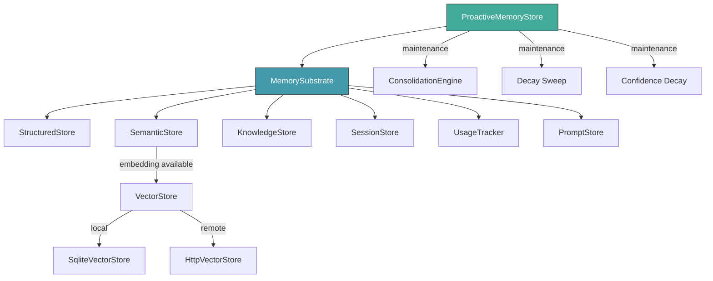

# Memory System — librefang-memory-src

# Memory System — `librefang-memory`

## Overview

The memory substrate for the LibreFang Agent Operating System. It provides a unified API over three persistent storage backends, a proactive memory system inspired by mem0, and background maintenance machinery for decay, consolidation, and eviction.

All data lives in SQLite by default. Vector search can run against the local database or delegate to a remote HTTP service (Qdrant, Weaviate, etc.).

## Architecture



Agents interact with `MemorySubstrate` for low-level CRUD and with `ProactiveMemoryStore` for the higher-level mem0-style API (auto-memorize, auto-retrieve, search/add/get/list).

## Key Modules

| Module | File | Purpose |
|---|---|---|
| `substrate` | `substrate.rs` | Top-level façade composing all stores; re-exposes session, semantic, structured, knowledge, usage, and prompt APIs |
| `proactive` | `proactive.rs` | mem0-style API: `ProactiveMemory` trait + `ProactiveMemoryStore` implementation with auto-memorize/retrieve hooks, confidence decay, session TTL cleanup, memory cap eviction |
| `structured` | `structured.rs` | Key-value store per agent backed by the `kv_store` SQLite table |
| `semantic` | `semantic.rs` | Text-based memory storage in the `memories` table with LIKE matching (Phase 1) or vector cosine similarity (Phase 2) |
| `knowledge` | `knowledge.rs` | Entity-relation knowledge graph in `entities` / `relations` tables with graph pattern queries |
| `session` | `session.rs` | Session history with FTS5 full-text search and canonical cross-channel sessions |
| `chunker` | `chunker.rs` | Splits long documents into overlapping chunks suitable for embedding |
| `consolidation` | `consolidation.rs` | Reduces confidence of old unaccessed memories and merges duplicates (>90% text similarity) |
| `decay` | `decay.rs` | Hard-deletes stale SESSION and AGENT scope memories past their TTL; USER scope never decays |
| `migration` | `migration.rs` | Schema creation and incremental migrations (currently at version 19) |
| `http_vector_store` | `http_vector_store.rs` | `VectorStore` implementation delegating to a remote HTTP/JSON service |
| `usage` | `usage.rs` | Token usage recording, cost tracking, quota enforcement, per-model performance metrics |
| `prompt` | `prompt.rs` | Prompt versioning and A/B experiment management |

## Storage Backends

### Structured Store (`StructuredStore`)

Per-agent key-value storage in the `kv_store` table. Values are arbitrary JSON blobs. Used for agent state, configuration, and memory item metadata.

```rust
let store = substrate.structured();
store.set(agent_id, "memory:abc123", serde_json::to_value(&item))?;
let val = store.get(agent_id, "memory:abc123")?;
let all = store.list_kv(agent_id)?;
store.delete(agent_id, "memory:abc123")?;
```

### Semantic Store (`SemanticStore`)

Stores free-text memories in the `memories` table with scope, confidence, access tracking, and optional vector embeddings. Supports multimodal entries (image URL + image embedding + modality).

Key operations:
- `remember` / `remember_with_embedding` — store a new memory
- `recall` / `recall_with_embedding` — search memories (keyword LIKE or vector cosine)
- `get_by_id` — fetch a single memory by ID
- `update_content` — mutate content and metadata in-place
- `forget` — soft-delete a memory
- `lowest_confidence` — retrieve IDs of the N lowest-confidence memories (for eviction)
- `count` — count non-deleted memories for an agent

Memory scopes map to isolation levels:

| Scope constant | `MemoryLevel` | Decay behavior |
|---|---|---|
| `user_memory` | `User` | Never decays |
| `session_memory` | `Session` | TTL-based cleanup |
| `agent_memory` | `Agent` | TTL-based cleanup |

### Knowledge Graph (`KnowledgeStore`)

Stores typed entities (`Entity`) and directed relations (`Relation`) in SQLite. Supports graph pattern queries via `query_graph(GraphPattern)`.

```rust
let store = substrate.knowledge();
store.add_entity(entity, "agent-id")?;
store.add_relation(relation, "agent-id")?;

let matches = store.query_graph(GraphPattern {
    source: Some("Alice".into()),
    relation: Some(RelationType::WorksAt),
    target: None,
    max_depth: 1,
})?;
```

Relations can reference entities by ID **or** by name. The JOIN logic in `query_graph` resolves both, which is important for MCP tool ingestion where relations are typically name-based.

## Proactive Memory System (`ProactiveMemoryStore`)

The core mem0-style API implementing the `ProactiveMemory` and `ProactiveMemoryHooks` traits.

### Decision Flow for `add()`

When `add()` is called with conversation messages:

1. **Extract** memories via the configured `MemoryExtractor` (default: `DefaultMemoryExtractor`, or a custom LLM-backed extractor).
2. **For each extracted item**, generate an embedding (if driver available) and search for similar existing memories.
3. **Decide action** via `MemoryExtractor::decide_action()`:
   - `Add` — new memory, no close match found.
   - `Update { existing_id }` — similar memory exists; update it in-place. Version history is preserved in metadata.
   - `Noop` — exact or near-duplicate; skip.
4. **Store** in both the semantic store and the structured KV store for consistency.
5. **Enforce cap** — if the agent exceeds `max_memories_per_agent`, evict the lowest-confidence memories.

### Conflict Detection

During `Update` actions, the system detects contradictory updates (e.g., "I prefer dark mode" → "I prefer light mode") via `detect_memory_conflict()`. Conflicts are flagged in metadata with `"conflict_detected": true` and logged at `info` level.

### Auto-Hooks

- **`auto_memorize`** — called after each agent turn; extracts and stores memories from the conversation.
- **`auto_retrieve`** — called before each agent turn; searches relevant memories and returns them as context injection strings.

### Maintenance Tasks

`ProactiveMemoryStore` runs background maintenance opportunistically (rate-limited to once per hour per task):

| Task | What it does | Trigger |
|---|---|---|
| Confidence decay | Exponential decay: `confidence × e^(-rate × days)`, boosted by `min(1 + log₂(access_count), 2.0)` | `maybe_decay_confidence()` on search/retrieve |
| Session TTL cleanup | Soft-deletes session-level memories older than `session_ttl_hours`; also cleans matching KV entries | `maybe_cleanup_expired()` on search/retrieve |
| Consolidation | Reduces confidence on unaccessed memories, merges >90% similar pairs (capped at 100 merges/run) | Every 10 `auto_memorize` calls per agent |
| Memory cap eviction | Evicts lowest-confidence memories when `max_memories_per_agent` is exceeded | After each `add()` and `import_memories()` |

### Export / Import

```rust
// Export all memories for migration or backup
let items: Vec<MemoryExportItem> = store.export_all("agent-id")?;

// Import with duplicate detection (>90% text similarity skips)
let count = store.import_memories("agent-id", items).await?;
```

## Text Chunking (`chunker`)

Splits long documents into overlapping chunks for embedding. Three-level strategy:

1. **Paragraph boundaries** (`\n\n`) — primary split.
2. **Sentence boundaries** (`. `, `。`, `？`, `！`) — for oversized paragraphs.
3. **Hard character limit** — for oversized sentences. Uses character boundaries to handle multi-byte Unicode correctly.

```rust
let chunks = chunk_text(document, 1500, 200);
// Returns Vec<String> of ≤1500 chars each with 200 chars overlap
```

## Consolidation (`ConsolidationEngine`)

Runs as part of the proactive memory system's periodic maintenance:

1. **Decay**: Memories not accessed in 7+ days have confidence reduced by `decay_rate` (floor: 0.1).
2. **Merge**: Pairs of active memories with >90% Jaccard word overlap are merged. The higher-confidence memory is kept; the other is soft-deleted. If the absorbed memory had higher confidence, the keeper's confidence is lifted. Capped at 100 merges per run to avoid O(n²) blowup.

Returns a `ConsolidationReport` with `memories_decayed`, `memories_merged`, and `duration_ms`.

## Time-Based Decay (`decay`)

Hard-deletes stale memories based on scope-specific TTLs configured via `MemoryDecayConfig`:

- **USER scope**: Never touched.
- **SESSION scope**: Deleted if `accessed_at` is older than `session_ttl_days`.
- **AGENT scope**: Deleted if `accessed_at` is older than `agent_ttl_days`.

Accessing a memory (search/recall) resets the timer by updating `accessed_at`.

```rust
let deleted_count = run_decay(&conn, &config)?;
```

## Vector Store Backends

### `SqliteVectorStore`

Local vector storage using the `embedding` BLOB column in the `memories` table. Computes cosine similarity in-process. Suitable for small-to-medium deployments.

### `HttpVectorStore`

Delegates vector operations to a remote HTTP service. Expected API contract:

| Method | Endpoint | Purpose |
|---|---|---|
| `POST` | `/insert` | Store embedding with payload and metadata |
| `POST` | `/search` | Query by embedding with optional filter, return top-K |
| `DELETE` | `/delete` | Remove by ID |
| `POST` | `/get_embeddings` | Batch fetch embeddings by IDs |

```rust
let store = HttpVectorStore::new("http://localhost:6333/collections/memories");
// Plugs into SemanticStore when an EmbeddingFn is configured
```

## Schema Migrations

The `migration` module manages SQLite schema versioning via the `user_version` pragma. Currently at version 19. Key tables created across migrations:

| Table | Version | Purpose |
|---|---|---|
| `agents` | v1 | Agent registry |
| `sessions` | v1 | Session history |
| `events` | v1 | Event log |
| `kv_store` | v1 | Per-agent key-value |
| `task_queue` | v1 | Task management |
| `memories` | v1, v3, v15, v16 | Semantic memories + embeddings + multimodal + peer_id |
| `entities`, `relations` | v1, v10 | Knowledge graph + agent_id |
| `usage_events` | v4, v14, v19 | Cost tracking + latency + provider |
| `canonical_sessions` | v5 | Cross-channel persistent memory |
| `paired_devices` | v7 | Device pairing |
| `audit_entries` | v8 | Merkle audit trail |
| `prompt_versions` | v13 | Prompt versioning |
| `prompt_experiments` | v13 | A/B testing |
| `sessions_fts` | v12 | FTS5 full-text search |
| `approval_audit` | v17 | Approval audit log |
| `totp_lockout` | v18 | TOTP lockout tracking |

Migrations are idempotent — `run_migrations` can be called repeatedly without error.

## Usage Tracking (`usage`)

Records per-request token usage, cost, latency, and tool call counts in `usage_events`. Supports:

- Quota enforcement (hourly/daily token limits per agent)
- Global budget caps
- Per-provider budget enforcement
- Model performance metrics (latency percentiles, success rates)
- Automatic cleanup of old records

## Integration Points

**From the runtime** (`librefang-runtime`):
- `MemorySubstrate::open_in_memory()` for testing
- `ProactiveMemoryStore::with_default_config()` / `with_extractor()` / `with_embedding()` for production setup
- `save_session_async()` called after each agent loop turn
- `recall_with_embedding_async()` called during context assembly before each turn
- `auto_memorize()` / `auto_retrieve()` hooks integrated into the agent loop

**From API routes** (`librefang-api`):
- Memory CRUD endpoints call `ProactiveMemoryStore::search()`, `get()`, `update()`, `delete()`
- `find_agent_id_for_memory()` resolves memory ownership for authorization
- Usage stats endpoints query the usage tracker

## Re-exports

The crate re-exports commonly used types for convenience:

```rust
// Core types from librefang-types
pub use librefang_types::memory::{
    ExtractionResult, MemoryAction, MemoryAddResult, MemoryFilter, MemoryFragment,
    MemoryId, MemoryItem, MemoryLevel, MemorySource, ProactiveMemory,
    ProactiveMemoryConfig, ProactiveMemoryHooks, RelationTriple, VectorSearchResult,
    VectorStore,
};

// Proactive memory types
pub use proactive::{MemoryExportItem, MemoryStats, ProactiveMemoryStore};

// Prompt store
pub use prompt::PromptStore;

// Vector store implementations
pub use http_vector_store::HttpVectorStore;
pub use semantic::SqliteVectorStore;

// Top-level substrate
pub use substrate::MemorySubstrate;
```