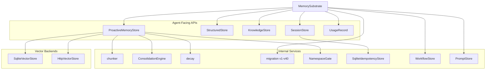

# Memory System — librefang-memory-src

# Memory System — `librefang-memory`

## Overview

`librefang-memory` is the persistence substrate for the LibreFang Agent Operating System. It provides a unified memory API over three storage backends and a collection of supporting services (decay, consolidation, idempotency, usage metering) that agents consume through a single `MemorySubstrate` entry point.

All primary state lives in SQLite (via `r2d2` + `rusqlite` with WAL mode), which keeps the deployment footprint to a single file and eliminates external database dependencies. Vector search delegates to pluggable `VectorStore` backends — either an in-process SQLite approximation (`SqliteVectorStore`) or a remote service (`HttpVectorStore`).

## Architecture



## Key Components

### `MemorySubstrate` (`substrate.rs`)

The top-level object that owns the `r2d2::Pool<SqliteConnectionManager>` and wires together all sub-stores. Created once at daemon startup; clones share the same pool. Handles schema migration on construction via `run_migrations`, then hands out references to each sub-store.

Re-exports the `Memory` trait from `librefang_types` so consumers don't need to depend on the types crate separately.

### `ProactiveMemoryStore` (`proactive.rs`)

mem0-style proactive memory — the primary API agents use for search, add, update, delete, and list operations. Internally:

- Embeds text via a configured embedding provider
- Chunks long documents with `chunker::chunk_text` before embedding
- Persists memories in the `memories` table with vector embeddings
- Enforces namespace ACLs via `NamespaceGate`

Key types re-exported: `ProactiveMemory`, `ProactiveMemoryHooks`, `MemoryStats`, `MemoryExportItem`.

### Semantic Memory (`semantic.rs` — `SqliteVectorStore`)

Implements `VectorStore` against SQLite. Stores embeddings as BLOBs (little-endian `f32` arrays) alongside the `memories` row. Search uses cosine similarity computed in Rust after loading candidates filtered by agent and scope. Suitable for moderate memory counts; larger deployments should switch to `HttpVectorStore`.

### `HttpVectorStore` (`http_vector_store.rs`)

Delegates vector operations to a remote HTTP service. Implements the same `VectorStore` trait. The remote API must expose four endpoints:

| Method | Path | Purpose |
|--------|------|---------|
| POST | `/insert` | Store a vector + payload |
| POST | `/search` | Nearest-neighbour search |
| DELETE | `/delete` | Remove a vector |
| POST | `/get_embeddings` | Batch-fetch vectors by ID |

### Knowledge Graph (`knowledge.rs`)

SQLite-backed entity-relation graph. Entities are typed (`EntityType::Person`, `Organization`, `Custom`, etc.) and carry a JSON `properties` map. Relations connect two entities with a `RelationType` and confidence score.

Queries use `GraphPattern` — a triple pattern with optional source, relation, and target bindings. The JOIN matches entities by both `id` and `name`, so relations created by the MCP tool (which references by name) resolve correctly.

**Tenant isolation:** All queries are scoped by `agent_id`. `delete_by_agent` wraps the relations-then-entities delete in a single transaction to prevent orphan entities.

### Text Chunker (`chunker.rs`)

Splits long text into overlapping chunks for embedding. Three-level splitting strategy:

1. **Paragraph boundaries** (`\n\n`)
2. **Sentence boundaries** (`. `, `.\n`, `。`, `？`, `！`)
3. **Hard character limit** as a last resort

All sizes are measured in Unicode characters, not bytes. Overlap is prepended from the tail of the previous chunk to preserve context continuity.

```rust
pub fn chunk_text(text: &str, max_size: usize, overlap: usize) -> Vec<String>
```

### Consolidation (`consolidation.rs`)

`ConsolidationEngine` runs two phases per cycle:

1. **Decay:** Reduces confidence of memories not accessed in 7 days by a configurable `decay_rate` (floored at 0.1).
2. **Merge:** Compares memories per-agent (preventing cross-tenant merges) and soft-deletes duplicates with >90% text similarity, merging their state into the higher-confidence keeper.

Merge semantics:
- **access_count:** summed (keeper + loser)
- **metadata:** JSON object union; keeper wins on key conflict; non-object payloads are preserved verbatim
- **embedding:** running confidence-weighted average — the keeper's accumulated weight grows with each absorbed loser, preventing pairwise-blend drift
- **confidence:** `max(keeper, loser)`

A single outer transaction wraps all merges (capped at `MAX_MERGES_PER_RUN = 100`) so only one fsync fires per consolidation cycle. If the run aborts mid-batch, the next cycle picks up where it left off — consolidation is idempotent.

### Time-Based Decay (`decay.rs`)

Scope-driven TTL soft-deletion:

| Scope | TTL Config | Behaviour |
|-------|-----------|-----------|
| `user_memory` | Never | Permanent |
| `session_memory` | `session_ttl_days` | Soft-delete after TTL |
| `agent_memory` | `agent_ttl_days` | Soft-delete after TTL |

Accessing a memory (via search/recall) updates `accessed_at`, resetting the timer. Soft-deleted rows keep their `deleted_at` timestamp for later hard-deletion.

**`prune_soft_deleted_memories`** — hard-deletes rows where `deleted_at` is older than a configurable threshold. Reclaims embedding BLOBs that would otherwise persist indefinitely in soft-deleted rows.

### Session Store (`session.rs`, `session_store.rs`)

Persists conversation history as MessagePack blobs in the `sessions` table. Features:

- Full-text search via `sessions_fts` (unicode61 tokenizer, rebuilt in migration v33)
- `message_count` denormalized column (migration v32) so `list_sessions` avoids deserializing blobs
- Canonical sessions for cross-channel persistent memory
- Expired session cleanup
- 24-hour usage stats aggregation per agent

### Namespace ACL (`namespace_acl.rs`)

Gates memory operations on namespace-prefixed keys. `NamespaceGate` checks read and write permissions before any KV or memory access. Supports per-namespace allowlists so an agent's memory namespace can be selectively shared or restricted.

### Idempotency Store (`idempotency.rs`)

SQLite-backed cache for HTTP `Idempotency-Key` semantics. Persists full HTTP responses (status + body) with a 24-hour TTL (`TTL_SECONDS`). First-writer-wins via `INSERT OR IGNORE`. Expired rows are pruned opportunistically on lookup.

Schema created by migration v34. Shares the substrate connection pool so no separate database file is needed.

### Schema Migrations (`migration.rs`)

40-version migration ladder. Each version is a transactional step that applies DDL and records itself in the `migrations` audit table. Key design properties:

- **No downgrade:** If `user_version > SCHEMA_VERSION`, the binary refuses to start (prevents silent data loss from missing columns).
- **Column-exists guards:** Every `ALTER TABLE ADD COLUMN` checks `column_exists` first so a retry after a partial failure doesn't error.
- **Audit trail self-heal:** After running all steps, verifies `migrations` row count matches `user_version` and backfills missing rows.
- **Performance indexes:** Migration v9 adds composite indexes for confidence-ordering, decay queries, and eviction scans.

### Supporting Stores

| Module | Purpose |
|--------|---------|
| `structured.rs` | Per-agent key-value store with version tracking and namespace ACL enforcement |
| `prompt.rs` | Prompt template versioning with active-version selection |
| `usage.rs` | LLM cost metering — records input/output tokens and cost per agent/model |
| `workflow_store.rs` | Workflow run state persistence (replaces JSON file, survives restarts) |
| `roster_store.rs` | Agent registry persistence |
| `provider.rs` | `MemoryProvider` trait — pluggable memory backend with `NullMemoryProvider` default |

## Data Flow

### Memory Add (Proactive)

```
Agent calls add()
  → chunker::chunk_text (if content > max_size)
  → Embed each chunk via embedding provider
  → NamespaceGate::check_write
  → INSERT into memories (content, embedding, confidence, scope)
```

### Memory Recall

```
Agent calls search(query)
  → Embed query
  → VectorStore::search (cosine similarity, filtered by agent_id)
  → Update accessed_at + increment access_count on hits
  → Return ranked results
```

### Consolidation Cycle

```
Kernel timer fires
  → ConsolidationEngine::consolidate()
    → Phase 1: decay confidence on 7+ day stale memories
    → Phase 2: per-agent O(N²) similarity scan (capped at 100 merges)
      → text_similarity > 0.9 → merge metadata, sum access_count,
        weighted-average embeddings, soft-delete loser
    → Single transaction commit (1 fsync)
```

### Decay Sweep

```
Kernel timer fires
  → run_decay(pool, config)
    → Soft-delete SESSION scope memories older than session_ttl_days
    → Soft-delete AGENT scope memories older than agent_ttl_days
    → USER scope untouched
  → prune_soft_deleted_memories(pool, retention_days)
    → Hard-delete rows soft-deleted > retention_days ago
```

## Design Decisions

**Soft-delete everywhere.** Hard `DELETE` only happens in `prune_soft_deleted_memories`, giving operators a recovery window. Other modules (consolidation, history queries) rely on the `deleted` flag to filter.

**Tenant isolation by `agent_id`.** Consolidation, knowledge graph queries, and vector search all scope by `agent_id`. Cross-tenant comparison never occurs, even when the database is shared.

**Char-based sizing.** The chunker counts Unicode characters, not bytes. `char_boundaries` produces byte offsets that never split a multi-byte character, so UTF-8 text (Japanese, emoji) chunks correctly.

**Single-transaction consolidation.** All merges in a consolidation cycle share one outer transaction. Per-pair atomicity (loser soft-delete + keeper update) is preserved because both writes land in the same transaction. A mid-batch crash rolls back the whole cycle; the next run is idempotent.

**Running weighted average for embeddings.** When a keeper absorbs multiple losers, its accumulated weight grows by each loser's confidence. This prevents the pairwise-blend bias where the last-absorbed loser disproportionately shifts the embedding. The accumulated weight is tracked per keeper in `accum_weights`.

**Embedding format.** Embeddings are stored as SQLite BLOBs containing little-endian `f32` values. `decode_embedding` / `encode_embedding` handle the conversion. Dimension mismatches between keeper and loser fall back to preserving the keeper's bytes verbatim.