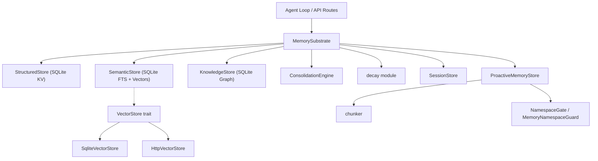

# Memory System — librefang-memory-src

# librefang-memory

The unified memory substrate for the LibreFang Agent Operating System. It provides persistent, queryable storage for agent state across three complementary backends—structured key-value, semantic text/vector search, and a knowledge graph—all layered on SQLite with an optional remote vector store.

## Architecture


```mermaid
graph TD
    Agent["Agent Loop / API Routes"] --> MemorySubstrate["MemorySubstrate"]
    MemorySubstrate --> StructuredStore["StructuredStore (SQLite KV)"]
    MemorySubstrate --> SemanticStore["SemanticStore (SQLite FTS + Vectors)"]
    MemorySubstrate --> KnowledgeStore["KnowledgeStore (SQLite Graph)"]
    MemorySubstrate --> ConsolidationEngine["ConsolidationEngine"]
    MemorySubstrate --> DecayModule["decay module"]
    MemorySubstrate --> SessionStore["SessionStore"]
    MemorySubstrate --> ProactiveStore["ProactiveMemoryStore"]
    SemanticStore -.-> VectorStore["VectorStore trait"]
    VectorStore --> SqliteVectorStore["SqliteVectorStore"]
    VectorStore --> HttpVectorStore["HttpVectorStore"]
    ProactiveStore --> Chunker["chunker"]
    ProactiveStore --> NamespaceACL["NamespaceGate / MemoryNamespaceGuard"]
```

## Core Substrate

`MemorySubstrate` (re-exported from `substrate.rs`) is the central factory. It holds a shared `r2d2::SqliteConnectionManager` pool and exposes the individual stores as well as the pool itself via `pool()`. Most crates that need memory access receive an `Arc<MemorySubstrate>` from the kernel boot sequence.

## Storage Backends

### Structured Store (`structured`)

Key-value storage for agent configuration, state, and arbitrary typed data. Supports agent-scoped namespaces and cascade-delete when an agent is removed.

### Semantic Store (`semantic`)

Full-text search over memory content backed by SQLite FTS5, with optional vector similarity search. Phase 1 uses `LIKE`-based matching; Phase 2 adds embedding vectors via the `VectorStore` trait. Key behaviors:

- `recall_with_embedding` updates `accessed_at` and increments `access_count`, which feeds into decay and consolidation logic.
- Embeddings are stored as `BLOB` columns containing little-endian `f32` arrays.

### Knowledge Graph (`knowledge`)

Entities (`Entity`) and relations (`Relation`) stored in normalized SQLite tables. Supports:

- `add_entity` / `add_relation` — upsert entities, insert relations
- `query_graph` — pattern matching on source/relation/target with JOIN resolution by both ID and name (so MCP tool references by name work, regression from #1022)
- `delete_by_agent` — transactional cascade delete of all relations then entities for a tenant
- Corrupt JSON in `properties` columns surfaces as `LibreFangError::Serialization` rather than being silently replaced with an empty map

### Session Store (`session`, `session_store`)

Persists conversation sessions with message history, metadata, and FTS-indexed content. Supports compaction for long conversations.

### Prompt Store (`prompt`)

Versioned prompt management with experiment tracking. Used by the kernel to resolve the active prompt version for an agent.

### Workflow Store (`workflow_store`)

Tracks workflow run state (pending, in-progress, completed, failed) with crash-recovery semantics for runs interrupted mid-execution.

## Proactive Memory (`proactive`)

Mem0-style proactive memory with automatic extraction, storage, and retrieval:

- `ProactiveMemoryStore` — implements the `ProactiveMemory` trait over `MemorySubstrate`
- `ProactiveMemoryHooks` — auto-memorize and auto-retrieve hooks that intercept agent turns
- Extracts structured memory fragments from conversation text, deduplicates via semantic similarity, and stores with confidence scores
- Search returns results from the semantic store, not a KV mirror

### Access Control (`namespace_acl`)

`NamespaceGate` enforces read/write/delete ACLs on proactive memory operations. `MemoryNamespaceGuard` applies redaction when PII access is not granted, replacing full content with a metadata label rather than silently skipping.

## Text Chunking (`chunker`)

Splits long documents into overlapping chunks suitable for embedding:

```
chunk_text(text, max_size, overlap) → Vec<String>
```

Splitting strategy, applied in order:
1. **Paragraph boundaries** (`\n\n`)
2. **Sentence boundaries** (`. ` / `.\n`, `。`, `？`, `！`) when a paragraph exceeds `max_size`
3. **Hard character split** when a single sentence still exceeds `max_size`

Overlap is applied by prepending the last `overlap` characters of the previous chunk. All length calculations are character-based (Unicode-safe via `char_indices`).

## Consolidation Engine (`consolidation`)

`ConsolidationEngine` runs as a periodic kernel-wide sweep (`kernel/background_lifecycle.rs::memory_consolidation`). Two phases per cycle:

### Phase 1: Confidence Decay

Reduces confidence of memories not accessed in the last 7 days by a configurable decay factor. Confidence floors at 0.1.

### Phase 2: Duplicate Merge

Merges near-verbatim duplicates using Jaccard word overlap (`text_similarity`):

- **Per-agent isolation**: Memories are loaded and compared only within the same `agent_id`, preventing cross-tenant merges.
- **Bounded cost**: `MAX_CANDIDATES_PER_AGENT = 500` limits the input set; `MAX_MERGES_PER_RUN = 100` limits output writes per cycle.
- **Single outer transaction**: All merges commit together (one fsync), preserving per-pair atomicity—both the loser soft-delete and the keeper update land in the same transaction.
- **Running weighted average**: When a keeper absorbs multiple losers, embeddings are blended with a running confidence-weighted average, not pairwise re-blends from the original weight.

When merging, the keeper (higher confidence) accumulates:
- `access_count` = sum of both
- `metadata` = JSON union, keeper wins on key conflicts (non-object payloads preserved verbatim)
- `embedding` = confidence-weighted average (handles dim mismatch, missing embeddings, and adoption from loser)
- `confidence` = max of both

The similarity threshold (`duplicate_threshold`) is shared with the per-agent on-demand consolidator and can be hot-reloaded at runtime via `set_duplicate_threshold` (takes `&self`, stored as `AtomicU32` bits).

## Time-Based Decay (`decay`)

Soft-deletes stale memories based on scope TTL:

| Scope | Behavior |
|-------|----------|
| `user_memory` | Never decays |
| `session_memory` | Decays after `session_ttl_days` of no access |
| `agent_memory` | Decays after `agent_ttl_days` of no access |

`run_decay` performs `UPDATE … SET deleted = 1, deleted_at = <now>` rather than a hard `DELETE`. Accessing a memory (via search/recall) resets the timer by updating `accessed_at`.

`prune_soft_deleted_memories` performs the actual hard `DELETE` for rows soft-deleted longer than a configurable retention window, reclaiming embedding BLOBs.

## Schema Migrations (`migration`)

Ladder-style migrations from version 1 to 41 (current). Each step runs in its own transaction that bundles DDL, an audit row in the `migrations` table, and the `user_version` pragma bump.

Key safety checks:
- **Forward-only**: Refuses to run if the database schema version exceeds what the binary supports.
- **Ladder consistency**: Detects drift between `MAX(migrations.version)` and `pragma user_version` before running any step, with operator recovery instructions.
- **Idempotent**: Re-running `run_migrations` is a no-op when already at the latest version.

## HTTP Vector Store (`http_vector_store`)

Delegates `VectorStore` operations to a remote HTTP service, allowing external vector databases (Qdrant, Weaviate, custom) without native client dependencies.

Expected API contract:

| Method | Path | Purpose |
|--------|------|---------|
| POST | `/insert` | Store embedding + payload |
| POST | `/search` | Nearest-neighbor query |
| DELETE | `/delete` | Remove by ID |
| POST | `/get_embeddings` | Batch fetch embeddings |

All errors surface as `LibreFangError::Internal` with the HTTP status and response body.

## Idempotency (`idempotency`)

SQLite-backed idempotency key cache for the API layer (#3637). `SqliteIdempotencyStore` shares the substrate connection pool and provides:

- `lookup` — returns a cached `StoredRecord` or `None`; expired rows are deleted in-place and treated as a miss
- `put` — first-writer-wins via `INSERT OR IGNORE`
- `prune_expired` — bulk cleanup of rows past the 24-hour TTL

The `IdempotencyStore` trait is pluggable so API-layer tests can swap in an in-memory implementation.

## Usage Tracking (`usage`)

Records per-provider, per-user token usage for budget enforcement by `librefang-kernel-metering`. `UsageRecord` rows feed into hourly and daily budget checks.

## Provider Plugin System (`provider`)

`MemoryProvider` trait with a `NullMemoryProvider` default. `MemoryManager` dispatches to the active provider, enabling custom memory backends without modifying core code.

## Re-exports

The crate re-exports key types from `librefang_types::memory` for convenience:

- `MemoryId`, `MemoryItem`, `MemoryFilter`, `MemorySource`, `MemoryLevel`
- `ProactiveMemory`, `ProactiveMemoryConfig`, `ProactiveMemoryHooks`
- `VectorStore`, `VectorSearchResult`
- `ExtractionResult`, `MemoryAction`, `MemoryAddResult`
- `Entity`, `Relation`, `GraphPattern`, `GraphMatch`

Plus concrete store types: `SqliteVectorStore`, `HttpVectorStore`, `MemorySubstrate`, `SessionStore`, `WorkflowStore`, `PromptStore`, `ProactiveMemoryStore`, `MemoryNamespaceGuard`, `NamespaceGate`, `MemoryProvider`, `NullMemoryProvider`, `MemoryManager`, `MemoryError`.