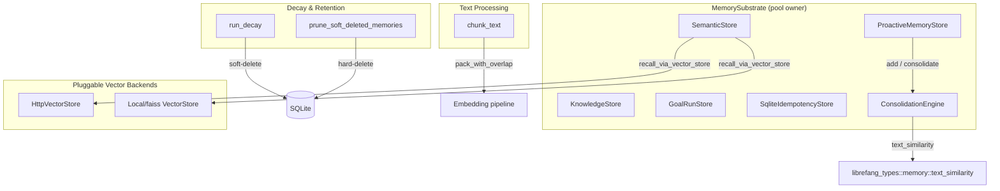

# Memory System — librefang-memory-src

# librefang-memory

Persistent memory infrastructure for LibreFang agents. Provides SQLite-backed storage for agent memories, knowledge graphs, session state, goal runs, idempotency caching, and the consolidation/decay pipelines that keep the store healthy over time.

All stores share a single r2d2 connection pool managed by `MemorySubstrate`, which means one WAL file, one set of migrations, and one pool to monitor.

## Architecture


```mermaid
graph TD
    subgraph "MemorySubstrate (pool owner)"
        SS[SemanticStore]
        PS[ProactiveMemoryStore]
        KS[KnowledgeStore]
        GR[GoalRunStore]
        ID[SqliteIdempotencyStore]
        CE[ConsolidationEngine]
    end

    subgraph "Decay & Retention"
        RD[run_decay]
        PR[prune_soft_deleted_memories]
    end

    subgraph "Pluggable Vector Backends"
        HS[HttpVectorStore]
        LS[Local/faiss VectorStore]
    end

    subgraph "Text Processing"
        CH[chunk_text]
    end

    SS -->|"recall_via_vector_store"| HS
    SS -->|"recall_via_vector_store"| LS
    PS -->|"add / consolidate"| CE
    CE -->|"text_similarity"| TS[librefang_types::memory::text_similarity]
    RD -->|"soft-delete"| DB[(SQLite)]
    PR -->|"hard-delete"| DB
    CH -->|"pack_with_overlap"| EMB[Embedding pipeline]
```

## Key Submodules

### chunker — Text Chunking

Splits long documents into overlapping chunks suitable for embedding. The three-tier splitting strategy preserves readability:

1. **Paragraph boundaries** (`\n\n`) — preferred, keeps coherent blocks together.
2. **Sentence boundaries** (`. `, `.\n`, `。`, `？`, `！`) — used when a single paragraph exceeds `max_size`.
3. **Hard character split** — last resort when a single sentence is still too large. Uses char-based iteration to avoid splitting multi-byte UTF-8 sequences.

```rust
let chunks = chunk_text(text, 1500, 200);
// Returns Vec<String>, each ≤ 1500 chars, with 200 chars overlap
```

Overlap is implemented by prepending the last `overlap` characters of the previous chunk to the next chunk, separated by `\n\n`. If the overlap + new segment exceeds `max_size`, the overlap is dropped.

Key internals:
- `build_segments` — breaks text into atomic segments (paragraphs → sentences → hard splits)
- `pack_with_overlap` — greedily packs segments into chunks, applying overlap between consecutive chunks
- `split_sentences` — char-aware sentence boundary detection supporting CJK punctuation
- `char_boundaries` / `suffix_by_chars` — Unicode-safe slicing helpers

### consolidation — Memory Merging and Confidence Decay

`ConsolidationEngine` runs as a periodic kernel-wide sweep. Two phases per cycle:

**Phase 1 — Decay:** Reduces confidence of active memories not accessed in the last 7 days. Confidence is multiplied by `(1 - decay_rate)` with a floor of 0.1.

**Phase 2 — Merge:** Finds near-duplicate memories per agent using Jaccard word overlap (`text_similarity`). When two memories exceed `duplicate_threshold` (default 0.85, configurable via hot-reload):

| Field | Merge strategy |
|-------|---------------|
| Keeper selection | Higher confidence wins |
| `confidence` | `max(keeper, loser)` |
| `access_count` | Sum of both |
| `metadata` | Union of JSON objects; keeper wins key conflicts. Non-object JSON (arrays, malformed) falls back to keeper verbatim. |
| `embedding` | Running confidence-weighted average. If only the loser has an embedding, the keeper adopts it. Dimension mismatches preserve the keeper's vector. |

The loser is soft-deleted (`deleted = 1`).

**Cost controls:**
- `MAX_CANDIDATES_PER_AGENT = 500` — bounds the O(N²) similarity loop input per agent
- `MAX_MERGES_PER_RUN = 100` — bounds writes per cycle

Both caps work together: the candidate cap limits memory residency during the comparison loop, while the merge cap spreads large dedup operations across ticks.

**Transaction model:** A single outer transaction wraps all merges in a run, collapsing up to 100 fsyncs into one. Per-pair atomicity (loser soft-delete + keeper update) is preserved within the batch. If any write fails, the entire run rolls back; consolidation is idempotent and the next tick picks up where it left off.

**Hot-reload:** `set_duplicate_threshold(&self, ...)` takes `&self` (not `&mut self`) so the kernel's `Arc<MemorySubstrate>` can push config changes through the hot-reload path without `Arc::get_mut`. The threshold is stored as `f32::to_bits` in an `AtomicU32`.

**Cross-tenant safety:** Memories are grouped by `agent_id` before comparison. Two identical memories belonging to different agents are never compared or merged.

### decay — Time-Based Memory Expiry

Scope-based TTL enforcement via `run_decay`:

| Scope | Behaviour |
|-------|-----------|
| `user_memory` | Never decays |
| `session_memory` | Soft-deleted after `session_ttl_days` of no access |
| `agent_memory` | Soft-deleted after `agent_ttl_days` of no access |

Decay performs soft deletes only (`deleted = 1, deleted_at = <unix_timestamp>`). The `accessed_at` column is compared using SQLite's `datetime()` function to handle RFC3339 format variations correctly.

Accessing a memory (via search/recall) updates `accessed_at`, resetting the decay timer. This is handled upstream in `SemanticStore::recall_with_embedding`.

`prune_soft_deleted_memories` performs hard deletes on rows that have been soft-deleted for longer than `older_than_days`. Rows with `deleted_at = NULL` are skipped (legacy rows from before the migration that added this column). This reclaims the embedding BLOB storage.

### goal_run_store — Goal Run Persistence

`GoalRunStore` persists active goal-run state to the `goal_runs` SQLite table so long-horizon goal runs survive daemon restarts.

`GoalRunRow` fields: `goal_id` (PK), `agent_id`, `phase`, `iteration`, `max_iterations`, `last_progress`, `last_error`, `started_at`, `updated_at`.

Key methods:
- `save_run` — upsert via `ON CONFLICT(goal_id) DO UPDATE`. Uses `DO UPDATE` instead of `INSERT OR REPLACE` to avoid the implicit DELETE+INSERT that would reset ROWID.
- `load_all_runs` — ordered by `started_at DESC` for deterministic boot-time recovery.
- `wal_checkpoint` — PASSIVE-mode checkpoint called after persisting terminal-phase runs.

The `phase` column has a CHECK constraint; invalid phases are rejected at the SQLite level.

### http_vector_store — Remote Vector Backend

`HttpVectorStore` implements the `VectorStore` trait by delegating to a remote HTTP service. This allows LibreFang to use external vector databases (Qdrant, Weaviate, custom microservices) without linking native clients.

Expected API contract:

| Method | Path | Purpose |
|--------|------|---------|
| POST | `/insert` | Store an embedding with payload and metadata |
| POST | `/search` | Nearest-neighbour search with optional filter |
| DELETE | `/delete` | Remove an embedding by ID |
| POST | `/get_embeddings` | Batch fetch embeddings by ID |

All errors are mapped to `LibreFangError::Internal` with context about which operation failed and the HTTP status received.

### idempotency — Request Deduplication Cache

`SqliteIdempotencyStore` persists idempotency keys for the API layer so that retried HTTP requests receive the same response.

- **TTL:** 24 hours (`TTL_SECONDS`). Expired rows are cleaned up opportunistically during lookups and via `prune_expired`.
- **First-writer-wins:** `INSERT OR IGNORE` means concurrent inserts under the same key silently keep whichever landed first.
- **Pool failure metrics:** Pool exhaustion is counted via `metrics::counter!("librefang_memory_pool_get_failed_total")` before returning the error, giving operators visibility into connection pressure.

The `IdempotencyStore` trait abstracts the backend so API-layer tests can swap in an in-memory implementation.

### knowledge — Knowledge Graph

`KnowledgeStore` manages entities and relations in SQLite with support for graph pattern queries.

Entity operations:
- `add_entity` — upsert by ID; auto-generates a UUID if `id` is empty. Serializes `EntityType` and `properties` as JSON.
- `delete_by_agent` — transactional delete of all entities and relations for an agent. Relations are deleted first to avoid orphans.

Relation operations:
- `add_relation` — creates a relation between two entities. Source/target can be entity IDs or entity names.
- `has_relation` — checks existence by ID or name on both sides.

Graph queries via `query_graph(GraphPattern)`:
- Joins `relations` → `entities` on both source and target, matching by ID or name within the same `agent_id`.
- Supports optional filters on source, relation type, and target.
- Returns `Vec<GraphMatch>` (source entity, relation, target entity).
- Results are capped at 100 rows.

**Corrupt JSON handling:** Both `parse_entity` and `parse_relation` log and return a `Serialization` error on corrupt `properties` JSON rather than silently substituting an empty `HashMap`. This prevents corrupt rows from being indistinguishable from legitimate empty-property rows.

## Data Lifecycle

```
  remember()          recall()           consolidation          decay
      │                   │                    │                   │
      ▼                   ▼                    ▼                   ▼
  INSERT into        UPDATE accessed_at   Reduce confidence   Soft-delete
  memories           (resets timer)       Merge duplicates    (deleted=1)
                                                             │
                                                             ▼
                                                    prune_soft_deleted_memories
                                                    (hard DELETE, reclaims BLOBs)
```

## Error Handling Convention

All public functions return `LibreFangResult<T>`. SQLite errors are wrapped via `LibreFangError::memory(...)` or `LibreFangError::memory_msg(format!(...))` for context-specific messages. Serialization failures use `LibreFangError::serialization(...)`.

Pool acquisition failures in `idempotency` and `goal_run_store` emit a `metrics::counter` before returning, tagged by store name and operation. Other stores rely on the caller to handle `Pool::get` errors from the shared substrate pool.

## Migration Dependency

All stores depend on `migration::run_migrations` having been called before first use. The migration module (not shown here but referenced throughout) creates the `memories`, `entities`, `relations`, `goal_runs`, and `idempotency_keys` tables with the expected schema, including CHECK constraints and indexes needed for query performance.