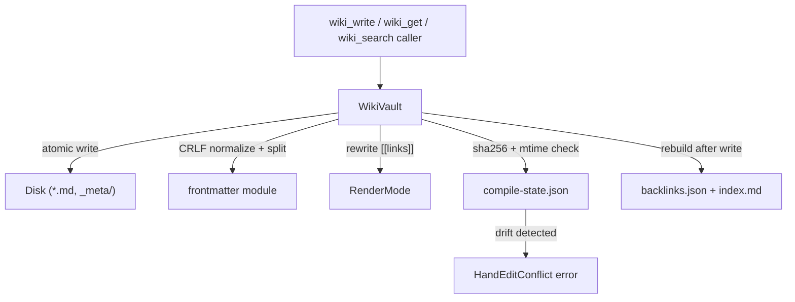

# Memory System — librefang-memory-wiki-src

# librefang-memory-wiki

Durable markdown knowledge vault for the LibreFang Agent OS. Complements `librefang-memory` (the SQLite + vector substrate) by providing a navigable, human-editable knowledge base that can be opened directly in Obsidian. Every page carries provenance frontmatter — which agent, session, channel, and turn produced the claim — so the origin of any fact is always auditable.

The vault is **off by default**. Operators opt in via configuration.

## Architecture



## Configuration

Enable the vault in `config.toml`:

```toml
[memory_wiki]
enabled = true
mode = "isolated"                           # isolated | bridge | unsafe_local
vault_path = "~/.librefang/wiki/main"
render_mode = "native"                      # native | obsidian
ingest_filter = "tagged"                    # tagged | all
```

| Field | Default | v1 Behavior |
|---|---|---|
| `enabled` | `false` | Must be `true` or `WikiVault::new` returns `WikiError::Disabled` |
| `mode` | `isolated` | Only `isolated` is wired; `bridge` and `unsafe_local` return `ModeNotImplemented` |
| `vault_path` | `<home_dir>/wiki/main` | When unset, falls back to the kernel-supplied `home_dir` — not the env-derived `LIBREFANG_HOME` — so embedded profiles don't mix data |
| `render_mode` | `native` | Controls how `[[topic]]` placeholders are rendered on disk |
| `ingest_filter` | `tagged` | `all` is accepted but has no behavioral effect in v1; a warning is logged |

## File Layout

```
<vault_path>/
├── <topic>.md              # one page per topic
├── index.md                # auto-generated alphabetical index
└── _meta/
    ├── compile-state.json  # mtime + sha256 per page from last compile
    └── backlinks.json      # { target -> [source, ...] } from every [[link]]
```

Reserved names: `index` (the auto-generated index) and any topic starting with `_` (metadata). Both are rejected by topic validation.

## Page Format

Each `.md` file is a YAML frontmatter block followed by a markdown body:

```markdown
---
topic: project-conventions
created: 2026-05-06T10:30:00Z
updated: 2026-05-06T11:00:00Z
content_sha256: 6a4f...
provenance:
  - agent: agent_xyz
    session: sess_abc
    channel: cli
    turn: 4
    at: 2026-05-06T10:30:00Z
---

body markdown ...
```

**`content_sha256`** is `Frontmatter::hash_body(body)` — a SHA-256 of the body after stripping one trailing newline. This normalization ensures an editor adding or removing a final `\n` doesn't flip the hash.

**Provenance is monotonic.** Every call to `WikiVault::write` appends a `ProvenanceEntry` to the existing list. The vault never drops provenance history.

### Frontmatter tolerance

Pages hand-authored in Obsidian without frontmatter still load: `frontmatter::split` returns `(None, raw)`, and the vault synthesizes a default header with `created = updated = now` and an empty provenance list. A subsequent `wiki_write` re-renders the page with a clean header.

Malformed YAML (e.g., an invalid hand-edit) triggers a warning log and falls back to `Frontmatter::default_for(topic)` — the read succeeds and the body remains accessible. The next successful `wiki_write` repairs the header.

### CRLF handling

Editors on Windows (or git checkouts with `core.autocrlf=true`) may save files with `\r\n`. The vault normalizes CRLF to LF on read in `read_page_if_present`, so the LF-only delimiter matcher in `frontmatter::split` works correctly regardless of how the file was saved. The vault's own `render()` always emits `\n`.

## Core Operations

### Writing Pages — `WikiVault::write`

```rust
pub fn write(
    &self,
    topic: &str,
    body_with_placeholders: &str,
    provenance: ProvenanceEntry,
    force: bool,
) -> WikiResult<WikiWriteOutcome>
```

**Callers always pass body markdown using `[[topic]]` placeholders** for cross-references. The vault rewrites those into the active render flavor at flush time, so the same body is portable across modes.

Write flow:

1. **Validate** the topic name (see [Topic Validation](#topic-validation)).
2. **Check body size** against the 1 MiB cap (`MAX_BODY_BYTES`). The size is measured after link rewriting.
3. **Acquire the write lock** (a `Mutex` that serializes concurrent writes to the same vault).
4. **Load compile state** from `_meta/compile-state.json`.
5. **Detect external drift** — compare on-disk mtime and body sha256 against the last compiler run. If either diverges, the page was hand-edited externally.
6. **Reject or merge** — if drifted and `force` is false, return `WikiError::HandEditConflict`. If `force` is true, preserve the external body verbatim (only provenance is appended).
7. **Rewrite links** — unless the external body was preserved, substitute all `[[topic]]` placeholders via `RenderMode::rewrite_links`.
8. **Update frontmatter** — set `updated`, append the new `ProvenanceEntry`, recompute `content_sha256`.
9. **Atomic write** — write to a `.tmp.write` file, then `fs::rename` to the final path.
10. **Update compile state** and rebuild `index.md` + `_meta/backlinks.json`.

Returns a `WikiWriteOutcome` with the topic, file path, content hash, and a `merged_with_external_edit` flag indicating whether a human edit was preserved.

### Reading Pages — `WikiVault::get`

```rust
pub fn get(&self, topic: &str) -> WikiResult<WikiPage>
```

Reads the `.md` file, normalizes CRLF, splits frontmatter from body, and parses the YAML. Returns `WikiError::NotFound` if the file doesn't exist. Malformed frontmatter falls back to a synthetic default — the read never fails due to bad YAML alone.

The returned `WikiPage` contains:

| Field | Type | Description |
|---|---|---|
| `topic` | `String` | Page topic identifier |
| `frontmatter` | `Frontmatter` | Parsed YAML header (or synthetic default) |
| `body` | `String` | Markdown body as it exists on disk (already link-rewritten) |

### Search — `WikiVault::search`

```rust
pub fn search(&self, query: &str, limit: usize) -> WikiResult<Vec<SearchHit>>
```

Naive case-insensitive substring search across all page bodies and topics. Scoring:

- Topic name contains the query: **+10.0**
- Body matches: **ln(1 + count)** — sub-linear weighting so a single long page can't bury shorter topic-only matches

Results are sorted by score descending, then topic name ascending. Each `SearchHit` includes a `snippet` — up to ~120 characters of context around the first body match, with `…` ellipsis at boundaries.

This is intentionally simple for v1. Vector / FTS5 ranking is a follow-up.

### Backlinks — `WikiVault::backlinks`

```rust
pub fn backlinks(&self) -> WikiResult<Vec<BacklinkEntry>>
```

Returns every `(source, target)` pair where `source` contains a link to `target`. Extracted from `_meta/backlinks.json`, which is rebuilt after every write. Deterministic order: target ascending, then source ascending.

## Hand-Edit Safety

This is a core v1 acceptance criterion. The vault detects when a page has been modified outside the compiler (e.g., a human editing in Obsidian) and refuses to silently overwrite.

**Detection mechanism:** `compile-state.json` stores `{ mtime_ns, sha256 }` for every page after each compiler run. On the next write, the vault reads the on-disk file and compares:

- **mtime** — file modification timestamp (nanoseconds since epoch)
- **sha256** — `Frontmatter::hash_body(body)` of the actual body on disk

If either value has changed, the page was edited externally. The mtime alone isn't reliable on filesystems with 1-second precision (HFS+), so the sha256 provides a content-level guarantee.

**Conflict resolution:**

| `force` | Drift detected | Behavior |
|---|---|---|
| `false` | No | Normal write — caller's body replaces on-disk content |
| `false` | Yes | `WikiError::HandEditConflict` returned |
| `true` | No | Normal write |
| `true` | Yes | External body preserved verbatim; only provenance is appended; `merged_with_external_edit = true` |

## Render Modes

Controlled by `RenderMode` and the `render_mode` config field. Affects only how cross-references are emitted on disk — frontmatter and prose body are identical.

| Mode | Link format | Example |
|---|---|---|
| `Native` (default) | `[topic](topic.md)` | `[widgets](widgets.md)` |
| `Obsidian` | `[[topic]]` | `[[widgets]]` |

**Authoring contract:** Callers always pass `[[topic]]` placeholders. The vault rewrites at flush time via `RenderMode::rewrite_links`, which scans for `[[...]]` and replaces each with the active flavor. This makes body text portable across modes — switching from `native` to `obsidian` doesn't require re-authoring.

**Backlink extraction** (`RenderMode::extract_links`) recognizes both forms so the backlinks index is invariant under render-mode flips. It also recognizes native-form links `[text](target.md)` — but only when `text == target`, which is what the vault always emits. This avoids false positives from generic markdown links like `[see this](docs/intro.md)`.

## Topic Validation

`validate_topic` enforces:

- Non-empty
- Max 100 characters
- Not the reserved word `index`
- Must not start with `_`
- Only `[a-zA-Z0-9_-]` characters

Validated on every `write` and `get` call. Violations return `WikiError::InvalidTopic` with the topic and reason.

## Error Handling

All errors flow through `WikiError` with a `WikiResult<T>` type alias:

| Variant | When |
|---|---|
| `Disabled` | `WikiVault::new` called with `enabled = false` |
| `ModeNotImplemented` | `bridge` or `unsafe_local` mode requested |
| `InvalidTopic` | Topic fails validation |
| `BodyTooLarge` | Body exceeds 1 MiB cap |
| `NotFound` | No `.md` file for the requested topic |
| `HandEditConflict` | External edit detected and `force = false` |
| `Frontmatter` | YAML parse error (carries `serde_yaml::Error` source) |
| `Io` | Filesystem error (carries `std::io::Error` source) |

`WikiError::io(path, source)` is a convenience constructor that wraps any `std::io::Error` with the file path for diagnostics.

## Thread Safety

`WikiVault` uses an internal `Mutex` (`write_lock`) to serialize all write operations. Concurrent writes to the same topic from multiple threads are safe — they'll either serialize cleanly or one will detect the mtime/sha256 drift from another thread's write and return `HandEditConflict` (unless `force = true`).

Read operations (`get`, `search`, `backlinks`) do not acquire the lock — they read directly from disk.

## Re-exports

The crate's public API (`lib.rs`):

```rust
pub use error::{WikiError, WikiResult};
pub use frontmatter::{Frontmatter, ProvenanceEntry};
pub use render::RenderMode;
pub use vault::{
    BacklinkEntry, MemoryWikiConfig, MemoryWikiMode,
    SearchHit, WikiPage, WikiVault, WikiWriteOutcome,
};
// From librefang-types:
pub use librefang_types::config::{MemoryWikiIngestFilter, MemoryWikiRenderMode};
```

## v1 Scope and Limitations

**In scope:**
- `isolated` mode only — the vault owns its directory, its writes, its index.
- Three tools: `wiki_get`, `wiki_search`, `wiki_write` (defined in `librefang-runtime`, not this crate).
- `native` and `obsidian` render modes.
- Hand-edit safety with compile-state tracking.
- Atomic writes, CRLF tolerance, malformed frontmatter fallback.

**Out of scope (tracked as #3329 follow-ups):**
- `bridge` mode — reading shared artifacts from the memory substrate. The enum variant exists; the read path is stubbed.
- `unsafe_local` mode — same-machine escape hatch for an existing Obsidian vault. Same stub.
- Memory-event subscription (`memory_store` durable filter). v1 ingests only via explicit `wiki_write` calls.
- LLM-assisted topic extraction. v1 requires explicit topic tags.
- `memory_search` cross-corpus parameter (`corpus = all|kv|wiki`). Extending that touches the runtime tool surface.