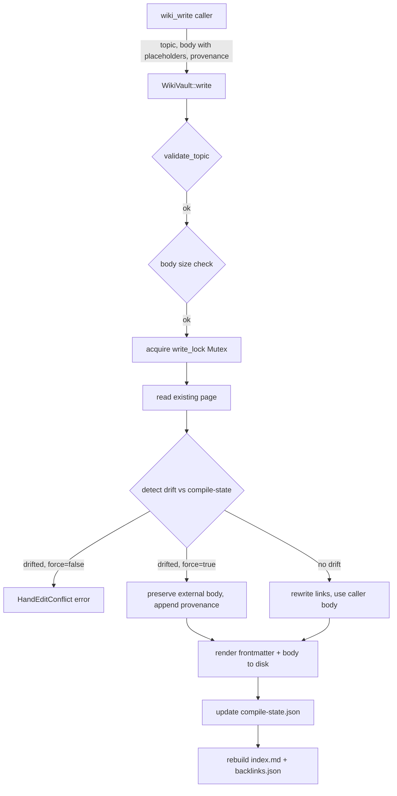

# Memory System — librefang-memory-wiki-src

# Memory Wiki (`librefang-memory-wiki`)

A durable, file-backed markdown knowledge vault for LibreFang Agent OS. Where the memory substrate (`librefang-memory`) excels at vector similarity search over snippets, this crate provides a navigable knowledge base that agents and humans can read and edit — including inside Obsidian or any Markdown editor.

Every page carries structured provenance frontmatter so any reader can audit which agent, session, and turn produced a claim.

## Activation

The vault is **off by default**. Operators opt in through `config.toml`:

```toml
[memory_wiki]
enabled = true
mode = "isolated"            # only mode wired in v1
vault_path = "~/.librefang/wiki/main"
render_mode = "native"       # native | obsidian
ingest_filter = "tagged"     # tagged | all (all has no effect in v1)
```

If `vault_path` is unset, the vault roots itself under the kernel's `home_dir` (not the environment-derived `LIBREFANG_HOME`), so embedded profiles and tests don't mix data with a developer's personal vault.

## Vault Layout

```text
<vault_path>/
  <topic>.md              # one page per topic
  index.md                # auto-generated alphabetical index
  _meta/
    compile-state.json    # mtime + sha256 per page from last compile
    backlinks.json        # { target -> [source, ...] } from every [[link]]
```

Topic filenames map 1:1 to topic strings: `widgets.md` holds the `widgets` topic. The `index` topic and any name starting with `_` are reserved.

## Architecture



## Module Structure

| File | Responsibility |
|------|---------------|
| `lib.rs` | Crate-level docs, re-exports of public types |
| `error.rs` | `WikiError` enum and `WikiResult<T>` alias |
| `frontmatter.rs` | YAML frontmatter parse/render/split; `Frontmatter` and `ProvenanceEntry` types |
| `render.rs` | `RenderMode` enum — link rewriting and extraction |
| `vault.rs` | `WikiVault` — the core read/write/search/backlinks engine |

## Key Types

### `WikiVault`

The primary entry point. Constructed via `WikiVault::new(config, home_dir)` (which checks `enabled` and rejects unsupported modes) or `WikiVault::with_root(...)` for tests.

All mutations go through a `Mutex<()`>` write lock, so concurrent `write` calls to the same vault are serialised.

**Public API:**

| Method | Description |
|--------|-------------|
| `new(config, home_dir)` | Construct from config; returns `WikiError::Disabled` if not opted in |
| `with_root(root, render_mode, ingest_filter)` | Bypass enabled-check; used by tests and after kernel validation |
| `root()` | Vault directory path |
| `render_mode()` | Active `RenderMode` |
| `write(topic, body, provenance, force)` | Create or update a page |
| `get(topic)` | Read a single page |
| `search(query, limit)` | Substring search across all pages |
| `backlinks()` | List all `source → target` backlink entries |

### `Frontmatter`

Structured YAML header on every page:

```yaml
---
topic: project-conventions
created: 2026-05-06T10:30:00Z
updated: 2026-05-06T11:00:00Z
content_sha256: 6a4f...
provenance:
  - agent: agent_xyz
    session: sess_abc
    channel: cli
    turn: 4
    at: 2026-05-06T10:30:00Z
---
```

`content_sha256` is `Frontmatter::hash_body(body)` — a SHA-256 of the body with its trailing newline stripped. This hash is the drift-detection key: if the on-disk hash differs from what the compiler recorded, a human edited the file externally.

When a page has no frontmatter at all (hand-authored in an editor), `Frontmatter::default_for(topic)` synthesises one with `created = updated = now`, empty provenance, and a blank `content_sha256`.

### `ProvenanceEntry`

Tracks the origin of each write: `agent`, optional `session`/`channel`/`turn`, and a timestamp `at`. Provenance is **monotonic** — the vault only ever appends, never removes entries.

### `RenderMode`

Controls how cross-page references are rendered on disk:

| Mode | Link syntax | Example |
|------|------------|---------|
| `Native` | `[topic](topic.md)` | `[widgets](widgets.md)` |
| `Obsidian` | `[[topic]]` | `[[widgets]]` |

The canonical authoring form is always `[[topic]]` (the Obsidian form). Callers pass `[[topic]]` placeholders in the body, and `RenderMode::rewrite_links` rewrites them to the active flavor at flush time. This means a body authored once is portable across render modes without re-authoring.

`RenderMode::extract_links` recognises both forms, so backlink indexing works against pages on disk regardless of which mode wrote them.

### `WikiPage`

A read result: `topic`, `frontmatter`, and `body` (the markdown after the closing `---`).

### `WikiWriteOutcome`

Returned by `write`: includes `topic`, `path`, `content_sha256`, and `merged_with_external_edit` (true when the caller forced an overwrite of a page that had drifted from the compiler state).

### `SearchHit`

A search result with `topic`, `snippet` (context window around the match), and `score`.

### `BacklinkEntry`

A directed edge: `source` page contains a link to `target` page.

## Write Flow in Detail

1. **Topic validation** (`validate_topic`): rejects empty strings, lengths over 100, `index`, `_`-prefixed names, and characters outside `[a-zA-Z0-9_-]`.
2. **Body size check**: rejects bodies over 1 MiB after link rewriting (prevents runaway LLM output from filling disk page-by-page).
3. **Acquire write lock**: serialises concurrent writes.
4. **Read existing page** (`read_page_if_present`): if the file exists, parse its frontmatter and body. CRLF line endings are normalised to LF on read so the `---` delimiter matcher works regardless of platform.
5. **Detect drift**: compare on-disk mtime (nanoseconds) and body SHA-256 against `compile-state.json`. If either differs, the page was hand-edited.
6. **Enforce hand-edit policy**: if drifted and `force = false`, return `WikiError::HandEditConflict`. If drifted and `force = true`, preserve the external body verbatim — only append the new provenance entry.
7. **Rewrite links**: `RenderMode::rewrite_links` converts `[[topic]]` placeholders to the active flavor.
8. **Render page**: `frontmatter::render` serialises the frontmatter to YAML and concatenates the body.
9. **Atomic write** (`atomic_write`): write to a `.tmp.write` file, then `fs::rename` to the final path. Prevents partial writes on crash.
10. **Update compile state**: record the new mtime and SHA-256.
11. **Rebuild index and backlinks**: regenerate `index.md` (alphabetical topic list with links and timestamps) and `_meta/backlinks.json` (target → sorted source list).

## Hand-Edit Safety

This is a core design contract. The vault tracks two signals per page in `compile-state.json`:

- **mtime** (nanoseconds since UNIX epoch): catches any file touch.
- **sha256** of the body: catches content changes even on filesystems with coarse mtime precision (e.g. HFS+ with 1-second resolution).

If both match the last compiler output, the write proceeds normally. If either drifts, the vault knows a human (or external tool) edited the page and refuses the write unless the caller explicitly passes `force = true`.

The forced path is **preservative**: the externally-edited body is kept intact, and only the provenance list is augmented. The next successful compile re-normalises the compile state.

## Search

v1 uses naive case-insensitive substring search. Scoring:

- **Topic match**: +10.0 (an exact substring in the topic name is a strong signal).
- **Body matches**: `ln(1 + count)` — sub-linear weighting so a single long page can't bury short topic-only matches.

Results are sorted by score descending, then topic ascending for deterministic ordering. A snippet (up to ~120 characters centred on the first match) is included with each hit.

Vector search and FTS5 integration are planned follow-ups.

## Error Handling

`WikiError` covers every failure mode:

| Variant | When |
|---------|------|
| `Disabled` | `enabled = true` not set in config |
| `ModeNotImplemented` | `bridge` or `unsafe_local` mode requested (v1 stubs) |
| `InvalidTopic` | Topic fails validation |
| `BodyTooLarge` | Body exceeds 1 MiB |
| `NotFound` | No `.md` file for the topic |
| `HandEditConflict` | External edit detected, `force = false` |
| `Frontmatter` | YAML parse error in a page header |
| `Io` | Filesystem error at a given path |

The `Io` variant wraps `std::io::Error` with the path that failed, making diagnostics actionable. `Frontmatter` wraps `serde_yaml::Error` with the topic name.

## Frontmatter Parsing Details

The `frontmatter::split` function extracts the optional YAML block and body from raw page content. It tolerates:

- **Missing frontmatter**: pages hand-authored without any `---` block return `(None, raw)` — the full content becomes the body.
- **Trailing newline variance**: `Frontmatter::hash_body` strips the trailing newline before hashing, so an editor adding or removing a final newline doesn't flip the hash.
- **CRLF line endings**: `read_page_if_present` normalises `\r\n` to `\n` before calling `split`. Without this, a `\r\n` in the opening `---\r\n` would cause the LF-only delimiter matcher to treat the entire YAML header as body content.
- **Malformed YAML**: if `serde_yaml` fails to parse the frontmatter block, the vault falls back to `Frontmatter::default_for(topic)` rather than failing the read — the body remains accessible, and a subsequent `wiki_write` repairs the header.

The `render` → `split` round-trip is guaranteed: `split(render(fm, body))` yields the same `body` (modulo trailing newline normalisation).

## CRLF and Cross-Platform Compatibility

The vault's own `frontmatter::render` always emits `\n` line endings. However, external editors on Windows (or git checkouts with `core.autocrlf = true`) may re-save files with `\r\n`. The read path normalises these on the fly, so:

- Frontmatter parsing works regardless of line ending style.
- Body content is returned with `\n` endings.
- Subsequent writes re-emit `\n` endings.

## Concurrency

`WikiVault` uses an internal `Mutex<()>` to serialise writes. Concurrent `write` calls to the same topic from different threads will proceed one at a time. Each serialised write updates the compile state, so the later write sees the earlier one's state and can detect drift correctly.

Reads (`get`, `search`, `backlinks`) are not locked — they read from the filesystem directly, which is safe because `atomic_write` uses `fs::rename` (atomic on POSIX) and the content is immutable once renamed.

## Integration Points

The crate re-exports configuration types from `librefang-types`:

- `MemoryWikiConfig` — the `[memory_wiki]` section of the kernel config.
- `MemoryWikiMode` — `Isolated`, `Bridge`, `UnsafeLocal`.
- `MemoryWikiRenderMode` — `Native`, `Obsidian`.
- `MemoryWikiIngestFilter` — `Tagged`, `All`.

The vault is consumed by the runtime through three builtin tools (`wiki_get`, `wiki_search`, `wiki_write`) which map directly to `WikiVault::get`, `WikiVault::search`, and `WikiVault::write`.

## v1 Scope Boundaries

**In scope:**
- `isolated` mode with its own vault directory.
- Explicit write-through via `wiki_write` tool calls.
- `native` and `obsidian` render modes.
- Hand-edit detection and preservative merging.

**Out of scope (tracked as #3329 follow-ups):**
- `bridge` mode — reading shared artifacts from the memory substrate.
- `unsafe_local` mode — same-machine escape hatch for an existing Obsidian vault.
- Memory-event subscription — v1 ingests only via explicit `wiki_write` calls, not via `memory_store` hooks.
- LLM-assisted topic extraction — topics must be provided explicitly.
- `memory_search` cross-corpus parameter — extending the runtime tool is a separate change.