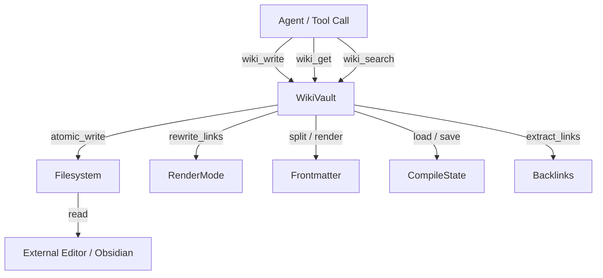

# Memory System — librefang-memory-wiki-src

# Memory Wiki (`librefang-memory-wiki`)

A durable, file-backed Markdown knowledge vault for the LibreFang Agent OS. Complements `librefang-memory` (SQLite + vector substrate) by providing a navigable knowledge base that is also editable in external tools like Obsidian. Every page carries structured provenance frontmatter so any reader can audit where a claim originated.

The vault is **disabled by default**. Operators opt in via configuration:

```toml
[memory_wiki]
enabled = true
mode = "isolated"
vault_path = "~/.librefang/wiki/main"
render_mode = "native"       # native | obsidian
ingest_filter = "tagged"     # tagged | all
```

## Architecture


```mermaid
graph TD
    A[Agent / Tool Call] -->|wiki_write| V[WikiVault]
    A -->|wiki_get| V
    A -->|wiki_search| V
    V -->|atomic_write| FS[Filesystem]
    V -->|rewrite_links| R[RenderMode]
    V -->|split / render| FM[Frontmatter]
    V -->|load / save| CS[CompileState]
    V -->|extract_links| BL[Backlinks]
    FS -->|read| HAND[External Editor / Obsidian]
```

## On-Disk Layout

Under the configured `vault_path`:

```
<topic>.md              One page per topic; YAML frontmatter + Markdown body
index.md                Auto-generated alphabetical topic index
_meta/
  compile-state.json    mtime + sha256 of every page from last compile
  backlinks.json        { target -> [source, ...] } extracted from [[link]] references
```

The `_meta/` directory and `index.md` are owned by the vault. Pages whose names start with `_` or equal `index` are rejected for user content.

## Module Structure

| Source | Purpose |
|---|---|
| `lib.rs` | Public re-exports, crate-level documentation, v1 scope description |
| `error.rs` | `WikiError` enum and `WikiResult<T>` type alias |
| `frontmatter.rs` | YAML frontmatter parsing, serialisation, body hashing |
| `render.rs` | `RenderMode` enum; link rewriting and extraction |
| `vault.rs` | `WikiVault` — the primary store with read/write/search operations |

## Key Types

### `WikiVault`

The central type. Created via `WikiVault::new(config, home_dir)` which validates configuration, or `WikiVault::with_root(root, render_mode, ingest_filter)` which bypasses the `enabled` check (used by tests and by `KernelHandle` after it has already validated).

All public methods:

| Method | Description |
|---|---|
| `write(topic, body, provenance, force)` | Create or update a page. Rewrites `[[link]]` placeholders into the active render flavor. Detects external hand-edits. |
| `get(topic)` | Read a single page. Returns `WikiError::NotFound` if absent. |
| `search(query, limit)` | Case-insensitive substring search across all page bodies and topic names. |
| `backlinks()` | Return every source→target link relationship tracked by the vault. |
| `root()` | The vault's filesystem root path. |
| `render_mode()` | The active `RenderMode`. |

Write operations are serialised through an internal `Mutex` to prevent concurrent corruption.

### `WikiPage`

```rust
pub struct WikiPage {
    pub topic: String,
    pub frontmatter: Frontmatter,
    pub body: String,
}
```

Returned by `get()`. The `body` field contains the raw Markdown as it appears on disk (links already rendered in the active flavor).

### `Frontmatter` and `ProvenanceEntry`

Every page carries a YAML header:

```yaml
---
topic: project-conventions
created: 2026-05-06T10:30:00Z
updated: 2026-05-06T11:00:00Z
content_sha256: 6a4f...
provenance:
  - agent: agent_xyz
    session: sess_abc
    channel: cli
    turn: 4
    at: 2026-05-06T10:30:00Z
---
```

`content_sha256` is computed by `Frontmatter::hash_body()` — a SHA-256 of the body with trailing newlines normalised. This hash is what the hand-edit detector compares against.

The frontmatter parser is tolerant: pages hand-authored without any YAML block still load successfully. `Frontmatter::default_for(topic)` synthesises a header with `created = updated = now`, empty provenance, and an empty hash that gets recomputed on the next compiler pass. Malformed YAML falls back gracefully with a warning log rather than failing the read.

### `RenderMode`

```rust
pub enum RenderMode {
    Native,    // [topic](topic.md)
    Obsidian,  // [[topic]]
}
```

Only affects how cross-references are rendered. The canonical authoring form is always `[[topic]]` — callers pass this placeholder and the vault rewrites at flush time. This means a body authored once is portable across render modes.

### `WikiError`

| Variant | When it occurs |
|---|---|
| `Disabled` | Config has `enabled = false` (the default) |
| `ModeNotImplemented` | `bridge` or `unsafe_local` mode requested (v1 only supports `isolated`) |
| `InvalidTopic` | Empty topic, exceeds 100 chars, uses `index`, starts with `_`, or contains characters outside `[a-zA-Z0-9_-]` |
| `BodyTooLarge` | Page body exceeds the 1 MiB cap (measured after link rewriting) |
| `NotFound` | No `.md` file for the requested topic |
| `HandEditConflict` | File was modified externally since last compile; caller must pass `force = true` |
| `Frontmatter` | YAML parse error in a page header |
| `Io` | Filesystem error, annotated with the affected path |

## Write Flow in Detail

`WikiVault::write()` is the most complex operation. Its execution path:

1. **Validate topic** — reject empty, overlong, reserved, or illegal-character topics.
2. **Pre-check body size** — reject if the raw input already exceeds the 1 MiB cap.
3. **Acquire write lock** — serialises concurrent writes to the same vault.
4. **Load compile state** — reads `_meta/compile-state.json` (or starts fresh).
5. **Read existing page** (if present) — via `read_page_if_present()`, which normalises CRLF → LF before parsing.
6. **Detect drift** — compare on-disk mtime and body sha256 against compile state. If either diverged, an external edit occurred.
7. **Resolve body**:
   - If the page drifted and `force = false` → return `HandEditConflict`.
   - If the page drifted and `force = true` → preserve the external body verbatim (only provenance is augmented).
   - Otherwise → rewrite `[[link]]` placeholders via `RenderMode::rewrite_links()`.
8. **Post-check body size** — the authoritative cap, enforced on the materialised body that will actually land on disk. This catches cases where link expansion pushes a body over the limit.
9. **Build frontmatter** — append the new `ProvenanceEntry`, update timestamps, compute `content_sha256`.
10. **Render to disk** — `frontmatter::render()` serialises the page, then `atomic_write()` writes to a `.tmp.write` file and renames.
11. **Update compile state** — record the new mtime and sha256.
12. **Rebuild index and backlinks** — scan all pages, extract links, write `index.md` and `_meta/backlinks.json`.

## Hand-Edit Safety

This is a core acceptance criterion. The vault never silently overwrites a human edit:

- **Compile state** (`_meta/compile-state.json`) records the mtime and body sha256 of every page at the end of each successful write.
- On the next write, the vault re-reads the file and compares. If either value changed, the file was edited externally.
- Without `force = true`, the write is rejected with `WikiError::HandEditConflict`.
- With `force = true`, the external body is preserved. The `WikiWriteOutcome.merged_with_external_edit` flag signals to the caller that a human edit was kept.

The dual check (mtime **and** sha256) handles filesystems with coarse mtime granularity (e.g. HFS+ with 1-second precision) — a body change that happens within the same mtime tick still triggers detection via the hash.

## Link Handling

Callers always author links as `[[topic]]`. The vault rewrites them at write time:

| Render Mode | `[[topic]]` becomes |
|---|---|
| `Native` | `[topic](topic.md)` |
| `Obsidian` | `[[topic]]` (identity) |

`RenderMode::extract_links()` recognises both forms when building the backlinks index, so the index is invariant under render-mode flips. The native-form matcher only accepts links where the visible text equals the target stem (`[foo](foo.md)` matches; `[click here](foo.md)` does not), which avoids false positives from arbitrary Markdown links.

## Search

`WikiVault::search()` is a naive case-insensitive substring scan across all pages. Scoring:

- Topic name contains the query: **+10 points**
- Body matches: **ln(1 + match_count)** — sub-linear weighting prevents long pages from drowning shorter topic-level matches.

Results are ordered by score descending, then topic name ascending. This is sufficient for v1's small vaults; vector/FTS5 ranking is a planned follow-up.

## CRLF Tolerance

Editors on Windows or git checkouts with `core.autocrlf = true` save files with `\r\n` line endings. The vault's delimiter matcher is LF-only, so `read_page_if_present()` normalises CRLF → LF before parsing. Without this, a hand-authored frontmatter block would be treated as absent and the YAML would leak into the body, corrupting the page on the next forced write.

## Body Size Cap

The 1 MiB limit (`MAX_BODY_BYTES`) is enforced on the materialised body — after `rewrite_links()` has expanded placeholders. This matters because in `Native` mode, each `[[topic]]` (5 bytes) expands to `[topic](topic.md)` (9+ bytes). A body just under the cap pre-rewrite can exceed it post-rewrite, and only the post-rewrite check catches this reliably.

## Topic Validation Rules

Enforced by `validate_topic()`:

- Must not be empty
- Maximum 100 characters
- Must not equal `index` (reserved for the auto-generated index)
- Must not start with `_` (reserved for vault metadata)
- Must match `[a-zA-Z0-9_-]+`

## Thread Safety

`WikiVault` uses an internal `Mutex<()>` to serialise writes. Concurrent writes to the same topic from different threads are safe — they will be serialised and the provenance list will accumulate all entries. The hand-edit detector may reject some writes in a tight race (a previous write already updated mtime/sha), but no data is lost.

## Connections to the Wider Codebase

The vault integrates with the rest of LibreFang at several points:

- **Configuration**: `WikiVault::new()` receives a `MemoryWikiConfig` from `librefang_types::config`. The `resolved_vault_path()` method on that config uses the kernel's `home_dir` rather than an environment variable, so embedded profiles and tests don't mix data with a developer's `~/.librefang/wiki/main`.
- **ACP and tool runner**: `frontmatter::split()` is called from `librefang-cli/src/acp.rs`, `librefang-api/src/acp_pipe.rs`, and `src/tool_runner/shell.rs` — these modules parse vault pages to extract frontmatter for their own purposes.
- **Tools**: Three builtin tools (`wiki_get`, `wiki_search`, `wiki_write`) are the primary external interface, wired through the runtime's tool surface.
- **Acceptance tests**: External integration tests in `tests/wiki_acceptance.rs` validate round-tripping, render modes, hand-edit preservation, backlinks, and provenance accumulation.

## v1 Scope and Limitations

**In scope:**
- `isolated` mode only
- Explicit `wiki_write` calls for ingestion
- Substring search (no vector/semantic ranking)
- Manual topic tagging (no LLM-assisted extraction)

**Out of scope (tracked as follow-ups):**
- `bridge` mode — reading shared artifacts from the memory substrate
- `unsafe_local` mode — same-machine Obsidian vault escape hatch
- Memory-event subscription — automatic ingestion when the memory substrate changes
- `memory_search` cross-corpus parameter — extending the runtime's search tool to include wiki content