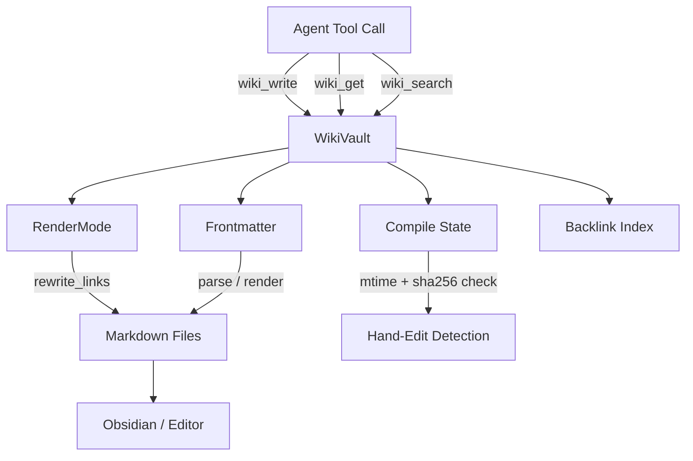

# Memory System — librefang-memory-wiki-src

# librefang-memory-wiki

Durable markdown knowledge vault for the LibreFang Agent OS. Complements `librefang-memory` (the SQLite + vector substrate) by providing a navigable, human-readable knowledge base that agents write to and operators can open directly in Obsidian or any Markdown editor.

Every page carries YAML frontmatter with full provenance — which agent, session, channel, and turn produced the content and when — so any reader can audit where a claim originated.

The vault is **disabled by default**. Operators opt in via config:

```toml
[memory_wiki]
enabled = true
mode = "isolated"
vault_path = "~/.librefang/wiki/main"
render_mode = "native"       # native | obsidian
ingest_filter = "tagged"     # tagged | all
```

## Architecture


```mermaid
graph TD
    A[Agent Tool Call] -->|wiki_write| B[WikiVault]
    A -->|wiki_get| B
    A -->|wiki_search| B
    B --> C[RenderMode]
    C -->|rewrite_links| D[Markdown Files]
    B --> E[Frontmatter]
    E -->|parse / render| D
    B --> F[Compile State]
    B --> G[Backlink Index]
    D --> H[Obsidian / Editor]
    F -->|mtime + sha256 check| I[Hand-Edit Detection]
```

The vault is file-based. Each topic maps to a single `<topic>.md` file under the vault root. Metadata lives in `_meta/`. All writes are serialised through a process-local `Mutex` and persisted atomically (write to `.tmp.write`, then `rename`).

## On-Disk Layout

```
<vault_path>/
├── <topic>.md              # one page per topic
├── index.md                # auto-generated alphabetical index
└── _meta/
    ├── compile-state.json  # mtime + sha256 per page from last compile
    └── backlinks.json      # { target -> [source, ...] } from every link
```

### Page Format

```markdown
---
topic: project-conventions
created: 2026-05-06T10:30:00Z
updated: 2026-05-06T11:00:00Z
content_sha256: 6a4f...
provenance:
  - agent: agent_xyz
    session: sess_abc
    channel: cli
    turn: 4
    at: 2026-05-06T10:30:00Z
---

body markdown ...
```

`content_sha256` is the SHA-256 of the body after stripping one trailing newline. The vault uses this — alongside mtime — to detect whether a file was edited externally between compiler runs.

## Key Types

| Type | Module | Purpose |
|------|--------|---------|
| `WikiVault` | `vault` | Top-level store; holds the root path, render mode, and write lock. All CRUD operations are methods here. |
| `WikiPage` | `vault` | A single page: topic, frontmatter, body string. |
| `Frontmatter` | `frontmatter` | Typed YAML header: topic, timestamps, content hash, provenance chain. |
| `ProvenanceEntry` | `frontmatter` | Single audit record: agent, optional session/channel/turn, timestamp. |
| `RenderMode` | `render` | Link flavor: `Native` (`[topic](topic.md)`) or `Obsidian` (`[[topic]]`). |
| `WikiWriteOutcome` | `vault` | Returned from `write()`: path, sha256, whether an external edit was preserved. |
| `SearchHit` | `vault` | A search result with topic, snippet, and score. |
| `BacklinkEntry` | `vault` | A directed edge: source page → target page. |
| `WikiError` | `error` | All error variants for the crate. |

## Core Operations

### `WikiVault::new(config, home_dir) -> WikiResult<WikiVault>`

Validates config, checks `enabled`, and dispatches on `mode`. Only `Isolated` mode is wired in v1; `Bridge` and `UnsafeLocal` return `WikiError::ModeNotImplemented`. Creates the vault root and `_meta/` directory.

When `config.vault_path` is unset, the resolved path falls under `home_dir` (the kernel's home directory), not the environment-derived `LIBREFANG_HOME`, so embedded profiles and tests don't mix data with a developer's personal vault.

### `WikiVault::write(topic, body, provenance, force) -> WikiResult<WikiWriteOutcome>`

The primary write path. Steps:

1. **Validate topic** — must match `[a-zA-Z0-9_-]+`, max 100 chars, cannot be `index` or start with `_`.
2. **Enforce body cap** — 1 MiB after link rewriting. Returns `WikiError::BodyTooLarge` if exceeded.
3. **Acquire write lock** — `Mutex` ensures concurrent writes to the same vault are serialised.
4. **Detect external edits** — compare on-disk mtime and body sha256 against `compile-state.json`. If either drifted and `force` is false, return `WikiError::HandEditConflict`.
5. **Choose body** — when `force` is used over an external edit, the on-disk body is preserved (only provenance is appended). Otherwise the caller's body is rewritten for the active render mode.
6. **Update frontmatter** — `updated` is set to now; the new `ProvenanceEntry` is appended to the existing chain. Provenance is strictly monotonic; the vault never drops history.
7. **Atomic write** — serialize frontmatter + body, write to a `.tmp.write` file, then `rename`.
8. **Rebuild indices** — update `compile-state.json` for the written page, regenerate `index.md` and `backlinks.json`.

### `WikiVault::get(topic) -> WikiResult<WikiPage>`

Reads the page file, normalises CRLF to LF, splits frontmatter from body, and parses the YAML. Tolerates missing or malformed frontmatter — a synthetic default is substituted so the body remains accessible even after a bad hand-edit. Returns `WikiError::NotFound` if no file exists.

### `WikiVault::search(query, limit) -> WikiResult<Vec<SearchHit>>`

Case-insensitive substring search across all page bodies and topics. Scoring:

- Topic match: +10.0
- Body matches: `ln(1 + count)` — sub-linear weighting prevents long pages from drowning short topic-only matches.

Results are ordered by score descending, then topic ascending. Snippets are extracted with ~60 characters of context around the first match.

### `WikiVault::backlinks() -> WikiResult<Vec<BacklinkEntry>>`

Returns the full backlink index built during the last write. Deterministic order: target ascending, then source ascending.

## Link Rendering

All `wiki_write` callers author body markdown using the canonical `[[topic]]` placeholder syntax. The vault rewrites these at flush time according to the active `RenderMode`:

| Mode | Output | Target Audience |
|------|--------|-----------------|
| `Native` | `[topic](topic.md)` | Generic Markdown renderers |
| `Obsidian` | `[[topic]]` | Obsidian / Logseq |

Bodies authored in one mode are portable to the other — `rewrite_links` always converts from `[[...]]` placeholders, and the on-disk representation can be re-rendered without data loss.

### Backlink Extraction

`RenderMode::extract_links(body)` recognises both authoring forms:

1. `[[topic]]` — the canonical placeholder / Obsidian syntax.
2. `[topic](topic.md)` — native-rendered links, but only when the visible text equals the target stem. This avoids false positives from generic Markdown links like `[see this](docs/intro.md)`.

## Hand-Edit Safety

A core acceptance criterion: external edits (human edits in Obsidian, git merges, etc.) are never silently overwritten.

The detection mechanism uses two signals stored in `_meta/compile-state.json`:

- **mtime** (nanoseconds since epoch) — catches any file save.
- **body sha256** — catches content drift even on filesystems with coarse mtime precision (HFS+).

If either drifts from the last compiler record, `write()` returns `WikiError::HandEditConflict` unless the caller passes `force = true`. The forced path:

- Preserves the external body verbatim.
- Appends the new provenance entry.
- Re-renders links in the preserved body for the active mode.
- Sets `WikiWriteOutcome::merged_with_external_edit = true`.

## CRLF Tolerance

Editors on Windows (and git checkouts with `core.autocrlf=true`) may save files with `\r\n` line endings. Since the frontmatter delimiter matcher is LF-only, `read_page_if_present` normalises CRLF to LF before parsing. The vault's own `render()` always emits `\n`, so this normalisation only affects externally-authored content.

## Error Handling

All errors flow through `WikiError`:

| Variant | When |
|---------|------|
| `Disabled` | `enabled` is false in config |
| `ModeNotImplemented` | `bridge` or `unsafe_local` mode requested in v1 |
| `InvalidTopic` | Empty, too long, reserved name, or bad characters |
| `BodyTooLarge` | Body exceeds 1 MiB |
| `NotFound` | No `.md` file for the topic |
| `HandEditConflict` | External edit detected and `force` is false |
| `Frontmatter` | YAML parse error in a page header |
| `Io` | Filesystem error with path context |

`WikiResult<T>` is the standard return type across the crate.

## Topic Validation Rules

Topics must satisfy all of:

- Non-empty, max 100 characters.
- Characters limited to `[a-zA-Z0-9_-]`.
- Cannot be `index` (reserved for the auto-generated index).
- Cannot start with `_` (reserved for vault metadata).

## Provenance Chain

Each `ProvenanceEntry` records:

```rust
pub struct ProvenanceEntry {
    pub agent: String,
    pub session: Option<String>,
    pub channel: Option<String>,
    pub turn: Option<u64>,
    pub at: DateTime<Utc>,
}
```

The list is append-only. Repeated writes to the same topic accumulate entries, giving a full edit history within the frontmatter.

## v1 Scope and Limitations

**In scope:**
- `isolated` mode only — own vault, own writes, no dependency on the memory plugin.
- Three tools: `wiki_get`, `wiki_search`, `wiki_write`.
- `native` and `obsidian` render modes.
- Hand-edit safety with mtime + sha256 detection.

**Out of scope (tracked under #3329 follow-ups):**
- `bridge` mode — reading shared artifacts from the memory substrate.
- `unsafe_local` mode — same-machine escape hatch for existing Obsidian vaults.
- Memory-event subscription (`memory_store` durable filter). v1 ingests only via explicit `wiki_write` calls.
- LLM-assisted topic extraction. v1 requires explicit topic tags.
- `memory_search` cross-corpus parameter (`corpus = all|kv|wiki`). Extending that touches the runtime tool surface and should land separately so the wiki crate stays independently usable.
- `ingest_filter = "all"` — accepted in config but has no behavioural effect in v1; a warning is logged.