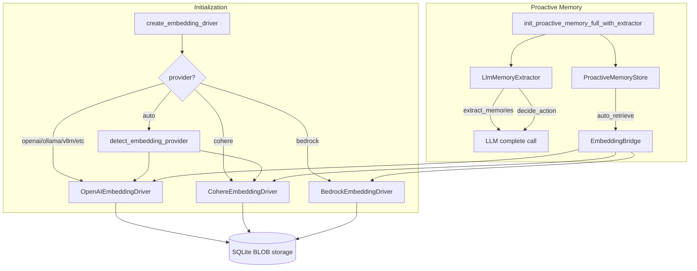

# Memory System — librefang-runtime-src

# Memory System — `librefang-runtime`

## Overview

This module provides the runtime layer for LibreFang's semantic memory system. It contains two subsystems:

1. **Embedding drivers** (`embedding.rs`) — compute vector representations of text for similarity search, with support for multiple cloud and local providers.
2. **Proactive memory** (`proactive_memory.rs`) — automatically extract facts from conversations and inject relevant context into agent turns, using LLM-powered extraction and conflict resolution.



## Embedding Drivers

### The `EmbeddingDriver` Trait

All drivers implement `EmbeddingDriver` — an async trait that abstracts vector computation:

```rust
#[async_trait]
pub trait EmbeddingDriver: Send + Sync {
    async fn embed(&self, texts: &[&str]) -> Result<Vec<Vec<f32>>, EmbeddingError>;
    async fn embed_one(&self, text: &str) -> Result<Vec<f32>, EmbeddingError>; // default impl
    fn dimensions(&self) -> usize;
    async fn embed_image(&self, _image_data: &[u8]) -> Result<Vec<f32>, EmbeddingError>; // optional
    fn supports_images(&self) -> bool { false }
}
```

- **`embed`** — batch embedding. Returns one vector per input text.
- **`embed_one`** — convenience wrapper around `embed` for single texts.
- **`dimensions`** — returns the vector length. Used for schema initialization and index sizing.
- **`embed_image` / `supports_images`** — optional multimodal support. Returns `Unsupported` by default.

### Provider Implementations

#### `OpenAIEmbeddingDriver`

Works with any provider that exposes the `/v1/embeddings` endpoint. Supported providers:

| Provider | Auth | Notes |
|----------|------|-------|
| OpenAI | `OPENAI_API_KEY` | Default 1536-dim models |
| OpenRouter | `OPENROUTER_API_KEY` | Proxies multiple model families |
| Mistral | `MISTRAL_API_KEY` | `mistral-embed` |
| Together | `TOGETHER_API_KEY` | Open-source models |
| Fireworks | `FIREWORKS_API_KEY` | `nomic-ai/nomic-embed-text-v1.5` etc. |
| Ollama | No key required | Local, defaults to `localhost:11434` |
| vLLM | No key required | Local, defaults to `localhost:8000` |
| LM Studio | No key required | Local, defaults to `localhost:1234` |

**Groq is intentionally excluded** — it has no embeddings endpoint (only chat + Whisper), so auto-wiring it would produce silent 404s.

Request shape:
```json
{
  "model": "text-embedding-3-small",
  "input": ["text1", "text2"]
}
```

The `/v1` path segment is automatically appended to base URLs for known providers when missing.

#### `CohereEmbeddingDriver`

Cohere's API is not OpenAI-compatible — it uses a different endpoint (`/v2/embed`), different request shape (`texts` + required `input_type`), and a different response structure (embeddings nested under `embeddings.float`). A dedicated driver is required; sending Cohere requests through `OpenAIEmbeddingDriver` produces 404s.

Key behaviors:

- **Batch limit**: 96 texts per request (Cohere rejects larger batches; this driver fails fast with a clear error).
- **`input_type`**: Cohere v3 models produce asymmetric embeddings. The driver defaults to `search_document` (optimized for indexing). Override via `LIBREFANG_COHERE_INPUT_TYPE` env var with one of: `search_document`, `search_query`, `classification`, `clustering`. Invalid values are ignored with a warning.
- **Model fallback**: If a non-Cohere model name is passed (e.g., `text-embedding-3-small` from auto-detect), the driver falls back to `embed-multilingual-v3.0` with a warning, rather than sending a name Cohere would reject.
- **API key required at construction**: Unlike the OpenAI driver (which accepts empty keys for local providers), Cohere rejects unauthenticated calls, so the driver fails immediately at `new()` if the key is empty.
- **Base URL required**: No hardcoded fallback — must come from the model catalog or explicit config.

#### `BedrockEmbeddingDriver`

Uses Amazon Bedrock embedding models (Titan, Cohere on Bedrock) via manually-signed SigV4 REST calls. This avoids pulling in the full `aws-sdk-*` dependency tree.

Key behaviors:

- **Per-text invocation**: Bedrock's Titan `/invoke` endpoint accepts a single `inputText` per call, so `embed` loops over texts sequentially.
- **Credential source**: Reads `AWS_ACCESS_KEY_ID`, `AWS_SECRET_ACCESS_KEY`, and optionally `AWS_SESSION_TOKEN` from environment variables. Region defaults to `us-east-1` unless `AWS_REGION` or an explicit override is provided.
- **SigV4 signing**: Minimal implementation in `sigv4_auth_header()` covering POST + JSON body (the only shape Bedrock invoke uses). Derived keys are produced by `sigv4_signing_key()`.

### Driver Factory: `create_embedding_driver`

```rust
pub fn create_embedding_driver(
    provider: &str,
    model: &str,
    api_key_env: &str,
    custom_base_url: Option<&str>,
    dimensions_override: Option<usize>,
) -> Result<Box<dyn EmbeddingDriver + Send + Sync>, EmbeddingError>
```

Central factory function. Routing logic:

1. **`provider == "auto"`** → calls `detect_embedding_provider()`, then recurses with the detected name.
2. **`provider == "bedrock"`** → creates `BedrockEmbeddingDriver`. `custom_base_url` is interpreted as a region override.
3. **`provider == "cohere"`** → creates `CohereEmbeddingDriver`. Validates API key presence, resolves base URL (required), remaps non-Cohere model names.
4. **All others** → creates `OpenAIEmbeddingDriver`. Cloud providers require a base URL from the model catalog. Local providers (`ollama`, `vllm`, `lmstudio`) have hardcoded defaults.

**Security**: Emits a `warn!` log when the resolved base URL is not localhost, alerting operators that text content will leave the machine.

### Auto-Detection: `detect_embedding_provider`

Checks environment variables in priority order:

1. `OPENAI_API_KEY` → `"openai"`
2. `OPENROUTER_API_KEY` → `"openrouter"`
3. `MISTRAL_API_KEY` → `"mistral"`
4. `TOGETHER_API_KEY` → `"together"`
5. `FIREWORKS_API_KEY` → `"fireworks"`
6. `COHERE_API_KEY` → `"cohere"`
7. `OLLAMA_HOST` (non-empty) → `"ollama"`
8. `None` if nothing is set

`GROQ_API_KEY` is deliberately absent from this list.

### Dimension Inference

Both `infer_dimensions` (OpenAI/Bedrock) and `infer_cohere_dimensions` map known model names to their vector lengths. Unknown models default to 1536 (OpenAI) or 1024 (Cohere). Callers can override with `dimensions_override` in `EmbeddingConfig`.

Known dimension mappings:

| Model | Dimensions |
|-------|-----------|
| `text-embedding-3-small` | 1536 |
| `text-embedding-3-large` | 3072 |
| `text-embedding-ada-002` | 1536 |
| `all-MiniLM-L6-v2` | 384 |
| `all-mpnet-base-v2` | 768 |
| `nomic-embed-text` | 768 |
| `amazon.titan-embed-text-v1` | 1536 |
| `amazon.titan-embed-text-v2:0` | 1024 |
| `embed-english-v3.0` | 1024 |
| `embed-multilingual-v3.0` | 1024 |
| `embed-english-light-v3.0` | 384 |
| `embed-english-v2.0` | 4096 |

### Utility Functions

- **`cosine_similarity(a, b)`** — dot product normalized by magnitudes. Returns `0.0` for mismatched lengths or zero vectors.
- **`embedding_to_bytes` / `embedding_from_bytes`** — serialize `Vec<f32>` to/from little-endian byte vectors for SQLite BLOB storage.

### Error Handling

`EmbeddingError` variants cover the full lifecycle:

| Variant | When |
|---------|------|
| `Http` | Network/transport failures |
| `Api { status, message }` | Non-200 response from provider |
| `Parse` | JSON deserialization failures |
| `MissingApiKey` | Required env var unset or empty |
| `InvalidInput` | Bad batch size, missing config |
| `Unsupported` | Image embeddings on non-vision drivers |

---

## Proactive Memory

### Architecture

The proactive memory system has two operating modes:

- **`auto_retrieve`** — before each agent turn, embed the user's message and retrieve semantically similar memories from the store, injecting them as context.
- **`auto_memorize`** — after each agent turn, extract factual memories from the conversation and persist them.

Both are controlled by `ProactiveMemoryConfig`. If both flags are false, `init_proactive_memory` returns `None` and the system is inert.

### Initialization Chain

```
init_proactive_memory                         → basic (no LLM, no embedding)
init_proactive_memory_with_llm                → LLM extractor only
init_proactive_memory_with_embedding          → embedding driver only
init_proactive_memory_full                    → both, returns Arc<ProactiveMemoryStore>
init_proactive_memory_full_with_extractor     → both, also returns LlmMemoryExtractor
```

The `_with_extractor` variant exists because the kernel needs the concrete `LlmMemoryExtractor` handle to wire up internal references. The store only holds a `dyn MemoryExtractor` trait object.

### `EmbeddingBridge`

A thin adapter that wraps the runtime's `EmbeddingDriver` to implement `librefang_memory::proactive::EmbeddingFn`:

```rust
struct EmbeddingBridge(Arc<dyn EmbeddingDriver + Send + Sync>);
```

This breaks the circular dependency: `librefang-memory` defines the trait, `librefang-runtime` owns the concrete drivers, and the bridge connects them without either crate depending on the other.

### `LlmMemoryExtractor`

Uses an LLM to extract structured memories from conversation text. Implements the `MemoryExtractor` trait from `librefang-types`.

#### `extract_memories`

1. **Conversation condensation**: Iterates messages, skipping `system` and `unknown` roles. Joins remaining content as `"{role}: {content}\n"`, truncating at 8000 characters at the last complete message boundary.
2. **LLM call**: Sends the condensed conversation to the LLM with a detailed extraction system prompt (`build_extraction_prompt`). Uses JSON response format and temperature 0.1 for consistency.
3. **Parsing**: `parse_llm_extraction_response` handles:
   - New format: `{"memories": [...], "relations": [...]}`
   - Legacy format: `[...]` (array of memories, no relations)
   - Markdown code blocks wrapping JSON (```json ... ```)
   - Content truncation at 2000 chars with UTF-8-safe boundary handling
   - Missing optional fields (defaults: category → `"general"`, level → `Session`, relation types → `"concept"`)

The extraction prompt instructs the LLM to produce nuanced, actionable memories rather than flat database entries, with explicit priority ordering (communication style > frustrations > preferences > work style > technical background > project context > personal details).

#### `extract_memories_with_agent_id`

Originally designed for a fork-based extraction path that would share the parent agent's prompt cache. The fork approach was removed because it cannot thread `response_format: json_object` through `run_forked_agent_oneshot`, causing weak models to reply in prose instead of JSON. This method now delegates directly to `extract_memories`. The `agent_id` parameter is retained for forward compatibility.

#### `decide_action`

LLM-powered conflict resolution for ADD/UPDATE/NOOP decisions:

1. If no existing memories → `Add` immediately (no LLM call).
2. Otherwise, sends the new memory and existing candidates to the LLM with `DECISION_SYSTEM_PROMPT`.
3. `parse_decision_response` handles:
   - Case-insensitive action strings
   - `existing_id` as UUID string or numeric (1-based index)
   - Invalid/missing IDs falling back to `Add` (safe: may duplicate but never silently drops information)
   - Markdown code blocks wrapping the response
   - Unparseable responses defaulting to `Add`

If the LLM call fails entirely, falls back to `DefaultMemoryExtractor`'s heuristic.

#### `format_context`

Formats retrieved memories for injection into the agent's context. The template explicitly instructs the agent not to mechanically recite memories ("NEVER say 'based on my memory...'") and to let remembered preferences silently guide behavior.

### Prompt Caching

Both extraction and decision calls support `prompt_caching` (controlled by `KernelConfig.prompt_caching`). When enabled, the stable system prompts (`EXTRACTION_SYSTEM_PROMPT`, `DECISION_SYSTEM_PROMPT`) get `cache_control` markers for Anthropic's prompt caching. Non-Anthropic providers ignore the flag, so enabling it is safe cross-provider.

The system prompts are deliberately separate from the agent's own system prompt — they're optimized for extraction quality, not for sharing cache keys with the main conversation.

### Key Constants

| Constant | Value | Purpose |
|----------|-------|---------|
| `MAX_EXTRACTION_CHARS` | 8000 | Conversation text sent to extraction LLM |
| `MAX_MEMORY_CONTENT_LENGTH` | 2000 | Maximum chars per extracted memory |
| `COHERE_EMBED_MAX_BATCH` | 96 | Cohere API batch limit |
| Decision timeout | 15s | `decide_action` LLM call timeout |
| Extraction timeout | 30s | `extract_memories` LLM call timeout |

### Response Parsing: `strip_code_block`

Handles the common case where LLMs wrap JSON in markdown code blocks:

- Strips leading text before the first ` ``` `
- Skips language tags (json, JSON, etc.)
- Extracts content between first ` ``` ` and last ` ``` `
- Passes through plain JSON unchanged

---

## Error Philosophy

The module follows a "never silently drop information" principle:

- Unparseable extraction responses produce empty results (no crash, no partial data).
- Unparseable decision responses default to `Add` (may duplicate, but won't lose new facts).
- Missing API keys fail at driver construction, not at first embed call.
- External API usage emits `warn!` logs about data leaving the machine.